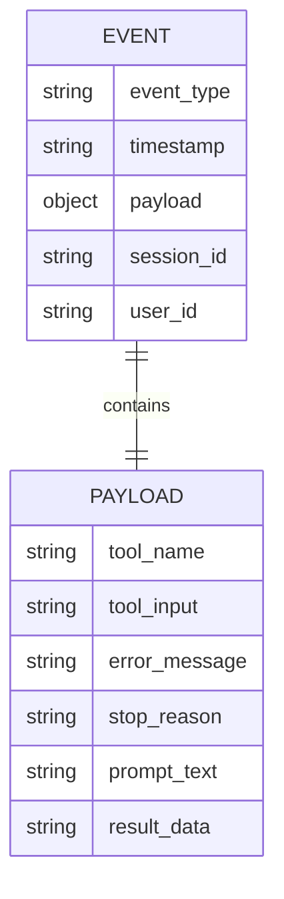
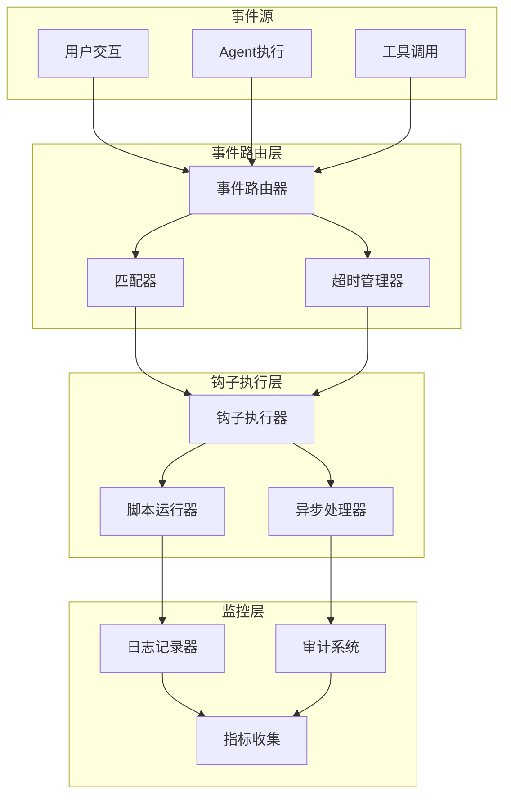
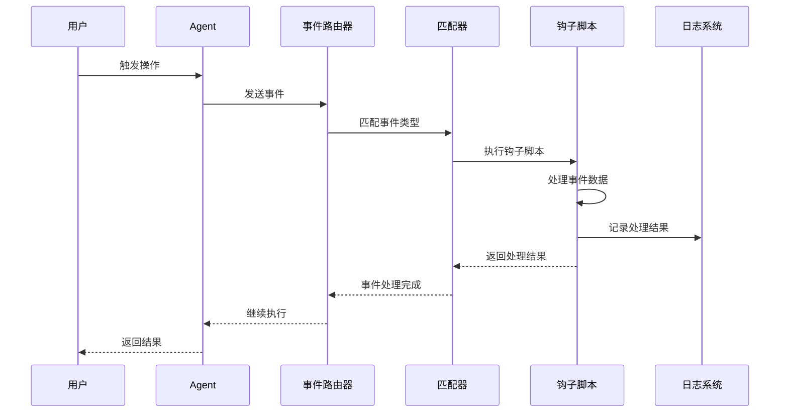
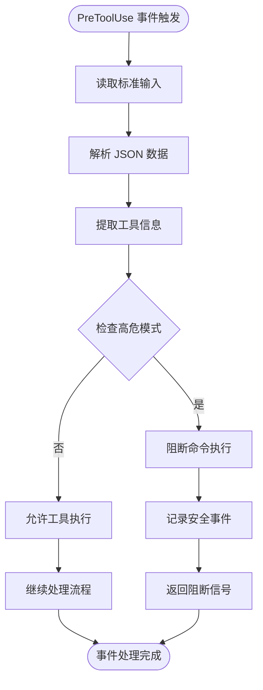
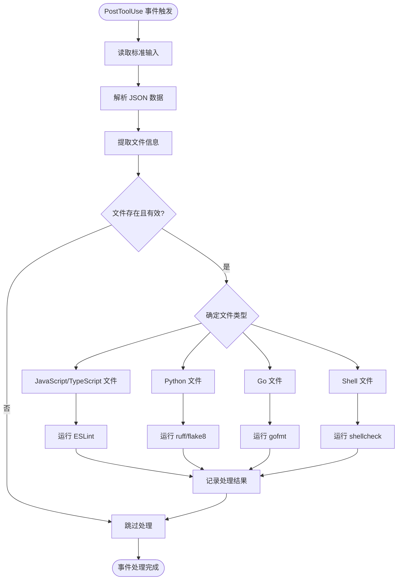
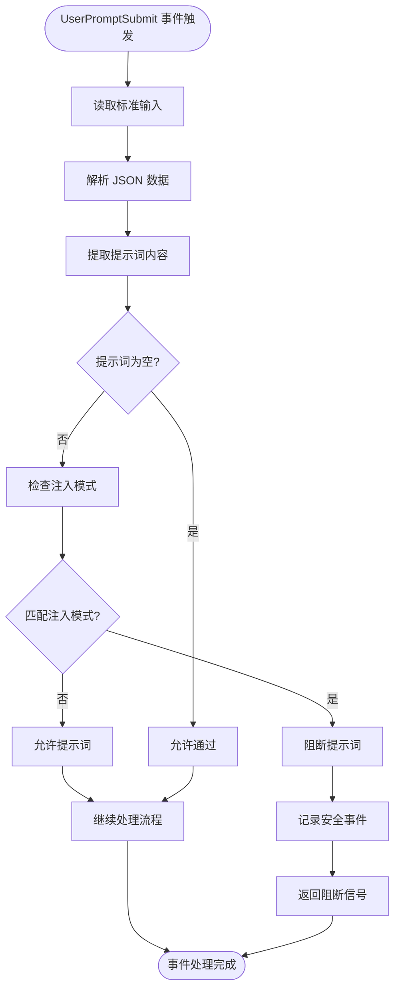
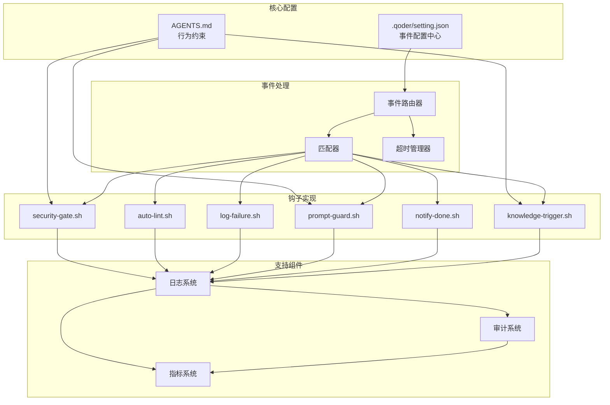
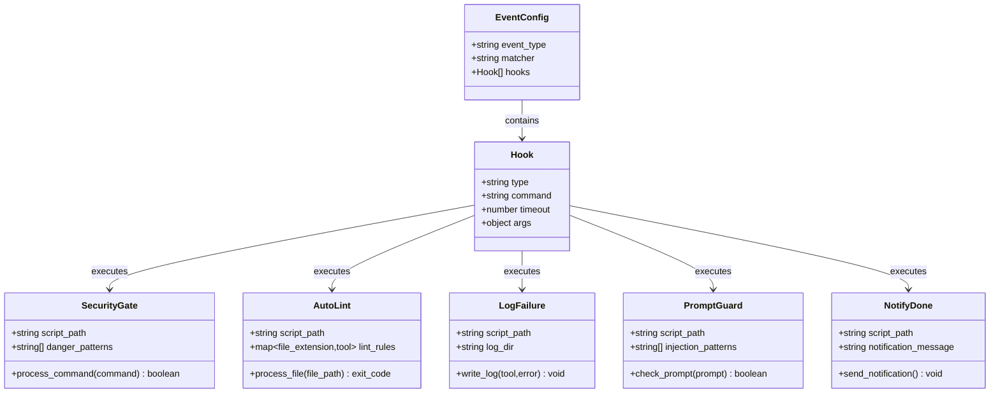
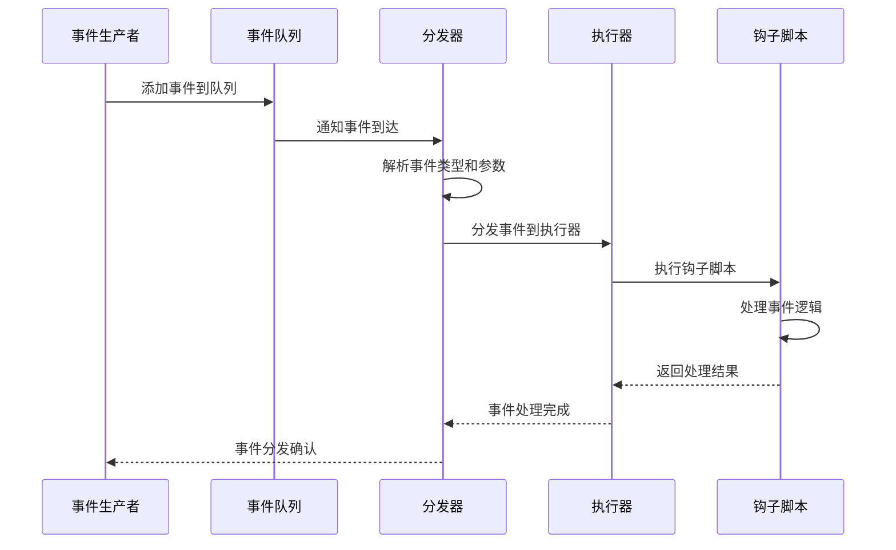

# Hooks 事件类型与触发机制

<cite>
**本文档引用的文件**
- [AGENTS.md](file://AGENTS.md)
- [QoderHarnessEngineering落地示例.md](file://QoderHarnessEngineering落地示例.md)
- [security-gate.sh](file://.qoderwork/hooks/security-gate.sh)
- [auto-lint.sh](file://.qoderwork/hooks/auto-lint.sh)
- [log-failure.sh](file://.qoderwork/hooks/log-failure.sh)
- [prompt-guard.sh](file://.qoderwork/hooks/prompt-guard.sh)
- [notify-done.sh](file://.qoderwork/hooks/notify-done.sh)
- [.qoder/setting.json](file://.qoder/setting.json)
- [.qoder/skills/KnowledgeExtractor.md](file://.qoder/skills/KnowledgeExtractor.md)
</cite>

## 目录
1. [简介](#简介)
2. [项目结构](#项目结构)
3. [核心组件](#核心组件)
4. [架构概览](#架构概览)
5. [详细组件分析](#详细组件分析)
6. [依赖关系分析](#依赖关系分析)
7. [性能考虑](#性能考虑)
8. [故障排除指南](#故障排除指南)
9. [结论](#结论)

## 简介

Qoder Harness 工作流中的 Hooks 事件系统是一套强大的生命周期管理机制，通过预定义的事件类型和相应的钩子脚本来实现对 Agent 操作的全面控制和审计。本文档深入解析八种核心事件类型的触发时机、用途和数据流转机制，包括 PreToolUse、PostToolUse、UserPromptSubmit、ToolResult、SessionStart、SessionEnd、Error、Success。

该系统采用事件驱动架构，通过 JSON 配置文件定义事件与钩子脚本的映射关系，支持精确的匹配器过滤和超时控制。每个事件都有其特定的数据结构和参数传递机制，确保在正确的时机执行相应的安全检查、质量保证和审计功能。

## 项目结构

Qoder Harness 工作流的 Hooks 系统主要由以下组件构成：

```mermaid
graph TB
subgraph "配置层"
SettingJSON[".qoder/setting.json<br/>事件配置"]
AGENTSMD["AGENTS.md<br/>项目行为约束"]
end
subgraph "钩子脚本层"
SecurityGate["security-gate.sh<br/>PreToolUse"]
AutoLint["auto-lint.sh<br/>PostToolUse"]
LogFailure["log-failure.sh<br/>PostToolUseFailure"]
PromptGuard["prompt-guard.sh<br/>UserPromptSubmit"]
NotifyDone["notify-done.sh<br/>Stop"]
KnowledgeTrigger["knowledge-trigger.sh<br/>PreCompact/SessionEnd"]
end
subgraph "事件类型"
PreToolUse["PreToolUse<br/>工具执行前"]
PostToolUse["PostToolUse<br/>工具成功后"]
PostToolUseFailure["PostToolUseFailure<br/>工具失败后"]
UserPromptSubmit["UserPromptSubmit<br/>用户提交prompt后"]
Stop["Stop<br/>Agent完成响应时"]
SessionStart["SessionStart<br/>会话启动"]
SessionEnd["SessionEnd<br/>会话结束"]
SubagentStart["SubagentStart<br/>子Agent启动"]
SubagentStop["SubagentStop<br/>子Agent完成"]
PreCompact["PreCompact<br/>上下文压缩前"]
Notification["Notification<br/>权限/通知事件"]
end
SettingJSON --> PreToolUse
SettingJSON --> PostToolUse
SettingJSON --> PostToolUseFailure
SettingJSON --> UserPromptSubmit
SettingJSON --> Stop
SettingJSON --> SessionStart
SettingJSON --> SessionEnd
SettingJSON --> SubagentStart
SettingJSON --> SubagentStop
SettingJSON --> PreCompact
SettingJSON --> Notification
AGENTSMD --> SecurityGate
AGENTSMD --> PromptGuard
AGENTSMD --> KnowledgeTrigger
```

**图表来源**
- [QoderHarnessEngineering落地示例.md: 42-67:42-67](file://QoderHarnessEngineering落地示例.md#L42-L67)
- [.qoder/setting.json: 30-113:30-113](file://.qoder/setting.json#L30-L113)

**章节来源**
- [QoderHarnessEngineering落地示例.md: 42-67:42-67](file://QoderHarnessEngineering落地示例.md#L42-L67)
- [AGENTS.md: 34-50:34-50](file://AGENTS.md#L34-L50)

## 核心组件

### 事件类型概览

Qoder Harness 支持完整的生命周期事件管理，涵盖从会话启动到结束的全过程监控。系统定义了十一种不同的事件类型，每种事件都有其特定的触发条件和处理机制。

| 事件类型 | 触发时机 | 可阻断 | 匹配器对象 | 用途 |
|---------|----------|--------|------------|------|
| PreToolUse | 工具执行前 | ✅ exit 2 | 工具名（Bash/Write/Edit/...） | 安全拦截和权限验证 |
| PostToolUse | 工具成功后 | ❌ | 工具名 | 质量保证和后处理 |
| PostToolUseFailure | 工具失败后 | ❌ | 工具名 | 错误记录和审计 |
| UserPromptSubmit | 用户提交prompt后 | ✅ | — | 提示词注入防护 |
| Stop | Agent完成响应时 | ✅ | — | 任务完成通知 |
| SessionStart | 会话启动 | ❌ | startup/resume/compact | 会话初始化 |
| SessionEnd | 会话结束 | ❌ | prompt_input_exit/other | 会话清理 |
| SubagentStart | 子Agent启动 | ❌ | Agent类型名 | 子Agent管理 |
| SubagentStop | 子Agent完成 | ✅ | Agent类型名 | 子Agent审计 |
| PreCompact | 上下文压缩前 | ❌ | manual/auto | 知识归档触发 |
| Notification | 权限/通知事件 | ❌ | permission/result | 权限状态通知 |

**章节来源**
- [QoderHarnessEngineering落地示例.md: 255-269:255-269](file://QoderHarnessEngineering落地示例.md#L255-L269)

### 数据结构定义

每个事件都遵循统一的数据结构规范，通过标准输入接收事件参数，通过标准输出返回处理结果。事件数据采用 JSON 格式传输，确保跨平台兼容性和一致性。

#### 通用事件数据结构

**图表来源**
- [QoderHarnessEngineering落地示例.md: 271-278:271-278](file://QoderHarnessEngineering落地示例.md#L271-L278)

#### 事件参数传递机制

事件系统采用管道通信机制，通过标准输入传递事件数据，通过标准输出返回处理结果。每个钩子脚本都遵循相同的接口规范，确保事件处理的一致性。

**章节来源**
- [QoderHarnessEngineering落地示例.md: 271-278:271-278](file://QoderHarnessEngineering落地示例.md#L271-L278)

## 架构概览

Qoder Harness 的 Hooks 事件系统采用分层架构设计，通过配置驱动的事件路由机制实现灵活的事件处理。

**图表来源**
- [QoderHarnessEngineering落地示例.md: 253-270:253-270](file://QoderHarnessEngineering落地示例.md#L253-L270)

### 事件触发流程

事件触发采用异步处理模式，确保主流程的流畅性和系统的稳定性。每个事件都会经过匹配器过滤、超时控制和并发管理等处理步骤。

**图表来源**
- [QoderHarnessEngineering落地示例.md: 253-270:253-270](file://QoderHarnessEngineering落地示例.md#L253-L270)

## 详细组件分析

### PreToolUse 事件类型

PreToolUse 事件是 Qoder Harness 安全体系的核心，负责在工具执行前进行安全检查和权限验证。

#### 触发时机与用途

PreToolUse 事件在任何工具执行前触发，主要用于：
- 高危命令拦截
- 权限验证
- 安全策略执行
- 用户确认流程

#### 数据结构与参数

**图表来源**
- [security-gate.sh: 8-37:8-37](file://.qoderwork/hooks/security-gate.sh#L8-L37)

#### 实现细节

PreToolUse 事件通过安全门脚本实现，采用正则表达式匹配高危模式：

**章节来源**
- [security-gate.sh: 1-38:1-38](file://.qoderwork/hooks/security-gate.sh#L1-L38)
- [.qoder/setting.json: 42-52:42-52](file://.qoder/setting.json#L42-L52)

### PostToolUse 事件类型

PostToolUse 事件在工具成功执行后触发，主要用于质量保证和后处理任务。

#### 触发时机与用途

PostToolUse 事件在工具执行成功后触发，主要用于：
- 自动代码格式化
- 静态代码分析
- 质量检查
- 文件完整性验证

#### 数据结构与参数

**图表来源**
- [auto-lint.sh: 8-42:8-42](file://.qoderwork/hooks/auto-lint.sh#L8-L42)

#### 实现细节

PostToolUse 事件通过自动 Lint 脚本实现，支持多种编程语言的静态分析：

**章节来源**
- [auto-lint.sh: 1-43:1-43](file://.qoderwork/hooks/auto-lint.sh#L1-L43)
- [.qoder/setting.json: 54-64:54-64](file://.qoder/setting.json#L54-L64)

### UserPromptSubmit 事件类型

UserPromptSubmit 事件在用户提交 prompt 后触发，主要用于提示词注入防护和内容安全检查。

#### 触发时机与用途

UserPromptSubmit 事件在用户提交 prompt 后触发，主要用于：
- 提示词注入检测
- 内容安全过滤
- 用户意图分析
- 安全策略执行

#### 数据结构与参数

**图表来源**
- [prompt-guard.sh: 8-54:8-54](file://.qoderwork/hooks/prompt-guard.sh#L8-L54)

#### 实现细节

UserPromptSubmit 事件通过提示词防护脚本实现，采用中英文双语正则表达式匹配：

**章节来源**
- [prompt-guard.sh: 1-55:1-55](file://.qoderwork/hooks/prompt-guard.sh#L1-L55)
- [.qoder/setting.json: 31-41:31-41](file://.qoder/setting.json#L31-L41)

### ToolResult 事件类型

ToolResult 事件在工具执行结果返回时触发，用于结果处理和后续操作。

#### 触发时机与用途

ToolResult 事件在工具执行完成后触发，主要用于：
- 结果数据处理
- 后续操作触发
- 状态更新
- 通知发送

#### 数据结构与参数

ToolResult 事件的数据结构包含完整的工具执行结果信息，支持不同类型工具的结果处理。

**章节来源**
- [QoderHarnessEngineering落地示例.md: 255-269:255-269](file://QoderHarnessEngineering落地示例.md#L255-L269)

### SessionStart 事件类型

SessionStart 事件在会话启动时触发，用于会话初始化和准备工作。

#### 触发时机与用途

SessionStart 事件在会话启动时触发，主要用于：
- 会话初始化
- 环境准备
- 资源分配
- 状态重置

#### 数据结构与参数

SessionStart 事件支持多种启动模式：
- startup：全新会话启动
- resume：会话恢复
- compact：上下文压缩

**章节来源**
- [QoderHarnessEngineering落地示例.md: 264](file://QoderHarnessEngineering落地示例.md#L264)

### SessionEnd 事件类型

SessionEnd 事件在会话结束时触发，用于会话清理和资源释放。

#### 触发时机与用途

SessionEnd 事件在会话结束时触发，主要用于：
- 会话清理
- 资源释放
- 状态保存
- 最终审计

#### 数据结构与参数

SessionEnd 事件支持多种结束模式：
- prompt_input_exit：用户主动退出
- other：其他结束原因

**章节来源**
- [QoderHarnessEngineering落地示例.md: 265](file://QoderHarnessEngineering落地示例.md#L265)

### Error 事件类型

Error 事件在发生错误时触发，用于错误处理和故障恢复。

#### 触发时机与用途

Error 事件在系统或工具执行过程中发生错误时触发，主要用于：
- 错误捕获
- 故障诊断
- 自动恢复
- 用户通知

#### 数据结构与参数

Error 事件包含详细的错误信息，支持错误分类和处理策略。

**章节来源**
- [QoderHarnessEngineering落地示例.md: 255-269:255-269](file://QoderHarnessEngineering落地示例.md#L255-L269)

### Success 事件类型

Success 事件在操作成功完成时触发，用于成功确认和后续操作。

#### 触发时机与用途

Success 事件在操作成功完成时触发，主要用于：
- 成功确认
- 后续操作触发
- 状态更新
- 用户反馈

#### 数据结构与参数

Success 事件提供操作结果的详细信息，支持成功状态的传播和处理。

**章节来源**
- [QoderHarnessEngineering落地示例.md: 255-269:255-269](file://QoderHarnessEngineering落地示例.md#L255-L269)

## 依赖关系分析

Qoder Harness 的 Hooks 事件系统具有清晰的依赖关系和模块化设计，确保系统的可维护性和扩展性。

**图表来源**
- [.qoder/setting.json: 30-113:30-113](file://.qoder/setting.json#L30-L113)
- [QoderHarnessEngineering落地示例.md: 253-339:253-339](file://QoderHarnessEngineering落地示例.md#L253-L339)

### 事件监听器注册机制

事件监听器通过 JSON 配置文件进行注册，支持精确的事件类型匹配和参数过滤。

#### 配置结构分析

**图表来源**
- [.qoder/setting.json: 30-113:30-113](file://.qoder/setting.json#L30-L113)

#### 注册流程

事件监听器的注册过程包括配置解析、匹配器构建、钩子脚本编译和执行器初始化等步骤。

**章节来源**
- [.qoder/setting.json: 30-113:30-113](file://.qoder/setting.json#L30-L113)

### 事件分发机制

事件分发采用异步队列机制，确保事件处理的高效性和可靠性。

**图表来源**
- [QoderHarnessEngineering落地示例.md: 253-270:253-270](file://QoderHarnessEngineering落地示例.md#L253-L270)

### 异步处理模式

系统采用异步处理模式，通过超时管理和并发控制确保事件处理的稳定性和性能。

**章节来源**
- [QoderHarnessEngineering落地示例.md: 271-278:271-278](file://QoderHarnessEngineering落地示例.md#L271-L278)

## 性能考虑

Qoder Harness 的 Hooks 事件系统在设计时充分考虑了性能优化和资源管理。

### 资源管理

- **内存管理**：事件数据采用流式处理，避免大文件内存占用
- **CPU 优化**：正则表达式编译缓存，减少重复计算开销
- **I/O 优化**：批量日志写入，减少磁盘操作频率

### 并发控制

- **线程池管理**：限制并发钩子执行数量
- **超时控制**：防止长时间阻塞影响系统性能
- **资源隔离**：每个钩子脚本独立进程执行

### 监控指标

系统提供完整的性能监控指标，包括：
- 事件处理延迟
- 超时事件统计
- 资源使用情况
- 错误率分析

## 故障排除指南

### 常见问题诊断

#### 事件未触发

**可能原因**：
- 配置文件语法错误
- 匹配器规则不匹配
- 脚本权限不足
- 超时设置过短

**解决方案**：
- 检查 JSON 配置语法
- 验证匹配器表达式
- 确认脚本执行权限
- 调整超时时间设置

#### 脚本执行失败

**可能原因**：
- 依赖工具未安装
- 输入数据格式错误
- 权限不足
- 环境变量缺失

**解决方案**：
- 安装所需依赖工具
- 验证输入数据格式
- 检查文件权限
- 配置环境变量

#### 性能问题

**可能原因**：
- 超时设置不合理
- 脚本逻辑复杂
- 资源竞争
- 日志过多

**解决方案**：
- 优化超时设置
- 简化脚本逻辑
- 减少资源竞争
- 控制日志级别

### 调试技巧

#### 日志分析

系统提供详细的日志记录功能，包括：
- 事件触发日志
- 脚本执行日志
- 错误诊断日志
- 性能监控日志

#### 调试工具

- **事件模拟器**：模拟各种事件场景
- **配置验证器**：验证配置文件有效性
- **性能分析器**：分析事件处理性能
- **监控仪表板**：实时监控系统状态

**章节来源**
- [QoderHarnessEngineering落地示例.md: 271-278:271-278](file://QoderHarnessEngineering落地示例.md#L271-L278)

## 结论

Qoder Harness 的 Hooks 事件系统通过精心设计的八种核心事件类型，实现了对 Agent 工作流的全面控制和管理。该系统采用事件驱动架构，支持精确的匹配器过滤、超时控制和异步处理，确保了系统的灵活性和可靠性。

通过 PreToolUse、PostToolUse、UserPromptSubmit 等事件的协同工作，系统实现了从安全拦截到质量保证的完整生命周期管理。配合 SessionStart、SessionEnd 等会话管理事件，系统能够准确把握会话的各个阶段，提供及时的处理和响应。

该事件系统的设计体现了现代软件架构的最佳实践，包括：
- 清晰的职责分离
- 灵活的配置机制
- 强大的扩展能力
- 完善的监控体系

未来的发展方向包括：
- 更丰富的事件类型支持
- 智能化的事件路由
- 更精细的性能优化
- 更完善的调试工具

通过持续的改进和优化，Qoder Harness 的 Hooks 事件系统将继续为开发者提供强大而可靠的事件管理能力。