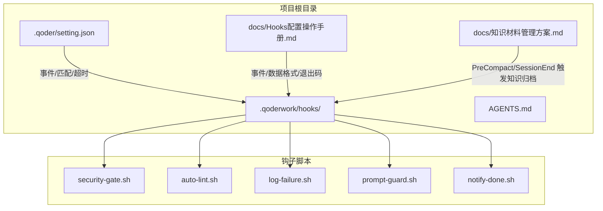
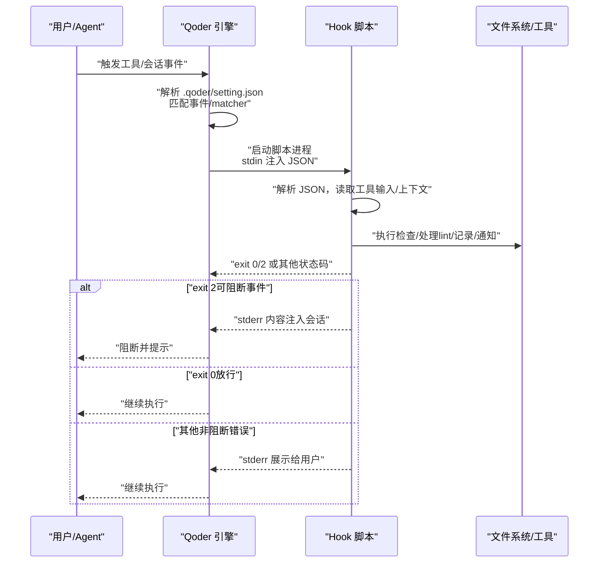
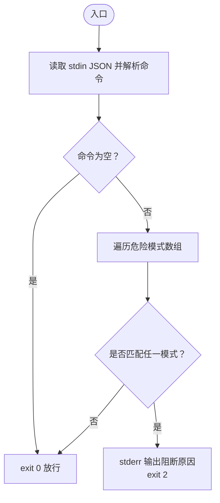
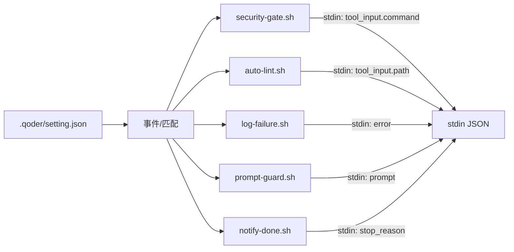

# Hooks 开发与调试指南

<cite>
**本文引用的文件**
- [AGENTS.md](file://AGENTS.md)
- [QoderHarnessEngineering落地示例.md](file://QoderHarnessEngineering落地示例.md)
- [Hooks配置操作手册.md](file://docs/Hooks配置操作手册.md)
- [security-gate.sh](file://.qoderwork/hooks/security-gate.sh)
- [auto-lint.sh](file://.qoderwork/hooks/auto-lint.sh)
- [log-failure.sh](file://.qoderwork/hooks/log-failure.sh)
- [prompt-guard.sh](file://.qoderwork/hooks/prompt-guard.sh)
- [notify-done.sh](file://.qoderwork/hooks/notify-done.sh)
- [知识材料管理方案.md](file://docs/知识材料管理方案.md)
</cite>

## 目录
1. [简介](#简介)
2. [项目结构](#项目结构)
3. [核心组件](#核心组件)
4. [架构总览](#架构总览)
5. [详细组件分析](#详细组件分析)
6. [依赖关系分析](#依赖关系分析)
7. [性能考虑](#性能考虑)
8. [故障排查指南](#故障排查指南)
9. [结论](#结论)
10. [附录](#附录)

## 简介
本指南面向 Hooks 开发与调试，围绕生命周期钩子机制的工作原理、事件模型、stdin 数据格式、matcher 过滤、退出码约定与错误处理、参数与环境变量使用、标准输入输出处理、调试工具与日志分析、性能优化、测试框架与策略、扩展开发与第三方工具集成、以及常见问题排查与运维维护最佳实践展开。文档以仓库中的 Hooks 脚本与配置说明为依据，提供可操作的开发与排障建议。

## 项目结构
本项目采用“配置层 + 生命周期钩子”的工程化范式，核心目录与文件如下：
- .qoderwork/hooks：生命周期钩子脚本集合，覆盖 PreToolUse、PostToolUse、PostToolUseFailure、UserPromptSubmit、Stop、PreCompact/SessionEnd 等事件
- .qoder/setting.json：项目级 Hooks 配置，声明事件、matcher、脚本路径与超时
- AGENTS.md：项目级 Agent 行为约束与上下文说明
- docs/Hooks配置操作手册.md：Hooks 配置结构、事件、stdin 数据格式、退出码规范与调试技巧
- docs/知识材料管理方案.md：结合 Hooks 的知识归档与审计实践

图表来源
- [QoderHarnessEngineering落地示例.md:42-67](file://QoderHarnessEngineering落地示例.md#L42-L67)
- [Hooks配置操作手册.md:53-72](file://docs/Hooks配置操作手册.md#L53-L72)
- [AGENTS.md:34-69](file://AGENTS.md#L34-L69)

章节来源
- [QoderHarnessEngineering落地示例.md:42-67](file://QoderHarnessEngineering落地示例.md#L42-L67)
- [Hooks配置操作手册.md:53-72](file://docs/Hooks配置操作手册.md#L53-L72)
- [AGENTS.md:34-69](file://AGENTS.md#L34-L69)

## 核心组件
- 事件与触发：PreToolUse、PostToolUse、PostToolUseFailure、UserPromptSubmit、Stop、SessionStart/End、SubagentStart/Stop、PreCompact、Notification 等
- 配置结构：hooks 事件 -> matcher -> hooks 数组（type/command/timeout）
- stdin 数据：JSON 格式，包含 session_id、工具名、工具输入、输出或错误等字段
- 退出码：0 放行；2 阻断（仅可阻断事件）；其他非阻断性错误
- 标准输出/错误：stdout 可用于细粒度控制；stderr 在 exit 2 时注入会话上下文
- matcher：支持精确字符串、多值 OR、正则表达式与通配符

章节来源
- [Hooks配置操作手册.md:84-101](file://docs/Hooks配置操作手册.md#L84-L101)
- [Hooks配置操作手册.md:53-72](file://docs/Hooks配置操作手册.md#L53-L72)
- [Hooks配置操作手册.md:104-216](file://docs/Hooks配置操作手册.md#L104-L216)
- [Hooks配置操作手册.md:245-262](file://docs/Hooks配置操作手册.md#L245-L262)
- [QoderHarnessEngineering落地示例.md:253-270](file://QoderHarnessEngineering落地示例.md#L253-L270)

## 架构总览
Hooks 的执行流程由 Qoder 在事件发生时自动调度脚本，脚本通过 stdin 接收上下文 JSON，根据逻辑决定 exit code，并可向 stderr 输出阻断原因或向 stdout 输出细粒度控制数据。

图表来源
- [Hooks配置操作手册.md:22-49](file://docs/Hooks配置操作手册.md#L22-L49)
- [Hooks配置操作手册.md:245-262](file://docs/Hooks配置操作手册.md#L245-L262)

## 详细组件分析

### 安全门（security-gate.sh）— PreToolUse（Bash）
- 作用：拦截高危 Bash 命令，exit 2 阻断
- 输入：stdin JSON 包含 tool_name、tool_input.command
- 逻辑：若命令为空放行；否则匹配预设危险模式数组，命中则 stderr 输出阻断原因并 exit 2
- 性能：正则匹配开销极低，适合前置拦截

图表来源
- [security-gate.sh:1-38](file://.qoderwork/hooks/security-gate.sh#L1-L38)

章节来源
- [security-gate.sh:1-38](file://.qoderwork/hooks/security-gate.sh#L1-L38)
- [QoderHarnessEngineering落地示例.md:281-295](file://QoderHarnessEngineering落地示例.md#L281-L295)

### 自动 Lint（auto-lint.sh）— PostToolUse（Write/Edit）
- 作用：文件写入/编辑后自动执行对应语言的静态检查或格式化
- 输入：stdin JSON 包含 tool_name、tool_input.path
- 逻辑：根据文件扩展名选择工具（ESLint、ruff/flake8、gofmt、shellcheck），执行并收集 exit 码
- 性能：按文件类型分支，尽量使用已安装工具；失败不影响主流程（非阻断）

章节来源
- [auto-lint.sh:1-43](file://.qoderwork/hooks/auto-lint.sh#L1-L43)
- [QoderHarnessEngineering落地示例.md:296-306](file://QoderHarnessEngineering落地示例.md#L296-L306)

### 失败日志（log-failure.sh）— PostToolUseFailure
- 作用：记录工具执行失败信息到 .qoderwork/logs/failure.log
- 输入：stdin JSON 包含 tool_name、error
- 逻辑：创建日志目录，追加带时间戳的失败记录，exit 0

章节来源
- [log-failure.sh:1-20](file://.qoderwork/hooks/log-failure.sh#L1-L20)
- [QoderHarnessEngineering落地示例.md:307-313](file://QoderHarnessEngineering落地示例.md#L307-L313)

### Prompt 注入防护（prompt-guard.sh）— UserPromptSubmit
- 作用：拦截提示词注入攻击，exit 2 阻断
- 输入：stdin JSON 包含 prompt
- 逻辑：若 prompt 为空放行；否则匹配中英文注入特征，命中则 stderr 输出阻断原因并 exit 2

章节来源
- [prompt-guard.sh:1-55](file://.qoderwork/hooks/prompt-guard.sh#L1-L55)
- [QoderHarnessEngineering落地示例.md:314-324](file://QoderHarnessEngineering落地示例.md#L314-L324)

### 任务完成通知（notify-done.sh）— Stop
- 作用：Agent 完成响应时发送桌面通知（macOS）
- 输入：stdin JSON 包含 stop_reason
- 逻辑：若系统支持则执行通知命令，exit 0

章节来源
- [notify-done.sh:1-16](file://.qoderwork/hooks/notify-done.sh#L1-L16)
- [QoderHarnessEngineering落地示例.md:325-330](file://QoderHarnessEngineering落地示例.md#L325-L330)

### 知识归档触发（knowledge-trigger.sh）— PreCompact/SessionEnd
- 作用：通过 stderr 向 Agent 注入知识归档提醒，配合 KnowledgeExtractor Skill 使用
- 输入：stdin JSON 包含 session_id、trigger/end_reason
- 逻辑：向 stderr 输出提示文本，同时记录到 .qoderwork/logs/knowledge-trigger.log

章节来源
- [QoderHarnessEngineering落地示例.md:332-336](file://QoderHarnessEngineering落地示例.md#L332-L336)
- [知识材料管理方案.md:166-174](file://docs/知识材料管理方案.md#L166-L174)

## 依赖关系分析
- 配置依赖：.qoder/setting.json 决定事件、matcher 与脚本路径，直接影响脚本是否被触发
- 脚本依赖：各脚本依赖 jq 解析 stdin JSON；部分脚本依赖外部工具（ESLint、ruff、gofmt、shellcheck、osascript 等）
- 事件依赖：不同事件的 stdin 字段不同，脚本需按事件类型解析相应字段
- 退出码依赖：仅可阻断事件（PreToolUse、UserPromptSubmit、Stop、SubagentStop）支持 exit 2 阻断

图表来源
- [Hooks配置操作手册.md:53-72](file://docs/Hooks配置操作手册.md#L53-L72)
- [Hooks配置操作手册.md:104-216](file://docs/Hooks配置操作手册.md#L104-L216)

章节来源
- [Hooks配置操作手册.md:53-72](file://docs/Hooks配置操作手册.md#L53-L72)
- [Hooks配置操作手册.md:104-216](file://docs/Hooks配置操作手册.md#L104-L216)

## 性能考虑
- 避免在脚本中执行重型计算或长耗时任务；必要时缩短 timeout 或拆分为异步处理
- 仅在必要时解析 stdin，减少不必要的 jq 调用次数
- 对 PostToolUse 类脚本，按文件类型分支处理，优先使用已安装工具，失败不影响主流程
- 对 PreToolUse 类脚本，保持正则匹配简洁高效，避免回溯复杂度
- 将日志写入本地文件时，使用追加写入并确保目录存在，减少 IO 开销

## 故障排查指南
- 脚本不执行
  - 检查脚本是否具有执行权限
  - 检查 setting.json 中事件名拼写与大小写
  - 检查 command 路径是否相对项目根目录
- exit 2 未阻断
  - 确认事件本身是否可阻断（仅 PreToolUse、UserPromptSubmit、Stop、SubagentStop 支持）
  - 确认脚本确实返回 exit 2
- stderr 内容未出现在会话中
  - 确认使用的是 exit 2（非 exit 1）
  - 确认内容写入 stderr（>&2）
- 脚本超时
  - 调整 hooks 配置中的 timeout 值
- 同一事件多 matcher 命中
  - 多个条目按顺序串行执行；任一返回 exit 2 均可阻断
- 配置改动生效
  - setting.json 改动立即生效，无需重启

章节来源
- [Hooks配置操作手册.md:572-626](file://docs/Hooks配置操作手册.md#L572-L626)

## 结论
Hooks 机制通过在关键生命周期节点自动触发外部脚本，实现了安全拦截、代码检查、审计日志与通知等功能。遵循统一的事件模型、stdin 数据格式、matcher 过滤与退出码约定，是保证 Hooks 稳定与可维护性的关键。结合本指南的调试与性能优化建议，可在团队协作中构建可靠的工程化实践。

## 附录

### 事件与 stdin 数据速查
- PreToolUse / PostToolUse：包含 session_id、tool_name、tool_input（含 command/path/content/old_string/new_string/url 等）
- PostToolUseFailure：包含 session_id、tool_name、tool_input、error
- UserPromptSubmit：包含 session_id、prompt
- Stop：包含 session_id、stop_reason
- SessionStart/End：包含 session_id、source/end_reason
- SubagentStart/Stop：包含 session_id、agent_type
- PreCompact：包含 session_id、trigger

章节来源
- [Hooks配置操作手册.md:104-216](file://docs/Hooks配置操作手册.md#L104-L216)

### 退出码约定
- 0：放行，继续执行
- 2：阻断（仅可阻断事件有效），stderr 注入会话
- 其他：非阻断性错误，stderr 展示给用户，执行继续

章节来源
- [Hooks配置操作手册.md:245-262](file://docs/Hooks配置操作手册.md#L245-L262)
- [QoderHarnessEngineering落地示例.md:271-278](file://QoderHarnessEngineering落地示例.md#L271-L278)

### 调试与测试建议
- 手动模拟测试：通过 echo + cat 模拟 stdin，验证 exit 码与 stderr 输出
- 检查 jq 解析：验证字段提取逻辑
- 开启脚本调试：临时启用 set -x 查看执行过程
- 实时查看日志：tail -f 监控 failure.log 等日志文件

章节来源
- [Hooks配置操作手册.md:520-571](file://docs/Hooks配置操作手册.md#L520-L571)