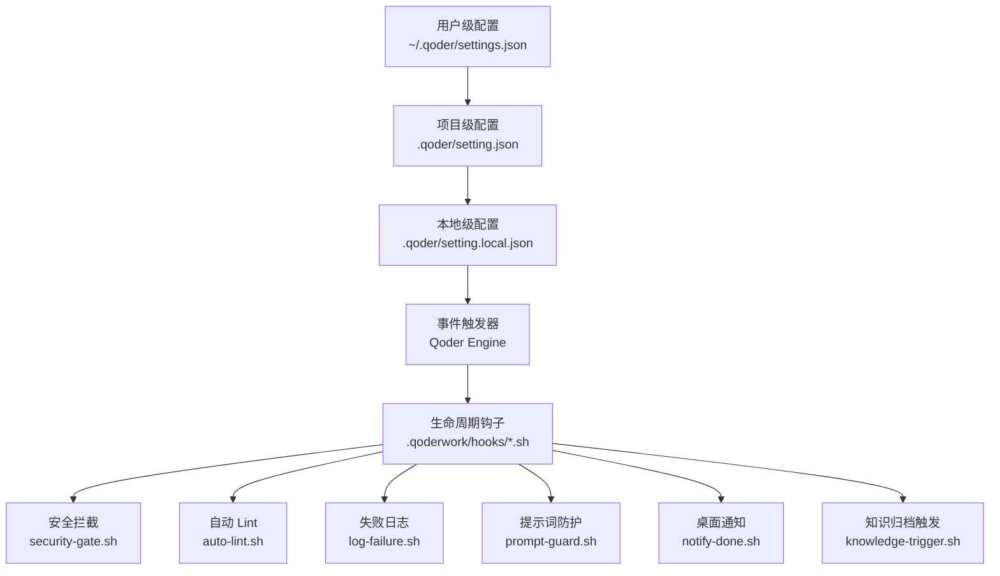
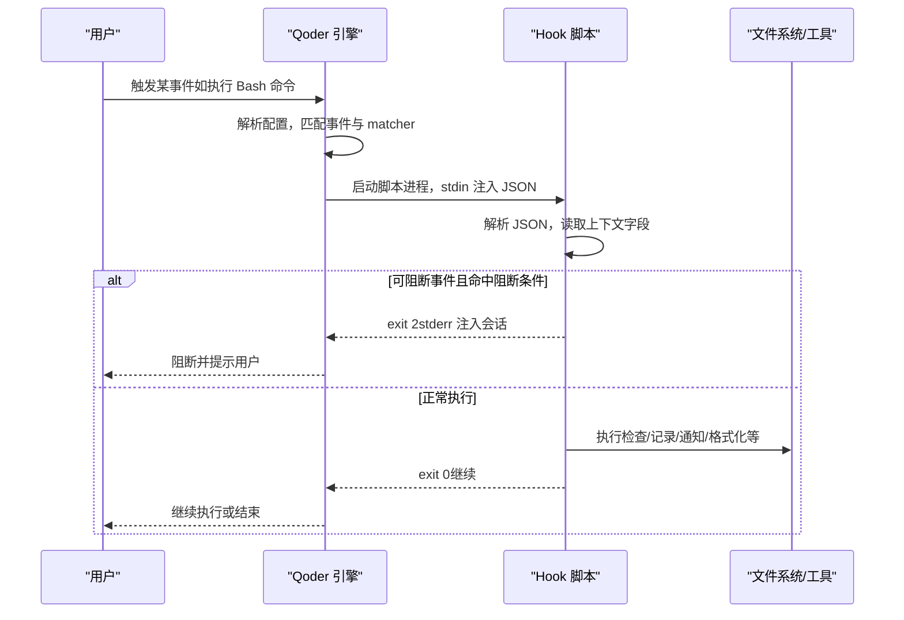
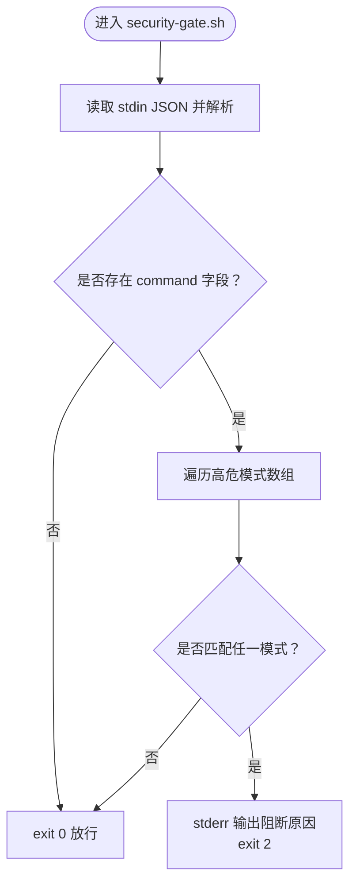
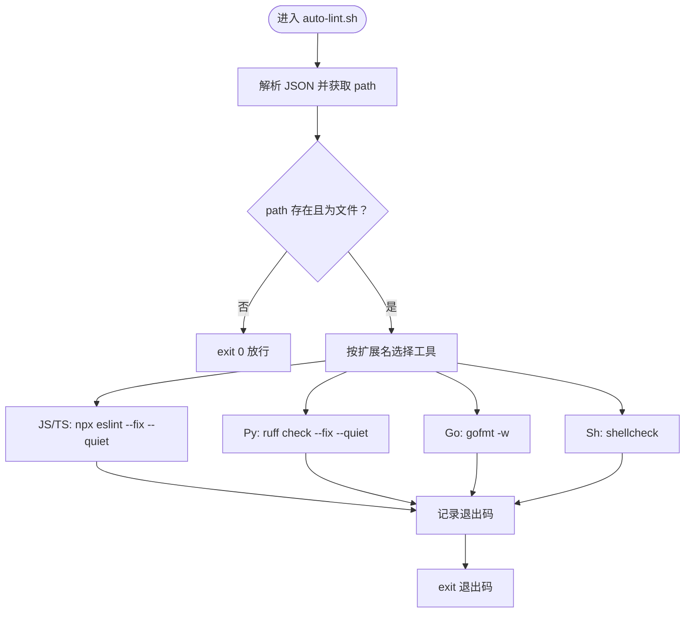
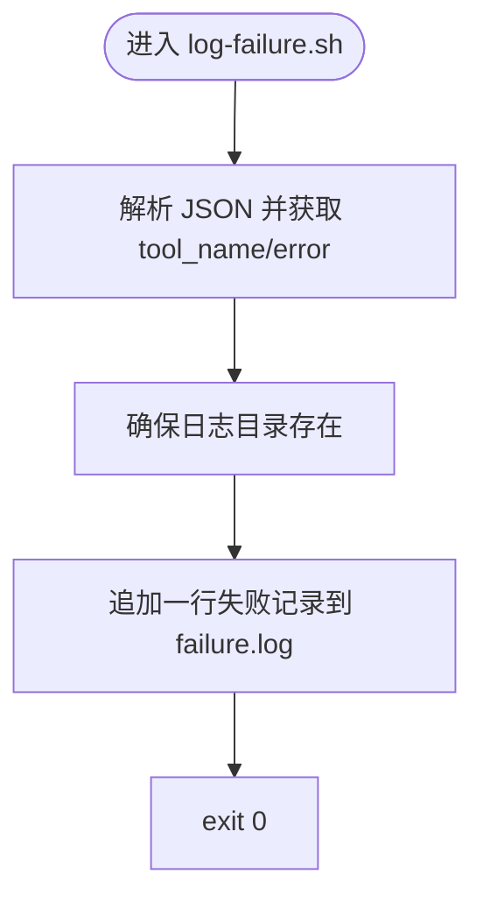
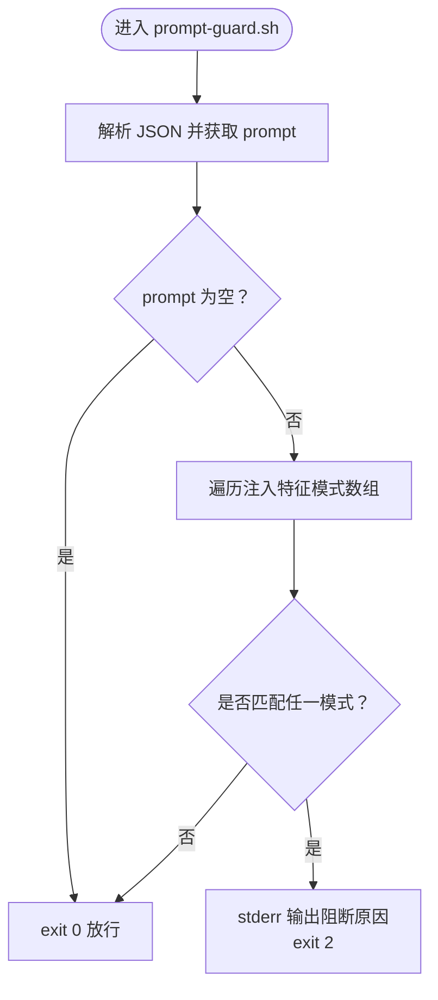
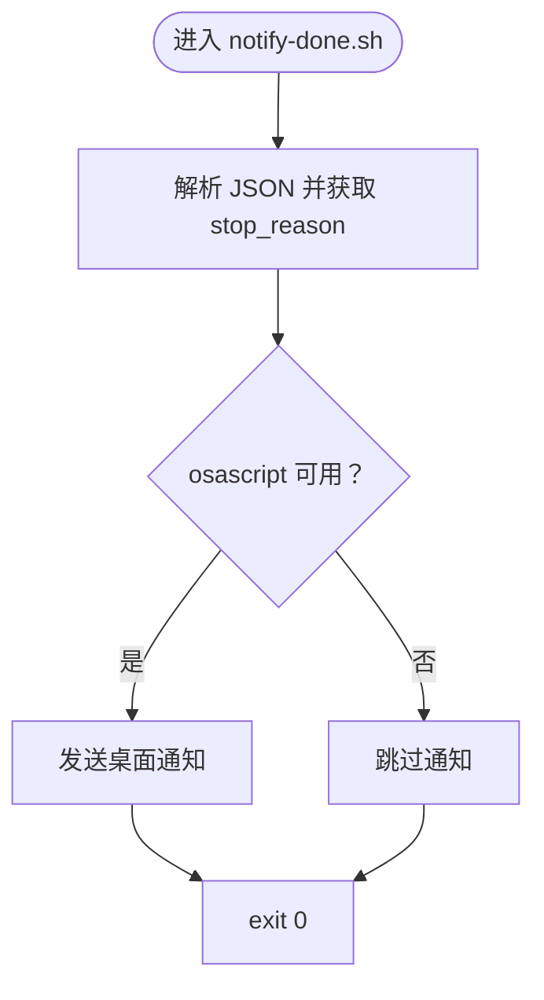
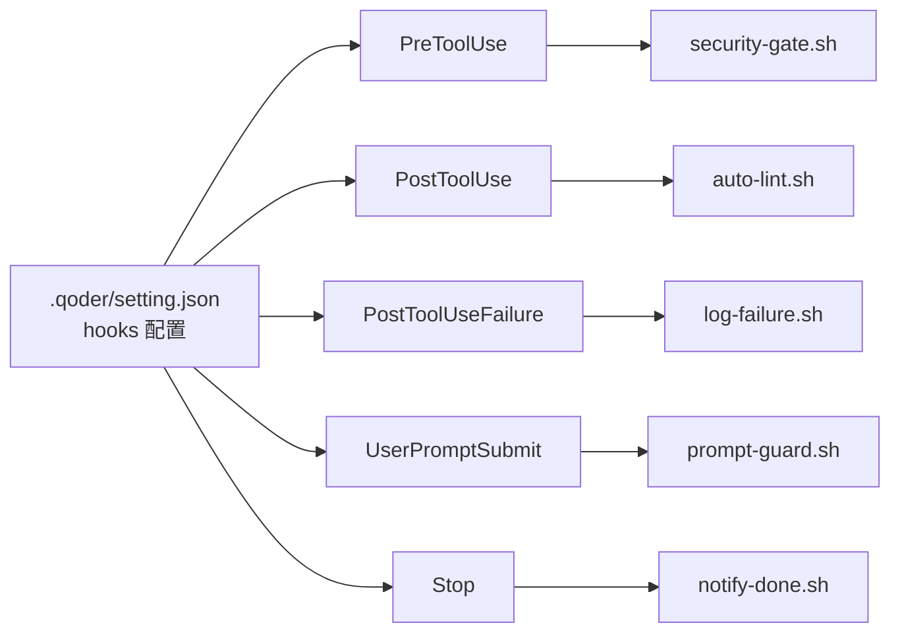

# Hooks 生命周期工程

<cite>
**本文引用的文件**
- [QoderHarnessEngineering落地示例.md](file://QoderHarnessEngineering落地示例.md)
- [Hooks配置操作手册.md](file://docs/Hooks配置操作手册.md)
- [AGENTS.md](file://AGENTS.md)
- [security-gate.sh](file://.qoderwork/hooks/security-gate.sh)
- [auto-lint.sh](file://.qoderwork/hooks/auto-lint.sh)
- [log-failure.sh](file://.qoderwork/hooks/log-failure.sh)
- [prompt-guard.sh](file://.qoderwork/hooks/prompt-guard.sh)
- [notify-done.sh](file://.qoderwork/hooks/notify-done.sh)
- [知识材料管理方案.md](file://docs/知识材料管理方案.md)
</cite>

## 目录
1. [简介](#简介)
2. [项目结构](#项目结构)
3. [核心组件](#核心组件)
4. [架构总览](#架构总览)
5. [详细组件分析](#详细组件分析)
6. [依赖关系分析](#依赖关系分析)
7. [性能考量](#性能考量)
8. [故障排查指南](#故障排查指南)
9. [结论](#结论)
10. [附录](#附录)

## 简介
本文件面向 Qoder Harness Engineering Hooks 生命周期系统，系统性梳理 8 种事件类型（PreToolUse、PostToolUse、PostToolUseFailure、UserPromptSubmit、Stop、SessionStart、SessionEnd、SubagentStart、SubagentStop、PreCompact、Notification 等）的触发时机、用途与实现要点。结合仓库中的六个脚本（security-gate.sh、auto-lint.sh、log-failure.sh、prompt-guard.sh、notify-done.sh、knowledge-trigger.sh），深入解析参数传递、返回值处理、错误与安全拦截、自动化代码检查、失败日志记录、提示词防护、桌面通知与知识归档触发等工程能力，并提供 Hooks 开发生命周期指南，覆盖从脚本编写到调试测试的全流程。

## 项目结构
仓库采用“配置分层 + 生命周期钩子”的工程化组织方式：
- 配置层：用户级 ~/.qoder/settings.json、项目级 .qoder/setting.json、本地级 .qoder/setting.local.json，按优先级合并。
- 扩展目录：.qoderwork/hooks/ 下放置生命周期钩子脚本，按事件类型挂载。
- 文档与规范：docs/ 下提供 Hooks 配置操作手册、知识材料管理方案等。

图示来源
- [QoderHarnessEngineering落地示例.md:42-67](file://QoderHarnessEngineering落地示例.md#L42-L67)
- [Hooks配置操作手册.md:53-82](file://docs/Hooks配置操作手册.md#L53-L82)

章节来源
- [QoderHarnessEngineering落地示例.md:23-40](file://QoderHarnessEngineering落地示例.md#L23-L40)
- [QoderHarnessEngineering落地示例.md:42-67](file://QoderHarnessEngineering落地示例.md#L42-L67)
- [Hooks配置操作手册.md:53-82](file://docs/Hooks配置操作手册.md#L53-L82)

## 核心组件
- 安全拦截（PreToolUse / Bash）：security-gate.sh
  - 作用：在 Bash 工具执行前拦截高危命令，exit 2 阻断并把 stderr 注入会话。
  - 关键点：基于正则匹配高危模式，输入来自 stdin 的 JSON，解析 tool_input.command。
- 自动 Lint（PostToolUse / Write|Edit）：auto-lint.sh
  - 作用：文件写入/编辑后自动对 JS/TS/Py/Go/Sh 执行相应工具检查或格式化。
  - 关键点：根据文件扩展名选择工具，非阻断性错误通过非 0 退出码展示给用户。
- 失败日志（PostToolUseFailure / *）：log-failure.sh
  - 作用：将失败记录追加到 .qoderwork/logs/failure.log，包含时间戳、工具名与错误信息。
- 提示词防护（UserPromptSubmit）：prompt-guard.sh
  - 作用：拦截提示词注入攻击（中英双语），exit 2 阻断并将提示注入会话。
- 桌面通知（Stop）：notify-done.sh
  - 作用：Agent 完成响应时触发 macOS 桌面通知。
- 知识归档触发（PreCompact / SessionEnd）：knowledge-trigger.sh
  - 作用：在上下文压缩前或会话结束时，向 stderr 注入知识归档提醒，配合 KnowledgeExtractor Skill 使用。

章节来源
- [QoderHarnessEngineering落地示例.md:279-337](file://QoderHarnessEngineering落地示例.md#L279-L337)
- [security-gate.sh:1-38](file://.qoderwork/hooks/security-gate.sh#L1-L38)
- [auto-lint.sh:1-43](file://.qoderwork/hooks/auto-lint.sh#L1-L43)
- [log-failure.sh:1-20](file://.qoderwork/hooks/log-failure.sh#L1-L20)
- [prompt-guard.sh:1-55](file://.qoderwork/hooks/prompt-guard.sh#L1-L55)
- [notify-done.sh:1-16](file://.qoderwork/hooks/notify-done.sh#L1-L16)

## 架构总览
事件触发与 Hook 执行的总体流程如下：

图示来源
- [Hooks配置操作手册.md:22-50](file://docs/Hooks配置操作手册.md#L22-L50)
- [Hooks配置操作手册.md:245-261](file://docs/Hooks配置操作手册.md#L245-L261)

章节来源
- [Hooks配置操作手册.md:22-50](file://docs/Hooks配置操作手册.md#L22-L50)
- [Hooks配置操作手册.md:245-261](file://docs/Hooks配置操作手册.md#L245-L261)

## 详细组件分析

### 安全拦截：security-gate.sh（PreToolUse / Bash）
- 触发时机：Bash 工具执行前。
- 参数传递：stdin JSON 包含 tool_name 与 tool_input.command。
- 返回值处理：匹配到高危模式时，stderr 输出阻断原因并 exit 2；否则 exit 0。
- 阻断模式：包括但不限于递归删除、数据库破坏性操作、磁盘写入、格式化、危险权限开放、特权删除、Fork Bomb 等。
- 错误处理：若未解析到命令，直接放行；正则匹配大小写不敏感，使用 -i 选项。

图示来源
- [security-gate.sh:8-38](file://.qoderwork/hooks/security-gate.sh#L8-L38)

章节来源
- [security-gate.sh:1-38](file://.qoderwork/hooks/security-gate.sh#L1-L38)
- [QoderHarnessEngineering落地示例.md:281-295](file://QoderHarnessEngineering落地示例.md#L281-L295)

### 自动 Lint：auto-lint.sh（PostToolUse / Write|Edit）
- 触发时机：文件写入/编辑成功后。
- 参数传递：stdin JSON 包含 tool_name 与 tool_input.path。
- 返回值处理：根据文件扩展名选择工具（npx eslint、ruff/flake8、gofmt、shellcheck），非阻断性错误通过非 0 退出码展示。
- 失败保护：若未解析到文件或文件不存在，直接放行；工具不存在时静默跳过。

图示来源
- [auto-lint.sh:8-43](file://.qoderwork/hooks/auto-lint.sh#L8-L43)

章节来源
- [auto-lint.sh:1-43](file://.qoderwork/hooks/auto-lint.sh#L1-L43)
- [QoderHarnessEngineering落地示例.md:296-306](file://QoderHarnessEngineering落地示例.md#L296-L306)

### 失败日志：log-failure.sh（PostToolUseFailure / *）
- 触发时机：工具执行失败后。
- 参数传递：stdin JSON 包含 tool_name 与 error。
- 返回值处理：始终 exit 0；将失败记录追加到 .qoderwork/logs/failure.log，包含时间戳、工具名与错误信息。

图示来源
- [log-failure.sh:7-19](file://.qoderwork/hooks/log-failure.sh#L7-L19)

章节来源
- [log-failure.sh:1-20](file://.qoderwork/hooks/log-failure.sh#L1-L20)
- [QoderHarnessEngineering落地示例.md:307-313](file://QoderHarnessEngineering落地示例.md#L307-L313)

### 提示词防护：prompt-guard.sh（UserPromptSubmit）
- 触发时机：用户提交 prompt 后、Agent 处理前。
- 参数传递：stdin JSON 包含 prompt。
- 返回值处理：匹配到注入攻击特征（中英双语）时，stderr 输出阻断原因并 exit 2；否则 exit 0。
- 防护范围：指令覆盖、Jailbreak、角色扮演绕过、系统提示泄露等模式。

图示来源
- [prompt-guard.sh:8-55](file://.qoderwork/hooks/prompt-guard.sh#L8-L55)

章节来源
- [prompt-guard.sh:1-55](file://.qoderwork/hooks/prompt-guard.sh#L1-L55)
- [QoderHarnessEngineering落地示例.md:314-324](file://QoderHarnessEngineering落地示例.md#L314-L324)

### 桌面通知：notify-done.sh（Stop）
- 触发时机：Agent 完成响应时。
- 参数传递：stdin JSON 包含 stop_reason。
- 返回值处理：始终 exit 0；在 macOS 上通过 osascript 发送桌面通知，失败时静默忽略。

图示来源
- [notify-done.sh:7-15](file://.qoderwork/hooks/notify-done.sh#L7-L15)

章节来源
- [notify-done.sh:1-16](file://.qoderwork/hooks/notify-done.sh#L1-L16)
- [QoderHarnessEngineering落地示例.md:325-331](file://QoderHarnessEngineering落地示例.md#L325-L331)

### 知识归档触发：knowledge-trigger.sh（PreCompact / SessionEnd）
- 触发时机：上下文压缩前或会话结束时。
- 参数传递：stdin JSON 包含 session_id 等上下文。
- 返回值处理：始终 exit 0；通过 stderr 注入知识归档提醒，日志记录到 .qoderwork/logs/knowledge-trigger.log。
- 协作关系：Hook 仅作触发器，实际内容提炼由 KnowledgeExtractor Skill 执行。

章节来源
- [QoderHarnessEngineering落地示例.md:332-337](file://QoderHarnessEngineering落地示例.md#L332-L337)
- [知识材料管理方案.md:166-215](file://docs/知识材料管理方案.md#L166-L215)

## 依赖关系分析
- 配置驱动：事件与脚本的绑定关系由 .qoder/setting.json 的 hooks 字段定义，支持 matcher 过滤与 timeout 控制。
- 事件覆盖：仓库中六个脚本覆盖 PreToolUse、PostToolUse、PostToolUseFailure、UserPromptSubmit、Stop、PreCompact/SessionEnd 等关键事件。
- 工具依赖：auto-lint.sh 依赖 npx/eslint、ruff/flake8、gofmt、shellcheck；notify-done.sh 依赖 osascript（macOS）。
- 数据依赖：所有脚本通过 stdin 接收 JSON，使用 jq 解析字段。

图示来源
- [QoderHarnessEngineering落地示例.md:157-183](file://QoderHarnessEngineering落地示例.md#L157-L183)
- [Hooks配置操作手册.md:53-82](file://docs/Hooks配置操作手册.md#L53-L82)

章节来源
- [QoderHarnessEngineering落地示例.md:157-183](file://QoderHarnessEngineering落地示例.md#L157-L183)
- [Hooks配置操作手册.md:53-82](file://docs/Hooks配置操作手册.md#L53-L82)

## 性能考量
- 超时控制：配置中可为每个 Hook 设置 timeout，避免长时间阻塞会话。
- 工具选择：auto-lint.sh 仅在工具存在时执行，不存在时静默跳过，降低开销。
- I/O 路径：日志写入统一到 .qoderwork/logs，避免频繁创建目录。
- 事件粒度：合理使用 matcher，减少不必要的脚本执行。

章节来源
- [Hooks配置操作手册.md:74-81](file://docs/Hooks配置操作手册.md#L74-L81)
- [auto-lint.sh:18-40](file://.qoderwork/hooks/auto-lint.sh#L18-L40)

## 故障排查指南
- 脚本不执行
  - 检查执行权限：确保 .qoderwork/hooks/*.sh 可执行。
  - 检查事件名拼写：区分大小写，与配置一致。
  - 检查 command 路径：相对项目根目录。
- exit 2 未阻断
  - 确认事件是否可阻断（仅 PreToolUse、UserPromptSubmit、Stop、SubagentStop 支持）。
  - 确认 stderr 输出：使用 >&2 写入阻断原因。
- stderr 未注入会话
  - 确认使用 exit 2（非 exit 1）。
  - 确认内容写入 stderr。
- 超时问题
  - 调整 timeout 值，避免阻塞会话。
- 手动模拟测试
  - 使用 echo '{...}' | bash ./hook.sh 模拟 stdin 输入，验证 exit 码与 stderr。

章节来源
- [Hooks配置操作手册.md:520-570](file://docs/Hooks配置操作手册.md#L520-L570)
- [Hooks配置操作手册.md:572-626](file://docs/Hooks配置操作手册.md#L572-L626)

## 结论
本 Hooks 生命周期系统通过“配置驱动 + 事件钩子 + 标准化返回值”的方式，实现了安全拦截、自动化检查、失败审计、提示词防护、桌面通知与知识归档触发等工程化能力。结合项目级配置与脚本模板，团队可快速落地并扩展 Hooks 能力，保障开发过程的安全性、一致性与可追溯性。

## 附录

### 事件类型与用途速览
- PreToolUse：工具执行前拦截（可阻断），典型用于安全门。
- PostToolUse：工具成功后处理（不可阻断），典型用于自动 Lint。
- PostToolUseFailure：工具失败后记录（不可阻断），典型用于失败日志。
- UserPromptSubmit：用户提交 prompt 后防护（可阻断），典型用于提示词注入拦截。
- Stop：Agent 完成响应时（可阻断），典型用于桌面通知。
- SessionStart/SessionEnd：会话启动/结束（不可阻断），用于环境信息打印或审计。
- SubagentStart/SubagentStop：子 Agent 启动/完成（可阻断），用于审计与阻断。
- PreCompact：上下文压缩前（不可阻断），用于知识归档触发。
- Notification：权限/通知事件（不可阻断），用于权限请求或结果通知。

章节来源
- [Hooks配置操作手册.md:84-101](file://docs/Hooks配置操作手册.md#L84-L101)
- [QoderHarnessEngineering落地示例.md:255-270](file://QoderHarnessEngineering落地示例.md#L255-L270)

### 退出码约定
- 0：放行，继续执行。
- 2：阻断（仅对可阻断事件有效），stderr 注入会话。
- 其他：非阻断性错误，stderr 展示给用户，执行继续。

章节来源
- [Hooks配置操作手册.md:245-261](file://docs/Hooks配置操作手册.md#L245-L261)
- [QoderHarnessEngineering落地示例.md:271-278](file://QoderHarnessEngineering落地示例.md#L271-L278)

### Hooks 开发生命周期指南
- 设计阶段
  - 明确事件与 matcher，评估是否可阻断。
  - 设计 stdin 字段解析与 stderr 输出策略。
- 编写阶段
  - 使用通用模板（拦截型/记录型/文件处理型）。
  - 严格遵循 set -uo pipefail 与 jq 字段解析。
- 测试阶段
  - 使用手动模拟测试验证 exit 码与 stderr。
  - 检查工具依赖与日志路径。
- 部署阶段
  - 赋予执行权限，校验配置文件路径与 timeout。
  - 在真实会话中观察效果，必要时调整正则与工具链。

章节来源
- [Hooks配置操作手册.md:442-517](file://docs/Hooks配置操作手册.md#L442-L517)
- [Hooks配置操作手册.md:520-570](file://docs/Hooks配置操作手册.md#L520-L570)