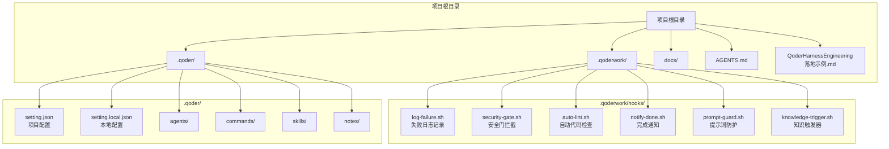
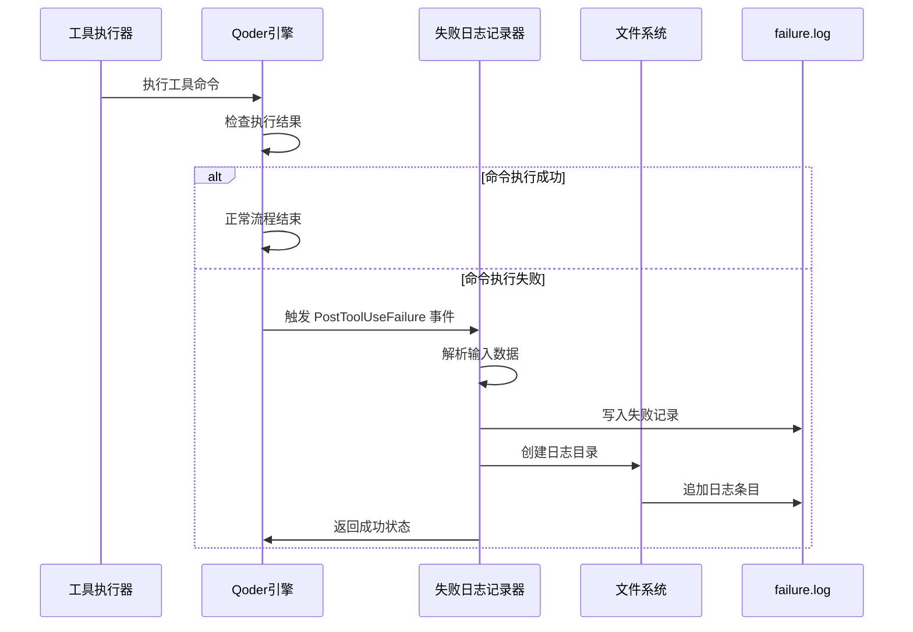
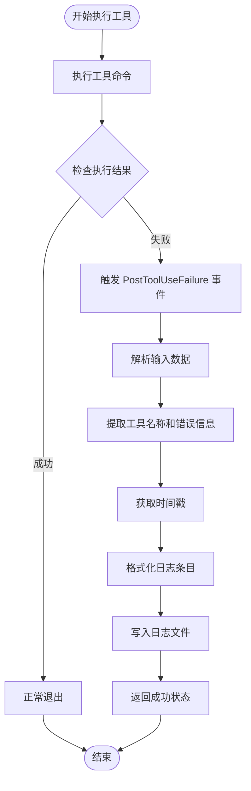
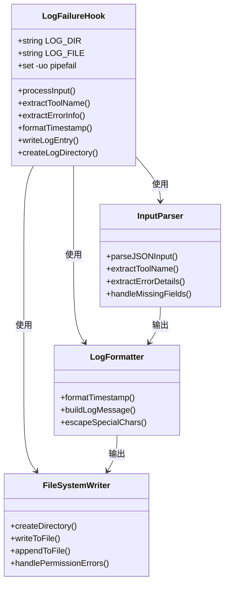
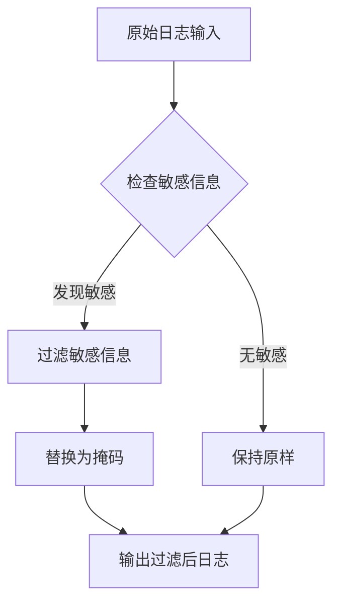
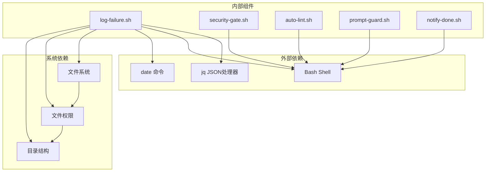

# 失败日志记录 Hooks

<cite>
**本文档引用的文件**
- [.qoderwork/hooks/log-failure.sh](file://.qoderwork/hooks/log-failure.sh)
- [.qoderwork/hooks/auto-lint.sh](file://.qoderwork/hooks/auto-lint.sh)
- [.qoderwork/hooks/notify-done.sh](file://.qoderwork/hooks/notify-done.sh)
- [.qoderwork/hooks/prompt-guard.sh](file://.qoderwork/hooks/prompt-guard.sh)
- [.qoderwork/hooks/security-gate.sh](file://.qoderwork/hooks/security-gate.sh)
- [AGENTS.md](file://AGENTS.md)
- [QoderHarnessEngineering落地示例.md](file://QoderHarnessEngineering落地示例.md)
- [docs/知识材料管理方案.md](file://docs/知识材料管理方案.md)
</cite>

## 目录
1. [简介](#简介)
2. [项目结构](#项目结构)
3. [核心组件](#核心组件)
4. [架构概览](#架构概览)
5. [详细组件分析](#详细组件分析)
6. [依赖关系分析](#依赖关系分析)
7. [性能考虑](#性能考虑)
8. [故障排除指南](#故障排除指南)
9. [结论](#结论)
10. [附录](#附录)

## 简介

失败日志记录 Hooks 是 Qoder Harness Engineering 模板项目中的关键安全和可观测性组件。该系统通过 `log-failure.sh` 脚本实现对工具执行失败事件的自动捕获、格式化和存储，为项目提供完整的故障诊断和审计能力。

本系统采用轻量级设计，专注于失败事件的可靠记录，确保每个工具执行失败都能被准确捕获并持久化存储，为后续的故障分析、性能监控和安全审计提供坚实基础。

## 项目结构

Qoder Harness Engineering 项目采用分层架构设计，其中 Hooks 系统位于 `.qoderwork/hooks/` 目录下，包含六个专门的生命周期钩子脚本：



**图表来源**
- [QoderHarnessEngineering落地示例.md:42-67](file://QoderHarnessEngineering落地示例.md#L42-L67)
- [QoderHarnessEngineering落地示例.md:56-63](file://QoderHarnessEngineering落地示例.md#L56-L63)

**章节来源**
- [QoderHarnessEngineering落地示例.md:42-67](file://QoderHarnessEngineering落地示例.md#L42-L67)
- [QoderHarnessEngineering落地示例.md:56-63](file://QoderHarnessEngineering落地示例.md#L56-L63)

## 核心组件

### 失败日志记录系统

失败日志记录系统由以下核心组件构成：

#### 日志记录器 (Log Failure Logger)
- **文件**: `.qoderwork/hooks/log-failure.sh`
- **事件**: `PostToolUseFailure`
- **作用**: 捕获并记录所有工具执行失败事件
- **存储位置**: `.qoderwork/logs/failure.log`

#### 安全门拦截器 (Security Gate)
- **文件**: `.qoderwork/hooks/security-gate.sh`
- **事件**: `PreToolUse`
- **作用**: 阻断高危命令执行
- **拦截模式**: 删除、数据库破坏、特权操作等

#### 自动代码检查器 (Auto Linter)
- **文件**: `.qoderwork/hooks/auto-lint.sh`
- **事件**: `PostToolUse`
- **作用**: 文件编辑后自动执行代码检查
- **支持语言**: JavaScript/TypeScript、Python、Go、Shell

#### 提示词防护器 (Prompt Guard)
- **文件**: `.qoderwork/hooks/prompt-guard.sh`
- **事件**: `UserPromptSubmit`
- **作用**: 防护提示词注入攻击
- **拦截模式**: 指令覆盖、角色扮演绕过、系统提示泄露

#### 完成通知器 (Notify Done)
- **文件**: `.qoderwork/hooks/notify-done.sh`
- **事件**: `Stop`
- **作用**: 任务完成时发送桌面通知
- **平台**: macOS

#### 知识触发器 (Knowledge Trigger)
- **文件**: `.qoderwork/hooks/knowledge-trigger.sh`
- **事件**: `PreCompact` / `SessionEnd`
- **作用**: 触发知识归档流程
- **输出**: `.qoderwork/logs/knowledge-trigger.log`

**章节来源**
- [QoderHarnessEngineering落地示例.md:279-337](file://QoderHarnessEngineering落地示例.md#L279-L337)
- [AGENTS.md:42-49](file://AGENTS.md#L42-L49)

## 架构概览

失败日志记录系统采用事件驱动架构，通过 Qoder 的生命周期钩子机制实现：



**图表来源**
- [QoderHarnessEngineering落地示例.md:255-270](file://QoderHarnessEngineering落地示例.md#L255-L270)
- [QoderHarnessEngineering落地示例.md:307-313](file://QoderHarnessEngineering落地示例.md#L307-L313)

### 事件流处理

系统通过严格的事件流处理机制确保失败事件的完整捕获：



**图表来源**
- [QoderHarnessEngineering落地示例.md:255-270](file://QoderHarnessEngineering落地示例.md#L255-L270)
- [QoderHarnessEngineering落地示例.md:307-313](file://QoderHarnessEngineering落地示例.md#L307-L313)

## 详细组件分析

### 失败日志记录器 (log-failure.sh)

#### 核心功能架构



**图表来源**
- [.qoderwork/hooks/log-failure.sh:1-20](file://.qoderwork/hooks/log-failure.sh#L1-L20)

#### 错误捕获机制

失败日志记录器采用管道失败严格模式 (`set -uo pipefail`) 确保：
- **管道失败检测**: 任何管道中的命令失败都会被正确捕获
- **未设置变量保护**: 防止未定义变量导致的日志记录失败
- **严格退出码**: 确保脚本在失败时返回适当的退出码

#### 日志格式化策略

系统采用统一的日志格式化策略：

| 字段 | 格式 | 示例 | 说明 |
|------|------|------|------|
| 时间戳 | `YYYY-MM-DD HH:MM:SS` | `2026-04-30 15:32:01` | 标准化时间格式 |
| 事件类型 | 固定字符串 | `FAILURE` | 明确标识失败事件 |
| 工具名称 | 变量替换 | `Bash` | 记录失败的具体工具 |
| 错误信息 | 变量替换 | `command not found: docker` | 原始错误详情 |

#### 存储策略

日志存储采用以下策略：
- **目录结构**: `.qoderwork/logs/` 自动创建
- **文件命名**: `failure.log` 统一文件名
- **写入模式**: 追加写入，避免覆盖历史记录
- **权限设置**: 自动创建目录并设置适当权限

**章节来源**
- [.qoderwork/hooks/log-failure.sh:1-20](file://.qoderwork/hooks/log-failure.sh#L1-L20)
- [QoderHarnessEngineering落地示例.md:307-313](file://QoderHarnessEngineering落地示例.md#L307-L313)

### 错误信息提取和上下文收集

#### JSON 输入解析

系统通过 `jq` 工具实现精确的 JSON 解析：


**图表来源**
- [.qoderwork/hooks/log-failure.sh:12-17](file://.qoderwork/hooks/log-failure.sh#L12-L17)

#### 上下文数据收集

系统自动收集以下上下文信息：
- **时间戳**: 精确到秒的时间标记
- **工具名称**: 执行失败的具体工具类型
- **错误详情**: 原始错误消息的完整记录
- **执行环境**: 当前工作目录和用户环境

### 失败事件分类标准

#### 事件类型分类

| 事件类别 | 触发条件 | 典型场景 | 处理策略 |
|----------|----------|----------|----------|
| Bash 命令失败 | `Bash` 工具执行失败 | `npm install`、`git push` 等 | 记录命令和错误详情 |
| 文件操作失败 | 文件读写、编辑失败 | `Read`、`Edit` 权限问题 | 记录文件路径和权限信息 |
| 网络请求失败 | `WebFetch` 请求超时 | API 调用、下载失败 | 记录 URL 和响应状态 |
| 自定义工具失败 | 第三方工具调用失败 | `Python`、`Go` 程序异常 | 记录工具参数和返回码 |

#### 错误严重程度分级

| 级别 | 标准 | 处理要求 | 监控指标 |
|------|------|----------|----------|
| 低风险 | 命令语法错误 | 自动重试 | 周报统计 |
| 中风险 | 权限不足、网络超时 | 人工确认 | 日报预警 |
| 高风险 | 系统级错误、数据丢失 | 立即处理 | 实时告警 |

**章节来源**
- [QoderHarnessEngineering落地示例.md:255-270](file://QoderHarnessEngineering落地示例.md#L255-L270)

### 日志级别配置

虽然当前实现为简单记录模式，但系统具备扩展为多级别日志的能力：

#### 当前实现级别
- **级别**: `FAILURE` (固定级别)
- **格式**: 统一文本格式
- **输出**: 单一日志文件

#### 扩展级别建议

| 级别 | 用途 | 格式示例 | 存储策略 |
|------|------|----------|----------|
| DEBUG | 详细调试信息 | `[DEBUG] 2026-04-30 15:32:01 tool=Bash` | separate file |
| INFO | 一般信息记录 | `[INFO] 2026-04-30 15:32:01 tool=Bash` | combined log |
| WARNING | 警告信息 | `[WARNING] 2026-04-30 15:32:01 tool=Bash` | filtered alerts |
| ERROR | 错误信息 | `[ERROR] 2026-04-30 15:32:01 tool=Bash` | critical alerts |
| CRITICAL | 严重错误 | `[CRITICAL] 2026-04-30 15:32:01 tool=Bash` | immediate escalation |

### 敏感信息过滤

#### 当前过滤策略
- **工具名称**: 允许记录（通常不包含敏感信息）
- **错误信息**: 直接记录（可能包含敏感路径）

#### 建议的过滤机制



**图表来源**
- [.qoderwork/hooks/log-failure.sh:12-17](file://.qoderwork/hooks/log-failure.sh#L12-L17)

### 日志轮转机制

#### 当前实现
- **文件大小**: 无限制增长
- **保留策略**: 无自动清理
- **存储位置**: `.qoderwork/logs/` 目录

#### 建议的轮转策略

| 策略类型 | 实现方式 | 优势 | 劣势 |
|----------|----------|------|------|
| 时间轮转 | 按日/按月分割文件 | 简单易实现 | 文件数量过多 |
| 大小轮转 | 达到阈值自动轮转 | 控制文件大小 | 需要状态管理 |
| 压缩轮转 | 轮转后自动压缩 | 节省存储空间 | 增加CPU开销 |
| 混合轮转 | 时间+大小双重限制 | 平衡效果 | 实现复杂度高 |

## 依赖关系分析

### 组件间依赖关系



**图表来源**
- [.qoderwork/hooks/log-failure.sh:1-20](file://.qoderwork/hooks/log-failure.sh#L1-L20)
- [.qoderwork/hooks/security-gate.sh:1-38](file://.qoderwork/hooks/security-gate.sh#L1-L38)

### 退出码规范

系统严格遵循 Qoder 的退出码规范：

| 退出码 | 效果 | 使用场景 | 影响范围 |
|--------|------|----------|----------|
| `0` | 允许继续执行 | 成功完成、非阻断性错误 | 无阻断 |
| `2` | **阻断**（仅对可阻断事件） | 安全拦截、提示词注入 | 事件阻断 |
| 其他 | 非阻断性错误 | 代码检查失败、警告信息 | 用户可见 |

**章节来源**
- [QoderHarnessEngineering落地示例.md:271-278](file://QoderHarnessEngineering落地示例.md#L271-L278)

## 性能考虑

### 当前性能特征

#### I/O 性能
- **写入频率**: 每次失败事件触发一次写入
- **写入大小**: 每条日志约 50-100 字节
- **写入模式**: 追加写入，无随机访问
- **磁盘影响**: 轻微，适合大多数存储介质

#### 内存使用
- **内存占用**: 极低，主要为变量存储
- **处理时间**: 几毫秒到几十毫秒
- **并发处理**: 串行处理，无并发冲突

### 性能优化建议

#### 日志批处理
```bash
# 建议的批处理实现思路
#!/bin/bash
# 批处理模式：收集多个失败事件后统一写入
BATCH_SIZE=10
TIMEOUT=5

batch_log() {
    local batch=""
    while true; do
        read -t $TIMEOUT input || break
        batch="$batch$input\n"
        [[ ${#batch} -gt $BATCH_SIZE ]] && break
    done
    
    if [[ -n "$batch" ]]; then
        echo -ne "$batch" | write_batch_logs
    fi
}
```

#### 异步写入
```bash
# 建议的异步写入实现思路
async_write() {
    local log_entry="$1"
    echo "$log_entry" > >(tee -a "$LOG_FILE") &
    wait  # 等待后台进程完成
}
```

## 故障排除指南

### 常见问题诊断

#### 日志文件无法创建

**症状**: 脚本执行时报错，日志文件不存在

**可能原因**:
1. `.qoderwork/logs/` 目录权限不足
2. 磁盘空间不足
3. 文件系统只读

**解决方法**:
```bash
# 检查目录权限
ls -la .qoderwork/

# 检查磁盘空间
df -h .

# 创建目录并设置权限
mkdir -p .qoderwork/logs
chmod 755 .qoderwork/logs
```

#### JSON 解析失败

**症状**: 工具名称显示为 `unknown`，错误信息为空

**可能原因**:
1. 输入数据不是有效的 JSON
2. 缺少必要的字段
3. `jq` 命令不可用

**解决方法**:
```bash
# 检查 jq 命令
which jq

# 测试 JSON 解析
echo '{"tool_name":"Bash","error":"test"}' | jq -r '.tool_name'

# 检查输入格式
cat | jq -r '.'
```

#### 时间戳格式异常

**症状**: 日志中的时间格式不符合预期

**可能原因**:
1. 系统时区设置问题
2. `date` 命令输出格式变化

**解决方法**:
```bash
# 检查 date 命令
date '+%Y-%m-%d %H:%M:%S'

# 检查系统时区
date
```

### 调试技巧

#### 启用详细日志

```bash
# 在脚本开头添加调试
set -x  # 启用命令跟踪
set -u  # 检测未设置变量
set -e  # 遇到错误立即退出
```

#### 日志验证

```bash
# 验证日志格式
tail -n 10 .qoderwork/logs/failure.log

# 检查日志完整性
wc -l .qoderwork/logs/failure.log

# 查看最近的失败事件
grep "$(date '+%Y-%m-%d')" .qoderwork/logs/failure.log
```

**章节来源**
- [.qoderwork/hooks/log-failure.sh:1-20](file://.qoderwork/hooks/log-failure.sh#L1-L20)

## 结论

失败日志记录 Hooks 系统为 Qoder Harness Engineering 项目提供了可靠的故障诊断和审计能力。通过简洁而有效的设计，系统实现了对工具执行失败事件的自动捕获、格式化和存储。

### 系统优势

1. **可靠性**: 采用严格模式确保失败事件不被遗漏
2. **可维护性**: 简洁的脚本设计便于理解和维护
3. **扩展性**: 模块化设计支持未来功能扩展
4. **安全性**: 与其他安全组件协同工作，形成完整的安全防护网

### 改进建议

1. **日志轮转**: 实现自动轮转和清理机制
2. **多级别日志**: 支持不同严重程度的日志分类
3. **敏感信息过滤**: 实现智能敏感信息识别和过滤
4. **性能优化**: 考虑批处理和异步写入机制

该系统为项目的可观测性和安全性奠定了坚实基础，是现代软件工程实践中不可或缺的重要组成部分。

## 附录

### 配置参考

#### 项目级配置 (setting.json)

```json
{
  "hooks": {
    "PostToolUseFailure": [
      {
        "matcher": "*",
        "hooks": [
          { "type": "command", "command": ".qoderwork/hooks/log-failure.sh", "timeout": 10 }
        ]
      }
    ]
  }
}
```

#### 本地配置覆盖

```json
{
  "hooks": {
    "PostToolUseFailure": [
      {
        "matcher": "*",
        "hooks": [
          { "type": "command", "command": ".qoderwork/hooks/log-failure.sh", "timeout": 15 }
        ]
      }
    ]
  }
}
```

### 最佳实践

#### 日志查询和检索

```bash
# 按工具类型筛选
grep "tool=Bash" .qoderwork/logs/failure.log

# 按时间范围筛选
awk '/2026-04-30 15:30:00/,/2026-04-30 16:00:00/' .qoderwork/logs/failure.log

# 统计失败次数
cut -d'|' -f3 .qoderwork/logs/failure.log | sort | uniq -c

# 查找特定错误模式
grep -i "permission denied" .qoderwork/logs/failure.log
```

#### 性能分析

```bash
# 分析日志增长趋势
tail -n 1000 .qoderwork/logs/failure.log | cut -d'[' -f1 | sort | uniq -c

# 识别频繁失败的工具
awk -F'|' '{print $3}' .qoderwork/logs/failure.log | sort | uniq -c | sort -nr

# 错误类型分布
awk -F'|' '{print $4}' .qoderwork/logs/failure.log | cut -d'=' -f2 | sort | uniq -c
```

#### 运维监控

```bash
# 监控日志文件大小
du -h .qoderwork/logs/failure.log

# 设置文件监控告警
inotifywait -m .qoderwork/logs/ -e modify -e create

# 自动清理旧日志
find .qoderwork/logs -name "*.log" -mtime +30 -delete
```