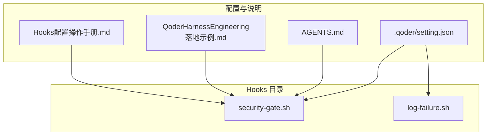
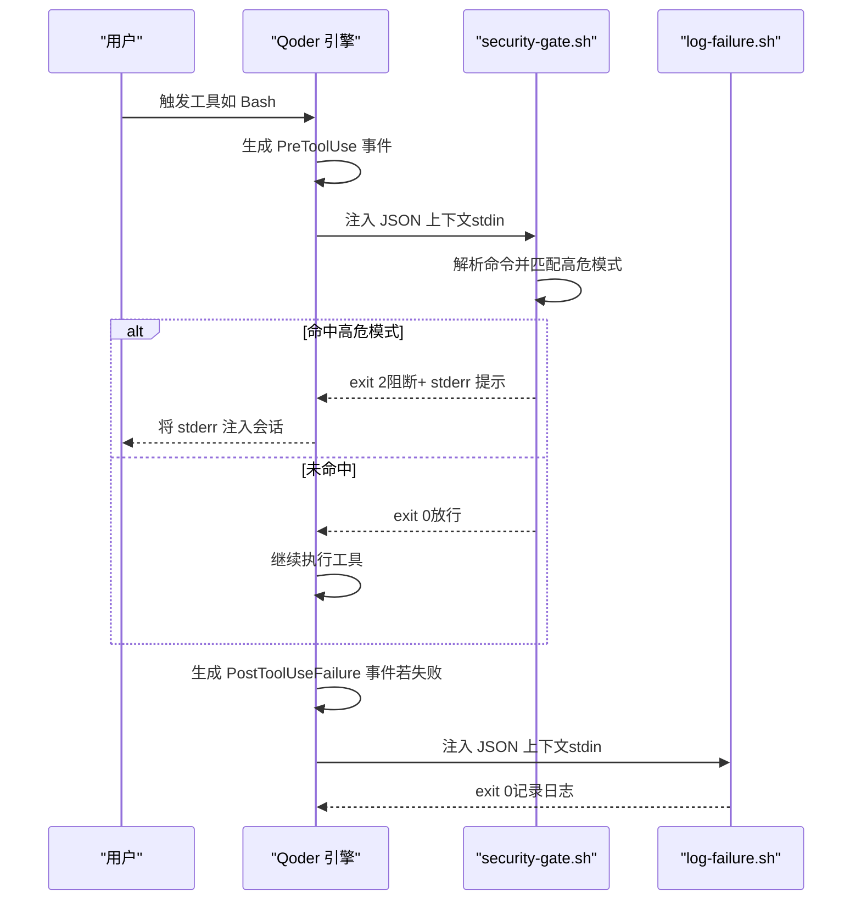
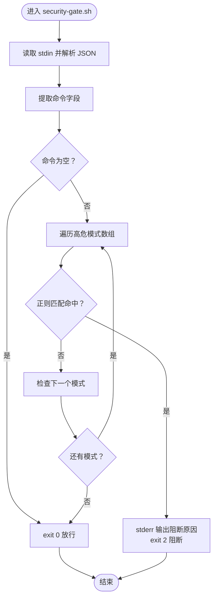
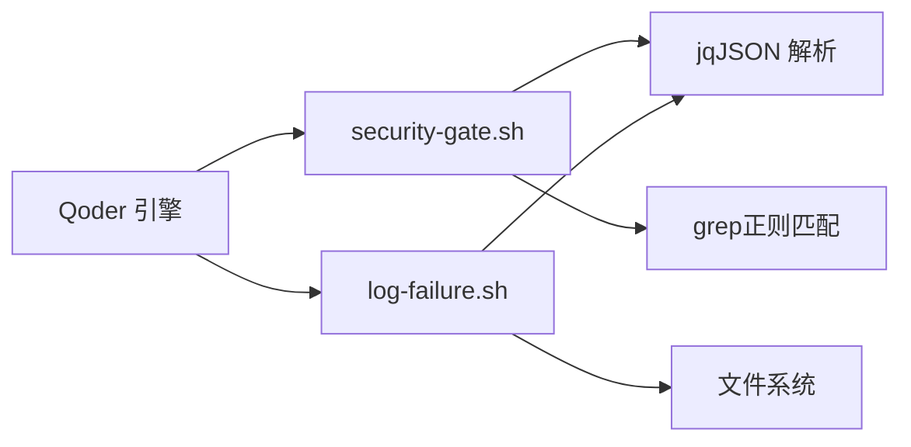

# 安全拦截器 Hooks

<cite>
**本文引用的文件**
- [security-gate.sh](file://.qoderwork/hooks/security-gate.sh)
- [log-failure.sh](file://.qoderwork/hooks/log-failure.sh)
- [AGENTS.md](file://AGENTS.md)
- [QoderHarnessEngineering落地示例.md](file://QoderHarnessEngineering落地示例.md)
- [Hooks配置操作手册.md](file://docs/Hooks配置操作手册.md)
</cite>

## 目录
1. [引言](#引言)
2. [项目结构](#项目结构)
3. [核心组件](#核心组件)
4. [架构总览](#架构总览)
5. [详细组件分析](#详细组件分析)
6. [依赖关系分析](#依赖关系分析)
7. [性能考量](#性能考量)
8. [故障排查指南](#故障排查指南)
9. [结论](#结论)
10. [附录](#附录)

## 引言
本文件围绕安全拦截器 Hooks 的技术实现展开，重点解析 PreToolUse 钩子中的安全门脚本 security-gate.sh 的实现原理，包括高危命令模式匹配算法、正则表达式规则设计与威胁检测逻辑。文档还提供安全策略配置方法、自定义威胁规则添加与误报处理机制，并覆盖安全事件日志记录、阻断响应处理与安全审计的技术实现，最后给出最佳实践与风险评估建议。

## 项目结构
本项目在 .qoderwork/hooks 目录下提供一组生命周期钩子脚本，其中 security-gate.sh 作为 PreToolUse 事件的 Bash 安全门，负责在命令执行前进行高危模式拦截。其他相关脚本包括日志记录脚本 log-failure.sh，以及配套的配置与说明文档。

图表来源
- [.qoderwork/hooks/security-gate.sh](file://.qoderwork/hooks/security-gate.sh)
- [.qoderwork/hooks/log-failure.sh](file://.qoderwork/hooks/log-failure.sh)
- [QoderHarnessEngineering落地示例.md](file://QoderHarnessEngineering落地示例.md)
- [AGENTS.md](file://AGENTS.md)
- [Hooks配置操作手册.md](file://docs/Hooks配置操作手册.md)

章节来源
- [QoderHarnessEngineering落地示例.md:42-67](file://QoderHarnessEngineering落地示例.md#L42-L67)
- [AGENTS.md:34-50](file://AGENTS.md#L34-L50)

## 核心组件
- security-gate.sh：PreToolUse 事件的 Bash 安全门，基于预置的高危命令模式集合进行匹配，命中即阻断（exit 2），并将错误信息注入会话。
- log-failure.sh：PostToolUseFailure 事件的日志记录脚本，将失败信息写入 .qoderwork/logs/failure.log。
- setting.json：Hooks 生命周期与权限策略的配置入口，定义 PreToolUse/Bash 的安全门绑定与超时等参数。
- AGENTS.md 与 Hooks 配置手册：提供事件触发时机、stdin 数据格式、matcher 语法、退出码规范等工程化支撑。

章节来源
- [security-gate.sh:1-38](file://.qoderwork/hooks/security-gate.sh#L1-L38)
- [log-failure.sh:1-20](file://.qoderwork/hooks/log-failure.sh#L1-L20)
- [QoderHarnessEngineering落地示例.md:123-184](file://QoderHarnessEngineering落地示例.md#L123-L184)
- [AGENTS.md:54-69](file://AGENTS.md#L54-L69)
- [Hooks配置操作手册.md:22-50](file://docs/Hooks配置操作手册.md#L22-L50)

## 架构总览
安全拦截器在 Qoder 的生命周期中自动触发，PreToolUse 事件在工具执行前注入 JSON 上下文，security-gate.sh 读取命令并进行高危模式匹配，命中则阻断并把 stderr 注入会话；PostToolUseFailure 事件在工具失败后触发 log-failure.sh 写入失败日志。

图表来源
- [security-gate.sh:8-37](file://.qoderwork/hooks/security-gate.sh#L8-L37)
- [log-failure.sh:12-19](file://.qoderwork/hooks/log-failure.sh#L12-L19)
- [Hooks配置操作手册.md:22-50](file://docs/Hooks配置操作手册.md#L22-L50)

## 详细组件分析

### security-gate.sh：高危命令安全门
- 输入解析：从 stdin 读取 JSON，提取工具名与命令字段；若命令为空则直接放行。
- 模式匹配：维护高危命令模式数组，逐条使用正则进行不区分大小写的匹配；任一命中即阻断。
- 阻断机制：输出错误信息到 stderr，返回 exit 2，Qoder 将该 stderr 注入会话上下文。
- 放行条件：未命中任何模式或命令为空时返回 exit 0。

图表来源
- [security-gate.sh:8-37](file://.qoderwork/hooks/security-gate.sh#L8-L37)

章节来源
- [security-gate.sh:1-38](file://.qoderwork/hooks/security-gate.sh#L1-L38)
- [QoderHarnessEngineering落地示例.md:281-295](file://QoderHarnessEngineering落地示例.md#L281-L295)

### 高危命令模式识别机制（10+ 类型）
- 递归删除：rm -rf、rm --recursive
- 数据库破坏：DROP TABLE、DROP DATABASE、TRUNCATE TABLE
- 磁盘写入：> /dev/sd*、dd if=
- 磁盘格式化：mkfs.*
- 权限开放：chmod -R 777
- 特权删除：sudo rm
- Fork Bomb：:(){:|:&};:

上述模式通过正则表达式进行匹配，具备一定的泛化能力，可覆盖常见变体与大小写差异。

章节来源
- [security-gate.sh:16-28](file://.qoderwork/hooks/security-gate.sh#L16-L28)
- [QoderHarnessEngineering落地示例.md:285-294](file://QoderHarnessEngineering落地示例.md#L285-L294)

### 正则表达式规则设计与威胁检测逻辑
- 设计原则
  - 不区分大小写：使用不区分大小写的匹配标志，提升覆盖面。
  - 泛化与稳健：针对 rm 的递归选项、数据库关键字、设备路径、特权命令等进行稳健匹配。
  - 早期阻断：在命令执行前进行阻断，避免造成不可逆影响。
- 检测流程
  - 读取命令字符串
  - 依次与每条正则模式比较
  - 命中即刻阻断并记录原因
  - 未命中则放行

章节来源
- [security-gate.sh:30-35](file://.qoderwork/hooks/security-gate.sh#L30-L35)
- [Hooks配置操作手册.md:245-261](file://docs/Hooks配置操作手册.md#L245-L261)

### 安全策略配置方法
- 在 setting.json 的 hooks.PreToolUse.Bash 中绑定 security-gate.sh，并设置合理的 timeout。
- 通过 permissions.allow/ask/deny 控制 Bash 命令的放行、确认与禁止范围，形成“三层策略”。
- 本地私有配置（setting.local.json）用于个人覆盖，建议加入 .gitignore。

章节来源
- [QoderHarnessEngineering落地示例.md:123-184](file://QoderHarnessEngineering落地示例.md#L123-L184)
- [QoderHarnessEngineering落地示例.md:194-221](file://QoderHarnessEngineering落地示例.md#L194-L221)

### 自定义威胁规则添加与误报处理
- 添加规则
  - 在 security-gate.sh 的高危模式数组中新增正则表达式。
  - 保持正则简洁且具有代表性，避免过度宽泛导致误报。
- 误报处理
  - 通过 permissions.ask/allow 对特定命令进行白名单放行或二次确认。
  - 在本地配置中临时屏蔽个别误报规则，待优化后再恢复。
  - 使用调试技巧验证规则命中与排除效果。

章节来源
- [security-gate.sh:16-28](file://.qoderwork/hooks/security-gate.sh#L16-L28)
- [Hooks配置操作手册.md:520-541](file://docs/Hooks配置操作手册.md#L520-L541)

### 安全事件日志记录与阻断响应
- 阻断响应：security-gate.sh 将阻断原因写入 stderr，Qoder 将其注入会话，便于用户理解与后续处理。
- 失败日志：log-failure.sh 在 PostToolUseFailure 事件中记录工具名与错误信息，写入 .qoderwork/logs/failure.log。
- 日志查看：可通过 tail -f 实时监控失败日志，辅助审计与排障。

章节来源
- [security-gate.sh:32-33](file://.qoderwork/hooks/security-gate.sh#L32-L33)
- [log-failure.sh:12-19](file://.qoderwork/hooks/log-failure.sh#L12-L19)
- [Hooks配置操作手册.md:305-315](file://docs/Hooks配置操作手册.md#L305-L315)

### 安全审计功能
- 审计入口：结合 PostToolUse 事件的 auto-lint.sh（如需）与 PostToolUseFailure 的日志记录，形成执行前后与失败的审计闭环。
- 审计建议：定期轮阅失败日志，识别异常命令模式与误报情况，持续优化规则与权限策略。

章节来源
- [QoderHarnessEngineering落地示例.md:296-306](file://QoderHarnessEngineering落地示例.md#L296-L306)
- [log-failure.sh:12-19](file://.qoderwork/hooks/log-failure.sh#L12-L19)

## 依赖关系分析
- security-gate.sh 依赖于：
  - jq：解析 stdin 中的 JSON 字段（命令与工具名）。
  - grep（正则匹配）：执行高危模式匹配。
  - Qoder 的生命周期事件机制：PreToolUse 事件触发与 exit 2 阻断。
- log-failure.sh 依赖于：
  - jq：解析失败事件的工具名与错误信息。
  - 文件系统：写入 .qoderwork/logs/failure.log。

图表来源
- [security-gate.sh:8-9](file://.qoderwork/hooks/security-gate.sh#L8-L9)
- [security-gate.sh:30-35](file://.qoderwork/hooks/security-gate.sh#L30-L35)
- [log-failure.sh:12-14](file://.qoderwork/hooks/log-failure.sh#L12-L14)

章节来源
- [security-gate.sh:1-38](file://.qoderwork/hooks/security-gate.sh#L1-L38)
- [log-failure.sh:1-20](file://.qoderwork/hooks/log-failure.sh#L1-L20)

## 性能考量
- 匹配复杂度：正则匹配数量有限（约 10 余条），单次匹配开销极低，整体延迟可忽略。
- I/O 成本：主要来自 jq 解析与日志写入，通常在毫秒级。
- 超时控制：建议在 setting.json 中为 security-gate.sh 设置合理 timeout，避免阻断会话。
- 并发与顺序：同一事件下的多个 Hook 按顺序串行执行，应尽量保持轻量与快速。

章节来源
- [Hooks配置操作手册.md:594-601](file://docs/Hooks配置操作手册.md#L594-L601)
- [QoderHarnessEngineering落地示例.md:157-165](file://QoderHarnessEngineering落地示例.md#L157-L165)

## 故障排查指南
- 脚本不执行
  - 检查执行权限与路径是否正确。
  - 确认 setting.json 中事件名与 matcher 拼写无误。
- exit 2 未阻断
  - 确认事件是否可阻断（仅 PreToolUse、UserPromptSubmit、Stop、SubagentStop 支持）。
  - 确认 stderr 输出是否使用 >&2。
- stderr 未注入会话
  - 检查是否使用 exit 2 且 stderr 内容非空。
- 超时问题
  - 调整 timeout 值，避免阻塞会话。
- 误报与漏报
  - 通过 permissions.ask/allow 进行微调，必要时增删正则规则。

章节来源
- [Hooks配置操作手册.md:572-621](file://docs/Hooks配置操作手册.md#L572-L621)
- [security-gate.sh:32-33](file://.qoderwork/hooks/security-gate.sh#L32-L33)

## 结论
security-gate.sh 通过在 PreToolUse 事件前对 Bash 命令进行高危模式匹配，实现了对 rm -rf、数据库破坏、磁盘写入、格式化、权限开放、特权删除与 Fork Bomb 等高危行为的早期阻断。结合权限策略与失败日志记录，形成了“事前拦截、事中审计、事后记录”的安全闭环。建议在团队内定期评估规则命中率与误报情况，动态优化正则与权限策略，确保安全与效率的平衡。

## 附录
- 事件与退出码规范
  - PreToolUse：可阻断（exit 2），stderr 注入会话。
  - PostToolUseFailure：不可阻断，仅记录日志。
- 常用调试方法
  - 使用 echo + pipe 模拟 stdin 输入，验证阻断与放行逻辑。
  - 使用 jq 验证字段提取是否正确。
  - 使用 tail -f 实时查看失败日志。

章节来源
- [Hooks配置操作手册.md:253-261](file://docs/Hooks配置操作手册.md#L253-L261)
- [Hooks配置操作手册.md:520-541](file://docs/Hooks配置操作手册.md#L520-L541)