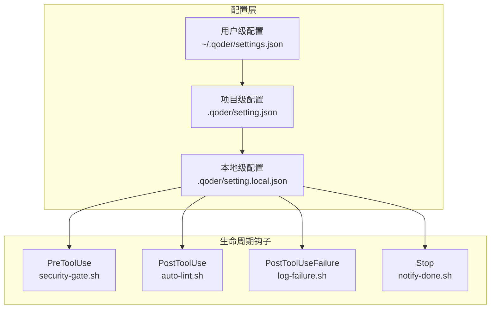
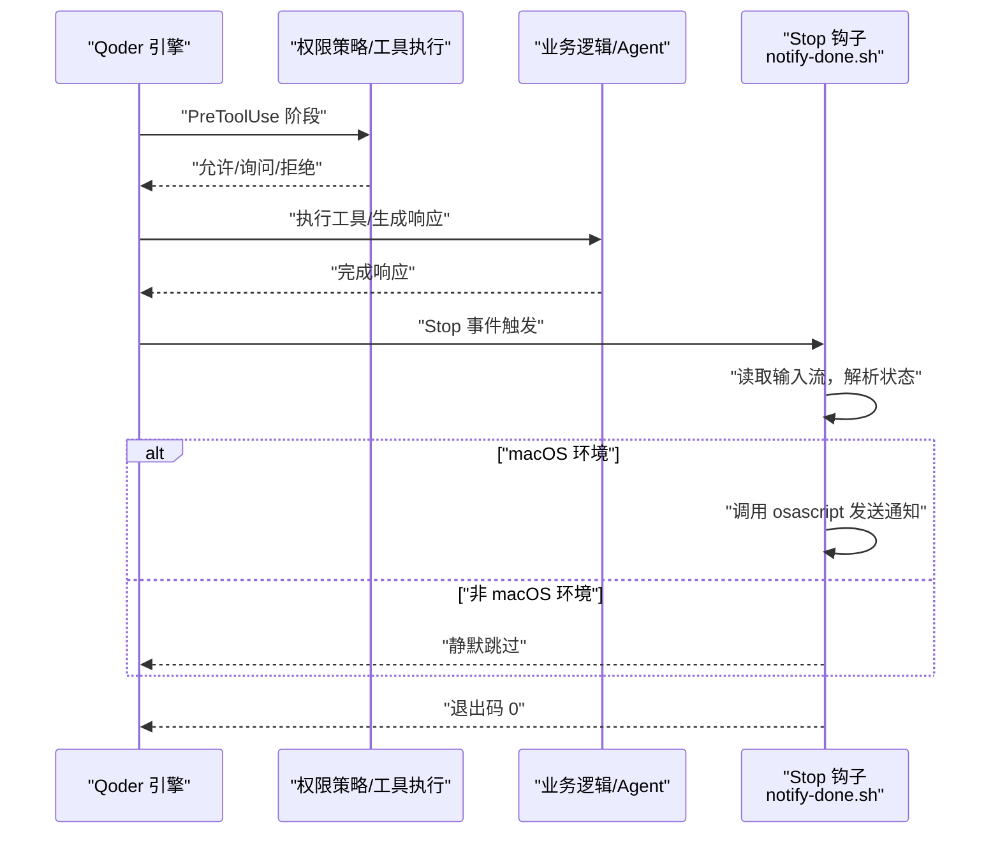
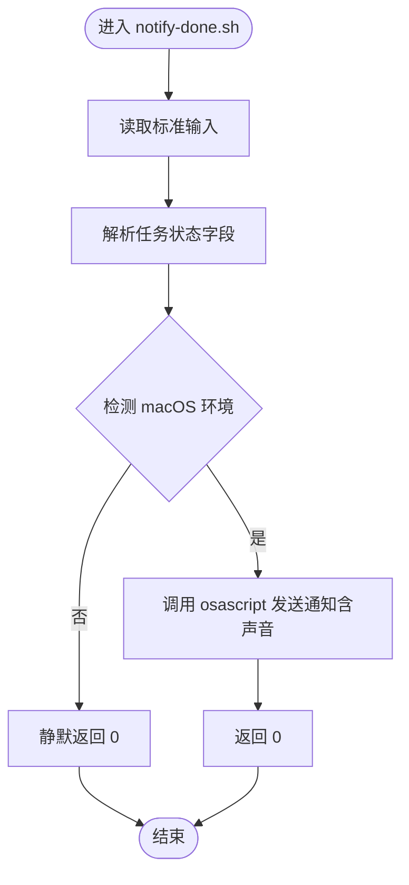
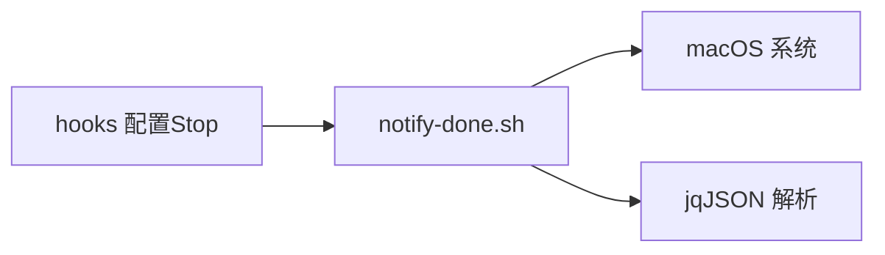

# 桌面通知 Hooks

<cite>
**本文引用的文件**
- [notify-done.sh](file://.qoderwork/hooks/notify-done.sh)
- [log-failure.sh](file://.qoderwork/hooks/log-failure.sh)
- [auto-lint.sh](file://.qoderwork/hooks/auto-lint.sh)
- [security-gate.sh](file://.qoderwork/hooks/security-gate.sh)
- [QoderHarnessEngineering落地示例.md](file://QoderHarnessEngineering落地示例.md)
- [AGENTS.md](file://AGENTS.md)
</cite>

## 目录
1. [引言](#引言)
2. [项目结构](#项目结构)
3. [核心组件](#核心组件)
4. [架构总览](#架构总览)
5. [详细组件分析](#详细组件分析)
6. [依赖关系分析](#依赖关系分析)
7. [性能考虑](#性能考虑)
8. [故障排查指南](#故障排查指南)
9. [结论](#结论)
10. [附录](#附录)

## 引言
本文件面向桌面通知 Hooks 的技术文档，聚焦于 notify-done.sh 脚本在 Qoder 工程化体系中的作用与实现。该脚本在 Agent 完成响应时触发，当前版本针对 macOS 平台通过 osascript 发送桌面通知，并支持可选的声音提示；同时，文档梳理了与之配套的权限策略、日志记录、自动 Lint、安全门等 Hooks，帮助读者理解通知在整个生命周期钩子体系中的位置与协作方式。

## 项目结构
本项目采用“配置分层 + 生命周期钩子”的工程化范式：
- 配置分层：用户级、项目级、本地级三档合并，deny 优先，具体规则优先于通配规则，本地级覆盖项目级，项目级覆盖用户级。
- 生命周期钩子：在工具执行前后、用户提交 Prompt、会话开始/结束、知识归档等节点注入自动化行为。
- 通知钩子：在 Stop 事件触发，向用户反馈任务完成状态。

图表来源
- [QoderHarnessEngineering落地示例.md: 25-33:25-33](file://QoderHarnessEngineering落地示例.md#L25-L33)
- [QoderHarnessEngineering落地示例.md: 157-182:157-182](file://QoderHarnessEngineering落地示例.md#L157-L182)
- [QoderHarnessEngineering落地示例.md: 253-269:253-269](file://QoderHarnessEngineering落地示例.md#L253-L269)

章节来源
- [QoderHarnessEngineering落地示例.md: 25-33:25-33](file://QoderHarnessEngineering落地示例.md#L25-L33)
- [QoderHarnessEngineering落地示例.md: 125-184:125-184](file://QoderHarnessEngineering落地示例.md#L125-L184)
- [QoderHarnessEngineering落地示例.md: 253-269:253-269](file://QoderHarnessEngineering落地示例.md#L253-L269)

## 核心组件
- notify-done.sh：在 Stop 事件触发，读取输入流中的上下文，判断任务状态并调用系统通知服务（macOS osascript），支持可选声音提示。
- security-gate.sh：在 PreToolUse 事件拦截高危 Bash 命令，命中规则时阻断执行。
- auto-lint.sh：在 PostToolUse 事件对写入/编辑后的文件进行自动 Lint。
- log-failure.sh：在 PostToolUseFailure 事件记录失败日志，便于后续审计与排障。

章节来源
- [notify-done.sh: 1-16:1-16](file://.qoderwork/hooks/notify-done.sh#L1-L16)
- [security-gate.sh: 1-38:1-38](file://.qoderwork/hooks/security-gate.sh#L1-L38)
- [auto-lint.sh: 1-43:1-43](file://.qoderwork/hooks/auto-lint.sh#L1-L43)
- [log-failure.sh: 1-20:1-20](file://.qoderwork/hooks/log-failure.sh#L1-L20)

## 架构总览
通知钩子在 Qoder 的生命周期中处于“收尾”阶段，负责向用户反馈任务完成状态。其上游可能经过权限校验、工具执行、结果处理等环节，下游可与其他钩子协同形成完整的工程化闭环。

图表来源
- [QoderHarnessEngineering落地示例.md: 253-269:253-269](file://QoderHarnessEngineering落地示例.md#L253-L269)
- [notify-done.sh: 7-13:7-13](file://.qoderwork/hooks/notify-done.sh#L7-L13)

## 详细组件分析

### notify-done.sh 组件分析
- 输入与解析
  - 从标准输入读取上下文，解析任务完成原因字段，若缺失则回退为默认值。
- 平台检测与通知发送
  - 仅在 macOS 环境下检测并使用 osascript 发送通知；若命令可用则尝试发送带声音的通知，失败时静默处理。
- 退出码
  - 总是返回 0，确保不影响后续流程。

图表来源
- [notify-done.sh: 7-13:7-13](file://.qoderwork/hooks/notify-done.sh#L7-L13)

章节来源
- [notify-done.sh: 1-16:1-16](file://.qoderwork/hooks/notify-done.sh#L1-L16)

### 与权限策略的协作
- 权限分层与优先级
  - deny 优先于 allow/ask；更具体规则优先于通配符；本地级覆盖项目级，项目级覆盖用户级。
- 通知钩子的触发条件
  - Stop 事件触发，与权限策略无关；但若在 PreToolUse 阶段被阻断，则不会到达 Stop 阶段。

章节来源
- [QoderHarnessEngineering落地示例.md: 224-250:224-250](file://QoderHarnessEngineering落地示例.md#L224-L250)
- [QoderHarnessEngineering落地示例.md: 253-269:253-269](file://QoderHarnessEngineering落地示例.md#L253-L269)

### 与日志记录的协作
- log-failure.sh 在 PostToolUseFailure 事件中记录失败详情，便于定位通知未触发的原因（如环境不满足、命令不可用等）。

章节来源
- [log-failure.sh: 1-20:1-20](file://.qoderwork/hooks/log-failure.sh#L1-L20)

### 与自动 Lint 的协作
- auto-lint.sh 在 PostToolUse 事件中对写入/编辑后的文件进行自动 Lint，减少后续失败概率，间接提升 Stop 事件的稳定性。

章节来源
- [auto-lint.sh: 1-43:1-43](file://.qoderwork/hooks/auto-lint.sh#L1-L43)

### 与安全门的协作
- security-gate.sh 在 PreToolUse 事件中拦截高危命令，避免因危险命令导致的异常中断，从而保证 Stop 事件能够正常触发。

章节来源
- [security-gate.sh: 1-38:1-38](file://.qoderwork/hooks/security-gate.sh#L1-L38)

## 依赖关系分析
- notify-done.sh 对外部工具的依赖
  - macOS 环境下的 osascript（AppleScript 命令行接口）。
  - jq（JSON 解析工具）用于从输入流中提取字段。
- 与系统环境的耦合
  - 仅在 macOS 环境下启用通知；其他平台将静默跳过。
- 与 Qoder 配置的耦合
  - 通过 hooks 配置在 Stop 事件中注册 notify-done.sh。

图表来源
- [notify-done.sh: 10-13:10-13](file://.qoderwork/hooks/notify-done.sh#L10-L13)
- [QoderHarnessEngineering落地示例.md: 157-182:157-182](file://QoderHarnessEngineering落地示例.md#L157-L182)

章节来源
- [notify-done.sh: 10-13:10-13](file://.qoderwork/hooks/notify-done.sh#L10-L13)
- [QoderHarnessEngineering落地示例.md: 157-182:157-182](file://QoderHarnessEngineering落地示例.md#L157-L182)

## 性能考虑
- 通知开销极小：仅在 Stop 事件触发，且为同步轻量调用，对整体性能影响可忽略。
- 并发与批量：当前实现为单次通知，未涉及批量处理；若需批量通知，建议在上游聚合后再调用一次通知钩子。
- 跨平台兼容：非 macOS 环境下静默跳过，避免额外开销与错误输出。

## 故障排查指南
- 通知未出现
  - 确认运行环境为 macOS。
  - 确认 osascript 可用且系统通知权限已开启。
  - 检查 hooks 配置是否正确注册 Stop 事件。
- 通知声音无效
  - 确认系统声音设置允许该应用发出声音。
  - 若声音名称不存在，通知仍会显示但无声。
- 日志辅助定位
  - 查看失败日志以确认是否因环境限制导致通知未触发。
- 权限策略影响
  - 若 PreToolUse 阶段被阻断，将不会进入 Stop 阶段，需检查权限策略与命令匹配。

章节来源
- [log-failure.sh: 12-17:12-17](file://.qoderwork/hooks/log-failure.sh#L12-L17)
- [QoderHarnessEngineering落地示例.md: 271-278:271-278](file://QoderHarnessEngineering落地示例.md#L271-L278)

## 结论
notify-done.sh 作为 Qoder 生命周期钩子体系中的“收尾”组件，通过在 Stop 事件中发送桌面通知，提升了用户对任务完成状态的感知。其设计简洁、平台相关性强（macOS），与权限策略、日志记录、自动 Lint、安全门等组件形成互补，共同构建了工程化的自动化与安全性保障体系。

## 附录
- 事件与钩子对照
  - PreToolUse：security-gate.sh
  - PostToolUse：auto-lint.sh
  - PostToolUseFailure：log-failure.sh
  - Stop：notify-done.sh
- 相关文档
  - Qoder 工程化落地示例与 Hooks 说明
  - AGENTS.md 中的项目上下文与行为约束

章节来源
- [QoderHarnessEngineering落地示例.md: 253-269:253-269](file://QoderHarnessEngineering落地示例.md#L253-L269)
- [AGENTS.md: 34-69:34-69](file://AGENTS.md#L34-L69)