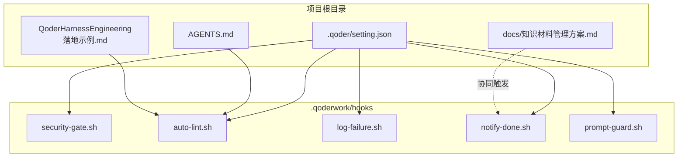
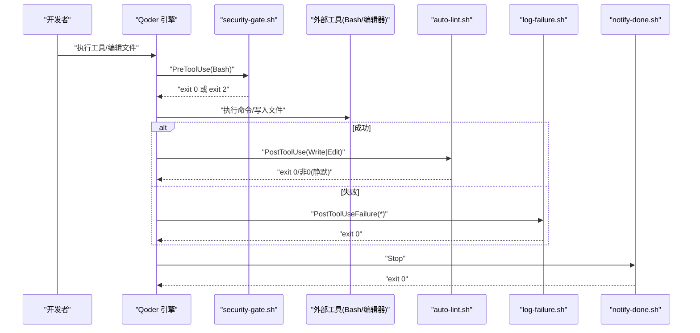
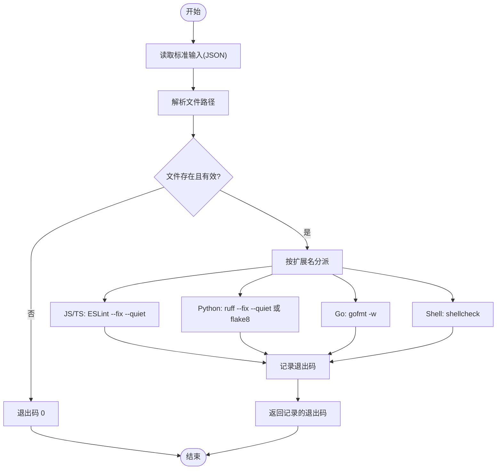
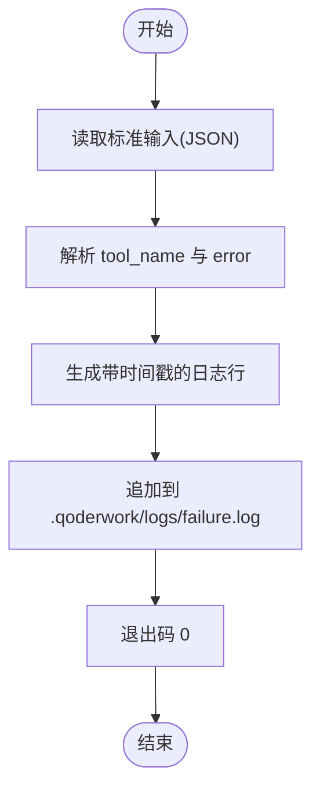
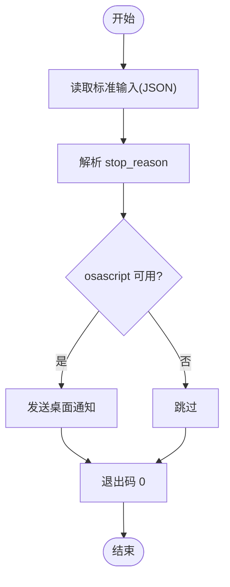
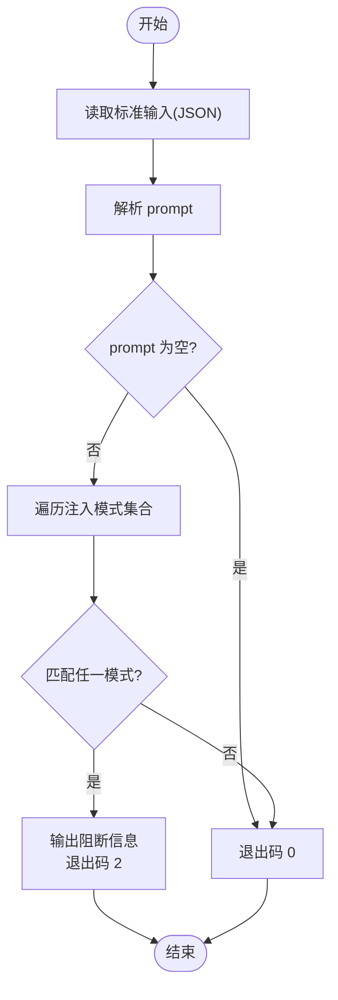
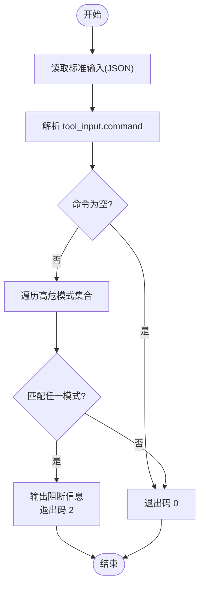
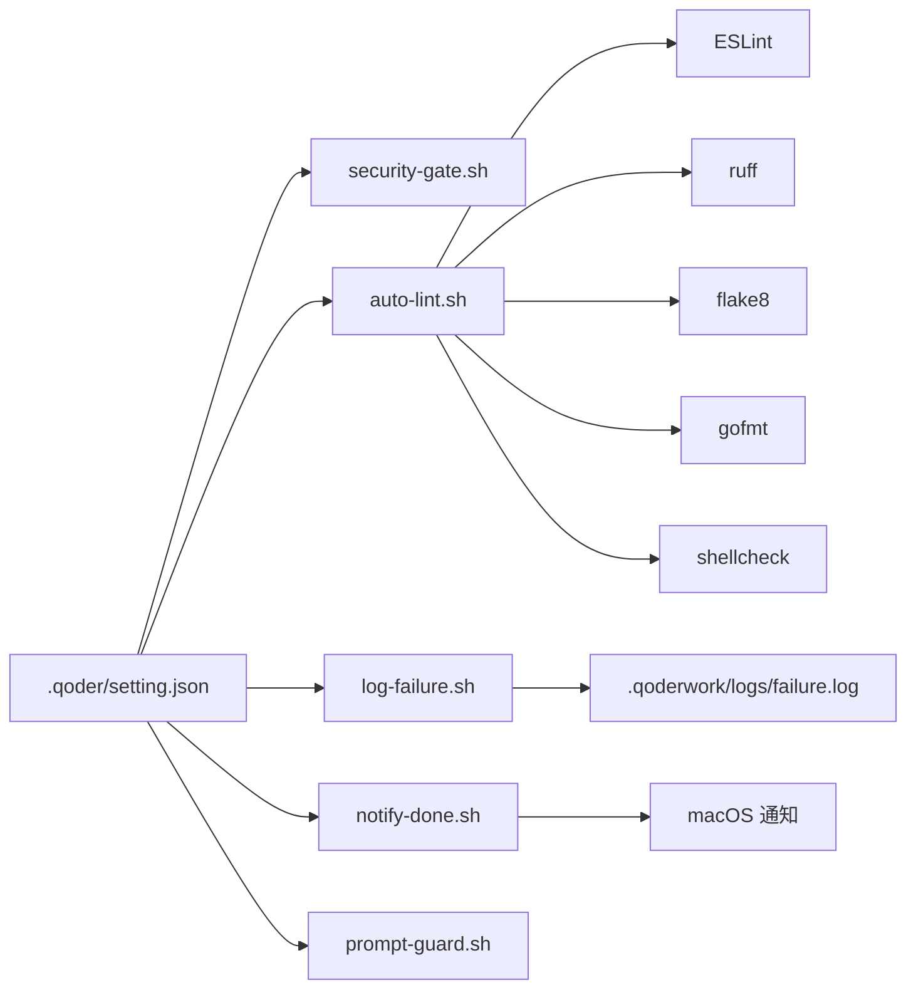

# 自动化代码检查 Hooks

<cite>
**本文引用的文件**   
- [auto-lint.sh](file://.qoderwork/hooks/auto-lint.sh)
- [log-failure.sh](file://.qoderwork/hooks/log-failure.sh)
- [notify-done.sh](file://.qoderwork/hooks/notify-done.sh)
- [prompt-guard.sh](file://.qoderwork/hooks/prompt-guard.sh)
- [security-gate.sh](file://.qoderwork/hooks/security-gate.sh)
- [AGENTS.md](file://AGENTS.md)
- [QoderHarnessEngineering落地示例.md](file://QoderHarnessEngineering落地示例.md)
- [知识材料管理方案.md](file://docs/知识材料管理方案.md)
</cite>

## 目录
1. [简介](#简介)
2. [项目结构](#项目结构)
3. [核心组件](#核心组件)
4. [架构总览](#架构总览)
5. [详细组件分析](#详细组件分析)
6. [依赖关系分析](#依赖关系分析)
7. [性能考虑](#性能考虑)
8. [故障排查指南](#故障排查指南)
9. [结论](#结论)
10. [附录](#附录)

## 简介
本文件围绕 Qoder 工程化模板中的自动化代码检查 Hooks 进行系统化技术文档编制，重点解析 auto-lint.sh 脚本的多语言支持机制（ESLint、ruff、flake8、gofmt、shellcheck），并深入说明规则配置、自动修复、检查结果处理流程。同时提供不同编程语言的检查策略配置、自定义规则添加、性能优化方法，以及检查结果格式化输出、错误统计与报告生成思路、代码质量监控与持续集成集成建议、工具升级维护指南。

## 项目结构
本项目采用“配置层 + 生命周期钩子”的工程化范式，核心目录与文件如下：
- .qoder/setting.json：项目级权限与 Hooks 配置
- .qoderwork/hooks/：生命周期钩子脚本集合
  - auto-lint.sh：文件写入/编辑后自动执行 Lint 检查
  - log-failure.sh：工具执行失败记录
  - notify-done.sh：Agent 完成响应时桌面通知
  - prompt-guard.sh：用户提交 Prompt 后注入防护
  - security-gate.sh：Bash 执行前高危命令拦截
- AGENTS.md：项目级 Agent 行为约束与上下文
- QoderHarnessEngineering落地示例.md：Hooks 生命周期工程与配置参考
- docs/知识材料管理方案.md：知识沉淀与归档流程（与 Hooks 协同）

**图表来源**
- [.qoderwork/hooks/auto-lint.sh:1-43](file://.qoderwork/hooks/auto-lint.sh#L1-L43)
- [.qoderwork/hooks/log-failure.sh:1-20](file://.qoderwork/hooks/log-failure.sh#L1-L20)
- [.qoderwork/hooks/notify-done.sh:1-16](file://.qoderwork/hooks/notify-done.sh#L1-L16)
- [.qoderwork/hooks/prompt-guard.sh:1-55](file://.qoderwork/hooks/prompt-guard.sh#L1-L55)
- [.qoderwork/hooks/security-gate.sh:1-38](file://.qoderwork/hooks/security-gate.sh#L1-L38)
- [QoderHarnessEngineering落地示例.md:123-184](file://QoderHarnessEngineering落地示例.md#L123-L184)

**章节来源**
- [QoderHarnessEngineering落地示例.md:42-67](file://QoderHarnessEngineering落地示例.md#L42-L67)
- [QoderHarnessEngineering落地示例.md:123-184](file://QoderHarnessEngineering落地示例.md#L123-L184)

## 核心组件
- auto-lint.sh：PostToolUse 钩子，依据文件类型选择对应 Lint 工具，支持自动修复与静默输出，非阻断性错误通过退出码反馈
- log-failure.sh：PostToolUseFailure 钩子，将失败信息写入日志文件，便于审计与问题追踪
- notify-done.sh：Stop 钩子，macOS 桌面通知，提升开发反馈闭环
- prompt-guard.sh：UserPromptSubmit 钩子，注入式 Prompt 安全防护
- security-gate.sh：PreToolUse 钩子，拦截高危 Bash 命令，保护系统安全

**章节来源**
- [QoderHarnessEngineering落地示例.md:296-337](file://QoderHarnessEngineering落地示例.md#L296-L337)
- [.qoderwork/hooks/auto-lint.sh:1-43](file://.qoderwork/hooks/auto-lint.sh#L1-L43)
- [.qoderwork/hooks/log-failure.sh:1-20](file://.qoderwork/hooks/log-failure.sh#L1-L20)
- [.qoderwork/hooks/notify-done.sh:1-16](file://.qoderwork/hooks/notify-done.sh#L1-L16)
- [.qoderwork/hooks/prompt-guard.sh:1-55](file://.qoderwork/hooks/prompt-guard.sh#L1-L55)
- [.qoderwork/hooks/security-gate.sh:1-38](file://.qoderwork/hooks/security-gate.sh#L1-L38)

## 架构总览
生命周期钩子在工具执行的不同阶段介入，形成“前置拦截—后置检查—失败记录—反馈通知”的闭环。auto-lint.sh 作为核心检查节点，根据文件类型动态选择 Lint 工具，确保多语言代码风格与质量一致性。

**图表来源**
- [.qoderwork/hooks/auto-lint.sh:1-43](file://.qoderwork/hooks/auto-lint.sh#L1-L43)
- [.qoderwork/hooks/log-failure.sh:1-20](file://.qoderwork/hooks/log-failure.sh#L1-L20)
- [.qoderwork/hooks/notify-done.sh:1-16](file://.qoderwork/hooks/notify-done.sh#L1-L16)
- [.qoderwork/hooks/security-gate.sh:1-38](file://.qoderwork/hooks/security-gate.sh#L1-L38)
- [QoderHarnessEngineering落地示例.md:253-278](file://QoderHarnessEngineering落地示例.md#L253-L278)

## 详细组件分析

### auto-lint.sh：多语言自动检查与修复
- 输入解析：从标准输入读取 JSON，提取被编辑文件路径
- 文件类型判定：基于扩展名分派至对应 Lint 工具
- 工具选择与行为：
  - JavaScript/TypeScript：ESLint，启用自动修复与静默输出
  - Python：优先 ruff，其次 flake8，均启用自动修复与静默输出
  - Go：gofmt，启用原地写入
  - Shell：shellcheck，静态检查
- 错误处理：记录首个非 0 退出码，最终以该码退出，保证非阻断性

**图表来源**
- [.qoderwork/hooks/auto-lint.sh:1-43](file://.qoderwork/hooks/auto-lint.sh#L1-L43)

**章节来源**
- [.qoderwork/hooks/auto-lint.sh:1-43](file://.qoderwork/hooks/auto-lint.sh#L1-L43)
- [QoderHarnessEngineering落地示例.md:296-306](file://QoderHarnessEngineering落地示例.md#L296-L306)

### log-failure.sh：失败记录与审计
- 输入解析：从标准输入读取工具名与错误信息
- 日志格式：带时间戳的结构化文本，追加至 failure.log
- 输出：始终以退出码 0 返回，不影响后续流程

**图表来源**
- [.qoderwork/hooks/log-failure.sh:1-20](file://.qoderwork/hooks/log-failure.sh#L1-L20)

**章节来源**
- [.qoderwork/hooks/log-failure.sh:1-20](file://.qoderwork/hooks/log-failure.sh#L1-L20)
- [QoderHarnessEngineering落地示例.md:307-313](file://QoderHarnessEngineering落地示例.md#L307-L313)

### notify-done.sh：完成通知
- 输入解析：读取停止原因
- 平台通知：macOS 使用系统通知，失败时静默处理
- 输出：始终以退出码 0 返回

**图表来源**
- [.qoderwork/hooks/notify-done.sh:1-16](file://.qoderwork/hooks/notify-done.sh#L1-L16)

**章节来源**
- [.qoderwork/hooks/notify-done.sh:1-16](file://.qoderwork/hooks/notify-done.sh#L1-L16)
- [QoderHarnessEngineering落地示例.md:325-330](file://QoderHarnessEngineering落地示例.md#L325-L330)

### prompt-guard.sh：提示词注入防护
- 输入解析：读取用户 Prompt
- 模式匹配：中英双语注入特征集合，支持正则匹配
- 行为：命中即阻断（退出码 2），并输出提示信息

**图表来源**
- [.qoderwork/hooks/prompt-guard.sh:1-55](file://.qoderwork/hooks/prompt-guard.sh#L1-L55)

**章节来源**
- [.qoderwork/hooks/prompt-guard.sh:1-55](file://.qoderwork/hooks/prompt-guard.sh#L1-L55)
- [QoderHarnessEngineering落地示例.md:314-324](file://QoderHarnessEngineering落地示例.md#L314-L324)

### security-gate.sh：高危命令拦截
- 输入解析：读取 Bash 命令
- 模式匹配：高危命令集合（如递归删除、数据库破坏性操作、格式化磁盘等）
- 行为：命中即阻断（退出码 2），并输出提示信息

**图表来源**
- [.qoderwork/hooks/security-gate.sh:1-38](file://.qoderwork/hooks/security-gate.sh#L1-L38)

**章节来源**
- [.qoderwork/hooks/security-gate.sh:1-38](file://.qoderwork/hooks/security-gate.sh#L1-L38)
- [QoderHarnessEngineering落地示例.md:281-295](file://QoderHarnessEngineering落地示例.md#L281-L295)

## 依赖关系分析
- auto-lint.sh 对外部工具的依赖：ESLint、ruff、flake8、gofmt、shellcheck
- 日志与通知：log-failure.sh 与 notify-done.sh 作为辅助组件，分别服务于失败审计与反馈闭环
- 安全前置：security-gate.sh 在 Bash 执行前进行拦截，降低风险
- 配置驱动：.qoder/setting.json 决定 Hooks 的注册与超时策略

**图表来源**
- [QoderHarnessEngineering落地示例.md:123-184](file://QoderHarnessEngineering落地示例.md#L123-L184)
- [.qoderwork/hooks/auto-lint.sh:1-43](file://.qoderwork/hooks/auto-lint.sh#L1-L43)
- [.qoderwork/hooks/log-failure.sh:1-20](file://.qoderwork/hooks/log-failure.sh#L1-L20)
- [.qoderwork/hooks/notify-done.sh:1-16](file://.qoderwork/hooks/notify-done.sh#L1-L16)
- [.qoderwork/hooks/prompt-guard.sh:1-55](file://.qoderwork/hooks/prompt-guard.sh#L1-L55)
- [.qoderwork/hooks/security-gate.sh:1-38](file://.qoderwork/hooks/security-gate.sh#L1-L38)

**章节来源**
- [QoderHarnessEngineering落地示例.md:123-184](file://QoderHarnessEngineering落地示例.md#L123-L184)

## 性能考虑
- 工具可用性检查：在调用前进行命令可用性判断，避免无效等待
- 静默输出与自动修复：减少交互与冗余输出，缩短检查时间
- 退出码策略：非阻断性错误避免中断开发流程，提高效率
- 日志异步化：失败日志写入独立文件，避免阻塞主流程
- 通知条件化：仅在可用时触发桌面通知，降低平台依赖开销

[本节为通用指导，无需特定文件引用]

## 故障排查指南
- ESLint 未找到：确认项目本地或全局安装 npx/ESLint；检查 PATH
- ruff 未找到：确认安装 ruff；若缺失则回退至 flake8
- flake8 未找到：确认安装 flake8；若缺失则跳过 Python 检查
- gofmt 未找到：确认安装 Go 工具链；若缺失则跳过 Go 检查
- shellcheck 未找到：确认安装 shellcheck；若缺失则跳过 Shell 检查
- 失败日志未生成：确认 .qoderwork/logs 目录存在且具备写权限
- 通知无响应：确认 macOS 环境与 osascript 可用
- 注入阻断频繁：检查 prompt-guard.sh 的模式集合，必要时调整或放宽

**章节来源**
- [.qoderwork/hooks/auto-lint.sh:1-43](file://.qoderwork/hooks/auto-lint.sh#L1-L43)
- [.qoderwork/hooks/log-failure.sh:1-20](file://.qoderwork/hooks/log-failure.sh#L1-L20)
- [.qoderwork/hooks/notify-done.sh:1-16](file://.qoderwork/hooks/notify-done.sh#L1-L16)
- [.qoderwork/hooks/prompt-guard.sh:1-55](file://.qoderwork/hooks/prompt-guard.sh#L1-L55)
- [.qoderwork/hooks/security-gate.sh:1-38](file://.qoderwork/hooks/security-gate.sh#L1-L38)

## 结论
auto-lint.sh 通过“按文件类型分派工具 + 自动修复 + 静默输出”的策略，实现了对多语言代码的高效检查与修复；结合 security-gate.sh、prompt-guard.sh、log-failure.sh、notify-done.sh，构建了从安全拦截、注入防护、失败审计到反馈闭环的完整 Hooks 生态。建议在团队内统一工具版本与规则集，配合 CI 集成与定期升级维护，持续提升代码质量与开发体验。

[本节为总结性内容，无需特定文件引用]

## 附录

### 多语言检查策略配置
- JavaScript/TypeScript：ESLint，启用自动修复与静默输出
- Python：优先 ruff，其次 flake8，均启用自动修复与静默输出
- Go：gofmt，启用原地写入
- Shell：shellcheck，静态检查

**章节来源**
- [QoderHarnessEngineering落地示例.md:296-306](file://QoderHarnessEngineering落地示例.md#L296-L306)

### 自定义规则添加与维护
- ESLint：在项目根目录配置 .eslintrc.*，或通过 package.json scripts 管理
- ruff：在 pyproject.toml 中配置规则与排除项
- flake8：在 setup.cfg 或 tox.ini 中配置
- gofmt：遵循 Go 官方格式化约定，无需额外配置
- shellcheck：在 shellcheck 选项中添加自定义规则或忽略项

[本节为通用指导，无需特定文件引用]

### 检查结果格式化与报告生成
- 当前实现：auto-lint.sh 以非阻断性退出码返回检查结果；log-failure.sh 生成结构化失败日志
- 建议增强：在 CI 中引入统一报告格式（如 SARIF），并结合工具输出生成 HTML/Markdown 报告

**章节来源**
- [.qoderwork/hooks/auto-lint.sh:1-43](file://.qoderwork/hooks/auto-lint.sh#L1-L43)
- [.qoderwork/hooks/log-failure.sh:1-20](file://.qoderwork/hooks/log-failure.sh#L1-L20)

### 代码质量监控与持续集成集成
- 在 CI 中调用 auto-lint.sh，将退出码作为任务成败依据
- 将 log-failure.sh 输出纳入 CI 日志归档
- 结合项目级权限与 Hooks 配置，确保 CI 与本地一致的检查策略

**章节来源**
- [QoderHarnessEngineering落地示例.md:123-184](file://QoderHarnessEngineering落地示例.md#L123-L184)

### 工具升级与维护指南
- 定期升级 ESLint、ruff、flake8、gofmt、shellcheck 至稳定版本
- 在 .qoder/setting.json 中统一声明允许的工具命令前缀，避免意外执行
- 通过 AGENTS.md 明确团队范围与禁止行为，减少误用

**章节来源**
- [QoderHarnessEngineering落地示例.md:123-184](file://QoderHarnessEngineering落地示例.md#L123-L184)
- [AGENTS.md:16-31](file://AGENTS.md#L16-L31)