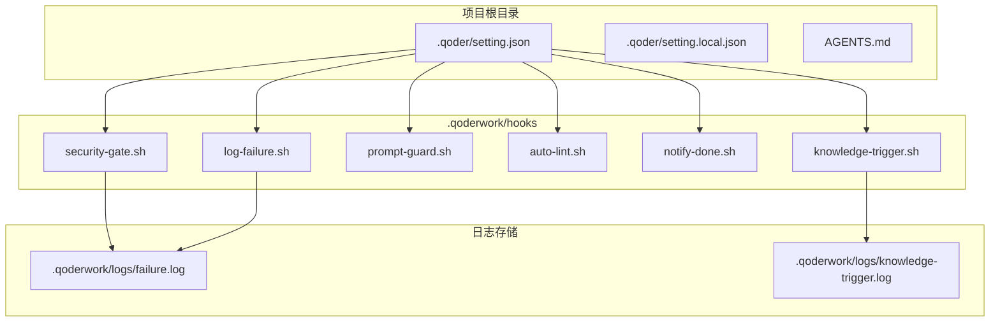
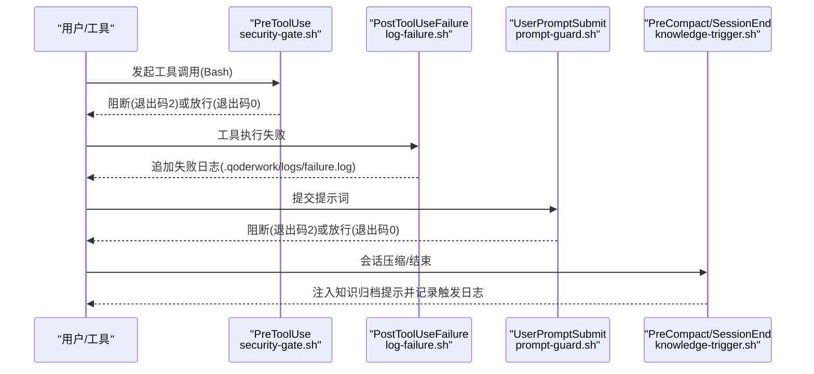
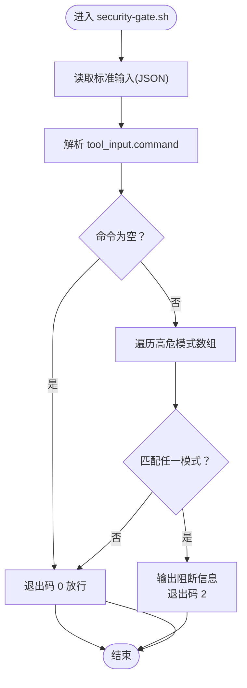
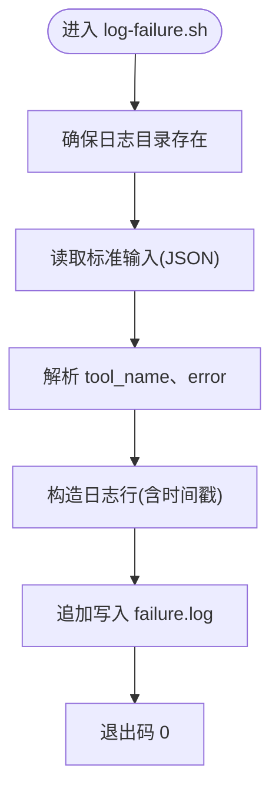
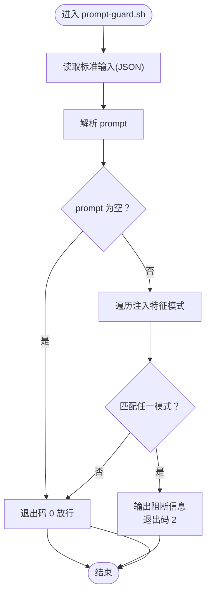
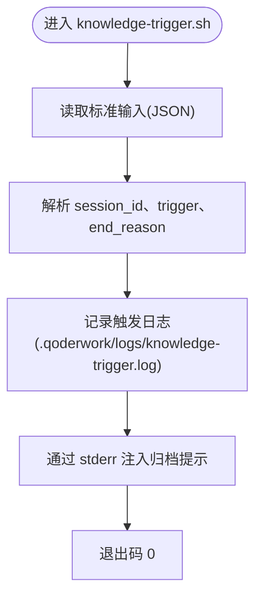
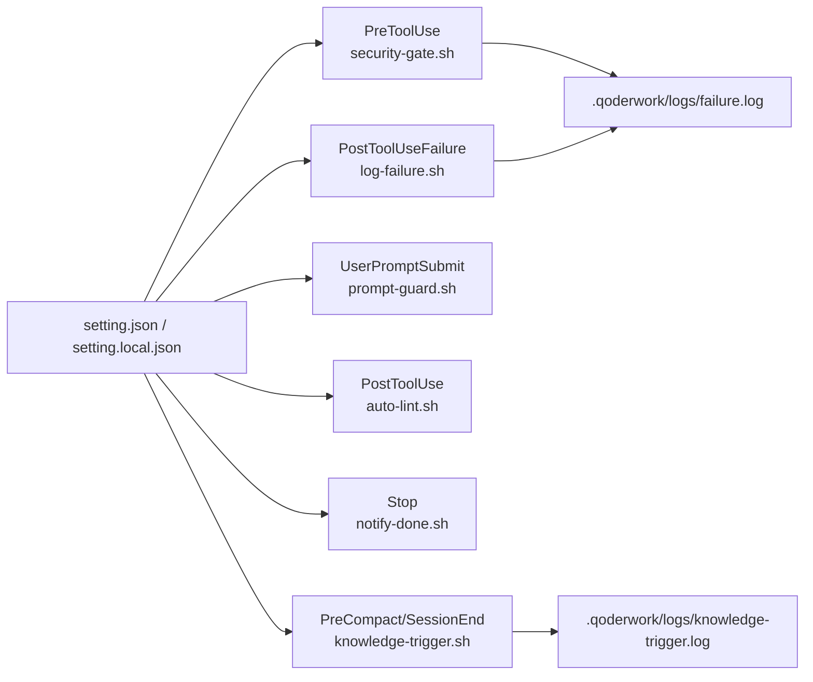

# 安全审计与日志

<cite>
**本文引用的文件**
- [QoderHarnessEngineering落地示例.md](file://QoderHarnessEngineering落地示例.md)
- [AGENTS.md](file://AGENTS.md)
- [.qoderwork/hooks/security-gate.sh](file://.qoderwork/hooks/security-gate.sh)
- [.qoderwork/hooks/log-failure.sh](file://.qoderwork/hooks/log-failure.sh)
- [.qoderwork/hooks/prompt-guard.sh](file://.qoderwork/hooks/prompt-guard.sh)
- [.qoderwork/hooks/auto-lint.sh](file://.qoderwork/hooks/auto-lint.sh)
- [.qoderwork/hooks/notify-done.sh](file://.qoderwork/hooks/notify-done.sh)
- [.qoderwork/hooks/knowledge-trigger.sh](file://.qoderwork/hooks/knowledge-trigger.sh)
</cite>

## 目录
1. [简介](#简介)
2. [项目结构](#项目结构)
3. [核心组件](#核心组件)
4. [架构总览](#架构总览)
5. [详细组件分析](#详细组件分析)
6. [依赖关系分析](#依赖关系分析)
7. [性能考量](#性能考量)
8. [故障排查指南](#故障排查指南)
9. [结论](#结论)
10. [附录](#附录)

## 简介
本文件面向安全审计与日志系统，围绕 Qoder 工程化落地示例中的 Hooks 生命周期与日志记录机制，系统阐述安全事件的记录格式、存储策略、查询方法与分析实践。重点覆盖：
- 审计日志结构设计：时间戳、用户信息、命令详情、拦截原因、处理结果等字段
- 日志采集与落盘：PreToolUse、PostToolUseFailure、UserPromptSubmit、PreCompact/SessionEnd 等事件的记录策略
- 日志分析与统计：基于现有日志格式的分类统计与趋势分析方法
- 隐私与合规：日志保留策略、敏感信息处理与合规要求
- 应急响应：阻断与失败事件的处置流程、事后分析报告生成

## 项目结构
本项目通过 Hooks 将安全与审计能力嵌入到工具调用生命周期中，形成“事前拦截、事中记录、事后分析”的闭环。

图表来源
- [QoderHarnessEngineering落地示例.md:253-339](file://QoderHarnessEngineering落地示例.md#L253-L339)
- [.qoderwork/hooks/security-gate.sh:1-38](file://.qoderwork/hooks/security-gate.sh#L1-L38)
- [.qoderwork/hooks/log-failure.sh:1-20](file://.qoderwork/hooks/log-failure.sh#L1-L20)
- [.qoderwork/hooks/knowledge-trigger.sh:1-40](file://.qoderwork/hooks/knowledge-trigger.sh#L1-L40)

章节来源
- [QoderHarnessEngineering落地示例.md:42-67](file://QoderHarnessEngineering落地示例.md#L42-L67)
- [QoderHarnessEngineering落地示例.md:253-339](file://QoderHarnessEngineering落地示例.md#L253-L339)

## 核心组件
- 安全门（security-gate.sh）：PreToolUse 事件拦截高危 Bash 命令，阻断后将错误信息注入会话
- 失败日志（log-failure.sh）：PostToolUseFailure 事件将失败记录追加至 failure.log
- 提示词防护（prompt-guard.sh）：UserPromptSubmit 事件拦截注入攻击特征
- 自动 Lint（auto-lint.sh）：PostToolUse 事件对写入/编辑文件执行静态检查
- 桌面通知（notify-done.sh）：Stop 事件触发任务完成通知
- 知识归档触发（knowledge-trigger.sh）：PreCompact/SessionEnd 事件记录触发日志并注入归档提示

章节来源
- [QoderHarnessEngineering落地示例.md:281-339](file://QoderHarnessEngineering落地示例.md#L281-L339)
- [.qoderwork/hooks/security-gate.sh:1-38](file://.qoderwork/hooks/security-gate.sh#L1-L38)
- [.qoderwork/hooks/log-failure.sh:1-20](file://.qoderwork/hooks/log-failure.sh#L1-L20)
- [.qoderwork/hooks/prompt-guard.sh:1-55](file://.qoderwork/hooks/prompt-guard.sh#L1-L55)
- [.qoderwork/hooks/auto-lint.sh:1-43](file://.qoderwork/hooks/auto-lint.sh#L1-L43)
- [.qoderwork/hooks/notify-done.sh:1-16](file://.qoderwork/hooks/notify-done.sh#L1-L16)
- [.qoderwork/hooks/knowledge-trigger.sh:1-40](file://.qoderwork/hooks/knowledge-trigger.sh#L1-L40)

## 架构总览
下图展示安全与审计事件在生命周期中的流转与落盘：

图表来源
- [QoderHarnessEngineering落地示例.md:253-339](file://QoderHarnessEngineering落地示例.md#L253-L339)
- [.qoderwork/hooks/security-gate.sh:1-38](file://.qoderwork/hooks/security-gate.sh#L1-L38)
- [.qoderwork/hooks/log-failure.sh:1-20](file://.qoderwork/hooks/log-failure.sh#L1-L20)
- [.qoderwork/hooks/prompt-guard.sh:1-55](file://.qoderwork/hooks/prompt-guard.sh#L1-L55)
- [.qoderwork/hooks/knowledge-trigger.sh:1-40](file://.qoderwork/hooks/knowledge-trigger.sh#L1-L40)

## 详细组件分析

### 安全门（security-gate.sh）
- 触发事件：PreToolUse（Bash）
- 功能：匹配高危命令模式，阻断执行并输出错误信息
- 关键字段（从输入解析）：tool_input.command
- 阻断标识：退出码 2
- 日志落盘：通过 stderr 注入会话，不直接写文件

图表来源
- [.qoderwork/hooks/security-gate.sh:1-38](file://.qoderwork/hooks/security-gate.sh#L1-L38)

章节来源
- [.qoderwork/hooks/security-gate.sh:1-38](file://.qoderwork/hooks/security-gate.sh#L1-L38)
- [QoderHarnessEngineering落地示例.md:281-295](file://QoderHarnessEngineering落地示例.md#L281-L295)

### 失败日志（log-failure.sh）
- 触发事件：PostToolUseFailure（任意工具）
- 功能：将失败记录追加到 .qoderwork/logs/failure.log
- 关键字段：timestamp、tool、error
- 输出格式：带时间戳的一行记录，便于 grep/awk 等工具分析

图表来源
- [.qoderwork/hooks/log-failure.sh:1-20](file://.qoderwork/hooks/log-failure.sh#L1-L20)

章节来源
- [.qoderwork/hooks/log-failure.sh:1-20](file://.qoderwork/hooks/log-failure.sh#L1-L20)
- [QoderHarnessEngineering落地示例.md:307-313](file://QoderHarnessEngineering落地示例.md#L307-L313)

### 提示词防护（prompt-guard.sh）
- 触发事件：UserPromptSubmit
- 功能：拦截注入攻击特征（中英双语），阻断并提示用户
- 关键字段：prompt
- 阻断标识：退出码 2

图表来源
- [.qoderwork/hooks/prompt-guard.sh:1-55](file://.qoderwork/hooks/prompt-guard.sh#L1-L55)

章节来源
- [.qoderwork/hooks/prompt-guard.sh:1-55](file://.qoderwork/hooks/prompt-guard.sh#L1-L55)
- [QoderHarnessEngineering落地示例.md:314-324](file://QoderHarnessEngineering落地示例.md#L314-L324)

### 自动 Lint（auto-lint.sh）
- 触发事件：PostToolUse（Write/Edit）
- 功能：根据文件类型自动选择 Lint 工具执行
- 关键字段：tool_input.path
- 结果：非 0 退出码作为非阻断性错误反馈给用户

章节来源
- [.qoderwork/hooks/auto-lint.sh:1-43](file://.qoderwork/hooks/auto-lint.sh#L1-L43)
- [QoderHarnessEngineering落地示例.md:296-306](file://QoderHarnessEngineering落地示例.md#L296-L306)

### 桌面通知（notify-done.sh）
- 触发事件：Stop
- 功能：macOS 桌面通知，提示任务完成
- 关键字段：stop_reason

章节来源
- [.qoderwork/hooks/notify-done.sh:1-16](file://.qoderwork/hooks/notify-done.sh#L1-L16)
- [QoderHarnessEngineering落地示例.md:325-331](file://QoderHarnessEngineering落地示例.md#L325-L331)

### 知识归档触发（knowledge-trigger.sh）
- 触发事件：PreCompact/SessionEnd
- 功能：向 stderr 注入知识归档提示，并记录触发日志
- 关键字段：session_id、trigger、end_reason
- 日志落盘：.qoderwork/logs/knowledge-trigger.log

图表来源
- [.qoderwork/hooks/knowledge-trigger.sh:1-40](file://.qoderwork/hooks/knowledge-trigger.sh#L1-L40)

章节来源
- [.qoderwork/hooks/knowledge-trigger.sh:1-40](file://.qoderwork/hooks/knowledge-trigger.sh#L1-L40)
- [QoderHarnessEngineering落地示例.md:332-337](file://QoderHarnessEngineering落地示例.md#L332-L337)

## 依赖关系分析
- 配置驱动：.qoder/setting.json 与 .qoder/setting.local.json 决定 Hooks 的启用与匹配规则
- 事件耦合：不同事件对应不同脚本，彼此独立但共同构成审计闭环
- 外部依赖：脚本依赖 jq、npx、ruff/flake8、gofmt、shellcheck、osascript 等工具

图表来源
- [QoderHarnessEngineering落地示例.md:123-184](file://QoderHarnessEngineering落地示例.md#L123-L184)
- [.qoderwork/hooks/security-gate.sh:1-38](file://.qoderwork/hooks/security-gate.sh#L1-L38)
- [.qoderwork/hooks/log-failure.sh:1-20](file://.qoderwork/hooks/log-failure.sh#L1-L20)
- [.qoderwork/hooks/knowledge-trigger.sh:1-40](file://.qoderwork/hooks/knowledge-trigger.sh#L1-L40)

章节来源
- [QoderHarnessEngineering落地示例.md:123-184](file://QoderHarnessEngineering落地示例.md#L123-L184)

## 性能考量
- 脚本开销：Hooks 以轻量 Shell 脚本为主，单次执行通常在毫秒到百毫秒级
- I/O 影响：日志写入为顺序追加，建议将 .qoderwork/logs 放置于本地 SSD 以降低延迟
- 并发风险：多会话并发触发时，需确保日志文件原子写入；当前实现为顺序追加，一般不会出现竞争
- 工具依赖：Lint 工具（如 npx/ruff/eslint）可能带来冷启动开销，建议在 CI/本地环境预热

## 故障排查指南
- 安全门未生效
  - 检查 PreToolUse 配置与 Bash 匹配器是否启用
  - 确认 security-gate.sh 可执行权限与 shebang 正确
  - 观察 stderr 是否输出阻断信息
- 失败日志缺失
  - 确认 PostToolUseFailure 配置已启用
  - 检查 .qoderwork/logs 目录权限与磁盘空间
  - 使用 tail/less 查看 failure.log 最新条目
- 提示词注入未阻断
  - 确认 UserPromptSubmit 配置已启用
  - 检查 prompt-guard.sh 是否被调用（可通过调试输出验证）
- 知识归档提示未出现
  - 检查 PreCompact/SessionEnd 配置
  - 确认 knowledge-trigger.sh 可执行且 stderr 注入正常
- 工具链缺失
  - 如 ruff/flake8/gofmt/shellcheck 未安装，auto-lint.sh 将跳过对应文件类型

章节来源
- [QoderHarnessEngineering落地示例.md:253-339](file://QoderHarnessEngineering落地示例.md#L253-L339)
- [.qoderwork/hooks/security-gate.sh:1-38](file://.qoderwork/hooks/security-gate.sh#L1-L38)
- [.qoderwork/hooks/log-failure.sh:1-20](file://.qoderwork/hooks/log-failure.sh#L1-L20)
- [.qoderwork/hooks/prompt-guard.sh:1-55](file://.qoderwork/hooks/prompt-guard.sh#L1-L55)
- [.qoderwork/hooks/knowledge-trigger.sh:1-40](file://.qoderwork/hooks/knowledge-trigger.sh#L1-L40)

## 结论
本项目通过 Hooks 将安全与审计能力深度集成到工具调用生命周期，形成“可阻断、可记录、可追溯”的安全审计体系。failure.log 与 knowledge-trigger.log 提供了结构化的审计入口，结合现有日志格式，可开展基础的分类统计与趋势分析。建议在生产环境中进一步完善日志轮转、集中化存储与告警联动，以满足更严格的合规与运营要求。

## 附录

### 审计日志字段设计建议
- 时间戳：精确到秒或毫秒，便于排序与关联
- 事件类型：PreToolUse、PostToolUseFailure、UserPromptSubmit、PreCompact、SessionEnd 等
- 工具名称：如 Bash、Write、Edit、WebFetch 等
- 命令详情：原始命令或提示词摘要（避免记录完整敏感参数）
- 拦截原因：阻断模式、匹配规则、阻断脚本名称
- 处理结果：允许、阻断、失败、通知、归档提示等
- 会话标识：session_id、trigger、end_reason 等上下文信息
- 用户标识：当前工作区、用户级配置来源（如适用）

### 日志存储策略
- 本地存储：.qoderwork/logs 下按功能分文件存储，便于快速定位
- 保留周期：建议按月/季度清理旧日志，保留关键审计期（如合规要求）
- 备份与归档：对关键日志定期归档至安全存储，支持离线取证

### 查询与分析方法
- 基础查询
  - 统计每日阻断次数：按日期聚合 failure.log 与 security-gate.sh 的 stderr 输出
  - 分析高危命令分布：grep 高危模式，统计命中率与趋势
  - 提示词注入拦截：统计 prompt-guard.sh 阻断次数与模式分布
- 趋势分析
  - 按周/月生成阻断报表，识别异常峰值
  - 对知识归档触发频率进行统计，评估知识沉淀效果
- 可视化建议
  - 使用折线图展示阻断趋势、失败率
  - 使用饼图展示高危命令类型分布、注入模式分布

### 隐私与合规
- 最小化原则：仅记录必要字段，避免记录完整命令参数与敏感内容
- 数据脱敏：对路径、参数进行脱敏处理后再写入日志
- 合规要求：遵循所在组织的数据保留与销毁政策，确保日志生命周期管理合规

### 安全事件响应流程
- 事件发现：监控 failure.log 与阻断日志，识别异常模式
- 快速处置：临时收紧 deny/ask 规则，暂停相关工具权限
- 调查取证：提取会话上下文与日志，定位责任人与影响范围
- 修复与复盘：修复漏洞或策略缺陷，更新知识库与培训材料
- 报告生成：输出事件报告，包含时间线、影响评估、改进措施与后续计划