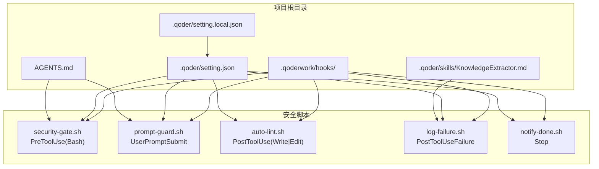
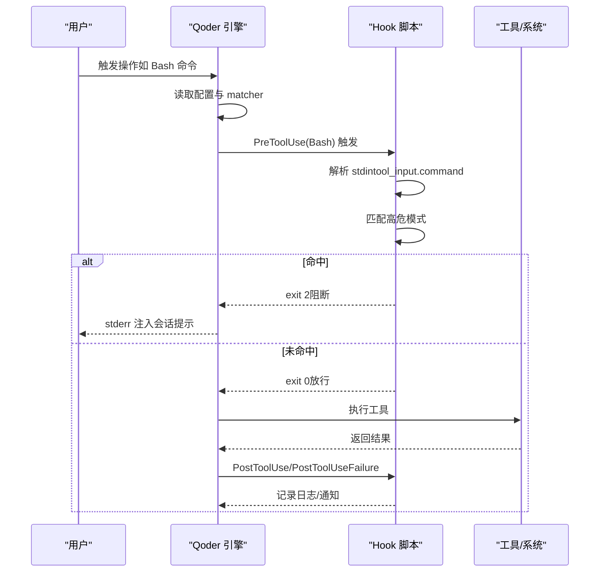
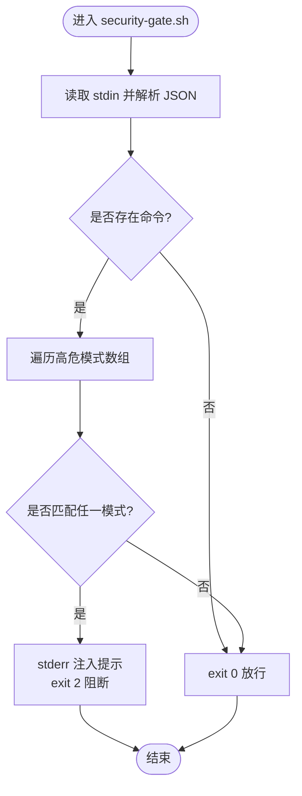
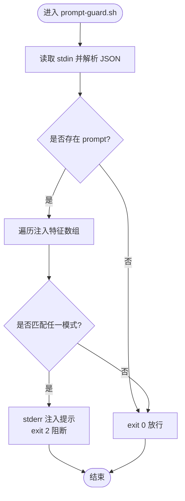
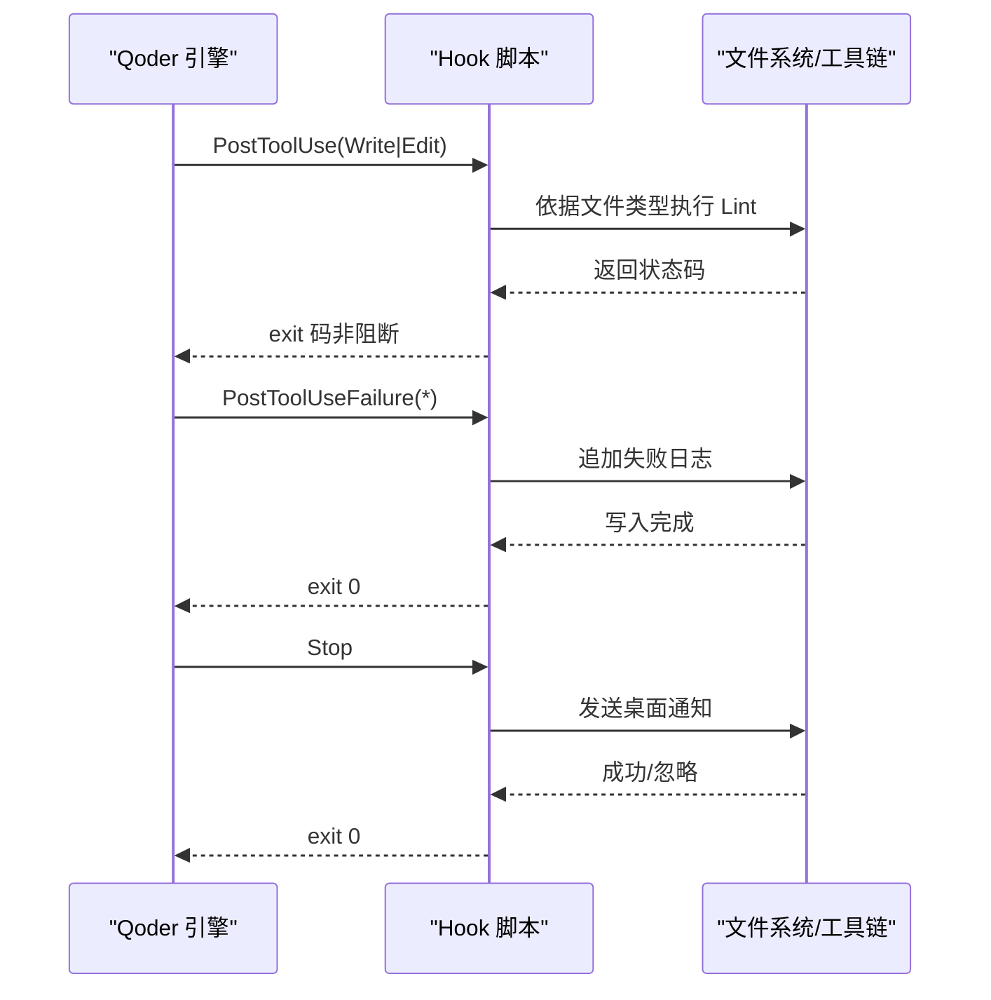
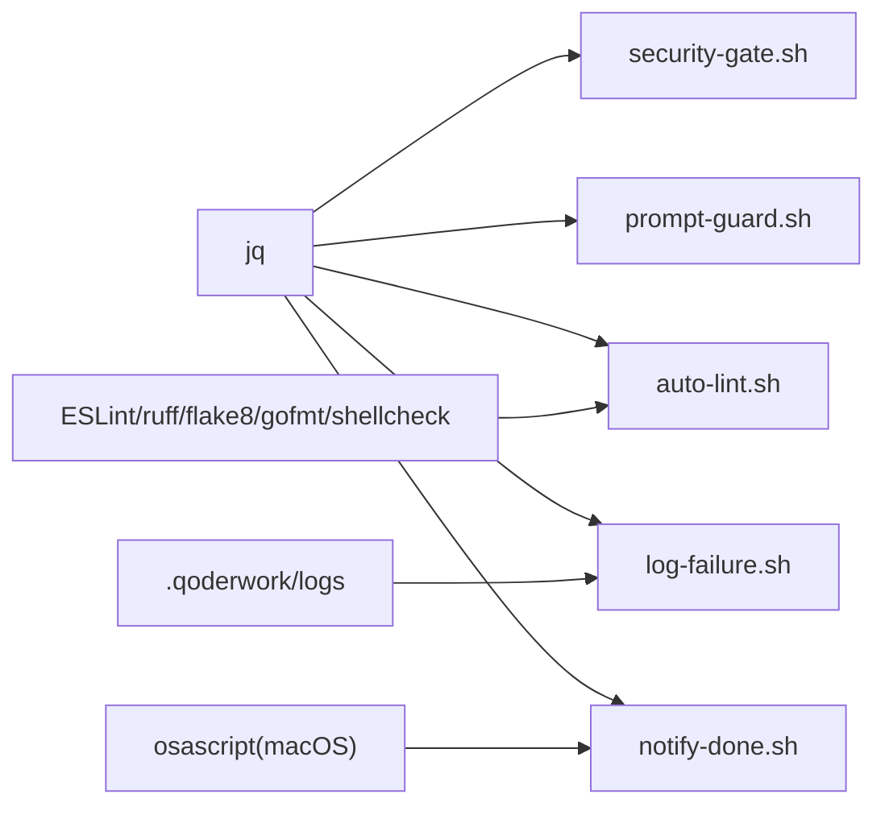

# 安全防护机制

<cite>
**本文引用的文件**
- [QoderHarnessEngineering落地示例.md](file://QoderHarnessEngineering落地示例.md)
- [AGENTS.md](file://AGENTS.md)
- [Hooks配置操作手册.md](file://docs/Hooks配置操作手册.md)
- [.qoderwork/hooks/security-gate.sh](file://.qoderwork/hooks/security-gate.sh)
- [.qoderwork/hooks/prompt-guard.sh](file://.qoderwork/hooks/prompt-guard.sh)
- [.qoderwork/hooks/auto-lint.sh](file://.qoderwork/hooks/auto-lint.sh)
- [.qoderwork/hooks/log-failure.sh](file://.qoderwork/hooks/log-failure.sh)
- [.qoderwork/hooks/notify-done.sh](file://.qoderwork/hooks/notify-done.sh)
- [.qoder/skills/KnowledgeExtractor.md](file://.qoder/skills/KnowledgeExtractor.md)
</cite>

## 目录
1. [简介](#简介)
2. [项目结构](#项目结构)
3. [核心组件](#核心组件)
4. [架构总览](#架构总览)
5. [详细组件分析](#详细组件分析)
6. [依赖关系分析](#依赖关系分析)
7. [性能考量](#性能考量)
8. [故障排查指南](#故障排查指南)
9. [结论](#结论)
10. [附录](#附录)

## 简介
本文件面向 Qoder Harness Engineering 的安全防护体系，聚焦两大核心能力：
- 高危命令拦截机制：在工具执行前对 Bash 命令进行模式匹配与阻断，覆盖 10+ 种高危模式。
- 提示词注入防护：在用户提交 Prompt 时进行多语言、多维度的注入特征检测，阻断恶意指令尝试。

文档还提供安全策略配置指南、自定义防护规则编写方法、安全事件处理流程、日志与告警机制，以及安全审计最佳实践与常见威胁应对策略，帮助开发者理解并扩展安全防护能力。

## 项目结构
本项目围绕 Hooks 生命周期工程构建安全与工程化能力，关键目录与文件如下：
- .qoderwork/hooks：存放安全与工程化脚本（PreToolUse、UserPromptSubmit、PostToolUseFailure 等事件）
- .qoder/setting.json 与 .qoder/setting.local.json：权限策略与 Hooks 配置入口
- AGENTS.md：项目级 Agent 行为约束与安全规范
- .qoder/skills/KnowledgeExtractor.md：知识归档与审计线索沉淀

图表来源
- [QoderHarnessEngineering落地示例.md:42-67](file://QoderHarnessEngineering落地示例.md#L42-L67)
- [Hooks配置操作手册.md:84-101](file://docs/Hooks配置操作手册.md#L84-L101)

章节来源
- [QoderHarnessEngineering落地示例.md:42-67](file://QoderHarnessEngineering落地示例.md#L42-L67)
- [Hooks配置操作手册.md:84-101](file://docs/Hooks配置操作手册.md#L84-L101)

## 核心组件
- 高危命令拦截（security-gate.sh）
  - 事件：PreToolUse（Bash）
  - 机制：解析 stdin 的 tool_input.command，匹配 10+ 种高危模式，命中则 exit 2 阻断并注入 stderr 提示
  - 覆盖模式：递归删除、数据库破坏性操作、磁盘写入、格式化、危险权限开放、特权删除、Fork Bomb 等
- 提示词注入防护（prompt-guard.sh）
  - 事件：UserPromptSubmit
  - 机制：解析 stdin 的 prompt，匹配中英双语注入特征，命中则 exit 2 阻断并注入 stderr 提示
  - 覆盖模式：指令覆盖、Jailbreak、角色扮演绕过、系统提示泄露等
- 审计与告警
  - auto-lint.sh：PostToolUse 后自动 Lint，非阻断性错误
  - log-failure.sh：PostToolUseFailure 追加失败日志
  - notify-done.sh：Stop 事件触发桌面通知（macOS）

章节来源
- [QoderHarnessEngineering落地示例.md:281-337](file://QoderHarnessEngineering落地示例.md#L281-L337)
- [.qoderwork/hooks/security-gate.sh:15-35](file://.qoderwork/hooks/security-gate.sh#L15-L35)
- [.qoderwork/hooks/prompt-guard.sh:14-52](file://.qoderwork/hooks/prompt-guard.sh#L14-L52)
- [.qoderwork/hooks/auto-lint.sh:17-40](file://.qoderwork/hooks/auto-lint.sh#L17-L40)
- [.qoderwork/hooks/log-failure.sh:12-17](file://.qoderwork/hooks/log-failure.sh#L12-L17)
- [.qoderwork/hooks/notify-done.sh:10-13](file://.qoderwork/hooks/notify-done.sh#L10-L13)

## 架构总览
安全防护通过 Hooks 在关键生命周期节点自动触发，结合权限策略与 Agent 行为约束，形成“事前拦截、事中审计、事后告警”的闭环。

图表来源
- [Hooks配置操作手册.md:22-49](file://docs/Hooks配置操作手册.md#L22-L49)
- [QoderHarnessEngineering落地示例.md:279-337](file://QoderHarnessEngineering落地示例.md#L279-L337)

## 详细组件分析

### 高危命令拦截机制（security-gate.sh）
- 输入解析
  - 从 stdin 读取 JSON，提取 tool_input.command
  - 空命令直接放行
- 检测算法
  - 定义高危模式数组，逐条正则匹配
  - 匹配到任一模式即阻断（exit 2），stderr 注入提示
- 模式覆盖
  - 递归删除、数据库破坏性操作、磁盘写入、格式化、危险权限开放、特权删除、Fork Bomb 等
- 性能与健壮性
  - 使用管道失败即退出，避免静默失败
  - 正则匹配使用大小写不敏感与扩展正则，兼顾准确性与可读性

图表来源
- [.qoderwork/hooks/security-gate.sh:8-35](file://.qoderwork/hooks/security-gate.sh#L8-L35)

章节来源
- [.qoderwork/hooks/security-gate.sh:15-35](file://.qoderwork/hooks/security-gate.sh#L15-L35)
- [QoderHarnessEngineering落地示例.md:283-295](file://QoderHarnessEngineering落地示例.md#L283-L295)

### 提示词注入防护（prompt-guard.sh）
- 输入解析
  - 从 stdin 读取 JSON，提取 prompt
  - 空 prompt 直接放行
- 检测算法
  - 定义中英双语注入特征数组，逐条正则匹配
  - 支持 Perl 风格与 POSIX 扩展正则，提升覆盖面
  - 命中则阻断（exit 2），stderr 注入提示
- 覆盖模式
  - 指令覆盖类（忽略之前指令、清除限制等）
  - 角色扮演绕过类（扮演无限制角色、Jailbreak/DAN/Developer Mode）
  - 系统提示泄露类（要求输出系统提示）

图表来源
- [.qoderwork/hooks/prompt-guard.sh:8-52](file://.qoderwork/hooks/prompt-guard.sh#L8-L52)

章节来源
- [.qoderwork/hooks/prompt-guard.sh:14-52](file://.qoderwork/hooks/prompt-guard.sh#L14-L52)
- [QoderHarnessEngineering落地示例.md:314-324](file://QoderHarnessEngineering落地示例.md#L314-L324)

### 审计与告警（auto-lint.sh、log-failure.sh、notify-done.sh）
- auto-lint.sh（PostToolUse）
  - 根据文件类型选择 Lint 工具（ESLint、ruff/flake8、gofmt、shellcheck）
  - 非阻断性错误，将工具返回码传递给 Qoder
- log-failure.sh（PostToolUseFailure）
  - 追加失败日志到 .qoderwork/logs/failure.log，包含时间戳、工具名与错误信息
- notify-done.sh（Stop）
  - macOS 桌面通知，提示任务完成

图表来源
- [.qoderwork/hooks/auto-lint.sh:17-42](file://.qoderwork/hooks/auto-lint.sh#L17-L42)
- [.qoderwork/hooks/log-failure.sh:12-17](file://.qoderwork/hooks/log-failure.sh#L12-L17)
- [.qoderwork/hooks/notify-done.sh:10-13](file://.qoderwork/hooks/notify-done.sh#L10-L13)

章节来源
- [.qoderwork/hooks/auto-lint.sh:17-42](file://.qoderwork/hooks/auto-lint.sh#L17-L42)
- [.qoderwork/hooks/log-failure.sh:12-17](file://.qoderwork/hooks/log-failure.sh#L12-L17)
- [.qoderwork/hooks/notify-done.sh:10-13](file://.qoderwork/hooks/notify-done.sh#L10-L13)

### 权限策略与 Hooks 配置
- 权限策略（setting.json）
  - allow：常规只读与受控编辑、常用 Bash 命令、WebFetch 白名单
  - ask：Git 写操作、配置文件修改，需人工确认
  - deny：危险命令与敏感路径访问，硬性禁止
- Hooks 配置
  - PreToolUse：挂载 security-gate.sh，拦截高危 Bash 命令
  - PostToolUse：挂载 auto-lint.sh，写入后自动 Lint
  - PostToolUseFailure：挂载 log-failure.sh，记录失败
  - UserPromptSubmit：挂载 prompt-guard.sh，拦截注入
  - Stop：挂载 notify-done.sh，任务完成通知

章节来源
- [QoderHarnessEngineering落地示例.md:127-184](file://QoderHarnessEngineering落地示例.md#L127-L184)
- [Hooks配置操作手册.md:264-438](file://docs/Hooks配置操作手册.md#L264-L438)

## 依赖关系分析
- 组件耦合
  - security-gate.sh 与 prompt-guard.sh 依赖 jq 解析 stdin JSON
  - auto-lint.sh 依赖项目工具链（ESLint、ruff/flake8、gofmt、shellcheck）
  - log-failure.sh 依赖 .qoderwork/logs 目录写入
  - notify-done.sh 依赖 macOS 环境（osascript）
- 外部依赖与集成点
  - jq：JSON 解析
  - 各语言/工具链：Lint 工具
  - 操作系统：桌面通知（macOS）
- 优先级与合并
  - deny 优先于 allow/ask，本地级覆盖项目级，项目级覆盖用户级

图表来源
- [.qoderwork/hooks/security-gate.sh:8-9](file://.qoderwork/hooks/security-gate.sh#L8-L9)
- [.qoderwork/hooks/prompt-guard.sh:8-9](file://.qoderwork/hooks/prompt-guard.sh#L8-L9)
- [.qoderwork/hooks/auto-lint.sh:19-38](file://.qoderwork/hooks/auto-lint.sh#L19-L38)
- [.qoderwork/hooks/log-failure.sh:7-17](file://.qoderwork/hooks/log-failure.sh#L7-L17)
- [.qoderwork/hooks/notify-done.sh:11-12](file://.qoderwork/hooks/notify-done.sh#L11-L12)

章节来源
- [QoderHarnessEngineering落地示例.md:35-38](file://QoderHarnessEngineering落地示例.md#L35-L38)
- [Hooks配置操作手册.md:245-261](file://docs/Hooks配置操作手册.md#L245-L261)

## 性能考量
- 正则匹配开销
  - 模式数量有限且匹配早停，整体开销可控
  - 建议将最可能命中的模式前置，减少平均匹配次数
- 工具链调用
  - auto-lint.sh 仅在文件存在时执行，避免无效调用
  - 工具链不存在时优雅降级（exit 0），不影响主流程
- I/O 与日志
  - 日志写入为追加，建议定期轮转，避免单文件过大
- 超时控制
  - Hooks 支持 timeout 配置，建议为安全脚本设置较短超时，避免阻塞会话

## 故障排查指南
- 脚本不执行
  - 检查执行权限与 setting.json 中事件名拼写
  - 确认 command 路径相对项目根目录
- exit 2 未阻断
  - 确认事件可阻断（PreToolUse、UserPromptSubmit、Stop、SubagentStop）
  - 确认 stderr 写入使用 >&2
- stderr 未注入会话
  - 检查是否使用 exit 2 且 stderr 内容非空
- 脚本超时
  - 调整 timeout 值，或优化脚本逻辑
- 自动 Lint 未生效
  - 确认目标文件类型与工具链安装情况
- 失败日志未记录
  - 检查 .qoderwork/logs 目录权限与磁盘空间

章节来源
- [Hooks配置操作手册.md:520-626](file://docs/Hooks配置操作手册.md#L520-L626)

## 结论
本安全防护体系通过 Hooks 将“高危命令拦截”和“提示词注入防护”嵌入到关键生命周期节点，结合权限策略与 Agent 行为约束，实现了自动、可扩展、可观测的安全治理。开发者可在现有脚本基础上扩展规则、优化匹配性能，并完善日志与告警机制，持续提升系统的安全性与可运维性。

## 附录

### 安全策略配置指南
- 权限策略
  - allow：仅放行必要且受控的 Bash 命令与文件操作
  - ask：对 Git 写操作与配置文件修改强制人工确认
  - deny：硬性禁止危险命令与敏感路径访问
- Hooks 挂载
  - PreToolUse：挂载 security-gate.sh
  - PostToolUse：挂载 auto-lint.sh
  - PostToolUseFailure：挂载 log-failure.sh
  - UserPromptSubmit：挂载 prompt-guard.sh
  - Stop：挂载 notify-done.sh

章节来源
- [QoderHarnessEngineering落地示例.md:127-184](file://QoderHarnessEngineering落地示例.md#L127-L184)
- [Hooks配置操作手册.md:264-438](file://docs/Hooks配置操作手册.md#L264-L438)

### 自定义防护规则编写方法
- 高危命令规则（security-gate.sh）
  - 在模式数组中新增正则表达式，遵循大小写不敏感与扩展正则
  - 建议提供替代方案或受控脚本指引，提升可操作性
- 注入防护规则（prompt-guard.sh）
  - 在注入特征数组中新增中英双语模式，兼顾中文与英文场景
  - 使用 Perl 风格与 POSIX 扩展正则相结合，提升覆盖率
- 审计规则（auto-lint.sh）
  - 根据项目技术栈新增文件类型与工具映射
  - 保持非阻断性错误，避免影响主流程

章节来源
- [.qoderwork/hooks/security-gate.sh:15-28](file://.qoderwork/hooks/security-gate.sh#L15-L28)
- [.qoderwork/hooks/prompt-guard.sh:16-43](file://.qoderwork/hooks/prompt-guard.sh#L16-L43)
- [.qoderwork/hooks/auto-lint.sh:17-39](file://.qoderwork/hooks/auto-lint.sh#L17-L39)

### 安全事件处理流程与日志记录
- 高危命令拦截
  - PreToolUse 触发 security-gate.sh，匹配到高危模式则阻断并注入提示
- 提示词注入防护
  - UserPromptSubmit 触发 prompt-guard.sh，匹配到注入特征则阻断并注入提示
- 审计与告警
  - PostToolUseFailure 追加失败日志
  - Stop 触发桌面通知
- 知识归档与审计线索
  - 通过 KnowledgeExtractor Skill 将会话要点结构化归档，沉淀审计线索

章节来源
- [QoderHarnessEngineering落地示例.md:279-337](file://QoderHarnessEngineering落地示例.md#L279-L337)
- [.qoder/skills/KnowledgeExtractor.md:19-141](file://.qoder/skills/KnowledgeExtractor.md#L19-L141)

### 安全审计最佳实践
- 规则优先级与合并
  - deny 优先于 allow/ask，本地级覆盖项目级，项目级覆盖用户级
- 审计留痕
  - 失败日志、Hook 执行日志、知识归档均保留可追溯信息
- 持续改进
  - 定期评估规则命中率与误报率，动态优化规则集
- 告警联动
  - 结合日志系统与监控平台，对高频阻断事件进行预警

章节来源
- [QoderHarnessEngineering落地示例.md:35-38](file://QoderHarnessEngineering落地示例.md#L35-L38)
- [.qoderwork/hooks/log-failure.sh:12-17](file://.qoderwork/hooks/log-failure.sh#L12-L17)
- [.qoder/skills/KnowledgeExtractor.md:19-141](file://.qoder/skills/KnowledgeExtractor.md#L19-L141)