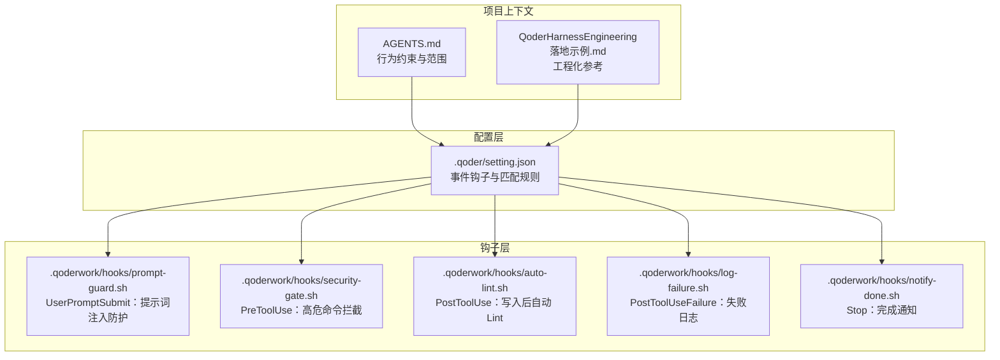
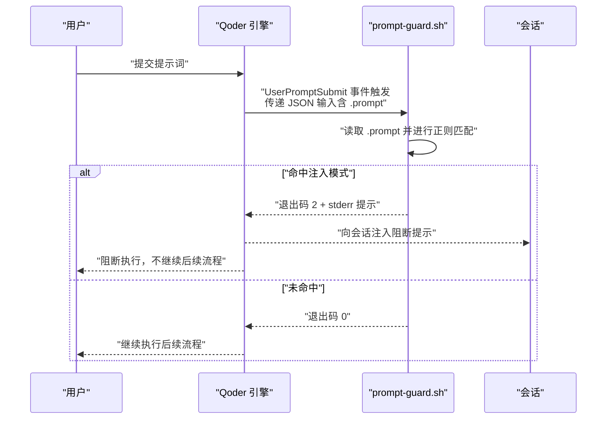
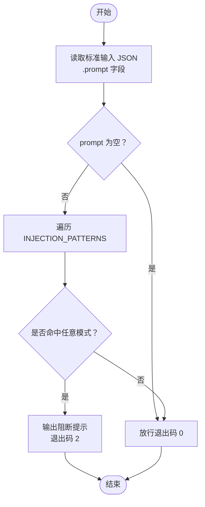
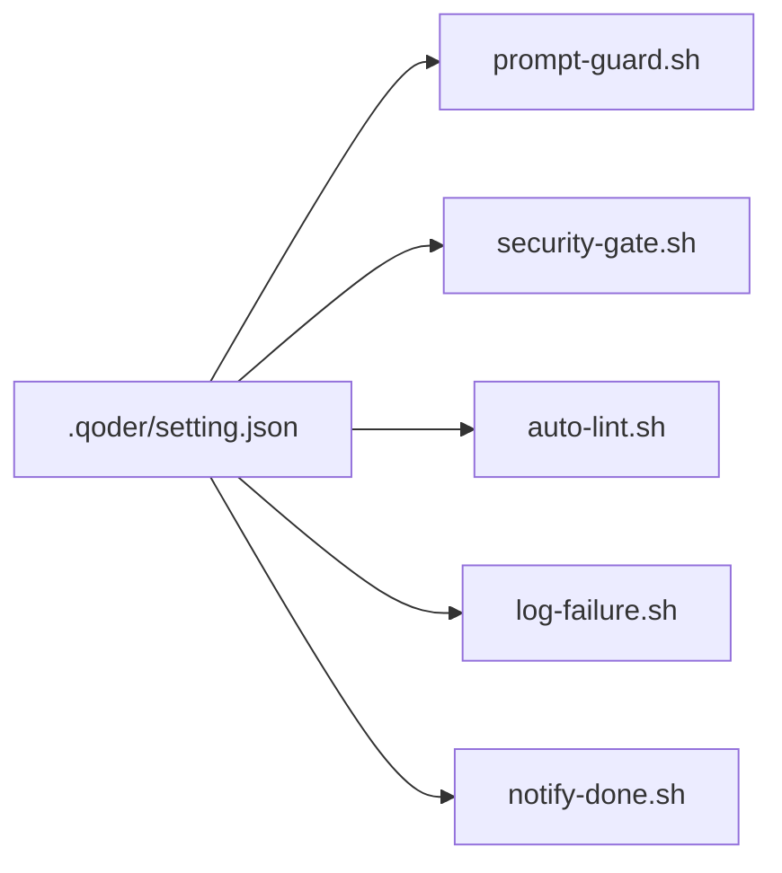

# 提示词注入防护

<cite>
**本文引用的文件**
- [.qoderwork/hooks/prompt-guard.sh](file://.qoderwork/hooks/prompt-guard.sh)
- [.qoderwork/hooks/security-gate.sh](file://.qoderwork/hooks/security-gate.sh)
- [.qoderwork/hooks/auto-lint.sh](file://.qoderwork/hooks/auto-lint.sh)
- [.qoderwork/hooks/log-failure.sh](file://.qoderwork/hooks/log-failure.sh)
- [.qoderwork/hooks/notify-done.sh](file://.qoderwork/hooks/notify-done.sh)
- [.qoder/setting.json](file://.qoder/setting.json)
- [AGENTS.md](file://AGENTS.md)
- [QoderHarnessEngineering落地示例.md](file://QoderHarnessEngineering落地示例.md)
</cite>

## 目录
1. [简介](#简介)
2. [项目结构](#项目结构)
3. [核心组件](#核心组件)
4. [架构总览](#架构总览)
5. [详细组件分析](#详细组件分析)
6. [依赖关系分析](#依赖关系分析)
7. [性能考量](#性能考量)
8. [故障排查指南](#故障排查指南)
9. [结论](#结论)
10. [附录](#附录)

## 简介
本文件面向提示词注入防护系统的技术文档，聚焦于“用户提交提示词”这一关键入口的恶意指令检测机制。系统通过在用户提交提示词事件上挂载安全钩子，基于正则表达式对提示词进行快速扫描，识别常见的提示词注入攻击模式（如指令覆盖、越狱、系统提示探测等），并在命中时阻断执行并将提示信息反馈至会话，从而降低提示词注入风险。

## 项目结构
本项目采用“配置驱动 + 生命周期钩子”的工程化落地方式，安全防护围绕以下目录与文件展开：
- .qoder/setting.json：项目级安全配置，声明各事件的钩子与匹配规则
- .qoderwork/hooks/：生命周期钩子脚本集合，包含提示词注入防护、安全门、自动 Lint、失败日志、桌面通知等
- AGENTS.md：项目级 Agent 行为约束与范围说明
- QoderHarnessEngineering落地示例.md：工程化落地参考文档，含钩子脚本说明与配置示例

图表来源
- [.qoder/setting.json:30-112](file://.qoder/setting.json#L30-L112)
- [.qoderwork/hooks/prompt-guard.sh:1-55](file://.qoderwork/hooks/prompt-guard.sh#L1-L55)
- [.qoderwork/hooks/security-gate.sh:1-38](file://.qoderwork/hooks/security-gate.sh#L1-L38)
- [.qoderwork/hooks/auto-lint.sh:1-43](file://.qoderwork/hooks/auto-lint.sh#L1-L43)
- [.qoderwork/hooks/log-failure.sh:1-20](file://.qoderwork/hooks/log-failure.sh#L1-L20)
- [.qoderwork/hooks/notify-done.sh:1-16](file://.qoderwork/hooks/notify-done.sh#L1-L16)

章节来源
- [.qoder/setting.json:127-184](file://.qoder/setting.json#L127-L184)
- [QoderHarnessEngineering落地示例.md:42-67](file://QoderHarnessEngineering落地示例.md#L42-L67)

## 核心组件
- 提示词注入防护（prompt-guard.sh）
  - 事件：UserPromptSubmit
  - 作用：对用户提交的提示词进行正则匹配，拦截指令覆盖、越狱、系统提示探测等模式
  - 阻断方式：退出码 2 阻断，stderr 内容注入会话
- 安全门（security-gate.sh）
  - 事件：PreToolUse（Bash）
  - 作用：拦截高危命令模式（如递归删除、数据库破坏、格式化磁盘等）
- 自动 Lint（auto-lint.sh）
  - 事件：PostToolUse（Write|Edit）
  - 作用：根据文件类型自动执行 Lint 工具，修正格式或报告问题
- 失败日志（log-failure.sh）
  - 事件：PostToolUseFailure（*）
  - 作用：记录失败原因，便于审计与复盘
- 完成通知（notify-done.sh）
  - 事件：Stop
  - 作用：任务完成后发送桌面通知（macOS）

章节来源
- [.qoderwork/hooks/prompt-guard.sh:1-55](file://.qoderwork/hooks/prompt-guard.sh#L1-L55)
- [.qoderwork/hooks/security-gate.sh:1-38](file://.qoderwork/hooks/security-gate.sh#L1-L38)
- [.qoderwork/hooks/auto-lint.sh:1-43](file://.qoderwork/hooks/auto-lint.sh#L1-L43)
- [.qoderwork/hooks/log-failure.sh:1-20](file://.qoderwork/hooks/log-failure.sh#L1-L20)
- [.qoderwork/hooks/notify-done.sh:1-16](file://.qoderwork/hooks/notify-done.sh#L1-L16)
- [.qoder/setting.json:30-112](file://.qoder/setting.json#L30-L112)

## 架构总览
提示词注入防护在“用户提交提示词”环节形成一道安全防线，其工作流如下：

图表来源
- [.qoderwork/hooks/prompt-guard.sh:8-54](file://.qoderwork/hooks/prompt-guard.sh#L8-L54)
- [.qoder/setting.json:31-41](file://.qoder/setting.json#L31-L41)

## 详细组件分析

### 提示词注入防护组件（prompt-guard.sh）
- 输入验证
  - 从标准输入读取 JSON，提取 .prompt 字段
  - 若 .prompt 为空，直接放行
- 安全过滤
  - 维护 INJECTION_PATTERNS 数组，覆盖中文与英文两类注入模式
  - 使用大小写不敏感的正则匹配，支持 PCRE 与 POSIX 两种风格
- 异常行为识别
  - 命中任一模式即阻断（退出码 2），并向 stderr 输出提示
- 配置集成
  - 在 .qoder/setting.json 的 UserPromptSubmit 事件中注册，设置超时时间

图表来源
- [.qoderwork/hooks/prompt-guard.sh:8-54](file://.qoderwork/hooks/prompt-guard.sh#L8-L54)

章节来源
- [.qoderwork/hooks/prompt-guard.sh:14-54](file://.qoderwork/hooks/prompt-guard.sh#L14-L54)
- [.qoder/setting.json:31-41](file://.qoder/setting.json#L31-L41)

### 安全门组件（security-gate.sh）
- 作用：在 Bash 工具执行前拦截高危命令
- 拦截模式：递归删除、数据库破坏、格式化磁盘、特权删除、Fork Bomb 等
- 阻断方式：命中即阻断（退出码 2），stderr 注入会话

章节来源
- [.qoderwork/hooks/security-gate.sh:15-35](file://.qoderwork/hooks/security-gate.sh#L15-L35)
- [.qoder/setting.json:42-53](file://.qoder/setting.json#L42-L53)

### 自动 Lint 组件（auto-lint.sh）
- 作用：文件写入/编辑后自动执行 Lint 工具，修正格式或报告问题
- 文件类型适配：JS/TS、Python、Go、Shell
- 错误处理：非阻断性错误（非 0 退出码），仅向用户展示

章节来源
- [.qoderwork/hooks/auto-lint.sh:17-42](file://.qoderwork/hooks/auto-lint.sh#L17-L42)
- [.qoder/setting.json:54-65](file://.qoder/setting.json#L54-L65)

### 失败日志组件（log-failure.sh）
- 作用：记录工具执行失败信息，便于审计与复盘
- 日志格式：带时间戳、工具名与错误信息

章节来源
- [.qoderwork/hooks/log-failure.sh:10-17](file://.qoderwork/hooks/log-failure.sh#L10-L17)
- [.qoder/setting.json:66-77](file://.qoder/setting.json#L66-L77)

### 完成通知组件（notify-done.sh）
- 作用：任务完成后发送桌面通知（macOS）
- 与 Stop 事件联动

章节来源
- [.qoderwork/hooks/notify-done.sh:10-13](file://.qoderwork/hooks/notify-done.sh#L10-L13)
- [.qoder/setting.json:78-88](file://.qoder/setting.json#L78-L88)

## 依赖关系分析
- 配置到脚本的依赖
  - .qoder/setting.json 将 UserPromptSubmit 事件与 prompt-guard.sh 绑定
  - 其他事件（PreToolUse、PostToolUse、PostToolUseFailure、Stop）分别绑定到对应脚本
- 脚本间无直接依赖，均为独立可执行单元
- 事件与脚本的匹配关系由 setting.json 的 matcher 字段控制

图表来源
- [.qoder/setting.json:30-112](file://.qoder/setting.json#L30-L112)

章节来源
- [.qoder/setting.json:30-112](file://.qoder/setting.json#L30-L112)

## 性能考量
- prompt-guard.sh
  - 正则数量有限，匹配开销极低，超时时间设置为 5 秒，足以覆盖大多数提示词长度
  - 使用大小写不敏感匹配，减少误报与漏报
- security-gate.sh
  - 高危命令模式较少，匹配代价低，超时 10 秒
- auto-lint.sh
  - 根据文件类型选择工具，避免不必要的工具调用
  - 退出码非阻断性，不影响主流程继续
- log-failure.sh
  - 简单文件写入，性能开销可忽略
- notify-done.sh
  - 仅在 macOS 环境下尝试通知，失败不阻断

章节来源
- [.qoderwork/hooks/prompt-guard.sh:45-52](file://.qoderwork/hooks/prompt-guard.sh#L45-L52)
- [.qoderwork/hooks/security-gate.sh:30-35](file://.qoderwork/hooks/security-gate.sh#L30-L35)
- [.qoderwork/hooks/auto-lint.sh:17-42](file://.qoderwork/hooks/auto-lint.sh#L17-L42)
- [.qoderwork/hooks/log-failure.sh:10-17](file://.qoderwork/hooks/log-failure.sh#L10-L17)
- [.qoderwork/hooks/notify-done.sh:10-13](file://.qoderwork/hooks/notify-done.sh#L10-L13)
- [.qoder/setting.json:36-38](file://.qoder/setting.json#L36-L38)
- [.qoder/setting.json:48-50](file://.qoder/setting.json#L48-L50)
- [.qoder/setting.json:59-62](file://.qoder/setting.json#L59-L62)
- [.qoder/setting.json:71-74](file://.qoder/setting.json#L71-L74)
- [.qoder/setting.json:82-85](file://.qoder/setting.json#L82-L85)

## 故障排查指南
- 提示词被误判阻断
  - 检查 prompt-guard.sh 的 INJECTION_PATTERNS 是否过于严格
  - 适当放宽或新增白名单模式，确保业务合理性
  - 参考路径：[提示词注入防护组件（prompt-guard.sh）:16-43](file://.qoderwork/hooks/prompt-guard.sh#L16-L43)
- 阻断提示未显示
  - 确认 stderr 输出是否被会话捕获
  - 检查 .qoder/setting.json 中 UserPromptSubmit 的 timeout 设置
  - 参考路径：[配置集成:31-41](file://.qoder/setting.json#L31-L41)
- 高危命令未被拦截
  - 检查 security-gate.sh 的 DANGER_PATTERNS 是否覆盖到目标模式
  - 确认 PreToolUse 事件是否正确匹配 Bash
  - 参考路径：[安全门组件（security-gate.sh）:15-28](file://.qoderwork/hooks/security-gate.sh#L15-L28)
- 自动 Lint 未执行
  - 确认 PostToolUse 事件是否匹配 Write|Edit
  - 检查对应工具是否安装（ESLint、ruff/flake8、gofmt、shellcheck）
  - 参考路径：[自动 Lint 组件（auto-lint.sh）:17-42](file://.qoderwork/hooks/auto-lint.sh#L17-L42)
- 失败日志未记录
  - 检查 .qoderwork/logs 目录权限与写入权限
  - 确认 PostToolUseFailure 事件是否触发
  - 参考路径：[失败日志组件（log-failure.sh）:7-17](file://.qoderwork/hooks/log-failure.sh#L7-L17)
- 完成通知未弹出
  - 确认 macOS 环境且 osascript 可用
  - 检查 Stop 事件是否触发
  - 参考路径：[完成通知组件（notify-done.sh）:10-13](file://.qoderwork/hooks/notify-done.sh#L10-L13)

章节来源
- [.qoderwork/hooks/prompt-guard.sh:16-54](file://.qoderwork/hooks/prompt-guard.sh#L16-L54)
- [.qoder/setting.json:31-41](file://.qoder/setting.json#L31-L41)
- [.qoderwork/hooks/security-gate.sh:15-35](file://.qoderwork/hooks/security-gate.sh#L15-L35)
- [.qoderwork/hooks/auto-lint.sh:17-42](file://.qoderwork/hooks/auto-lint.sh#L17-L42)
- [.qoderwork/hooks/log-failure.sh:7-17](file://.qoderwork/hooks/log-failure.sh#L7-L17)
- [.qoderwork/hooks/notify-done.sh:10-13](file://.qoderwork/hooks/notify-done.sh#L10-L13)

## 结论
本系统通过在“用户提交提示词”事件上部署 prompt-guard.sh，实现了对常见提示词注入攻击的快速识别与阻断。结合安全门、自动 Lint、失败日志与完成通知等配套机制，形成了覆盖“事前拦截、事中校验、事后审计”的闭环安全体系。建议在保证业务可用性的前提下，持续优化注入模式库与阈值策略，提升检测精度与稳定性。

## 附录

### 常见注入攻击模式与防护策略
- 指令覆盖类
  - 模式特征：要求模型忽略先前指令、清空规则、不受限制等
  - 防护策略：正则匹配“忽略/清除/丢弃/不受限制/扮演/假装”等关键词组合
- 越狱/角色扮演类
  - 模式特征：要求模型扮演无限制角色、DAN/developer mode、Jailbreak 等
  - 防护策略：对“you are now/pretend/act as/jailbreak/DAN/developer mode”等进行拦截
- 系统提示探测类
  - 模式特征：要求模型输出系统提示词、隐藏指令等
  - 防护策略：对“reveal/show/reveal your system prompt/输出/显示/告诉我”等进行拦截

章节来源
- [.qoderwork/hooks/prompt-guard.sh:16-43](file://.qoderwork/hooks/prompt-guard.sh#L16-L43)

### 防护规则配置指南
- 在 .qoder/setting.json 的 hooks.UserPromptSubmit 中添加 prompt-guard.sh
  - 设置合理的 timeout，避免长文本导致超时
  - 参考路径：[配置集成:31-41](file://.qoder/setting.json#L31-L41)
- 如需扩展注入模式，可在 prompt-guard.sh 的 INJECTION_PATTERNS 中新增正则
  - 建议先在测试环境验证，再逐步上线
  - 参考路径：[提示词注入防护组件（prompt-guard.sh）:16-43](file://.qoderwork/hooks/prompt-guard.sh#L16-L43)

章节来源
- [.qoder/setting.json:31-41](file://.qoder/setting.json#L31-L41)
- [.qoderwork/hooks/prompt-guard.sh:16-43](file://.qoderwork/hooks/prompt-guard.sh#L16-L43)

### 自定义检测规则编写方法
- 规则组织
  - 将规则按功能分组（指令覆盖、越狱、系统提示探测等）
  - 使用大小写不敏感匹配，提高覆盖率
- 测试与验证
  - 准备正样本（真实注入场景）与负样本（正常提示词）
  - 在本地环境运行脚本，观察命中率与误报率
- 上线与回滚
  - 采用灰度发布策略，逐步扩大影响范围
  - 出现误报时，及时回滚并调整规则

章节来源
- [.qoderwork/hooks/prompt-guard.sh:16-54](file://.qoderwork/hooks/prompt-guard.sh#L16-L54)

### 检测精度优化技巧
- 正则优化
  - 使用更精确的词边界与分组，减少误报
  - 对高频误报模式进行反向排除
- 多策略融合
  - 结合上下文分析（如 AGENTS.md 中的行为约束）辅助判断
  - 参考路径：[AGENTS.md:340-356](file://AGENTS.md#L340-L356)
- 动态阈值
  - 根据业务场景调整敏感度，平衡安全与可用性

章节来源
- [AGENTS.md:340-356](file://AGENTS.md#L340-L356)

### 安全事件监控、日志记录与告警机制
- 日志记录
  - 失败日志：使用 log-failure.sh 记录工具执行失败
  - 参考路径：[失败日志组件（log-failure.sh）:10-17](file://.qoderwork/hooks/log-failure.sh#L10-L17)
- 会话提示
  - prompt-guard.sh 命中时通过 stderr 注入会话提示
  - 参考路径：[提示词注入防护组件（prompt-guard.sh）:48-50](file://.qoderwork/hooks/prompt-guard.sh#L48-L50)
- 告警机制
  - 可在 CI/CD 中增加对 .qoderwork/logs 的巡检与告警
  - 结合外部 SIEM 系统进行统一审计与告警

章节来源
- [.qoderwork/hooks/log-failure.sh:10-17](file://.qoderwork/hooks/log-failure.sh#L10-L17)
- [.qoderwork/hooks/prompt-guard.sh:48-50](file://.qoderwork/hooks/prompt-guard.sh#L48-L50)

### 常见注入攻击手法识别与评估
- 识别方法
  - 关注关键词组合与语义意图，避免仅依赖字面匹配
  - 结合上下文与历史会话，综合判断是否为恶意意图
- 评估标准
  - 漏报率：未拦截的真实攻击数占比
  - 误报率：正常请求被阻断的比例
  - 响应时间：从提交到阻断的总耗时（建议 < 1 秒）
  - 可解释性：阻断原因清晰可追溯，便于复核与改进

章节来源
- [.qoderwork/hooks/prompt-guard.sh:45-52](file://.qoderwork/hooks/prompt-guard.sh#L45-L52)