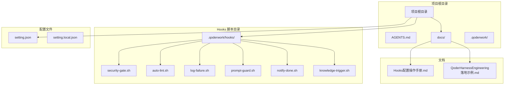
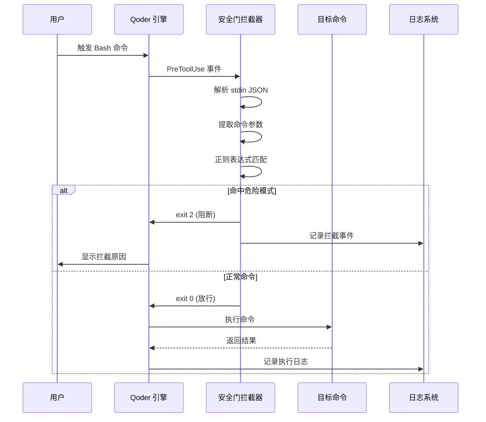
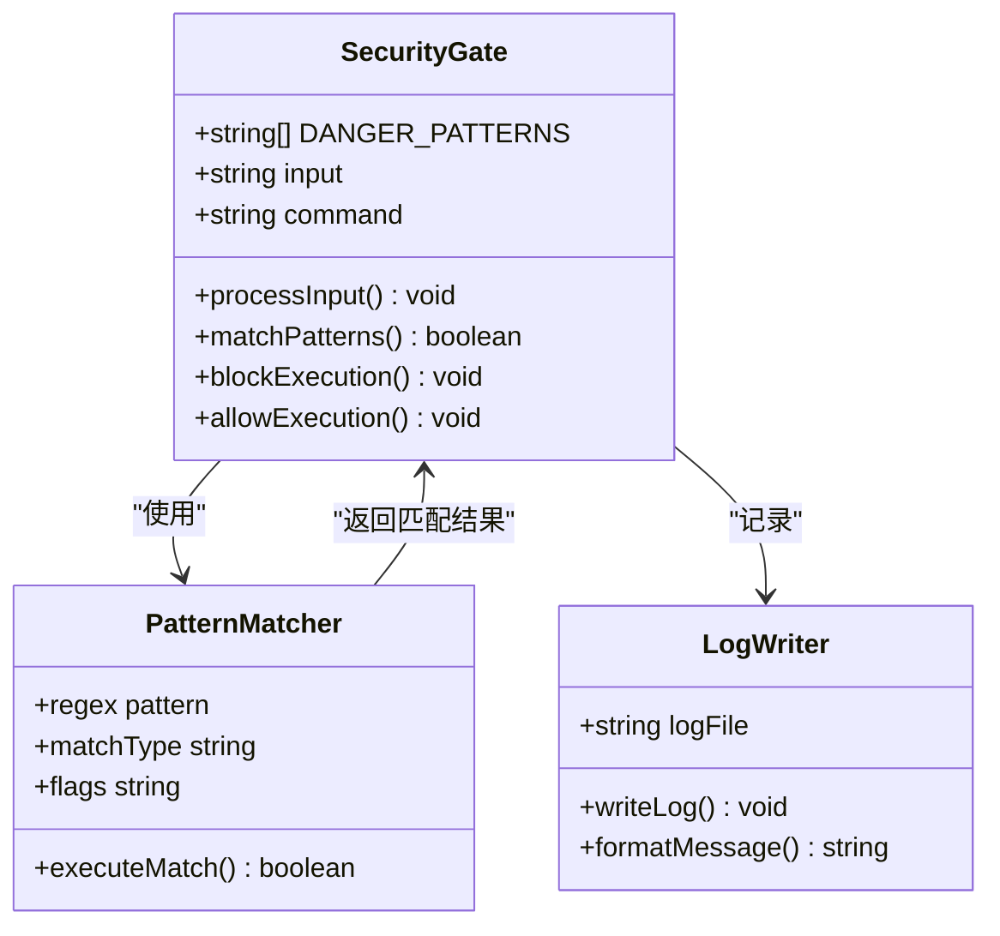
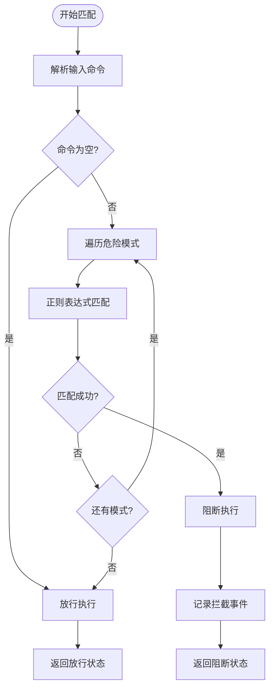
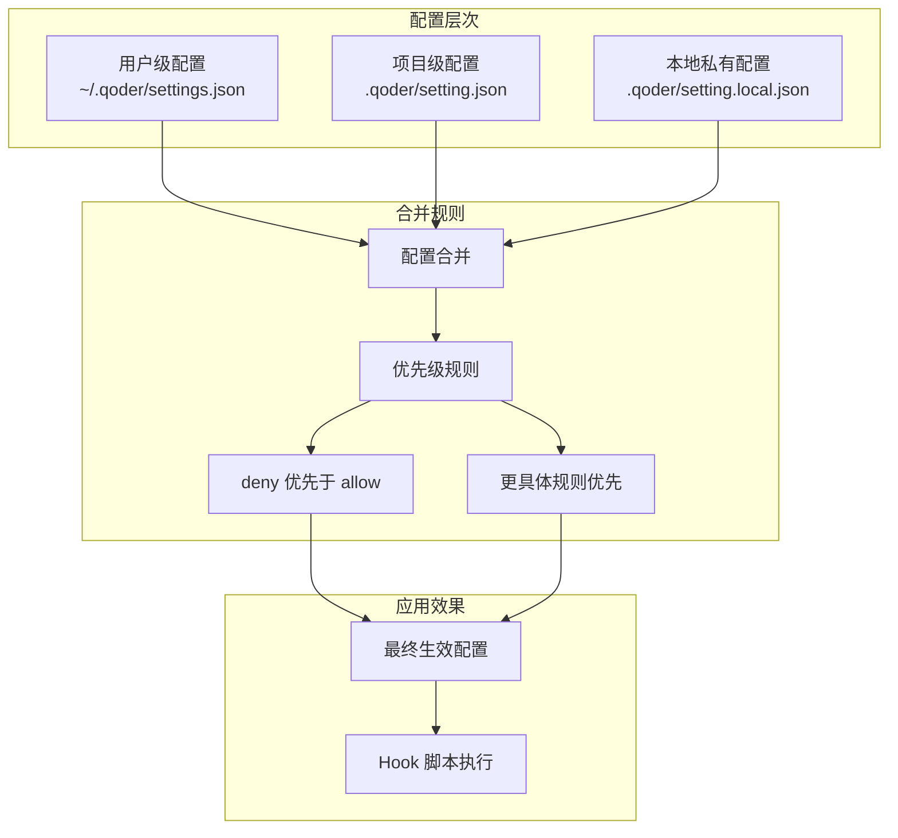
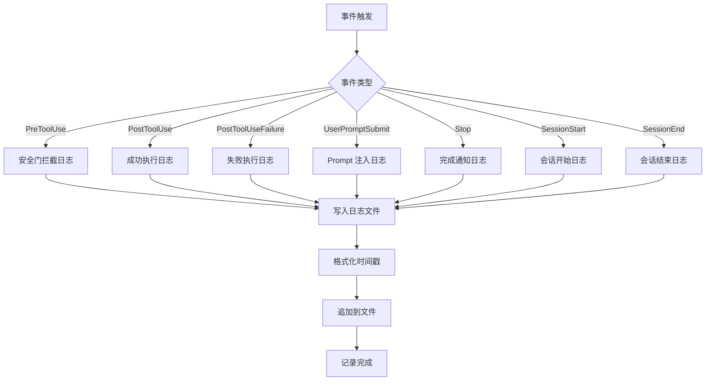
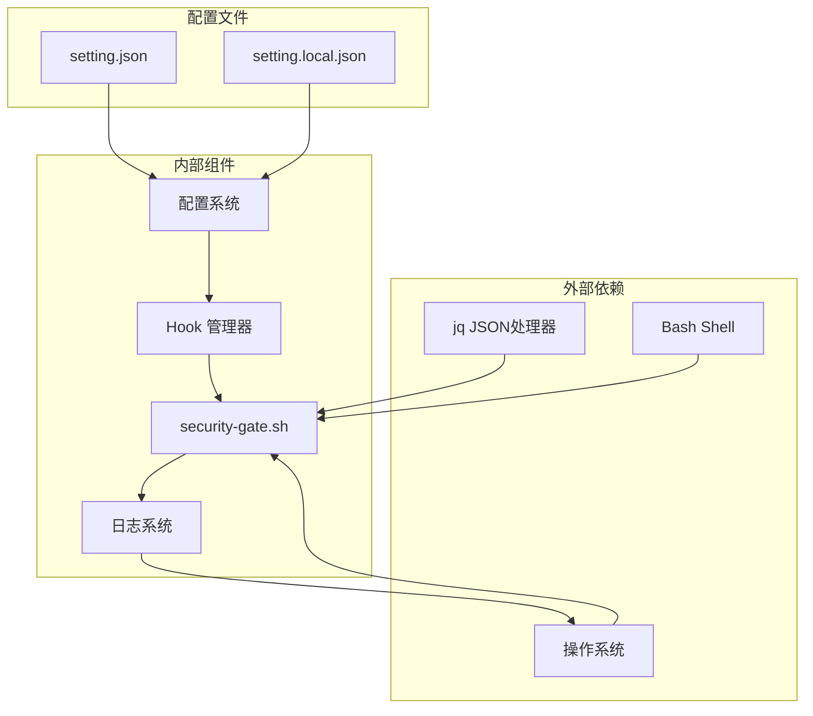

# 高危命令拦截

<cite>
**本文引用的文件**
- [AGENTS.md](file://AGENTS.md)
- [QoderHarnessEngineering落地示例.md](file://QoderHarnessEngineering落地示例.md)
- [.qoderwork/hooks/security-gate.sh](file://.qoderwork/hooks/security-gate.sh)
- [Hooks配置操作手册.md](file://docs/Hooks配置操作手册.md)
- [.qoderwork/hooks/log-failure.sh](file://.qoderwork/hooks/log-failure.sh)
- [.qoderwork/hooks/auto-lint.sh](file://.qoderwork/hooks/auto-lint.sh)
- [.qoderwork/hooks/prompt-guard.sh](file://.qoderwork/hooks/prompt-guard.sh)
- [.qoderwork/hooks/notify-done.sh](file://.qoderwork/hooks/notify-done.sh)
- [.qoderwork/hooks/knowledge-trigger.sh](file://.qoderwork/hooks/knowledge-trigger.sh)
</cite>

## 目录
1. [简介](#简介)
2. [项目结构](#项目结构)
3. [核心组件](#核心组件)
4. [架构概览](#架构概览)
5. [详细组件分析](#详细组件分析)
6. [依赖关系分析](#依赖关系分析)
7. [性能考虑](#性能考虑)
8. [故障排除指南](#故障排除指南)
9. [结论](#结论)
10. [附录](#附录)

## 简介

高危命令拦截功能是 Qoder Harness Engineering 模板项目中的核心安全机制，旨在防止危险的 Bash 命令被执行，保护开发环境免受意外或恶意操作的影响。该系统通过预工具使用前的拦截机制，结合正则表达式匹配算法，能够有效识别和阻止多种类型的高危命令。

本功能基于 Hooks 生命周期机制实现，能够在命令执行前自动检查并拦截潜在的危险操作。系统支持灵活的配置选项，允许团队根据自身需求定制拦截规则和处理策略。

## 项目结构

该项目采用标准化的 Qoder Harness Engineering 结构，包含以下关键目录和文件：



**图表来源**
- [AGENTS.md:34-69](file://AGENTS.md#L34-L69)
- [QoderHarnessEngineering落地示例.md:42-67](file://QoderHarnessEngineering落地示例.md#L42-L67)

**章节来源**
- [AGENTS.md:34-69](file://AGENTS.md#L34-L69)
- [QoderHarnessEngineering落地示例.md:42-67](file://QoderHarnessEngineering落地示例.md#L42-L67)

## 核心组件

高危命令拦截系统由以下核心组件构成：

### 安全门拦截器 (Security Gate)

安全门拦截器是系统的核心组件，负责在 Bash 命令执行前进行实时拦截检查。它通过预定义的危险模式列表和正则表达式匹配算法，识别潜在的高危操作。

### 配置管理系统

系统采用三层配置合并机制，支持用户级、项目级和本地级配置的灵活组合。这种设计允许团队在保持一致性的同时，为个人开发者提供必要的灵活性。

### 日志记录系统

完整的日志记录机制确保所有拦截事件、失败操作和系统状态变化都被准确记录，为安全审计和问题诊断提供支持。

**章节来源**
- [QoderHarnessEngineering落地示例.md:281-295](file://QoderHarnessEngineering落地示例.md#L281-L295)
- [Hooks配置操作手册.md:53-72](file://docs/Hooks配置操作手册.md#L53-L72)

## 架构概览

系统的整体架构基于 Hooks 生命周期机制，实现了从命令触发到拦截处理的完整流程：



**图表来源**
- [Hooks配置操作手册.md:22-49](file://docs/Hooks配置操作手册.md#L22-L49)
- [.qoderwork/hooks/security-gate.sh:15-37](file://.qoderwork/hooks/security-gate.sh#L15-L37)

**章节来源**
- [Hooks配置操作手册.md:22-49](file://docs/Hooks配置操作手册.md#L22-L49)
- [.qoderwork/hooks/security-gate.sh:15-37](file://.qoderwork/hooks/security-gate.sh#L15-L37)

## 详细组件分析

### 安全门拦截器实现

安全门拦截器是整个高危命令拦截系统的核心，其设计体现了简洁而高效的原则：

#### 数据结构设计



**图表来源**
- [.qoderwork/hooks/security-gate.sh:16-28](file://.qoderwork/hooks/security-gate.sh#L16-L28)

#### 拦截模式识别

系统识别以下10+种高危命令模式：

| 模式类别 | 拦截模式 | 正则表达式 | 安全威胁评估 |
|---------|----------|-----------|-------------|
| 文件删除 | `rm\s+-[rRf]` | 递归删除文件 | 高风险：可能导致数据丢失 |
| 文件删除 | `rm\s+--recursive` | 明确递归删除 | 高风险：系统级删除 |
| 数据库操作 | `DROP\s+TABLE` | 删除数据表 | 高风险：数据永久删除 |
| 数据库操作 | `DROP\s+DATABASE` | 删除整个数据库 | 极高风险：业务系统瘫痪 |
| 数据库操作 | `TRUNCATE\s+TABLE` | 清空数据表 | 高风险：数据清空 |
| 设备写入 | `>\s*/dev/sd` | 直接写入磁盘设备 | 极高风险：系统损坏 |
| 设备写入 | `dd\s+if=` | 磁盘复制操作 | 高风险：数据破坏 |
| 设备写入 | `mkfs\.` | 文件系统格式化 | 极高风险：系统不可用 |
| 权限操作 | `chmod\s+-R\s+777` | 开放危险权限 | 高风险：系统安全漏洞 |
| 特权操作 | `sudo\s+rm` | 特权删除操作 | 高风险：绕过权限控制 |
| 恶意脚本 | `:(){:|:&};:` | Fork Bomb | 极高风险：系统资源耗尽 |

#### 正则表达式匹配算法

系统采用高效的正则表达式匹配算法，具有以下特点：



**图表来源**
- [.qoderwork/hooks/security-gate.sh:30-35](file://.qoderwork/hooks/security-gate.sh#L30-L35)

**章节来源**
- [.qoderwork/hooks/security-gate.sh:15-37](file://.qoderwork/hooks/security-gate.sh#L15-L37)

### 配置管理系统

系统采用三层配置合并机制，确保配置的灵活性和一致性：

#### 配置层次结构



**图表来源**
- [QoderHarnessEngineering落地示例.md:23-38](file://QoderHarnessEngineering落地示例.md#L23-L38)

#### 权限策略设计

系统支持三种权限策略，每种都有明确的用途和优先级：

| 策略类型 | 用途 | 优先级 | 示例规则 |
|---------|------|--------|----------|
| allow | 自动放行 | 最低 | `Bash(npm run*)` |
| ask | 需要确认 | 中等 | `Bash(git commit*)` |
| deny | 直接拒绝 | 最高 | `Bash(sudo rm*)` |

**章节来源**
- [QoderHarnessEngineering落地示例.md:123-184](file://QoderHarnessEngineering落地示例.md#L123-L184)

### 日志记录系统

系统提供了完整的日志记录机制，支持多种类型的事件记录：

#### 日志记录流程



**图表来源**
- [.qoderwork/hooks/log-failure.sh:17](file://.qoderwork/hooks/log-failure.sh#L17)

**章节来源**
- [.qoderwork/hooks/log-failure.sh:17](file://.qoderwork/hooks/log-failure.sh#L17)

## 依赖关系分析

系统的依赖关系相对简单，主要围绕 Hooks 机制和配置管理：



**图表来源**
- [.qoderwork/hooks/security-gate.sh:8-9](file://.qoderwork/hooks/security-gate.sh#L8-L9)
- [Hooks配置操作手册.md:522-541](file://docs/Hooks配置操作手册.md#L522-L541)

**章节来源**
- [.qoderwork/hooks/security-gate.sh:8-9](file://.qoderwork/hooks/security-gate.sh#L8-L9)
- [Hooks配置操作手册.md:522-541](file://docs/Hooks配置操作手册.md#L522-L541)

## 性能考虑

高危命令拦截系统在设计时充分考虑了性能因素：

### 匹配算法优化

1. **早期退出策略**：一旦发现匹配的危险模式，立即停止进一步检查
2. **正则表达式缓存**：预编译的正则表达式减少重复编译开销
3. **最小化系统调用**：尽量减少外部命令调用次数

### 内存使用优化

- 使用数组存储危险模式，避免动态内存分配
- 逐个模式检查，避免一次性加载大量数据
- 及时释放临时变量和中间结果

### 执行时间控制

- 设置合理的超时时间（默认60秒）
- 非阻断性错误不影响整体性能
- 并发执行时的资源竞争最小化

## 故障排除指南

### 常见问题及解决方案

#### 问题1：脚本不执行

**可能原因：**
- 脚本缺少执行权限
- 配置文件中的事件名拼写错误
- Hook 脚本路径不正确

**解决方法：**
```bash
# 检查脚本权限
ls -la .qoderwork/hooks/

# 赋予执行权限
chmod +x .qoderwork/hooks/*.sh

# 验证配置文件
cat .qoder/setting.json | jq '.hooks.PreToolUse'
```

#### 问题2：拦截规则不生效

**可能原因：**
- matcher 条件不匹配
- 正则表达式语法错误
- 配置文件合并问题

**解决方法：**
```bash
# 测试正则表达式
echo "rm -rf /" | grep -E 'rm\s+(-[rRf]|--recursive)'

# 检查配置合并
jq -s '.[0] * .[1] * .[2]' ~/.qoder/settings.json .qoder/setting.json .qoder/setting.local.json
```

#### 问题3：误报问题

**解决方法：**
1. 分析误报的具体命令模式
2. 调整正则表达式的精确度
3. 添加例外规则或白名单

**章节来源**
- [Hooks配置操作手册.md:572-626](file://docs/Hooks配置操作手册.md#L572-L626)

### 调试技巧

#### 手动测试方法

```bash
# 测试安全门拦截器
echo '{"session_id":"test","tool_name":"Bash","tool_input":{"command":"rm -rf /"}}' \
  | bash .qoderwork/hooks/security-gate.sh
echo "exit: $?"

# 测试日志记录
echo '{"session_id":"test","tool_name":"Bash","error":"permission denied"}' \
  | bash .qoderwork/hooks/log-failure.sh
```

#### 日志分析

```bash
# 实时监控日志
tail -f .qoderwork/logs/failure.log

# 分析拦截事件
grep "安全门拦截" .qoderwork/logs/failure.log
```

## 结论

高危命令拦截功能通过简洁而有效的设计，为 Qoder Harness Engineering 项目提供了强大的安全保护。系统的主要优势包括：

1. **实时拦截**：在命令执行前进行检查，防止潜在危险操作
2. **灵活配置**：支持多层次配置，适应不同团队的安全需求
3. **完整日志**：提供详细的审计跟踪，支持安全分析和问题诊断
4. **易于扩展**：模块化的架构设计便于添加新的拦截规则和功能

通过合理配置和持续优化，该系统能够有效降低开发环境的安全风险，保护团队的代码资产和业务连续性。

## 附录

### 配置示例

#### 基础安全配置

```json
{
  "hooks": {
    "PreToolUse": [
      {
        "matcher": "Bash",
        "hooks": [
          { "type": "command", "command": ".qoderwork/hooks/security-gate.sh", "timeout": 10 }
        ]
      }
    ]
  }
}
```

#### 高级配置选项

```json
{
  "permissions": {
    "allow": [
      "Bash(npm run*)",
      "Bash(git status)",
      "Bash(ls*)"
    ],
    "ask": [
      "Bash(git commit*)",
      "Bash(git push*)"
    ],
    "deny": [
      "Bash(rm*)",
      "Bash(chmod*)",
      "Bash(sudo*)"
    ]
  }
}
```

### 最佳实践

1. **定期审查规则**：根据实际使用情况调整拦截规则
2. **监控误报率**：建立误报统计和处理流程
3. **备份配置**：定期备份配置文件，防止意外修改
4. **培训团队**：确保团队成员了解拦截规则和正确的操作方式