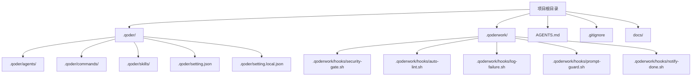
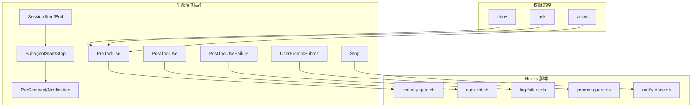
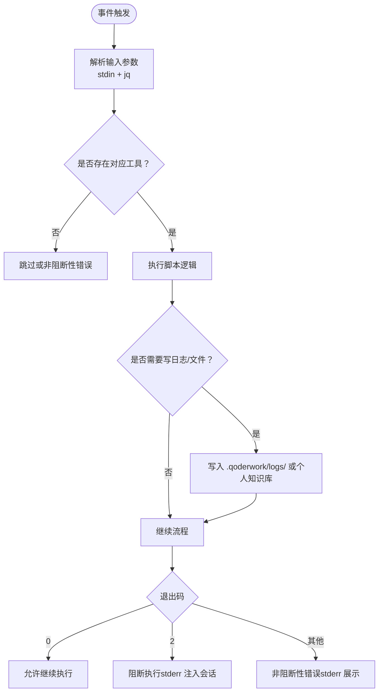

# 快速开始

<cite>
**本文引用的文件**
- [QoderHarnessEngineering落地示例.md](file://QoderHarnessEngineering落地示例.md)
- [AGENTS.md](file://AGENTS.md)
- [.gitignore](file://.gitignore)
- [security-gate.sh](file://.qoderwork/hooks/security-gate.sh)
- [auto-lint.sh](file://.qoderwork/hooks/auto-lint.sh)
- [log-failure.sh](file://.qoderwork/hooks/log-failure.sh)
- [prompt-guard.sh](file://.qoderwork/hooks/prompt-guard.sh)
- [notify-done.sh](file://.qoderwork/hooks/notify-done.sh)
- [KnowledgeExtractor.md](file://.qoder/skills/KnowledgeExtractor.md)
- [知识材料管理方案.md](file://docs/知识材料管理方案.md)
</cite>

## 目录
1. [简介](#简介)
2. [项目结构](#项目结构)
3. [核心组件](#核心组件)
4. [架构概览](#架构概览)
5. [详细组件分析](#详细组件分析)
6. [依赖分析](#依赖分析)
7. [性能考虑](#性能考虑)
8. [故障排除指南](#故障排除指南)
9. [结论](#结论)
10. [附录](#附录)

## 简介
本指南面向首次接触 Qoder Harness Engineering 的新用户，帮助你在 30 分钟内完成从零到一的环境准备、基础配置与验证。你将学会：
- 如何复制模板并初始化项目
- 如何创建与合并配置层级（用户级、项目级、本地级）
- 如何配置权限策略与生命周期 Hooks
- 如何编写第一个 Hooks 脚本并进行测试
- 如何使用 KnowledgeExtractor 技能进行知识归档

本指南严格依据仓库现有文件与脚本，提供可直接运行的命令与步骤。

## 项目结构
Qoder Harness Engineering 将工程化配置与 Hooks 脚本组织在统一的项目结构中，便于团队复用与扩展。关键目录与文件如下：
- .qoder/：项目级配置与扩展目录（agents/、commands/、skills/、setting.json、setting.local.json）
- .qoderwork/hooks/：生命周期 Hooks 脚本（6 个）
- AGENTS.md：项目级 Agent 行为约束
- .gitignore：忽略本地私有配置与 Hooks 日志
- docs/：知识管理方案文档

图表来源
- [QoderHarnessEngineering落地示例.md:42-67](file://QoderHarnessEngineering落地示例.md#L42-L67)
- [.gitignore:1-13](file://.gitignore#L1-L13)

章节来源
- [QoderHarnessEngineering落地示例.md:42-67](file://QoderHarnessEngineering落地示例.md#L42-L67)
- [.gitignore:1-13](file://.gitignore#L1-L13)

## 核心组件
- 配置层级与合并机制：用户级（全局）、项目级（团队共享）、本地级（个人覆盖）。合并时 deny 优先于 allow，更具体规则优先于通配符，本地级覆盖项目级，项目级覆盖用户级。
- 权限策略：支持 Bash 命令、文件读取/编辑、网络请求等多类型规则，分为 allow、ask、deny 三类。
- 生命周期 Hooks：PreToolUse、PostToolUse、PostToolUseFailure、UserPromptSubmit、Stop、SessionStart、SessionEnd、SubagentStart、SubagentStop、PreCompact、Notification 等。
- AGENTS.md：为 Qoder 提供项目上下文与行为约束，每次会话自动加载。
- KnowledgeExtractor 技能：将会话内容结构化归档到个人知识库。

章节来源
- [QoderHarnessEngineering落地示例.md:23-39](file://QoderHarnessEngineering落地示例.md#L23-L39)
- [QoderHarnessEngineering落地示例.md:123-191](file://QoderHarnessEngineering落地示例.md#L123-L191)
- [QoderHarnessEngineering落地示例.md:253-270](file://QoderHarnessEngineering落地示例.md#L253-L270)
- [AGENTS.md:1-69](file://AGENTS.md#L1-L69)
- [.qoder/skills/KnowledgeExtractor.md:1-160](file://.qoder/skills/KnowledgeExtractor.md#L1-L160)

## 架构概览
下图展示了 Hooks 在工具调用与会话生命周期中的触发关系，以及与权限策略的交互：

图表来源
- [QoderHarnessEngineering落地示例.md:157-182](file://QoderHarnessEngineering落地示例.md#L157-L182)
- [QoderHarnessEngineering落地示例.md:255-269](file://QoderHarnessEngineering落地示例.md#L255-L269)
- [QoderHarnessEngineering落地示例.md:279-337](file://QoderHarnessEngineering落地示例.md#L279-L337)

## 详细组件分析

### 权限策略与配置层级
- 配置层级与优先级：用户级 < 项目级 < 本地级；deny 优先于 allow；更具体规则优先于通配符。
- 项目级 setting.json：定义 allow、ask、deny 规则与 hooks 映射。
- 本地级 setting.local.json：用于个人覆盖，需加入 .gitignore。

章节来源
- [QoderHarnessEngineering落地示例.md:23-39](file://QoderHarnessEngineering落地示例.md#L23-L39)
- [QoderHarnessEngineering落地示例.md:123-191](file://QoderHarnessEngineering落地示例.md#L123-L191)
- [QoderHarnessEngineering落地示例.md:194-221](file://QoderHarnessEngineering落地示例.md#L194-L221)
- [.gitignore:1-13](file://.gitignore#L1-L13)

### Hooks 生命周期工程
- PreToolUse：工具执行前拦截，security-gate.sh 拦截高危命令，exit 2 阻断。
- PostToolUse：工具成功后执行，auto-lint.sh 对写入/编辑文件自动 Lint。
- PostToolUseFailure：工具失败后记录，log-failure.sh 写入失败日志。
- UserPromptSubmit：用户提交 prompt 后注入防护，prompt-guard.sh 阻断注入模式。
- Stop：Agent 完成响应时触发，notify-done.sh 发送桌面通知。
- PreCompact/SessionEnd：知识归档提示，配合 KnowledgeExtractor 技能使用。

章节来源
- [QoderHarnessEngineering落地示例.md:253-270](file://QoderHarnessEngineering落地示例.md#L253-L270)
- [QoderHarnessEngineering落地示例.md:279-337](file://QoderHarnessEngineering落地示例.md#L279-L337)
- [.qoderwork/hooks/security-gate.sh:1-38](file://.qoderwork/hooks/security-gate.sh#L1-L38)
- [.qoderwork/hooks/auto-lint.sh:1-43](file://.qoderwork/hooks/auto-lint.sh#L1-L43)
- [.qoderwork/hooks/log-failure.sh:1-20](file://.qoderwork/hooks/log-failure.sh#L1-L20)
- [.qoderwork/hooks/prompt-guard.sh:1-55](file://.qoderwork/hooks/prompt-guard.sh#L1-L55)
- [.qoderwork/hooks/notify-done.sh:1-16](file://.qoderwork/hooks/notify-done.sh#L1-L16)

### AGENTS.md 行为约束
- 为 Qoder 提供项目级上下文与行为约束，适用于所有会话。
- 包含代码安全、Git 纪律、文件作用域等核心规则。
- 提供 Hooks 脚本参考表，便于快速查阅。

章节来源
- [AGENTS.md:1-69](file://AGENTS.md#L1-L69)

### KnowledgeExtractor 技能
- 功能：将会话内容结构化提炼并归档到个人知识库。
- 流程：确认归档路径 → 分析会话内容 → 生成文件名 → 按模板生成内容 → 写入文件 → 更新项目索引与全局 README。
- 触发：PreCompact/SessionEnd 自动提示或手动触发。

章节来源
- [.qoder/skills/KnowledgeExtractor.md:1-160](file://.qoder/skills/KnowledgeExtractor.md#L1-L160)

### 知识材料管理方案
- 草稿层：项目内 .qoder/notes/，不提交 Git，零摩擦记录。
- 精炼层：~/Documents/PersonalKnowledge/，统一跨项目归档。
- 双层结构：兼顾即时捕获与长期沉淀，推荐方案。

章节来源
- [知识材料管理方案.md:51-78](file://docs/知识材料管理方案.md#L51-L78)
- [知识材料管理方案.md:120-161](file://docs/知识材料管理方案.md#L120-L161)
- [知识材料管理方案.md:164-215](file://docs/知识材料管理方案.md#L164-L215)

## 依赖分析
- 工具依赖：Hooks 脚本依赖 jq、npx、ruff/flake8、gofmt、shellcheck、osascript 等工具。若缺失，脚本会以非阻断性错误退出或跳过相应功能。
- 路径与权限：脚本读取输入参数（stdin）并通过 jq 解析；部分脚本需要写入 .qoderwork/logs/ 目录，需具备写权限。
- 事件与脚本映射：setting.json 中 hooks 字段定义事件到脚本的映射关系，脚本通过 exit 码控制是否阻断。

图表来源
- [QoderHarnessEngineering落地示例.md:271-278](file://QoderHarnessEngineering落地示例.md#L271-L278)
- [.qoderwork/hooks/auto-lint.sh:17-40](file://.qoderwork/hooks/auto-lint.sh#L17-L40)
- [.qoderwork/hooks/log-failure.sh:7-17](file://.qoderwork/hooks/log-failure.sh#L7-L17)

章节来源
- [QoderHarnessEngineering落地示例.md:271-278](file://QoderHarnessEngineering落地示例.md#L271-L278)
- [.qoderwork/hooks/auto-lint.sh:1-43](file://.qoderwork/hooks/auto-lint.sh#L1-L43)
- [.qoderwork/hooks/log-failure.sh:1-20](file://.qoderwork/hooks/log-failure.sh#L1-L20)

## 性能考虑
- Hooks 脚本尽量短小、幂等，避免长时间阻塞。
- Lint 工具优先使用本地缓存与增量检查，减少重复开销。
- 日志写入采用追加模式，避免大文件频繁重写。
- 网络请求遵循白名单策略，降低超时与失败概率。

## 故障排除指南
- 权限未生效
  - 检查 setting.json 中 allow/ask/deny 规则是否覆盖目标操作。
  - 确认 deny 优先级高于 allow，且本地级覆盖项目级。
  - 参考：[QoderHarnessEngineering落地示例.md:244-249](file://QoderHarnessEngineering落地示例.md#L244-L249)
- Hooks 未执行
  - 确认事件名称与脚本路径匹配，脚本具备可执行权限。
  - 参考：[QoderHarnessEngineering落地示例.md:157-182](file://QoderHarnessEngineering落地示例.md#L157-L182)
- 高危命令被阻断
  - security-gate.sh 对 rm -rf、DROP TABLE、sudo rm 等模式阻断，exit 2。
  - 参考：[QoderHarnessEngineering落地示例.md:281-295](file://QoderHarnessEngineering落地示例.md#L281-L295)
- Lint 未执行
  - auto-lint.sh 仅对写入/编辑文件生效；若未触发，检查工具链与文件类型。
  - 参考：[QoderHarnessEngineering落地示例.md:296-306](file://QoderHarnessEngineering落地示例.md#L296-L306)
- 失败日志未记录
  - log-failure.sh 写入 .qoderwork/logs/failure.log；检查权限与目录存在性。
  - 参考：[QoderHarnessEngineering落地示例.md:307-313](file://QoderHarnessEngineering落地示例.md#L307-L313)
- 提示词注入被阻断
  - prompt-guard.sh 对指令覆盖、越狱、系统提示泄露等模式阻断，exit 2。
  - 参考：[QoderHarnessEngineering落地示例.md:314-324](file://QoderHarnessEngineering落地示例.md#L314-L324)
- 桌面通知未出现
  - notify-done.sh 依赖 osascript；检查 macOS 环境与脚本权限。
  - 参考：[QoderHarnessEngineering落地示例.md:325-331](file://QoderHarnessEngineering落地示例.md#L325-L331)
- 知识归档未生成
  - 确认 KnowledgeExtractor 技能路径与个人知识库目录存在。
  - 参考：[QoderHarnessEngineering落地示例.md:332-336](file://QoderHarnessEngineering落地示例.md#L332-L336)

## 结论
通过本指南，你已掌握 Qoder Harness Engineering 的基础配置与 Hooks 使用方法。建议在团队内推广以下实践：
- 以项目级 setting.json 为基准，本地级仅做必要覆盖
- 优先使用 allow 与 ask 控制风险，deny 仅保留必要项
- 逐步启用更多 Hooks，提升开发效率与安全性
- 使用 KnowledgeExtractor 技能沉淀知识，构建个人知识库

## 附录

### 快速开始步骤（30 分钟）
- 复制模板
  - 复制 .qoder/、.qoderwork/、AGENTS.md 至新项目根目录
  - 参考：[QoderHarnessEngineering落地示例.md:507-514](file://QoderHarnessEngineering落地示例.md#L507-L514)
- 配置 .gitignore
  - 添加 .qoder/setting.local.json 与 .qoderwork/logs/ 到忽略列表
  - 参考：[QoderHarnessEngineering落地示例.md:515-523](file://QoderHarnessEngineering落地示例.md#L515-L523)
- 调整权限策略
  - 编辑 .qoder/setting.json，按项目技术栈调整 allow 规则
  - 参考：[QoderHarnessEngineering落地示例.md:524-535](file://QoderHarnessEngineering落地示例.md#L524-L535)
- 更新 AGENTS.md
  - 填写项目技术栈、目录结构与禁止行为
  - 参考：[QoderHarnessEngineering落地示例.md:536-542](file://QoderHarnessEngineering落地示例.md#L536-L542)
- 赋予脚本执行权限
  - 为 .qoderwork/hooks/ 下所有脚本赋予执行权限
  - 参考：[QoderHarnessEngineering落地示例.md:543-547](file://QoderHarnessEngineering落地示例.md#L543-L547)
- 验证配置
  - 打开 Qoder，执行一条被 ask 规则覆盖的命令（如 git commit），确认弹窗提示
  - 参考：[QoderHarnessEngineering落地示例.md:549-552](file://QoderHarnessEngineering落地示例.md#L549-L552)

### 常用命令参考
- 复制模板目录
  - 参考：[QoderHarnessEngineering落地示例.md:509-513](file://QoderHarnessEngineering落地示例.md#L509-L513)
- 赋予执行权限
  - 参考：[QoderHarnessEngineering落地示例.md:545-547](file://QoderHarnessEngineering落地示例.md#L545-L547)
- 查看知识库
  - 参考：[知识材料管理方案.md:329-340](file://docs/知识材料管理方案.md#L329-L340)

### Hooks 脚本路径与用途
- security-gate.sh：PreToolUse（Bash）阻断高危命令
  - 参考：[security-gate.sh:1-38](file://.qoderwork/hooks/security-gate.sh#L1-L38)
- auto-lint.sh：PostToolUse（Write|Edit）自动 Lint
  - 参考：[auto-lint.sh:1-43](file://.qoderwork/hooks/auto-lint.sh#L1-L43)
- log-failure.sh：PostToolUseFailure（*）记录失败日志
  - 参考：[log-failure.sh:1-20](file://.qoderwork/hooks/log-failure.sh#L1-L20)
- prompt-guard.sh：UserPromptSubmit 注入防护
  - 参考：[prompt-guard.sh:1-55](file://.qoderwork/hooks/prompt-guard.sh#L1-L55)
- notify-done.sh：Stop 桌面通知
  - 参考：[notify-done.sh:1-16](file://.qoderwork/hooks/notify-done.sh#L1-L16)