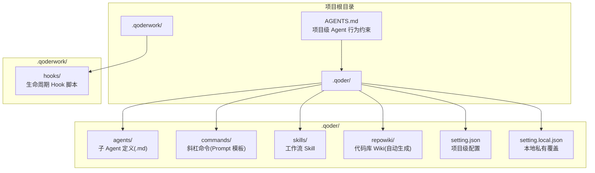
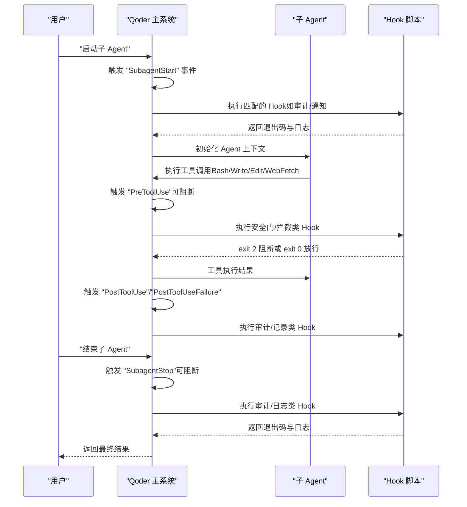
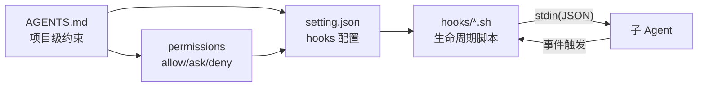

# Agents 目录

<cite>
**本文引用的文件**
- [AGENTS.md](file://AGENTS.md)
- [QoderHarnessEngineering落地示例.md](file://QoderHarnessEngineering落地示例.md)
- [Hooks配置操作手册.md](file://docs/Hooks配置操作手册.md)
- [.qoderwork/hooks/security-gate.sh](file://.qoderwork/hooks/security-gate.sh)
</cite>

## 目录
1. [简介](#简介)
2. [项目结构](#项目结构)
3. [核心组件](#核心组件)
4. [架构总览](#架构总览)
5. [详细组件分析](#详细组件分析)
6. [依赖关系分析](#依赖关系分析)
7. [性能考量](#性能考量)
8. [故障排除指南](#故障排除指南)
9. [结论](#结论)
10. [附录](#附录)

## 简介
本文件面向 Qoder Harness Engineering 项目中的 agents/ 目录，系统化阐述“自定义子 Agent”的开发原理、接口规范、行为约束与生命周期管理，给出配置格式、参数传递与返回值规范，并提供最佳实践（错误处理、性能优化、安全考虑）。同时，结合项目现有 Hooks 机制，说明 Agent 与主系统的集成方式与调用机制，最后提供可直接落地的 Agent 开发示例与参考路径。

## 项目结构
agents/ 位于 .qoder/ 下，用于存放“自定义子 Agent”。每个 Agent 以 .md 文件形式存在，通过 frontmatter 定义能力边界，运行在“独立上下文窗口”中，可配置专属工具权限与 MCP 服务。其职责与 commands/、skills/、repowiki/ 协同互补，共同构成 Qoder 的扩展体系。

图示来源
- [QoderHarnessEngineering落地示例.md:360-434](file://QoderHarnessEngineering落地示例.md#L360-L434)
- [AGENTS.md:34-50](file://AGENTS.md#L34-L50)

章节来源
- [QoderHarnessEngineering落地示例.md:360-434](file://QoderHarnessEngineering落地示例.md#L360-L434)
- [AGENTS.md:34-50](file://AGENTS.md#L34-L50)

## 核心组件
- 子 Agent（agents/）：每个 .md 文件即一个子 Agent，frontmatter 定义名称、描述与工具集合，运行在独立上下文窗口，适合需要专属工具权限与反复使用的专职角色。
- 项目级 Agent 行为约束（AGENTS.md）：提供项目级上下文与行为规范，每次会话自动加载，约束修改范围、Git 操作与禁止行为。
- Hooks 生命周期：通过 setting.json 中 hooks 字段挂载 Hook 脚本，实现 PreToolUse、PostToolUse、PostToolUseFailure、UserPromptSubmit、Stop、SessionStart、SessionEnd、SubagentStart、SubagentStop、PreCompact、Notification 等事件的自动化控制。
- 权限策略（permissions）：allow/ask/deny 三层合并策略，deny 优先，支持 Bash、Read、Edit、WebFetch 等规则与路径取反。

章节来源
- [QoderHarnessEngineering落地示例.md:372-384](file://QoderHarnessEngineering落地示例.md#L372-L384)
- [AGENTS.md:16-31](file://AGENTS.md#L16-L31)
- [QoderHarnessEngineering落地示例.md:123-184](file://QoderHarnessEngineering落地示例.md#L123-L184)
- [QoderHarnessEngineering落地示例.md:253-269](file://QoderHarnessEngineering落地示例.md#L253-L269)

## 架构总览
Agent 与主系统的交互遵循“事件驱动 + 生命周期 Hook”的模式。Agent 的启动与停止分别触发 SubagentStart/SubagentStop 事件，主系统据此执行相应 Hook。同时，Agent 在执行工具（Bash/Write/Edit/WebFetch 等）前后，也会触发 PreToolUse/PostToolUse/PostToolUseFailure 等事件，实现安全拦截、自动 Lint、失败记录等工程化能力。

图示来源
- [QoderHarnessEngineering落地示例.md:253-269](file://QoderHarnessEngineering落地示例.md#L253-L269)
- [Hooks配置操作手册.md:22-49](file://docs/Hooks配置操作手册.md#L22-L49)

章节来源
- [QoderHarnessEngineering落地示例.md:253-269](file://QoderHarnessEngineering落地示例.md#L253-L269)
- [Hooks配置操作手册.md:22-49](file://docs/Hooks配置操作手册.md#L22-L49)

## 详细组件分析

### 子 Agent 接口规范与生命周期
- 文件格式：.md，frontmatter 定义 name、description、tools 等能力边界。
- 上下文：独立窗口，可配置专属工具权限与 MCP 服务。
- 生命周期事件：
  - SubagentStart：子 Agent 启动时触发，适合审计/初始化。
  - SubagentStop：子 Agent 完成时触发，适合审计/清理。
- 与主系统集成：通过 /agent名 或自然语言匹配启动；与 hooks 配置联动，实现安全与审计。

章节来源
- [QoderHarnessEngineering落地示例.md:372-384](file://QoderHarnessEngineering落地示例.md#L372-L384)
- [QoderHarnessEngineering落地示例.md:266-267](file://QoderHarnessEngineering落地示例.md#L266-L267)

### 行为约束与权限策略
- AGENTS.md 提供项目级约束，如修改配置文件需确认、禁止直接删除文件、Git 操作需确认、编辑范围限定等。
- 权限策略（permissions）：
  - allow：自动放行
  - ask：弹出确认对话框
  - deny：直接拒绝
  - 优先级：deny > allow/ask；更具体规则优先于通配符；本地级覆盖项目级，项目级覆盖用户级。
- 工具规则示例：Bash、Read、Edit、WebFetch、路径取反等。

章节来源
- [AGENTS.md:16-31](file://AGENTS.md#L16-L31)
- [QoderHarnessEngineering落地示例.md:224-251](file://QoderHarnessEngineering落地示例.md#L224-L251)
- [QoderHarnessEngineering落地示例.md:123-184](file://QoderHarnessEngineering落地示例.md#L123-L184)

### 配置格式、参数传递与返回值规范
- setting.json 中 hooks 字段：
  - 事件名 -> 数组条目 -> matcher（可选）-> hooks 数组（命令型 Hook）。
  - Hook 对象字段：type（固定为 command）、command（脚本路径或 shell 命令）、timeout（超时秒数）。
- stdin 数据格式（Hook 通过 stdin 接收 JSON）：
  - PreToolUse/PostToolUse：包含 session_id、tool_name、tool_input（含 command/path/content/old_string/new_string/url 等）、tool_output（PostToolUse 有）。
  - PostToolUseFailure：包含 session_id、tool_name、tool_input、error。
  - UserPromptSubmit：包含 session_id、prompt。
  - Stop：包含 session_id、stop_reason。
  - SessionStart/SessionEnd：包含 session_id、source/end_reason。
  - SubagentStart/SubagentStop：包含 session_id、agent_type。
  - PreCompact：包含 session_id、trigger。
  - Notification：包含 session_id、type、message。
- 退出码规范：
  - 0：放行继续执行。
  - 2：阻断（仅对可阻断事件有效，stderr 注入会话）。
  - 其他：非阻断性错误，stderr 展示给用户，执行继续。

章节来源
- [QoderHarnessEngineering落地示例.md:123-184](file://QoderHarnessEngineering落地示例.md#L123-L184)
- [Hooks配置操作手册.md:53-81](file://docs/Hooks配置操作手册.md#L53-L81)
- [Hooks配置操作手册.md:104-215](file://docs/Hooks配置操作手册.md#L104-L215)
- [Hooks配置操作手册.md:245-261](file://docs/Hooks配置操作手册.md#L245-L261)

### 错误处理、性能优化与安全考虑
- 错误处理：
  - 使用 stderr 注入会话上下文（exit 2 时）。
  - 非阻断性错误使用其他退出码并在 stderr 输出。
  - Hook 脚本应健壮解析 stdin，避免空输入导致异常。
- 性能优化：
  - 合理设置 timeout，避免阻塞会话。
  - 尽量减少外部依赖与 IO，必要时缓存结果。
  - 对 PostToolUse 的文件处理 Hook，按文件类型分支处理，避免无效操作。
- 安全考虑：
  - PreToolUse 事件使用安全门拦截高危命令（如 rm -rf、数据库破坏性操作、Fork Bomb 等）。
  - WebFetch 使用域名白名单策略，deny 通配 + allow 白名单实现“仅允许指定域名”。

章节来源
- [Hooks配置操作手册.md:245-261](file://docs/Hooks配置操作手册.md#L245-L261)
- [QoderHarnessEngineering落地示例.md:281-295](file://QoderHarnessEngineering落地示例.md#L281-L295)
- [QoderHarnessEngineering落地示例.md:484-497](file://QoderHarnessEngineering落地示例.md#L484-L497)

### Agent 开发示例与最佳实践
- 示例思路（以“Hooks 配置审查子 Agent”为例）：
  - 文件：agents/hooks-reviewer.md（frontmatter 包含 name、description、tools 列表）。
  - 角色：审查 .qoder/setting.json 中 hooks 字段的合规性（事件名、脚本路径、退出码使用）。
  - 工具：Read、Grep、Glob（用于读取配置、匹配脚本路径、统计事件分布）。
  - 生命周期：SubagentStart 初始化检查清单，SubagentStop 汇总报告。
  - 与 Hooks 集成：PreToolUse 可挂载安全门；PostToolUse 可挂载自动 Lint；SubagentStop 可审计。
- 最佳实践：
  - 明确定义 Agent 的职责边界与工具权限，避免越权。
  - 在 AGENTS.md 中明确项目级约束，确保 Agent 行为与项目规范一致。
  - 使用 ask/deny 规则保护敏感路径与危险命令，避免误操作。
  - 为每个 Agent 设计清晰的输入输出契约，便于复用与测试。

章节来源
- [QoderHarnessEngineering落地示例.md:372-384](file://QoderHarnessEngineering落地示例.md#L372-L384)
- [QoderHarnessEngineering落地示例.md:472-482](file://QoderHarnessEngineering落地示例.md#L472-L482)
- [AGENTS.md:16-31](file://AGENTS.md#L16-L31)

## 依赖关系分析
- agents/ 与 setting.json 的 hooks 字段耦合：Agent 的行为受权限策略与生命周期 Hook 控制。
- AGENTS.md 与 setting.json 的 permissions：两者共同决定 Agent 的可执行范围。
- .qoderwork/hooks/* 与 setting.json 的 hooks：Hook 脚本通过 stdin 获取上下文，通过 exit code 控制执行流。

图示来源
- [AGENTS.md:16-31](file://AGENTS.md#L16-L31)
- [QoderHarnessEngineering落地示例.md:123-184](file://QoderHarnessEngineering落地示例.md#L123-L184)
- [QoderHarnessEngineering落地示例.md:253-269](file://QoderHarnessEngineering落地示例.md#L253-L269)

章节来源
- [AGENTS.md:16-31](file://AGENTS.md#L16-L31)
- [QoderHarnessEngineering落地示例.md:123-184](file://QoderHarnessEngineering落地示例.md#L123-L184)
- [QoderHarnessEngineering落地示例.md:253-269](file://QoderHarnessEngineering落地示例.md#L253-L269)

## 性能考量
- Hook 超时控制：合理设置 timeout，避免长时间阻塞会话。
- 事件串行执行：同一事件下多个 Hook 按顺序串行执行，注意避免长耗时 Hook。
- 脚本健壮性：对 stdin 解析失败、文件不存在等情况进行早返回，减少无效计算。
- 退出码语义化：仅在必要时使用 exit 2 阻断，其余错误以非阻断方式处理。

章节来源
- [Hooks配置操作手册.md:53-81](file://docs/Hooks配置操作手册.md#L53-L81)
- [Hooks配置操作手册.md:520-541](file://docs/Hooks配置操作手册.md#L520-L541)

## 故障排除指南
- 脚本不执行：
  - 检查执行权限与 setting.json 中 command 路径是否正确。
- exit 2 未阻断：
  - 确认事件是否可阻断（仅 PreToolUse、UserPromptSubmit、Stop、SubagentStop 支持 exit 2）。
- stderr 未注入会话：
  - 确认使用 exit 2 且内容写入 stderr。
- Hook 超时：
  - 调整 timeout 或优化脚本逻辑。
- 多个 Hook 命中：
  - 同一事件下全部按顺序执行，任一 exit 2 可阻断（对可阻断事件）。

章节来源
- [Hooks配置操作手册.md:572-621](file://docs/Hooks配置操作手册.md#L572-L621)

## 结论
agents/ 为 Qoder 提供了“独立上下文 + 专属工具权限”的子 Agent 能力，结合 AGENTS.md 的项目级约束与 setting.json 的 hooks 配置，可实现从安全拦截、自动 Lint、失败记录到审计日志的全生命周期工程化。通过明确的接口规范、参数传递与返回值约定，以及遵循错误处理、性能优化与安全考虑的最佳实践，开发者可以稳定地扩展系统能力，构建可复用、可审计、可演进的 Agent 生态。

## 附录
- 快速启动步骤（基于项目模板）：
  - 复制 .qoder/、.qoderwork/ 与 AGENTS.md 至新项目。
  - 在 .gitignore 中添加 .qoder/setting.local.json 与 .qoderwork/logs/。
  - 按项目技术栈调整 .qoder/setting.json 的 permissions.allow。
  - 更新 AGENTS.md 中的项目约束与禁止行为。
  - 赋予 .qoderwork/hooks/*.sh 执行权限。
  - 验证 ask 规则是否弹窗确认。

章节来源
- [QoderHarnessEngineering落地示例.md:503-552](file://QoderHarnessEngineering落地示例.md#L503-L552)