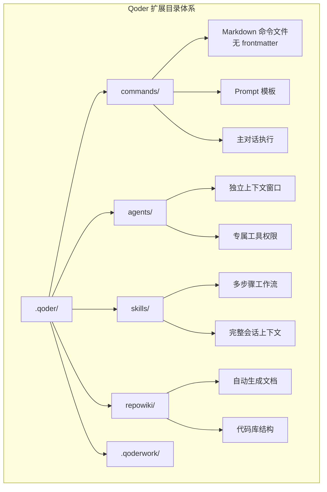
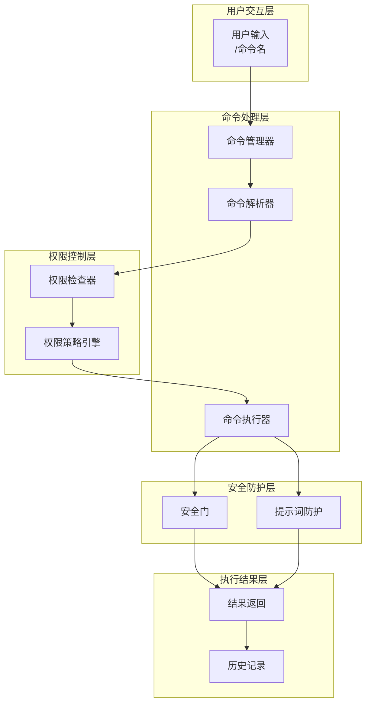
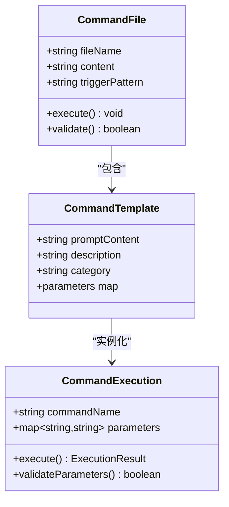
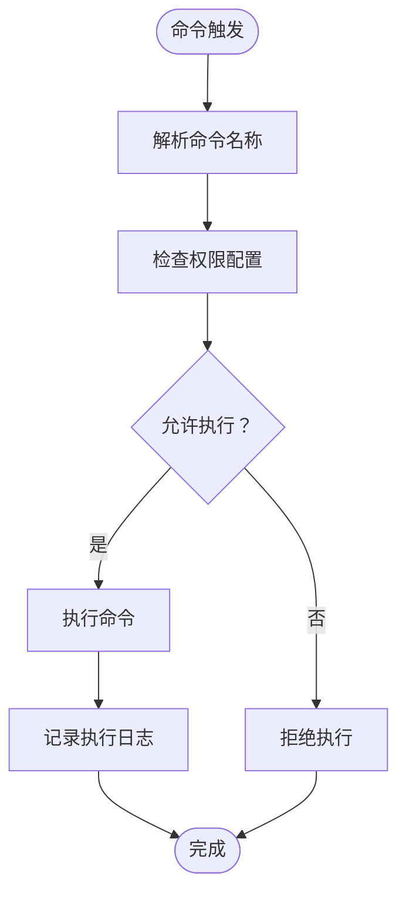
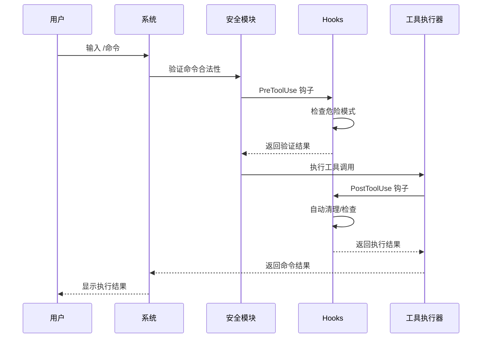
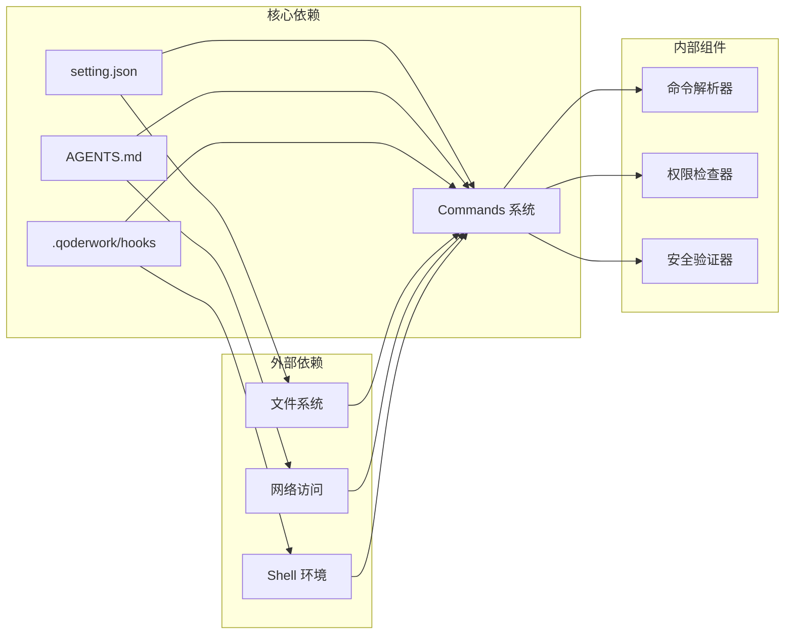

# Commands 目录

<cite>
**本文档引用的文件**
- [QoderHarnessEngineering落地示例.md](file://QoderHarnessEngineering落地示例.md)
- [security-gate.sh](file://.qoderwork/hooks/security-gate.sh)
- [auto-lint.sh](file://.qoderwork/hooks/auto-lint.sh)
- [log-failure.sh](file://.qoderwork/hooks/log-failure.sh)
- [prompt-guard.sh](file://.qoderwork/hooks/prompt-guard.sh)
- [notify-done.sh](file://.qoderwork/hooks/notify-done.sh)
- [knowledge-trigger.sh](file://.qoderwork/hooks/knowledge-trigger.sh)
- [setting.json](file://.qoder/setting.json)
- [setting.local.json](file://.qoder/setting.local.json)
- [AGENTS.md](file://AGENTS.md)
</cite>

## 目录
1. [简介](#简介)
2. [项目结构](#项目结构)
3. [核心组件](#核心组件)
4. [架构概览](#架构概览)
5. [详细组件分析](#详细组件分析)
6. [依赖关系分析](#依赖关系分析)
7. [性能考虑](#性能考虑)
8. [故障排除指南](#故障排除指南)
9. [结论](#结论)
10. [附录](#附录)

## 简介

Commands 目录是 Qoder Harness Engineering 项目中自定义斜杠命令的核心存储位置。每个命令都是一个纯 Markdown 文件，内容即执行时注入的 Prompt，无 frontmatter，直接在主对话中执行。这些命令为用户提供了一键执行高频固定操作的能力，如会话归档、代码审查、安全检查等。

## 项目结构

根据项目文档，Commands 目录位于 `.qoder/commands/` 路径下，与 agents/、skills/、repowiki/ 等目录并列，共同构成 Qoder 的扩展目录体系。

**图表来源**
- [QoderHarnessEngineering落地示例.md: 360-434:360-434](file://QoderHarnessEngineering落地示例.md#L360-L434)

**章节来源**
- [QoderHarnessEngineering落地示例.md: 42-67:42-67](file://QoderHarnessEngineering落地示例.md#L42-L67)
- [QoderHarnessEngineering落地示例.md: 388-401:388-401](file://QoderHarnessEngineering落地示例.md#L388-L401)

## 核心组件

### 命令文件格式

每个命令文件都是纯 Markdown 文档，具有以下特点：
- 无 frontmatter 标头
- 内容即 Prompt 模板
- 在主对话中执行
- 通过 `/命令名` 触发

### 命令执行机制

命令的执行遵循以下流程：
1. 用户在对话框输入 `/命令名`
2. 系统查找对应的命令文件
3. 将命令文件内容作为 Prompt 注入到 Agent
4. Agent 执行相应的工具调用

### 权限控制系统

Commands 目录与权限系统紧密集成，通过 setting.json 中的 permissions 配置控制命令的可用性。

**章节来源**
- [QoderHarnessEngineering落地示例.md: 388-401:388-401](file://QoderHarnessEngineering落地示例.md#L388-L401)
- [setting.json: 1-114:1-114](file://.qoder/setting.json#L1-L114)

## 架构概览

Commands 系统与 Hooks 系统协同工作，形成完整的安全执行环境。

**图表来源**
- [QoderHarnessEngineering落地示例.md: 253-278:253-278](file://QoderHarnessEngineering落地示例.md#L253-L278)
- [setting.json: 30-112:30-112](file://.qoder/setting.json#L30-L112)

## 详细组件分析

### 命令文件结构

每个命令文件采用简单的 Markdown 格式，内容直接作为 Prompt 模板使用。

**图表来源**
- [QoderHarnessEngineering落地示例.md: 392-396:392-396](file://QoderHarnessEngineering落地示例.md#L392-L396)

### 权限控制机制

Commands 系统通过三层权限控制确保安全性：

**图表来源**
- [setting.json: 2-29:2-29](file://.qoder/setting.json#L2-L29)

### 安全验证流程

安全验证贯穿命令执行的整个生命周期：

**图表来源**
- [security-gate.sh: 1-38:1-38](file://.qoderwork/hooks/security-gate.sh#L1-L38)
- [auto-lint.sh: 1-43:1-43](file://.qoderwork/hooks/auto-lint.sh#L1-L43)

**章节来源**
- [setting.json: 30-112:30-112](file://.qoder/setting.json#L30-L112)
- [QoderHarnessEngineering落地示例.md: 253-278:253-278](file://QoderHarnessEngineering落地示例.md#L253-L278)

## 依赖关系分析

Commands 系统与其他组件存在密切的依赖关系：

**图表来源**
- [setting.json: 1-114:1-114](file://.qoder/setting.json#L1-L114)
- [AGENTS.md: 1-53:1-53](file://AGENTS.md#L1-L53)

**章节来源**
- [QoderHarnessEngineering落地示例.md: 340-356:340-356](file://QoderHarnessEngineering落地示例.md#L340-L356)
- [setting.json: 1-114:1-114](file://.qoder/setting.json#L1-L114)

## 性能考虑

### 命令加载优化

- 命令文件采用轻量级 Markdown 格式，减少解析开销
- 无 frontmatter 减少元数据处理时间
- 延迟加载机制避免不必要的文件读取

### 执行效率

- 命令执行在主对话上下文中进行，减少上下文切换开销
- Hooks 系统采用异步执行模式，避免阻塞主流程
- 缓存机制提升频繁命令的执行速度

## 故障排除指南

### 常见问题及解决方案

#### 命令无法找到
- 检查命令文件是否位于正确的 `.qoder/commands/` 目录
- 确认文件名与触发命令一致
- 验证文件权限设置

#### 权限拒绝执行
- 检查 `setting.json` 中的 permissions 配置
- 验证命令是否在 allow 列表中
- 检查 deny 规则是否误拦截

#### 安全门拦截
- 查看安全门日志了解拦截原因
- 检查命令是否包含危险模式
- 联系项目负责人获取特殊权限

**章节来源**
- [security-gate.sh: 30-35:30-35](file://.qoderwork/hooks/security-gate.sh#L30-L35)
- [setting.json: 21-28:21-28](file://.qoder/setting.json#L21-L28)

## 结论

Commands 目录为 Qoder Harness Engineering 提供了强大的自定义命令功能。通过简洁的 Markdown 格式、严格的权限控制和全面的安全防护，用户可以轻松创建和管理各种自动化工作流程。结合 Hooks 系统，Commands 系统形成了一个既灵活又安全的扩展平台。

## 附录

### 命令开发最佳实践

1. **命名规范**：使用简洁明了的命令名称
2. **内容设计**：确保 Prompt 模板清晰具体
3. **权限配置**：合理设置 permissions 配置
4. **安全检查**：定期审查命令的安全性
5. **文档编写**：为复杂命令编写使用说明

### 调试技巧

- 使用 `setting.local.json` 进行本地测试
- 查看 `.qoderwork/logs/` 中的日志文件
- 利用 `ask` 权限模式进行确认执行
- 通过 AGENTS.md 提供上下文信息

**章节来源**
- [QoderHarnessEngineering落地示例.md: 503-552:503-552](file://QoderHarnessEngineering落地示例.md#L503-L552)
- [setting.local.json: 1-8:1-8](file://.qoder/setting.local.json#L1-L8)