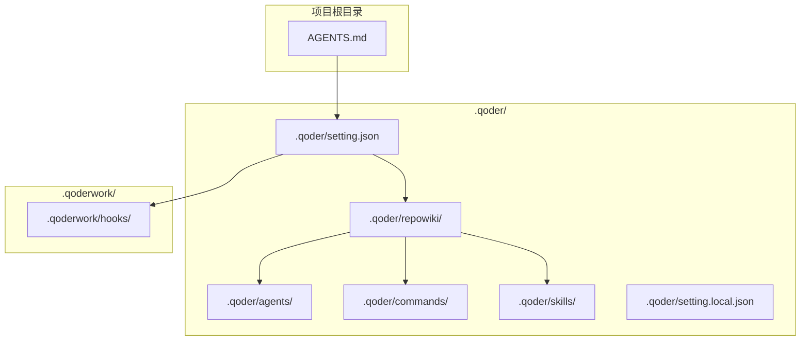
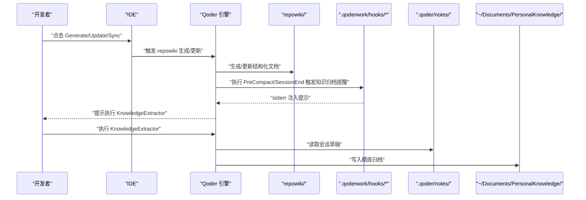
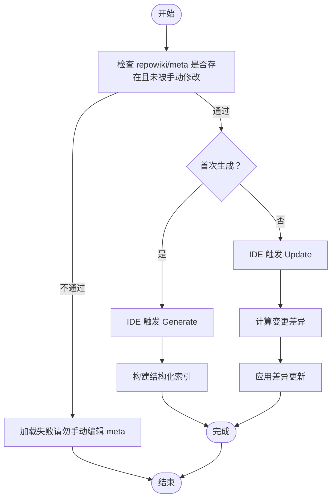
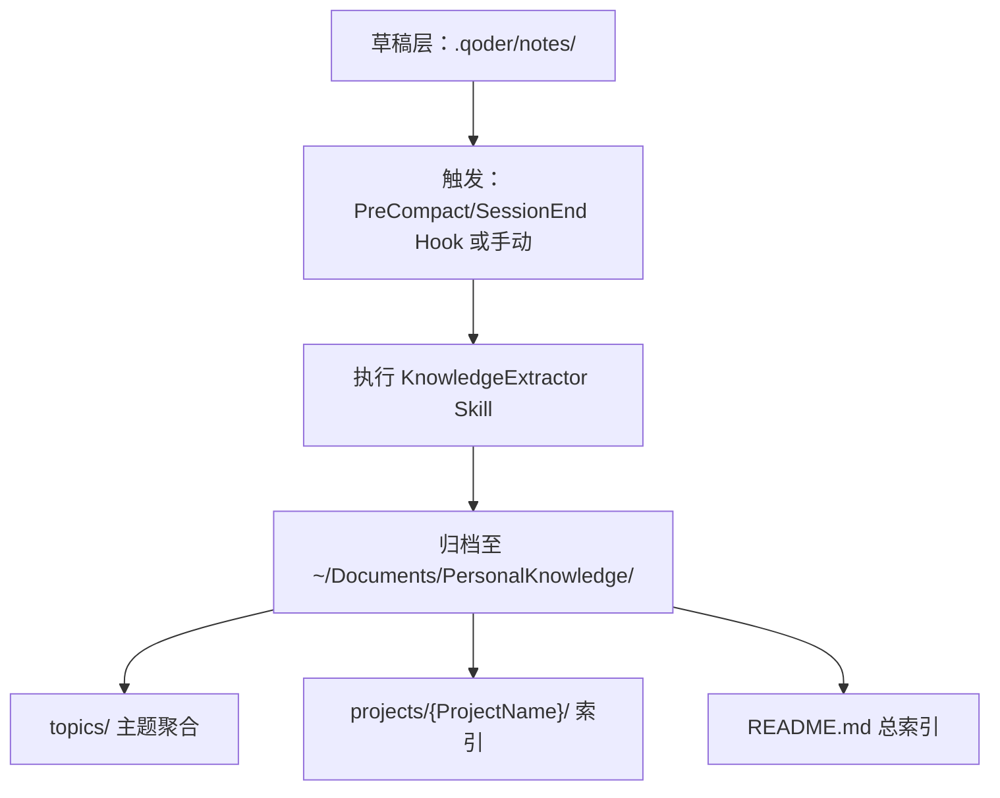
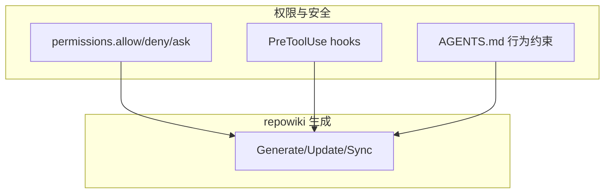
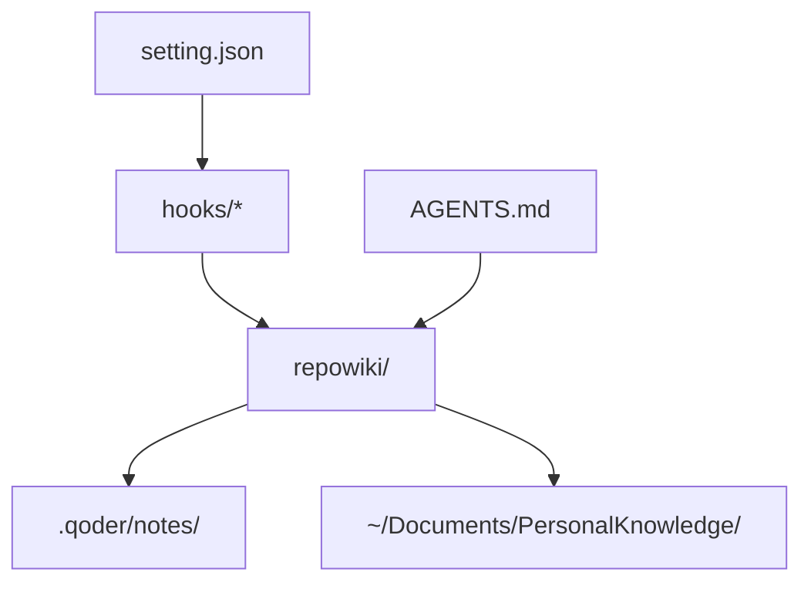

# RepoWiki 目录

<cite>
**本文引用的文件**
- [QoderHarnessEngineering落地示例.md](file://QoderHarnessEngineering落地示例.md)
- [AGENTS.md](file://AGENTS.md)
- [知识材料管理方案.md](file://docs/知识材料管理方案.md)
- [规划ToDo.md](file://docs/规划ToDo.md)
- [security-gate.sh](file://.qoderwork/hooks/security-gate.sh)
- [prompt-guard.sh](file://.qoderwork/hooks/prompt-guard.sh)
</cite>

## 目录
1. [简介](#简介)
2. [项目结构](#项目结构)
3. [核心组件](#核心组件)
4. [架构总览](#架构总览)
5. [组件详解](#组件详解)
6. [依赖关系分析](#依赖关系分析)
7. [性能考量](#性能考量)
8. [故障排查指南](#故障排查指南)
9. [结论](#结论)
10. [附录](#附录)

## 简介
本文件面向 Qoder Harness Engineering 的 repowiki/ 目录，系统阐述知识管理系统的实现原理与使用方法，重点覆盖：
- 知识内容的组织结构、存储格式与检索机制
- repowiki 在知识沉淀与分享中的作用与价值
- 如何基于 repowiki 构建团队知识库
- 配置选项与自定义方法（内容分类、标签系统、版本管理）
- 最佳实践与维护建议

在本项目中，repowiki/ 由 Qoder 自动分析代码库生成，作为 AI 优先读取的知识载体，显著降低检索成本、提升上下文质量。

## 项目结构
repowiki/ 位于 .qoder/ 下，是 Qoder 自动生成的代码库结构化文档目录。其职责与其他扩展目录互补：
- agents/：子 Agent 定义（独立上下文）
- commands/：斜杠命令模板（主对话执行）
- repowiki/：代码库 Wiki（自动生成，AI 优先读取）
- skills/：多步骤工作流（主对话执行）

repowiki 的 IDE 操作方式：
- 首次：点击 Generate（约 4000 文件耗时 ~120 分钟）
- 代码变更后：点击 Update（仅更新变化部分）
- 手动编辑 .md 后：点击 Synchronize（v0.2.0+）

⚠️ repowiki/meta 由系统自动管理，严禁手动编辑，否则导致 Wiki 加载失败。

**图表来源**
- [QoderHarnessEngineering落地示例.md:42-67](file://QoderHarnessEngineering落地示例.md#L42-L67)
- [QoderHarnessEngineering落地示例.md:402-416](file://QoderHarnessEngineering落地示例.md#L402-L416)

**章节来源**
- [QoderHarnessEngineering落地示例.md:42-67](file://QoderHarnessEngineering落地示例.md#L42-L67)
- [QoderHarnessEngineering落地示例.md:402-416](file://QoderHarnessEngineering落地示例.md#L402-L416)

## 核心组件
- repowiki/：由 Qoder 自动分析代码库生成的结构化文档，AI 在回答代码相关问题时优先读取，无需逐文件扫描，显著节省上下文。
- repowiki/meta：系统自管文件，严禁手动编辑，否则导致加载失败。
- repowiki 的生成与更新：首次 Generate、变更后 Update、手动编辑后 Synchronize。
- 生成后可提交到 Git，团队成员 git pull 即可共享。

repowiki 的价值在于：
- 将代码库“结构化知识”前置到 AI 的检索与推理路径中
- 显著降低上下文窗口占用，提高问答效率与准确性
- 作为团队知识库的一部分，支撑日常开发与协作

**章节来源**
- [QoderHarnessEngineering落地示例.md:402-416](file://QoderHarnessEngineering落地示例.md#L402-L416)

## 架构总览
repowiki 的运行与集成涉及以下关键要素：
- 生成与更新：IDE 操作驱动 Qoder 执行生成/更新/Sync
- 权限与安全：setting.json 中的 permissions 与 hooks 控制工具调用与风险拦截
- 知识沉淀：结合 repowiki 与知识管理方案，形成“草稿 → 精炼 → 归档”的闭环

**图表来源**
- [QoderHarnessEngineering落地示例.md:402-416](file://QoderHarnessEngineering落地示例.md#L402-L416)
- [QoderHarnessEngineering落地示例.md:332-337](file://QoderHarnessEngineering落地示例.md#L332-L337)
- [知识材料管理方案.md:175-215](file://docs/知识材料管理方案.md#L175-L215)

## 组件详解

### repowiki/ 的生成与更新流程
- 首次生成：约 4000 文件，耗时约 120 分钟
- 变更后更新：仅更新变化部分
- 手动编辑后同步：确保本地修改与系统索引一致

**图表来源**
- [QoderHarnessEngineering落地示例.md:406-412](file://QoderHarnessEngineering落地示例.md#L406-L412)
- [QoderHarnessEngineering落地示例.md:414](file://QoderHarnessEngineering落地示例.md#L414)

**章节来源**
- [QoderHarnessEngineering落地示例.md:406-412](file://QoderHarnessEngineering落地示例.md#L406-L412)
- [QoderHarnessEngineering落地示例.md:414](file://QoderHarnessEngineering落地示例.md#L414)

### 知识沉淀与检索机制
repowiki 与知识管理方案协同，形成“草稿 → 精炼 → 归档”的闭环：
- 草稿层：项目内 .qoder/notes/，随会话产生，不提交 Git
- 精炼层：~/Documents/PersonalKnowledge/，经 KnowledgeExtractor 提炼后统一归档
- 触发机制：PreCompact / SessionEnd Hook 自动提示，或用户手动触发

**图表来源**
- [知识材料管理方案.md:175-215](file://docs/知识材料管理方案.md#L175-L215)
- [知识材料管理方案.md:136-161](file://docs/知识材料管理方案.md#L136-L161)
- [QoderHarnessEngineering落地示例.md:332-337](file://QoderHarnessEngineering落地示例.md#L332-L337)

**章节来源**
- [知识材料管理方案.md:175-215](file://docs/知识材料管理方案.md#L175-L215)
- [知识材料管理方案.md:136-161](file://docs/知识材料管理方案.md#L136-L161)
- [QoderHarnessEngineering落地示例.md:332-337](file://QoderHarnessEngineering落地示例.md#L332-L337)

### 权限与安全对 repowiki 的影响
- setting.json 的 permissions 控制工具调用范围，间接影响 repowiki 的生成与更新能力
- hooks 在 PreToolUse 等事件中拦截高危命令，保障 repowiki 生成过程的安全性
- AGENTS.md 提供项目级上下文与行为约束，确保 repowiki 使用符合团队规范

**图表来源**
- [QoderHarnessEngineering落地示例.md:127-183](file://QoderHarnessEngineering落地示例.md#L127-L183)
- [security-gate.sh:15-37](file://.qoderwork/hooks/security-gate.sh#L15-L37)
- [AGENTS.md:16-31](file://AGENTS.md#L16-L31)

**章节来源**
- [QoderHarnessEngineering落地示例.md:127-183](file://QoderHarnessEngineering落地示例.md#L127-L183)
- [security-gate.sh:15-37](file://.qoderwork/hooks/security-gate.sh#L15-L37)
- [AGENTS.md:16-31](file://AGENTS.md#L16-L31)

### 配置选项与自定义方法
- 内容分类与标签系统
  - repowiki 本身为结构化文档集合，不直接提供标签字段
  - 建议在精炼层（PersonalKnowledge）通过 frontmatter 与目录结构实现分类与标签
  - 精炼层模板包含 project、topics、date 等字段，可用于分类与检索
- 版本管理
  - repowiki 生成物可提交到 Git，团队成员 git pull 即可共享
  - 精炼层（PersonalKnowledge）可升级为独立 Git 仓库，实现完整版本管理与多设备同步
- 内容组织
  - 草稿层：.qoder/notes/，零摩擦记录
  - 精炼层：~/Documents/PersonalKnowledge/，按时间、主题、项目聚合

**章节来源**
- [QoderHarnessEngineering落地示例.md:402-416](file://QoderHarnessEngineering落地示例.md#L402-L416)
- [知识材料管理方案.md:217-281](file://docs/知识材料管理方案.md#L217-L281)
- [知识材料管理方案.md:136-161](file://docs/知识材料管理方案.md#L136-L161)
- [规划ToDo.md:67-73](file://docs/规划ToDo.md#L67-L73)

## 依赖关系分析
repowiki 的使用与维护依赖于以下组件与流程：
- setting.json：定义工具调用权限与 hooks 触发
- .qoderwork/hooks/*：在生命周期事件中执行安全拦截、自动检查与失败记录
- AGENTS.md：提供项目上下文与行为约束
- 知识管理方案：定义草稿 → 精炼 → 归档的流程与模板

**图表来源**
- [QoderHarnessEngineering落地示例.md:127-183](file://QoderHarnessEngineering落地示例.md#L127-L183)
- [QoderHarnessEngineering落地示例.md:402-416](file://QoderHarnessEngineering落地示例.md#L402-L416)
- [AGENTS.md:16-31](file://AGENTS.md#L16-L31)
- [知识材料管理方案.md:175-215](file://docs/知识材料管理方案.md#L175-L215)

**章节来源**
- [QoderHarnessEngineering落地示例.md:127-183](file://QoderHarnessEngineering落地示例.md#L127-L183)
- [QoderHarnessEngineering落地示例.md:402-416](file://QoderHarnessEngineering落地示例.md#L402-L416)
- [AGENTS.md:16-31](file://AGENTS.md#L16-L31)
- [知识材料管理方案.md:175-215](file://docs/知识材料管理方案.md#L175-L215)

## 性能考量
- repowiki 通过结构化索引显著降低 AI 检索成本，减少上下文窗口占用
- 首次生成耗时较长，建议在空闲时段执行；变更后仅更新差异，提升效率
- hooks 的自动检查与失败记录有助于及时发现与修复问题，避免影响 repowiki 生成质量

[本节为通用指导，无需引用具体文件]

## 故障排查指南
- repowiki 无法加载
  - 检查 repowiki/meta 是否被手动编辑
  - 重新执行 Generate/Update/Sync
- 生成耗时过长
  - 首次生成属正常现象；后续变更仅更新差异
- 知识归档未触发
  - 检查 PreCompact/SessionEnd Hook 是否正常
  - 确认 KnowledgeExtractor Skill 可用
- 安全拦截误报
  - 检查 security-gate.sh 的高危模式匹配
  - 在 setting.json 中合理配置 permissions 与 hooks

**章节来源**
- [QoderHarnessEngineering落地示例.md:414](file://QoderHarnessEngineering落地示例.md#L414)
- [QoderHarnessEngineering落地示例.md:332-337](file://QoderHarnessEngineering落地示例.md#L332-L337)
- [security-gate.sh:15-37](file://.qoderwork/hooks/security-gate.sh#L15-L37)

## 结论
repowiki/ 作为 Qoder 自动生成的代码库结构化知识载体，能够显著提升 AI 对代码库的理解与检索效率。结合知识管理方案，团队可形成“草稿 → 精炼 → 归档”的高效知识沉淀闭环，并通过 Git 实现团队共享与版本管理。建议在项目中规范 repowiki 的生成与更新流程，完善权限与安全策略，持续优化知识分类与检索机制，以最大化 repowiki 的价值。

[本节为总结性内容，无需引用具体文件]

## 附录
- 快速操作参考
  - 查看最近归档：列出 ~/Documents/PersonalKnowledge/archive/ 年份目录
  - 全文搜索：在 ~/Documents/PersonalKnowledge/ 下执行 grep
  - 查看总索引：打开 ~/Documents/PersonalKnowledge/README.md
- 触发时机
  - 会话上下文压缩前：PreCompact Hook
  - 会话即将结束时：SessionEnd Hook
  - 重要决策完成后：手动触发
  - 定期整理：每周/每月批量处理草稿

**章节来源**
- [知识材料管理方案.md:317-340](file://docs/知识材料管理方案.md#L317-L340)
- [QoderHarnessEngineering落地示例.md:168-173](file://QoderHarnessEngineering落地示例.md#L168-L173)