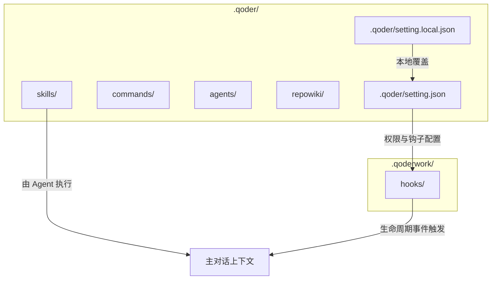
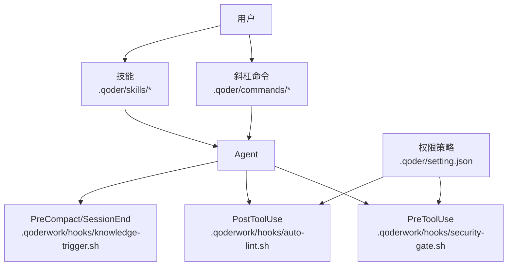
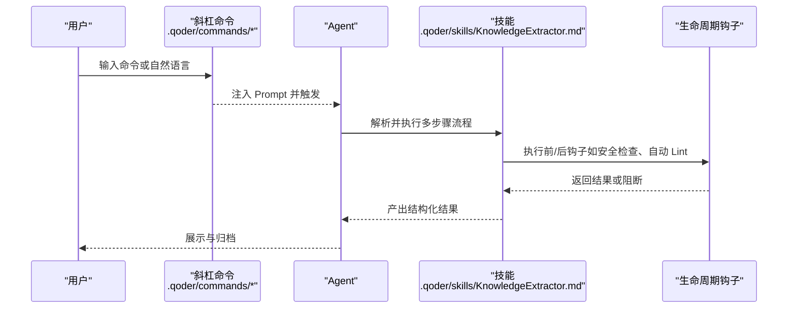
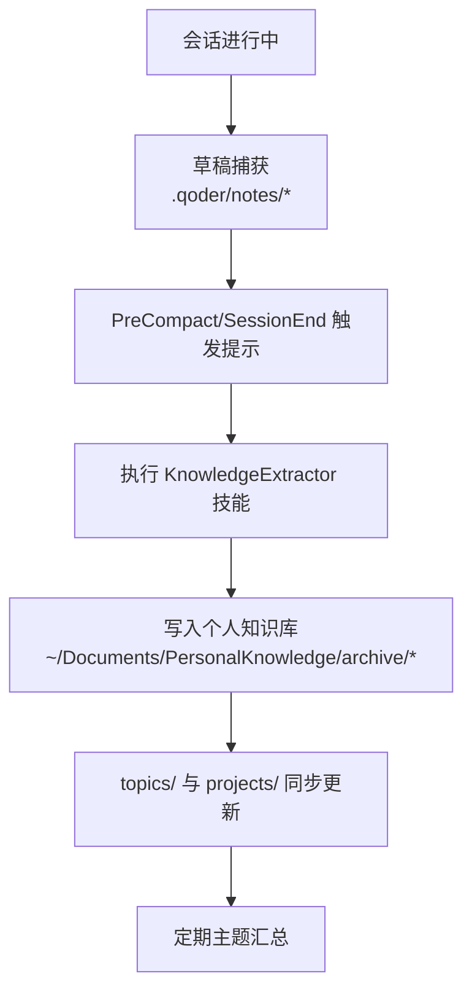
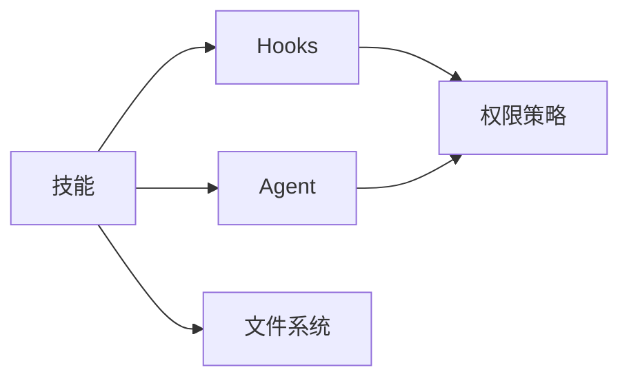

# Skills 目录

<cite>
**本文引用的文件**
- [QoderHarnessEngineering落地示例.md](file://QoderHarnessEngineering落地示例.md)
- [AGENTS.md](file://AGENTS.md)
- [知识材料管理方案.md](file://docs/知识材料管理方案.md)
- [knowledge-trigger.sh](file://.qoderwork/hooks/knowledge-trigger.sh)
- [security-gate.sh](file://.qoderwork/hooks/security-gate.sh)
- [auto-lint.sh](file://.qoderwork/hooks/auto-lint.sh)
</cite>

## 目录
1. [简介](#简介)
2. [项目结构](#项目结构)
3. [核心组件](#核心组件)
4. [架构总览](#架构总览)
5. [详细组件分析](#详细组件分析)
6. [依赖分析](#依赖分析)
7. [性能考虑](#性能考虑)
8. [故障排查指南](#故障排查指南)
9. [结论](#结论)
10. [附录](#附录)

## 简介
本文件面向 Qoder Harness Engineering 项目中的 skills/ 目录，系统化阐述“工作流技能”的开发原理、实现规范与最佳实践。重点覆盖：
- 技能接口与调用机制：如何在主对话中由 Agent 执行多步骤工作流
- 参数传递与结果处理：基于会话上下文与 Hooks 的输入输出约定
- 配置管理：权限策略、生命周期钩子与技能触发
- 复杂工作流组合：如何将多个技能串联形成复合流程
- 实践指南：技能封装、复用策略与性能优化
- 示例：以 KnowledgeExtractor 为例，展示可重用工作流组件的设计思路
- 协作关系：技能与 Agent、Commands、Hooks 的协同

## 项目结构
skills/ 目录位于 .qoder/ 下，用于存放“多步骤专业工作流”定义。本项目已内置一个典型技能：KnowledgeExtractor，用于将会话内容提炼并归档至个人知识库。

图示来源
- [QoderHarnessEngineering落地示例.md:42–67:42-67](file://QoderHarnessEngineering落地示例.md#L42-L67)
- [QoderHarnessEngineering落地示例.md:418–433:418-433](file://QoderHarnessEngineering落地示例.md#L418-L433)

章节来源
- [QoderHarnessEngineering落地示例.md:42–67:42-67](file://QoderHarnessEngineering落地示例.md#L42-L67)
- [QoderHarnessEngineering落地示例.md:418–433:418-433](file://QoderHarnessEngineering落地示例.md#L418-L433)

## 核心组件
- 技能（Skill）：多步骤专业工作流，运行在主对话上下文中，可访问完整会话历史与状态。技能文件为 Markdown，通过命令或自然语言触发。
- Agent：在会话中执行技能的执行主体，具备项目上下文与权限边界。
- Commands：可复用的 Prompt 模板，通过斜杠命令触发，常用于一键执行技能或引导用户输入。
- Hooks：生命周期钩子脚本，提供安全拦截、自动检查、失败记录与通知等横切能力，影响工具调用与技能执行的前置/后置行为。
- 权限策略（Permissions）：定义允许/询问/拒绝的细粒度规则，保障技能执行的安全边界。

章节来源
- [QoderHarnessEngineering落地示例.md:365–371:365-371](file://QoderHarnessEngineering落地示例.md#L365-L371)
- [QoderHarnessEngineering落地示例.md:418–433:418-433](file://QoderHarnessEngineering落地示例.md#L418-L433)
- [QoderHarnessEngineering落地示例.md:123–184:123-184](file://QoderHarnessEngineering落地示例.md#L123-L184)

## 架构总览
技能在 Qoder 工程化体系中的位置与交互如下：

图示来源
- [QoderHarnessEngineering落地示例.md:365–371:365-371](file://QoderHarnessEngineering落地示例.md#L365-L371)
- [QoderHarnessEngineering落地示例.md:255–270:255-270](file://QoderHarnessEngineering落地示例.md#L255-L270)
- [knowledge-trigger.sh:1–40:1-40](file://.qoderwork/hooks/knowledge-trigger.sh#L1-L40)
- [security-gate.sh:1–38:1-38](file://.qoderwork/hooks/security-gate.sh#L1-L38)
- [auto-lint.sh:1–43:1-43](file://.qoderwork/hooks/auto-lint.sh#L1-L43)

## 详细组件分析

### 技能接口与调用机制
- 触发方式
  - 斜杠命令：通过 .qoder/commands/ 下的 Prompt 模板触发，适合高频固定流程。
  - 自然语言：在主对话中直接描述“执行某技能”，由系统识别并调用。
- 执行环境
  - Agent 在主对话上下文中执行技能，可访问完整会话历史，便于进行多轮推理与结果整合。
- 调用序列（以 KnowledgeExtractor 为例）

图示来源
- [QoderHarnessEngineering落地示例.md:388–401:388-401](file://QoderHarnessEngineering落地示例.md#L388-L401)
- [QoderHarnessEngineering落地示例.md:418–425:418-425](file://QoderHarnessEngineering落地示例.md#L418-L425)
- [knowledge-trigger.sh:18–37:18-37](file://.qoderwork/hooks/knowledge-trigger.sh#L18-L37)

章节来源
- [QoderHarnessEngineering落地示例.md:388–401:388-401](file://QoderHarnessEngineering落地示例.md#L388-L401)
- [QoderHarnessEngineering落地示例.md:418–425:418-425](file://QoderHarnessEngineering落地示例.md#L418-L425)

### 参数传递与结果处理
- 会话上下文
  - 技能可读取当前会话的历史消息、工具调用结果与状态，用于驱动下一步动作。
- 输入输出约定
  - 输入：命令 Prompt、会话历史、工具返回值。
  - 输出：结构化结果（如 Markdown 文档）、文件写入、日志记录。
- 结果落盘与同步
  - 以 KnowledgeExtractor 为例，技能将提炼结果写入个人知识库，并同步更新索引与主题目录。

章节来源
- [知识材料管理方案.md:175–215:175-215](file://docs/知识材料管理方案.md#L175-L215)

### 配置管理与权限策略
- 权限策略（Permissions）
  - allow：自动放行；ask：弹窗确认；deny：直接拒绝。
  - deny 优先于 allow/ask，且更具体的规则优先于通配符规则。
- 生命周期钩子（Hooks）
  - PreToolUse：工具执行前拦截高危命令（如 rm -rf、数据库破坏性操作等）。
  - PostToolUse：文件写入/编辑后自动执行 Lint。
  - PostToolUseFailure：工具失败后记录日志。
  - UserPromptSubmit：过滤注入式 Prompt 模式。
  - Stop：任务完成时触发桌面通知。
  - PreCompact/SessionEnd：知识归档提示注入。
- 配置层级
  - 用户级（~/.qoder/settings.json）< 项目级（.qoder/setting.json）< 本地级（.qoder/setting.local.json）

章节来源
- [QoderHarnessEngineering落地示例.md:123–184:123-184](file://QoderHarnessEngineering落地示例.md#L123-L184)
- [QoderHarnessEngineering落地示例.md:255–270:255-270](file://QoderHarnessEngineering落地示例.md#L255-L270)
- [QoderHarnessEngineering落地示例.md:439–497:439-497](file://QoderHarnessEngineering落地示例.md#L439-L497)

### 复杂工作流组合与串联
- 组合策略
  - 将多个技能拆分为原子步骤，通过命令或自然语言编排顺序。
  - 使用知识归档提示（PreCompact/SessionEnd）在合适时机触发后续步骤。
- 示例流程（草稿 → 精炼 → 归档 → 主题汇总）

图示来源
- [知识材料管理方案.md:175–215:175-215](file://docs/知识材料管理方案.md#L175-L215)
- [knowledge-trigger.sh:18–37:18-37](file://.qoderwork/hooks/knowledge-trigger.sh#L18-L37)

章节来源
- [知识材料管理方案.md:175–215:175-215](file://docs/知识材料管理方案.md#L175-L215)
- [knowledge-trigger.sh:18–37:18-37](file://.qoderwork/hooks/knowledge-trigger.sh#L18-L37)

### 技能开发实践指南
- 设计原则
  - 明确输入/输出契约：固定输入来源（会话历史、工具结果），标准化输出格式（Markdown、JSON、文件路径）。
  - 可回滚与可观测：记录中间状态与失败原因，便于重试与审计。
  - 最小权限：遵循 Permissions 策略，避免越权操作。
- 封装与复用
  - 将通用步骤抽象为可配置模块，支持参数化与分支逻辑。
  - 通过命令模板复用常用触发路径，降低用户心智负担。
- 性能优化
  - 减少不必要的文件读写与网络请求；对大文件处理采用流式或分块策略。
  - 合理利用缓存与增量更新，避免重复计算。
- 安全与合规
  - 在 PreToolUse 钩子中拦截高危命令；在 UserPromptSubmit 中过滤注入风险。
  - 对外部网络访问使用白名单策略。

章节来源
- [QoderHarnessEngineering落地示例.md:123–184:123-184](file://QoderHarnessEngineering落地示例.md#L123-L184)
- [QoderHarnessEngineering落地示例.md:255–270:255-270](file://QoderHarnessEngineering落地示例.md#L255-L270)
- [QoderHarnessEngineering落地示例.md:484–497:484-497](file://QoderHarnessEngineering落地示例.md#L484-L497)

### 示例：KnowledgeExtractor 技能
- 目标：将一次会话的关键信息提炼为结构化文档并归档至个人知识库。
- 关键步骤（示意）
  - 1）提取会话目标与背景
  - 2）识别核心决策与方案对比
  - 3）整理约束与后续行动项
  - 4）生成结构化 Markdown
  - 5）写入归档路径并更新索引
- 触发方式
  - 斜杠命令：在 .qoder/commands/ 下定义 Prompt，触发技能执行。
  - 自然语言：在主对话中直接描述“执行 KnowledgeExtractor，归档本次会话”。

章节来源
- [QoderHarnessEngineering落地示例.md:418–425:418-425](file://QoderHarnessEngineering落地示例.md#L418-L425)
- [QoderHarnessEngineering落地示例.md:388–401:388-401](file://QoderHarnessEngineering落地示例.md#L388-L401)
- [知识材料管理方案.md:175–215:175-215](file://docs/知识材料管理方案.md#L175-L215)

### 与 Agent、Commands 的协作关系
- Agent
  - 作为技能执行载体，承载项目上下文与权限边界，负责解析 Prompt、调度工具与处理结果。
- Commands
  - 作为技能入口，提供一键触发与参数注入，简化用户操作。
- Skills
  - 作为业务编排单元，串联工具调用与文件写入，形成闭环工作流。

章节来源
- [QoderHarnessEngineering落地示例.md:365–371:365-371](file://QoderHarnessEngineering落地示例.md#L365-L371)
- [QoderHarnessEngineering落地示例.md:388–401:388-401](file://QoderHarnessEngineering落地示例.md#L388-L401)
- [QoderHarnessEngineering落地示例.md:418–433:418-433](file://QoderHarnessEngineering落地示例.md#L418-L433)

## 依赖分析
- 组件耦合
  - 技能依赖 Agent 的执行环境与会话上下文；依赖 Hooks 提供的安全与质量保障；依赖权限策略确保最小可用权限。
- 外部依赖
  - 工具链：ESLint、ruff/flake8、gofmt、shellcheck 等（由 PostToolUse 钩子调用）。
  - 文件系统：知识库归档路径（~/Documents/PersonalKnowledge/）。
- 潜在环路
  - 技能与钩子之间为单向依赖（钩子影响技能执行，技能不直接调用钩子），避免循环依赖。

图示来源
- [auto-lint.sh:17–40:17-40](file://.qoderwork/hooks/auto-lint.sh#L17-L40)
- [security-gate.sh:15–28:15-28](file://.qoderwork/hooks/security-gate.sh#L15-L28)
- [knowledge-trigger.sh:18–37:18-37](file://.qoderwork/hooks/knowledge-trigger.sh#L18-L37)

章节来源
- [auto-lint.sh:1–43:1-43](file://.qoderwork/hooks/auto-lint.sh#L1-L43)
- [security-gate.sh:1–38:1-38](file://.qoderwork/hooks/security-gate.sh#L1-L38)
- [knowledge-trigger.sh:1–40:1-40](file://.qoderwork/hooks/knowledge-trigger.sh#L1-L40)

## 性能考虑
- I/O 优化
  - 批量写入与延迟刷新，减少频繁 fsync。
  - 对大文件采用流式处理，避免一次性加载至内存。
- 计算优化
  - 利用缓存与增量更新，避免重复解析与格式化。
  - 将昂贵操作（如网络请求）置于必要时才执行。
- 并发与资源
  - 控制并发工具数量，避免资源争用。
  - 对外部服务调用设置超时与重试策略。

## 故障排查指南
- 常见问题
  - 工具执行被阻断：检查 PreToolUse 钩子的危险命令匹配与退出码。
  - 自动 Lint 失败：确认本地工具安装与版本兼容性。
  - 知识归档未触发：确认 PreCompact/SessionEnd 钩子是否注入提示，或通过命令手动触发。
- 排查步骤
  - 检查 .qoderwork/logs 下的日志文件，定位失败原因。
  - 在 AGENTS.md 中核对项目级行为约束，确保操作范围符合规范。
  - 临时关闭 ask/allow/deny 规则验证问题是否由权限策略引起。

章节来源
- [QoderHarnessEngineering落地示例.md:255–270:255-270](file://QoderHarnessEngineering落地示例.md#L255-L270)
- [QoderHarnessEngineering落地示例.md:340–356:340-356](file://QoderHarnessEngineering落地示例.md#L340-L356)
- [knowledge-trigger.sh:13–16:13-16](file://.qoderwork/hooks/knowledge-trigger.sh#L13-L16)

## 结论
skills/ 目录为 Qoder 工程化提供了“可编排、可复用、可审计”的工作流能力。通过与 Agent、Commands、Hooks、权限策略的协同，技能能够在保证安全与可控的前提下，高效完成复杂任务。建议在实践中坚持“最小权限、可观测、可回滚”的原则，并以模块化与参数化提升复用效率。

## 附录
- 快速启动
  - 复制 .qoder/ 与 .qoderwork/ 目录至新项目，按需调整权限与钩子脚本。
  - 在 AGENTS.md 中补充项目上下文与行为约束。
  - 为常用流程创建斜杠命令，降低使用门槛。
- 参考文件
  - 技能与命令的职责划分与触发方式
  - 知识归档流程与路径约定
  - Hooks 事件列表与退出码规范

章节来源
- [QoderHarnessEngineering落地示例.md:503–552:503-552](file://QoderHarnessEngineering落地示例.md#L503-L552)
- [AGENTS.md:1–69:1-69](file://AGENTS.md#L1-L69)
- [知识材料管理方案.md:175–215:175-215](file://docs/知识材料管理方案.md#L175-L215)