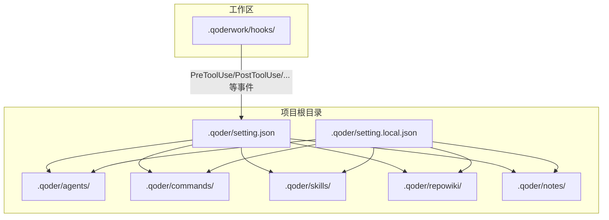
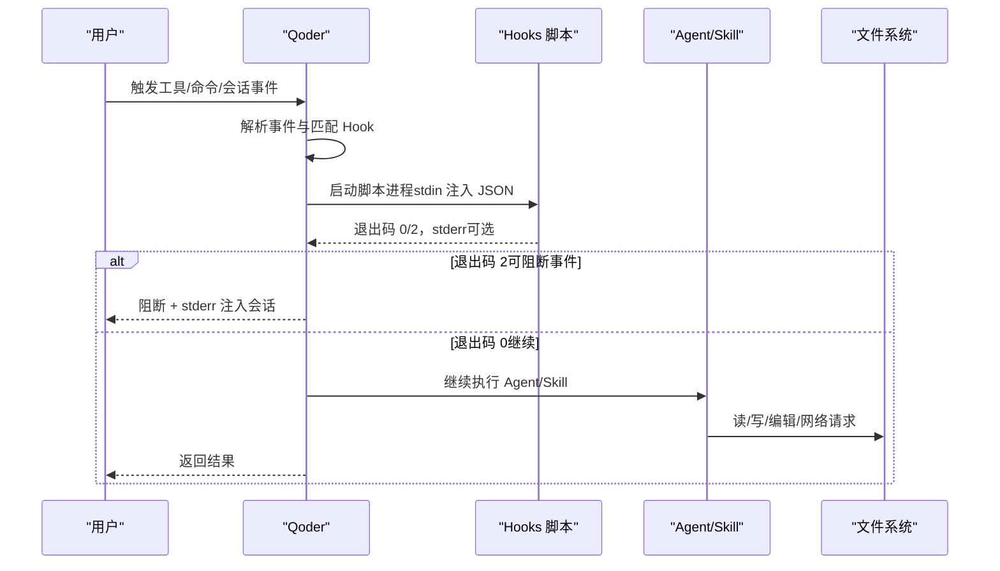
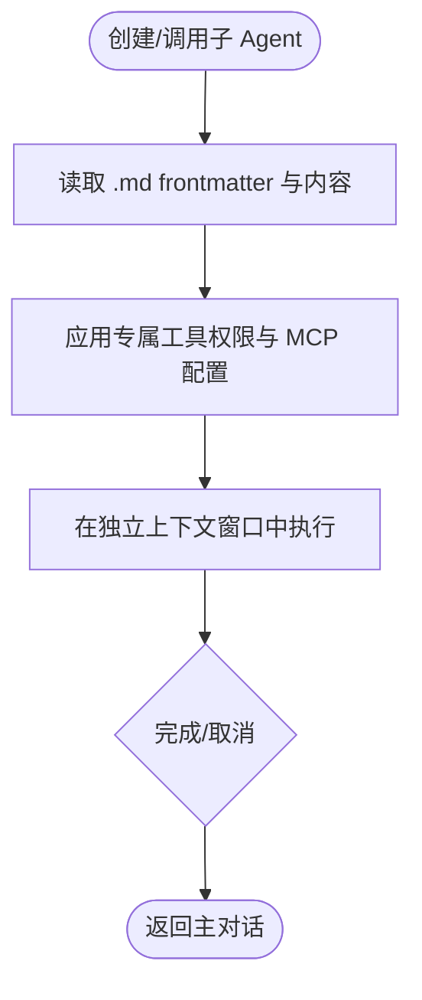
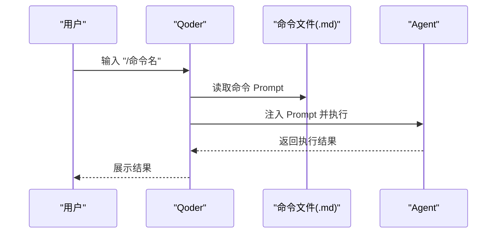
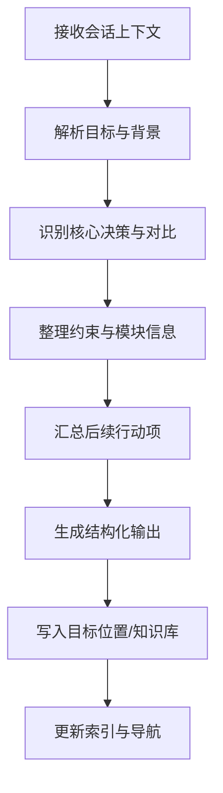
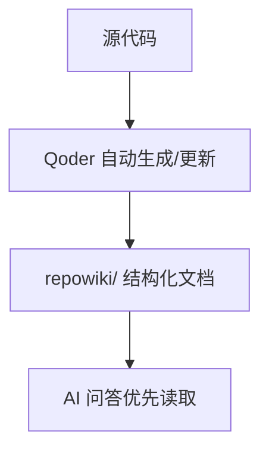
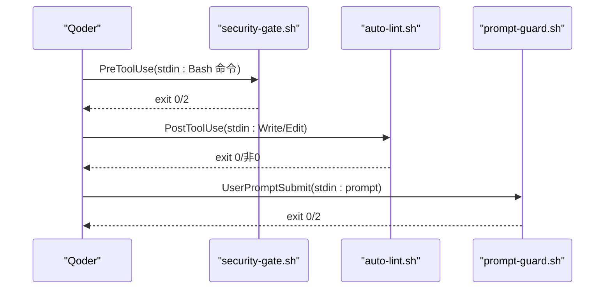
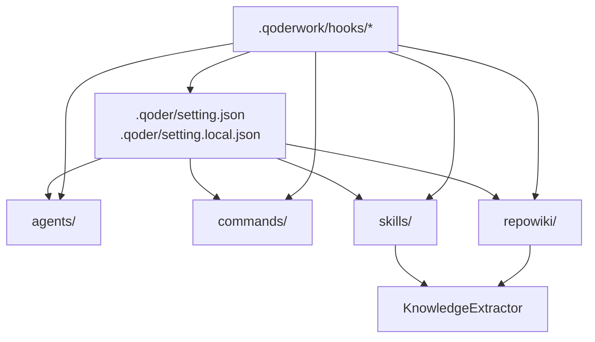

# 扩展目录体系

<cite>
**本文引用的文件**
- [AGENTS.md](file://AGENTS.md)
- [QoderHarnessEngineering落地示例.md](file://QoderHarnessEngineering落地示例.md)
- [Hooks配置操作手册.md](file://docs/Hooks配置操作手册.md)
- [知识材料管理方案.md](file://docs/知识材料管理方案.md)
- [.qoderwork/hooks/prompt-guard.sh](file://.qoderwork/hooks/prompt-guard.sh)
- [.qoderwork/hooks/security-gate.sh](file://.qoderwork/hooks/security-gate.sh)
- [.qoderwork/hooks/auto-lint.sh](file://.qoderwork/hooks/auto-lint.sh)
</cite>

## 目录
1. [简介](#简介)
2. [项目结构](#项目结构)
3. [核心组件](#核心组件)
4. [架构总览](#架构总览)
5. [详细组件分析](#详细组件分析)
6. [依赖关系分析](#依赖关系分析)
7. [性能考量](#性能考量)
8. [故障排查指南](#故障排查指南)
9. [结论](#结论)
10. [附录](#附录)

## 简介
本文件系统化阐述 Qoder Harness Engineering 的扩展目录体系，聚焦 agents/、commands/、skills/、repowiki/ 四大扩展目录的职责、使用方法与开发规范，并提供自定义子 Agent、斜杠命令与工作流技能的开发指南与最佳实践。同时结合 Hooks 生命周期工程，给出安全拦截、自动 Lint、失败记录、提示词注入防护、桌面通知与知识归档触发等实战方案，帮助团队在统一范式下高效落地工程化能力。

## 项目结构
Qoder 在项目根目录下提供三层配置与扩展目录：
- 用户级配置：~/.qoder/settings.json（全局生效）
- 项目级配置：.qoder/setting.json（团队共享）
- 本地级配置：.qoder/setting.local.json（个人覆盖）

扩展目录位于 .qoder/ 下，包含：
- agents/：自定义子 Agent（独立上下文，专属工具权限）
- commands/：自定义斜杠命令（Prompt 模板，主对话执行）
- skills/：自定义工作流 Skill（多步骤专业流程，主对话执行）
- repowiki/：代码库 Wiki（自动生成，AI 优先读取）

图示来源
- [QoderHarnessEngineering落地示例.md:42-67](file://QoderHarnessEngineering落地示例.md#L42-L67)
- [QoderHarnessEngineering落地示例.md:123-184](file://QoderHarnessEngineering落地示例.md#L123-L184)

章节来源
- [QoderHarnessEngineering落地示例.md:42-67](file://QoderHarnessEngineering落地示例.md#L42-L67)
- [QoderHarnessEngineering落地示例.md:123-184](file://QoderHarnessEngineering落地示例.md#L123-L184)

## 核心组件
- agents/：独立上下文的子 Agent，通过 frontmatter 定义名称、描述、工具权限等，适合需要专属工具权限与反复使用的专职角色（如代码审查、测试生成、部署助手等）。
- commands/：斜杠命令 Prompt 模板，无 frontmatter，输入 /命令名 即可在主对话中一键执行，适合高频固定操作。
- skills/：多步骤专业工作流，由 Agent 在主对话中执行，可访问完整会话上下文，如 KnowledgeExtractor。
- repowiki/：由 Qoder 自动生成的代码库结构化文档，AI 在回答代码相关问题时优先读取，显著节省上下文。

章节来源
- [QoderHarnessEngineering落地示例.md:372-433](file://QoderHarnessEngineering落地示例.md#L372-L433)
- [QoderHarnessEngineering落地示例.md:418-425](file://QoderHarnessEngineering落地示例.md#L418-L425)

## 架构总览
扩展目录与 Hooks 的协作关系如下：Qoder 在关键生命周期事件触发外部脚本，脚本通过 stdin 接收上下文 JSON，依据退出码决定是否阻断或继续执行，并可将 stderr 注入会话。扩展目录中的 agents/、commands/、skills/、repowiki/ 与 Hooks 配合，共同构成工程化能力闭环。

图示来源
- [Hooks配置操作手册.md:22-50](file://docs/Hooks配置操作手册.md#L22-L50)
- [Hooks配置操作手册.md:245-262](file://docs/Hooks配置操作手册.md#L245-L262)

章节来源
- [Hooks配置操作手册.md:22-50](file://docs/Hooks配置操作手册.md#L22-L50)
- [Hooks配置操作手册.md:245-262](file://docs/Hooks配置操作手册.md#L245-L262)

## 详细组件分析

### agents/ 自定义子 Agent
- 本质：独立上下文窗口中的专用角色，拥有专属工具权限与 MCP 服务配置。
- 触发方式：/agent名 或自然语言匹配，支持手动创建与 UI 操作。
- frontmatter 字段建议：name、description、tools 等，用于声明能力边界。
- 适用场景：需要专属工具权限、反复使用的专职角色（代码审查、测试生成、部署助手等）。

图示来源
- [QoderHarnessEngineering落地示例.md:372-387](file://QoderHarnessEngineering落地示例.md#L372-L387)

章节来源
- [QoderHarnessEngineering落地示例.md:372-387](file://QoderHarnessEngineering落地示例.md#L372-L387)

### commands/ 自定义斜杠命令
- 本质：Prompt 模板文件，无 frontmatter，在主对话中执行。
- 触发方式：在对话框输入 /命令名。
- 适用场景：高频固定操作（归档会话、生成 PR 描述、安全检查、代码审查标准流程等）。
- 开发建议：命令内容即 Prompt，尽量结构化、可复用；必要时可结合 Skills 与 repowiki 提升效果。

图示来源
- [QoderHarnessEngineering落地示例.md:388-401](file://QoderHarnessEngineering落地示例.md#L388-L401)

章节来源
- [QoderHarnessEngineering落地示例.md:388-401](file://QoderHarnessEngineering落地示例.md#L388-L401)

### skills/ 自定义工作流 Skill
- 本质：多步骤专业工作流，由 Agent 在主对话中执行，可访问完整会话上下文。
- 示例：KnowledgeExtractor，7 步提炼流程，归档会话内容到个人知识库。
- 适用场景：需要跨步骤、跨工具、可复用的专业流程（如知识归档、代码生成、评审流程等）。

图示来源
- [QoderHarnessEngineering落地示例.md:418-425](file://QoderHarnessEngineering落地示例.md#L418-L425)
- [知识材料管理方案.md:175-215](file://docs/知识材料管理方案.md#L175-L215)

章节来源
- [QoderHarnessEngineering落地示例.md:418-425](file://QoderHarnessEngineering落地示例.md#L418-L425)
- [知识材料管理方案.md:175-215](file://docs/知识材料管理方案.md#L175-L215)

### repowiki/ 代码库 Wiki（自动生成）
- 本质：由 Qoder 自动分析代码库生成的结构化文档，AI 在回答代码相关问题时优先读取。
- IDE 操作：侧边栏 Wiki 图标，首次 Generate、代码变更后 Update、手动编辑后 Synchronize。
- 注意：repowiki/meta 由系统自动管理，严禁手动编辑。

图示来源
- [QoderHarnessEngineering落地示例.md:402-417](file://QoderHarnessEngineering落地示例.md#L402-L417)

章节来源
- [QoderHarnessEngineering落地示例.md:402-417](file://QoderHarnessEngineering落地示例.md#L402-L417)

### Hooks 生命周期工程与扩展联动
- 事件类型：PreToolUse、PostToolUse、PostToolUseFailure、UserPromptSubmit、Stop、SessionStart、SessionEnd、SubagentStart、SubagentStop、PreCompact、Notification。
- 退出码规范：0 放行；2 阻断（仅可阻断事件）；其他非阻断性错误。
- 实战脚本：security-gate.sh（PreToolUse 拦截高危命令）、auto-lint.sh（PostToolUse 自动 Lint）、prompt-guard.sh（UserPromptSubmit 注入防护）。

图示来源
- [Hooks配置操作手册.md:84-101](file://docs/Hooks配置操作手册.md#L84-L101)
- [Hooks配置操作手册.md:245-262](file://docs/Hooks配置操作手册.md#L245-L262)
- [.qoderwork/hooks/security-gate.sh:1-38](file://.qoderwork/hooks/security-gate.sh#L1-L38)
- [.qoderwork/hooks/auto-lint.sh:1-43](file://.qoderwork/hooks/auto-lint.sh#L1-L43)
- [.qoderwork/hooks/prompt-guard.sh:1-55](file://.qoderwork/hooks/prompt-guard.sh#L1-L55)

章节来源
- [Hooks配置操作手册.md:84-101](file://docs/Hooks配置操作手册.md#L84-L101)
- [Hooks配置操作手册.md:245-262](file://docs/Hooks配置操作手册.md#L245-L262)
- [.qoderwork/hooks/security-gate.sh:1-38](file://.qoderwork/hooks/security-gate.sh#L1-L38)
- [.qoderwork/hooks/auto-lint.sh:1-43](file://.qoderwork/hooks/auto-lint.sh#L1-L43)
- [.qoderwork/hooks/prompt-guard.sh:1-55](file://.qoderwork/hooks/prompt-guard.sh#L1-L55)

## 依赖关系分析
- agents/、commands/、skills/、repowiki/ 与 .qoder/setting.json/setting.local.json 共同决定扩展能力与权限边界。
- Hooks 脚本通过 stdin 获取事件上下文，依据退出码影响后续执行流。
- repowiki/ 与 skills/（如 KnowledgeExtractor）协同，支撑知识归档与检索。

图示来源
- [QoderHarnessEngineering落地示例.md:123-184](file://QoderHarnessEngineering落地示例.md#L123-L184)
- [QoderHarnessEngineering落地示例.md:418-425](file://QoderHarnessEngineering落地示例.md#L418-L425)

章节来源
- [QoderHarnessEngineering落地示例.md:123-184](file://QoderHarnessEngineering落地示例.md#L123-L184)
- [QoderHarnessEngineering落地示例.md:418-425](file://QoderHarnessEngineering落地示例.md#L418-L425)

## 性能考量
- repowiki/ 自动生成显著减少上下文扫描成本，建议在大型代码库中启用并定期更新。
- skills/ 将多步骤流程封装为可复用工作流，避免重复计算与上下文冗余。
- Hooks 脚本应保持轻量与快速，避免长时间阻塞；必要时设置合理的 timeout。
- commands/ 作为 Prompt 模板，应尽量简洁明确，减少不必要的上下文注入。

## 故障排查指南
- 脚本不执行：检查执行权限与 setting.json 中事件名拼写；确认 command 路径相对项目根目录正确。
- exit 2 未阻断：确认事件是否支持阻断（PreToolUse、UserPromptSubmit、Stop、SubagentStop）。
- stderr 未注入会话：确认使用 exit 2 且内容写入 stderr。
- 脚本超时：适当降低 timeout；或拆分长任务为多步 Hook。
- 多个 Hook 命中：按顺序串行执行，任一 exit 2 可阻断（对可阻断事件）。

章节来源
- [Hooks配置操作手册.md:572-626](file://docs/Hooks配置操作手册.md#L572-L626)

## 结论
通过 agents/、commands/、skills/、repowiki/ 与 Hooks 的协同，Qoder Harness Engineering 提供了可扩展、可工程化的智能体工作范式。团队可在统一配置与权限策略下，快速构建安全、高效、可复用的扩展能力，持续提升研发效率与知识沉淀质量。

## 附录

### 扩展开发最佳实践
- 权限最小化：遵循 allow/ask/deny 三层策略，deny 优先于 allow。
- 命令与 Prompt 结构化：commands/ 与 skills/ 的 Prompt 应清晰、可复用、可维护。
- 独立上下文与主对话分离：agents/ 用于专属角色，skills/ 用于多步骤流程，避免混用。
- Hooks 轻量化：PreToolUse/PostToolUse 脚本应快速返回，避免阻塞会话。
- 知识归档闭环：利用 repowiki/ 与 KnowledgeExtractor，形成“草稿→精炼→归档”的知识管理闭环。

章节来源
- [QoderHarnessEngineering落地示例.md:224-251](file://QoderHarnessEngineering落地示例.md#L224-L251)
- [知识材料管理方案.md:51-78](file://docs/知识材料管理方案.md#L51-L78)

### 自定义子 Agent 开发指南
- 文件格式：.md，frontmatter 定义 name、description、tools 等。
- 行为约束：结合 AGENTS.md 与 setting.json 的 allow/ask/deny 策略。
- 集成方式：/agent名 或自然语言匹配触发；支持手动创建与 UI 操作。

章节来源
- [QoderHarnessEngineering落地示例.md:372-387](file://QoderHarnessEngineering落地示例.md#L372-L387)
- [AGENTS.md:16-32](file://AGENTS.md#L16-L32)

### 自定义斜杠命令实现与注册
- 文件格式：.md，内容即 Prompt，无 frontmatter。
- 注册方式：在设置界面或通过 /create-agent 等 UI 操作创建；触发方式为 /命令名。
- 与 Skills/repowiki 协作：复杂流程可委托 Skills；涉及代码库理解时可借助 repowiki。

章节来源
- [QoderHarnessEngineering落地示例.md:388-401](file://QoderHarnessEngineering落地示例.md#L388-L401)

### 工作流技能开发规范与调用机制
- 文件格式：.md，定义多步骤流程，由 Agent 在主对话中执行。
- 调用机制：/skill名 或自然语言触发；可访问完整会话上下文。
- 示例：KnowledgeExtractor，7 步提炼流程，归档到个人知识库。

章节来源
- [QoderHarnessEngineering落地示例.md:418-425](file://QoderHarnessEngineering落地示例.md#L418-L425)
- [知识材料管理方案.md:175-215](file://docs/知识材料管理方案.md#L175-L215)

### 扩展配置方案示例
- Prompt 注入防护：UserPromptSubmit 中挂载 prompt-guard.sh。
- 任务完成通知：Stop 中挂载 notify-done.sh。
- 子 Agent 审计日志：SubagentStop 中挂载 audit-subagent.sh。
- 精细化 WebFetch 白名单：deny * 与 allow 指定域名组合实现。

章节来源
- [QoderHarnessEngineering落地示例.md:437-497](file://QoderHarnessEngineering落地示例.md#L437-L497)
- [Hooks配置操作手册.md:305-347](file://docs/Hooks配置操作手册.md#L305-L347)