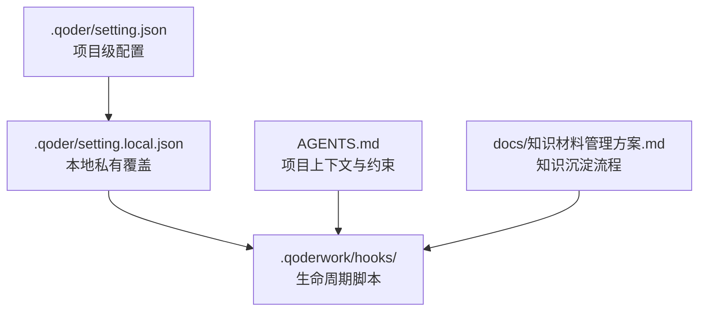
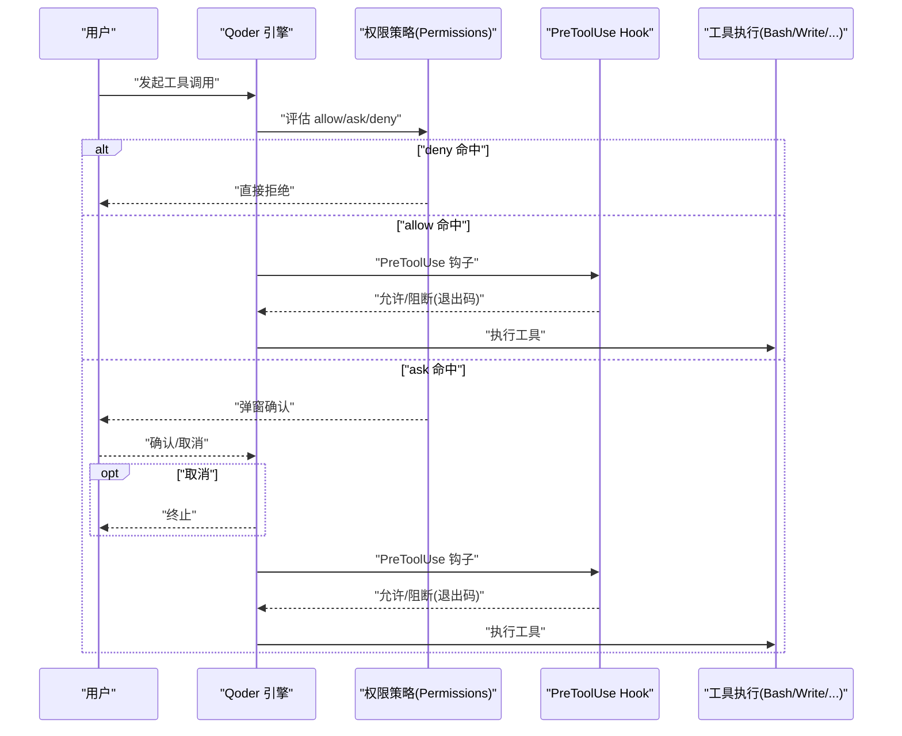
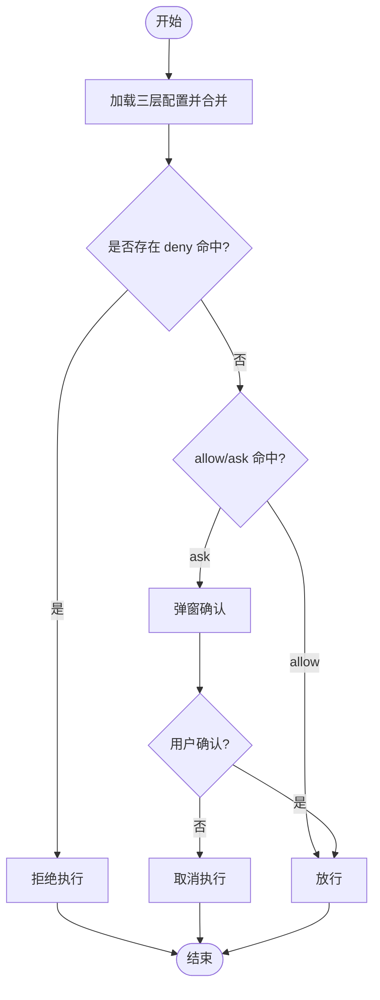
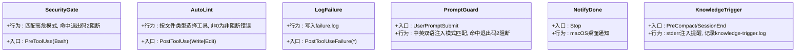
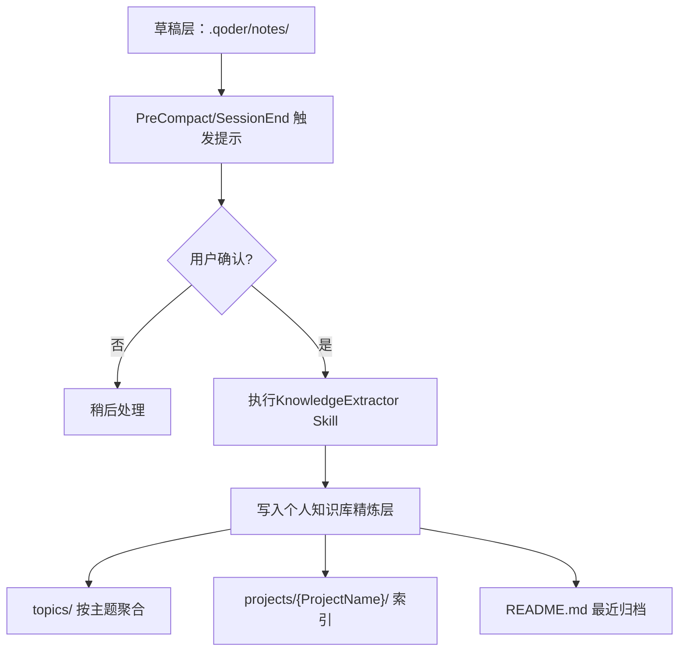
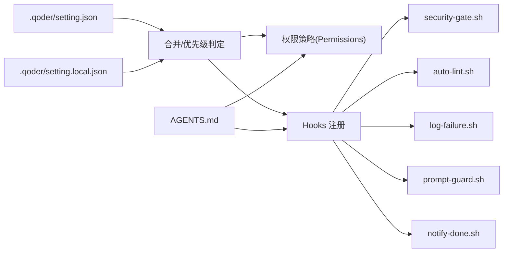
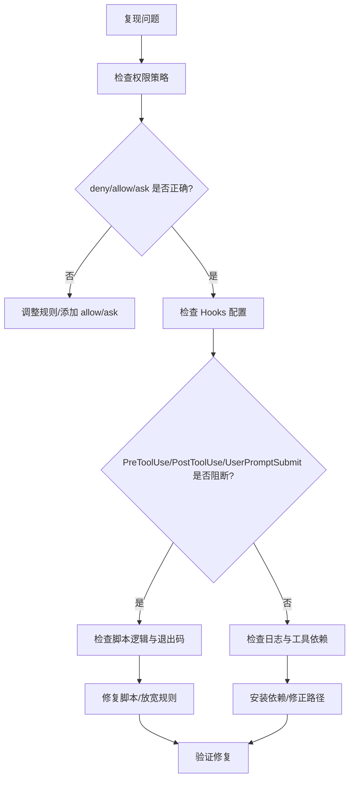

# 故障排除和调试

<cite>
**本文引用的文件**
- [QoderHarnessEngineering落地示例.md](file://QoderHarnessEngineering落地示例.md)
- [AGENTS.md](file://AGENTS.md)
- [.qoderwork/hooks/security-gate.sh](file://.qoderwork/hooks/security-gate.sh)
- [.qoderwork/hooks/auto-lint.sh](file://.qoderwork/hooks/auto-lint.sh)
- [.qoderwork/hooks/log-failure.sh](file://.qoderwork/hooks/log-failure.sh)
- [.qoderwork/hooks/prompt-guard.sh](file://.qoderwork/hooks/prompt-guard.sh)
- [.qoderwork/hooks/notify-done.sh](file://.qoderwork/hooks/notify-done.sh)
- [知识材料管理方案.md](file://docs/知识材料管理方案.md)
</cite>

## 目录
1. [简介](#简介)
2. [项目结构](#项目结构)
3. [核心组件](#核心组件)
4. [架构总览](#架构总览)
5. [详细组件分析](#详细组件分析)
6. [依赖关系分析](#依赖关系分析)
7. [性能考虑](#性能考虑)
8. [故障排除指南](#故障排除指南)
9. [结论](#结论)
10. [附录](#附录)

## 简介
本指南面向 Qoder Harness Engineering 的使用者与维护者，提供系统化的故障排除与调试方法，覆盖配置错误、权限问题、Hooks 脚本异常、日志分析、错误追踪与性能优化等。读者可据此快速定位问题根因并采取修复措施，提升日常开发效率与安全性。

## 项目结构
本项目采用“三层配置 + 生命周期 Hooks”的工程化范式，关键目录与文件如下：
- .qoder/setting.json：项目级配置（共享）
- .qoder/setting.local.json：本地私有覆盖（不提交）
- .qoderwork/hooks/：生命周期脚本集合
- AGENTS.md：项目级 Agent 行为约束与上下文
- docs/知识材料管理方案.md：知识沉淀与归档流程

图表来源
- [QoderHarnessEngineering落地示例.md:42-67](file://QoderHarnessEngineering落地示例.md#L42-L67)
- [QoderHarnessEngineering落地示例.md:123-184](file://QoderHarnessEngineering落地示例.md#L123-L184)
- [AGENTS.md:1-69](file://AGENTS.md#L1-L69)
- [知识材料管理方案.md:120-160](file://docs/知识材料管理方案.md#L120-L160)

章节来源
- [QoderHarnessEngineering落地示例.md:42-67](file://QoderHarnessEngineering落地示例.md#L42-L67)
- [QoderHarnessEngineering落地示例.md:123-184](file://QoderHarnessEngineering落地示例.md#L123-L184)
- [AGENTS.md:1-69](file://AGENTS.md#L1-L69)
- [知识材料管理方案.md:120-160](file://docs/知识材料管理方案.md#L120-L160)

## 核心组件
- 配置系统（三层合并）：用户级、项目级、本地级，deny 优先于 allow，本地级覆盖项目级，项目级覆盖用户级。
- 权限策略（Permissions）：Bash、Read、Edit、WebFetch 等规则，支持通配与取反。
- 生命周期 Hooks：PreToolUse、PostToolUse、PostToolUseFailure、UserPromptSubmit、Stop、SessionStart/End、PreCompact、SubagentStart/Stop 等。
- Agent 行为约束：AGENTS.md 提供项目级上下文与行为边界。
- 知识沉淀：草稿层（.qoder/notes/）与精炼层（个人知识库）双层结构。

章节来源
- [QoderHarnessEngineering落地示例.md:23-39](file://QoderHarnessEngineering落地示例.md#L23-L39)
- [QoderHarnessEngineering落地示例.md:224-251](file://QoderHarnessEngineering落地示例.md#L224-L251)
- [QoderHarnessEngineering落地示例.md:253-270](file://QoderHarnessEngineering落地示例.md#L253-L270)
- [AGENTS.md:16-31](file://AGENTS.md#L16-L31)
- [知识材料管理方案.md:51-78](file://docs/知识材料管理方案.md#L51-L78)

## 架构总览
下图展示一次典型工具调用在权限与 Hooks 管线中的流转：

图表来源
- [QoderHarnessEngineering落地示例.md:224-251](file://QoderHarnessEngineering落地示例.md#L224-L251)
- [QoderHarnessEngineering落地示例.md:253-270](file://QoderHarnessEngineering落地示例.md#L253-L270)
- [QoderHarnessEngineering落地示例.md:123-184](file://QoderHarnessEngineering落地示例.md#L123-L184)

## 详细组件分析

### 权限策略（Permissions）
- 规则类型：Bash、Read、Edit、WebFetch；支持通配与取反。
- 优先级：deny > allow > ask；更具体规则优先于通配；本地级覆盖项目级，项目级覆盖用户级。
- 常见问题：deny 误伤、ask 过度弹窗、通配粒度过粗导致风险暴露。

图表来源
- [QoderHarnessEngineering落地示例.md:23-39](file://QoderHarnessEngineering落地示例.md#L23-L39)
- [QoderHarnessEngineering落地示例.md:224-251](file://QoderHarnessEngineering落地示例.md#L224-L251)

章节来源
- [QoderHarnessEngineering落地示例.md:224-251](file://QoderHarnessEngineering落地示例.md#L224-L251)
- [QoderHarnessEngineering落地示例.md:23-39](file://QoderHarnessEngineering落地示例.md#L23-L39)

### Hooks 生命周期工程
- 事件与可阻断性：PreToolUse、UserPromptSubmit、Stop 可阻断；其余事件不可阻断。
- 退出码语义：0 允许继续；2 阻断（stderr 注入会话）；其他非阻断性错误。
- 六个内置脚本职责与行为：
  - security-gate.sh：PreToolUse 拦截高危 Bash 模式，命中 exit 2 阻断。
  - auto-lint.sh：PostToolUse 对写入/编辑文件自动执行 Lint，非 0 作为非阻断性错误。
  - log-failure.sh：PostToolUseFailure 追加失败记录至 .qoderwork/logs/failure.log。
  - prompt-guard.sh：UserPromptSubmit 阻断注入式 Prompt，命中 exit 2 阻断。
  - notify-done.sh：Stop 发送桌面通知（macOS）。
  - knowledge-trigger.sh：PreCompact/SessionEnd 注入知识归档提醒（配合 KnowledgeExtractor Skill）。

图表来源
- [QoderHarnessEngineering落地示例.md:271-278](file://QoderHarnessEngineering落地示例.md#L271-L278)
- [QoderHarnessEngineering落地示例.md:279-337](file://QoderHarnessEngineering落地示例.md#L279-L337)
- [.qoderwork/hooks/security-gate.sh:1-38](file://.qoderwork/hooks/security-gate.sh#L1-L38)
- [.qoderwork/hooks/auto-lint.sh:1-43](file://.qoderwork/hooks/auto-lint.sh#L1-L43)
- [.qoderwork/hooks/log-failure.sh:1-20](file://.qoderwork/hooks/log-failure.sh#L1-L20)
- [.qoderwork/hooks/prompt-guard.sh:1-55](file://.qoderwork/hooks/prompt-guard.sh#L1-L55)
- [.qoderwork/hooks/notify-done.sh:1-16](file://.qoderwork/hooks/notify-done.sh#L1-L16)

章节来源
- [QoderHarnessEngineering落地示例.md:253-270](file://QoderHarnessEngineering落地示例.md#L253-L270)
- [QoderHarnessEngineering落地示例.md:279-337](file://QoderHarnessEngineering落地示例.md#L279-L337)
- [.qoderwork/hooks/security-gate.sh:1-38](file://.qoderwork/hooks/security-gate.sh#L1-L38)
- [.qoderwork/hooks/auto-lint.sh:1-43](file://.qoderwork/hooks/auto-lint.sh#L1-L43)
- [.qoderwork/hooks/log-failure.sh:1-20](file://.qoderwork/hooks/log-failure.sh#L1-L20)
- [.qoderwork/hooks/prompt-guard.sh:1-55](file://.qoderwork/hooks/prompt-guard.sh#L1-L55)
- [.qoderwork/hooks/notify-done.sh:1-16](file://.qoderwork/hooks/notify-done.sh#L1-L16)

### Agent 行为约束（AGENTS.md）
- 作用：为每次会话提供项目级上下文与行为边界，约束代码安全、Git 操作与文件范围。
- 建议：结合项目实际技术栈与规范，持续完善 AGENTS.md 内容。

章节来源
- [AGENTS.md:16-31](file://AGENTS.md#L16-L31)
- [QoderHarnessEngineering落地示例.md:340-356](file://QoderHarnessEngineering落地示例.md#L340-L356)

### 知识沉淀与归档（双层结构）
- 草稿层：.qoder/notes/，随会话产生，不提交 Git，零摩擦记录。
- 精炼层：个人知识库，经 KnowledgeExtractor Skill 提炼后统一归档，支持按时间、主题、项目聚合。
- 触发机制：PreCompact/SessionEnd Hook 自动提示，或用户手动触发。

图表来源
- [知识材料管理方案.md:166-215](file://docs/知识材料管理方案.md#L166-L215)
- [QoderHarnessEngineering落地示例.md:332-337](file://QoderHarnessEngineering落地示例.md#L332-L337)

章节来源
- [知识材料管理方案.md:51-78](file://docs/知识材料管理方案.md#L51-L78)
- [知识材料管理方案.md:166-215](file://docs/知识材料管理方案.md#L166-L215)
- [QoderHarnessEngineering落地示例.md:332-337](file://QoderHarnessEngineering落地示例.md#L332-L337)

## 依赖关系分析
- 配置依赖：setting.json 与 setting.local.json 合并后驱动权限策略与 Hooks 注册。
- 脚本依赖：Hooks 脚本通过 .qoderwork/hooks/ 目录加载，依赖 jq、npx、ruff/flake8、gofmt、shellcheck 等外部工具。
- Agent 依赖：AGENTS.md 为每次会话提供上下文，影响工具调用与提示词注入防护效果。

图表来源
- [QoderHarnessEngineering落地示例.md:23-39](file://QoderHarnessEngineering落地示例.md#L23-L39)
- [QoderHarnessEngineering落地示例.md:123-184](file://QoderHarnessEngineering落地示例.md#L123-L184)
- [AGENTS.md:1-69](file://AGENTS.md#L1-L69)

章节来源
- [QoderHarnessEngineering落地示例.md:23-39](file://QoderHarnessEngineering落地示例.md#L23-L39)
- [QoderHarnessEngineering落地示例.md:123-184](file://QoderHarnessEngineering落地示例.md#L123-L184)
- [AGENTS.md:1-69](file://AGENTS.md#L1-L69)

## 性能考虑
- Hooks 执行超时：setting.json 中为部分 Hooks 配置了超时（如 security-gate 10s、auto-lint 30s），避免长时间阻塞。
- Lint 工具选择：按文件类型选择轻量工具（如 gofmt、shellcheck），减少开销；ESLint 通过 npx 调用可能带来冷启动成本。
- 日志落盘：log-failure.sh 与知识归档日志写入磁盘，建议定期轮转与清理，避免日志膨胀。
- WebFetch 白名单：通过 deny(*) + allow(域名白名单) 实现最小暴露面，降低网络请求延迟与风险。

章节来源
- [QoderHarnessEngineering落地示例.md:157-182](file://QoderHarnessEngineering落地示例.md#L157-L182)
- [QoderHarnessEngineering落地示例.md:484-497](file://QoderHarnessEngineering落地示例.md#L484-L497)
- [.qoderwork/hooks/auto-lint.sh:18-40](file://.qoderwork/hooks/auto-lint.sh#L18-L40)
- [.qoderwork/hooks/log-failure.sh:7-17](file://.qoderwork/hooks/log-failure.sh#L7-L17)

## 故障排除指南

### 一、配置错误
- 症状
  - deny 误伤：常用命令被拒绝
  - ask 过度弹窗：频繁确认导致效率下降
  - 通配粒度过粗：潜在风险未被拦截
- 诊断步骤
  1) 确认三层配置合并顺序与优先级
     - 参考：[QoderHarnessEngineering落地示例.md:23-39](file://QoderHarnessEngineering落地示例.md#L23-L39)
  2) 检查 setting.json 与 setting.local.json 的 allow/ask/deny 规则
     - 参考：[QoderHarnessEngineering落地示例.md:123-184](file://QoderHarnessEngineering落地示例.md#L123-L184)
  3) 使用 AGENTS.md 明确项目约束，避免越界
     - 参考：[AGENTS.md:16-31](file://AGENTS.md#L16-L31)
- 解决方案
  - 将高危命令放入 deny；将常规命令放入 allow；对写操作与敏感路径使用 ask
  - 使用更具体的规则替代通配，减少误伤
  - 本地覆盖仅用于个人例外，避免影响团队

章节来源
- [QoderHarnessEngineering落地示例.md:23-39](file://QoderHarnessEngineering落地示例.md#L23-L39)
- [QoderHarnessEngineering落地示例.md:123-184](file://QoderHarnessEngineering落地示例.md#L123-L184)
- [AGENTS.md:16-31](file://AGENTS.md#L16-L31)

### 二、权限问题
- 症状
  - Bash 命令报错“未找到”或“权限不足”
  - WebFetch 请求被拒绝
- 诊断步骤
  1) 检查 Bash 规则是否匹配（前缀/通配）
     - 参考：[QoderHarnessEngineering落地示例.md:224-251](file://QoderHarnessEngineering落地示例.md#L224-L251)
  2) 检查 WebFetch 白名单配置
     - 参考：[QoderHarnessEngineering落地示例.md:484-497](file://QoderHarnessEngineering落地示例.md#L484-L497)
  3) 确认 deny 优先级是否覆盖 allow
     - 参考：[QoderHarnessEngineering落地示例.md:244-249](file://QoderHarnessEngineering落地示例.md#L244-L249)
- 解决方案
  - 为必要命令添加 allow；为危险命令添加 deny
  - 使用 deny(*) + allow(域名白名单) 控制网络访问

章节来源
- [QoderHarnessEngineering落地示例.md:224-251](file://QoderHarnessEngineering落地示例.md#L224-L251)
- [QoderHarnessEngineering落地示例.md:484-497](file://QoderHarnessEngineering落地示例.md#L484-L497)
- [QoderHarnessEngineering落地示例.md:244-249](file://QoderHarnessEngineering落地示例.md#L244-L249)

### 三、Hooks 脚本异常
- 症状
  - PreToolUse 阻断导致命令无法执行
  - PostToolUse 后 Lint 未执行或报错
  - PostToolUseFailure 未记录失败
  - UserPromptSubmit 被误拦截
  - Stop 未触发通知
- 诊断步骤
  1) 检查脚本退出码与 stderr 输出
     - 参考：[QoderHarnessEngineering落地示例.md:271-278](file://QoderHarnessEngineering落地示例.md#L271-L278)
  2) 确认脚本路径与权限
     - 参考：[QoderHarnessEngineering落地示例.md:543-547](file://QoderHarnessEngineering落地示例.md#L543-L547)
  3) 验证 jq、npx、ruff/flake8、gofmt、shellcheck 等依赖是否可用
     - 参考：[.qoderwork/hooks/auto-lint.sh:18-40](file://.qoderwork/hooks/auto-lint.sh#L18-L40)
- 解决方案
  - security-gate.sh：仅拦截明确高危模式，避免误伤
  - auto-lint.sh：为缺失工具设置兜底或禁用对应类型
  - log-failure.sh：确认 .qoderwork/logs/ 目录存在且可写
  - prompt-guard.sh：根据实际提示词场景调整正则
  - notify-done.sh：确认 macOS 环境与 osascript 可用

章节来源
- [QoderHarnessEngineering落地示例.md:271-278](file://QoderHarnessEngineering落地示例.md#L271-L278)
- [QoderHarnessEngineering落地示例.md:543-547](file://QoderHarnessEngineering落地示例.md#L543-L547)
- [.qoderwork/hooks/security-gate.sh:15-35](file://.qoderwork/hooks/security-gate.sh#L15-L35)
- [.qoderwork/hooks/auto-lint.sh:18-40](file://.qoderwork/hooks/auto-lint.sh#L18-L40)
- [.qoderwork/hooks/log-failure.sh:7-17](file://.qoderwork/hooks/log-failure.sh#L7-L17)
- [.qoderwork/hooks/prompt-guard.sh:14-52](file://.qoderwork/hooks/prompt-guard.sh#L14-L52)
- [.qoderwork/hooks/notify-done.sh:10-13](file://.qoderwork/hooks/notify-done.sh#L10-L13)

### 四、日志分析与错误追踪
- 关键日志位置
  - 失败日志：.qoderwork/logs/failure.log
  - 知识归档提醒：.qoderwork/logs/knowledge-trigger.log
- 分析方法
  - 使用 tail -f 实时观察失败日志
    - 参考：[QoderHarnessEngineering落地示例.md:307-312](file://QoderHarnessEngineering落地示例.md#L307-L312)
  - grep 搜索关键字定位问题
    - 参考：[知识材料管理方案.md:329-340](file://docs/知识材料管理方案.md#L329-L340)
- 建议
  - 定期轮转日志，避免磁盘占用过大
  - 将关键错误写入失败日志，便于后续审计

章节来源
- [QoderHarnessEngineering落地示例.md:307-312](file://QoderHarnessEngineering落地示例.md#L307-L312)
- [知识材料管理方案.md:329-340](file://docs/知识材料管理方案.md#L329-L340)

### 五、性能监控与优化
- 监控点
  - Hooks 执行耗时：关注 security-gate 与 auto-lint 的 timeout 配置
    - 参考：[QoderHarnessEngineering落地示例.md:157-182](file://QoderHarnessEngineering落地示例.md#L157-L182)
  - Lint 工具冷启动：npx 可能带来额外开销
    - 参考：[.qoderwork/hooks/auto-lint.sh:18-21](file://.qoderwork/hooks/auto-lint.sh#L18-L21)
  - 网络请求：WebFetch 白名单减少不必要的请求
    - 参考：[QoderHarnessEngineering落地示例.md:484-497](file://QoderHarnessEngineering落地示例.md#L484-L497)
- 优化建议
  - 为常用工具安装本地可执行，减少 npx 调用
  - 合理设置 ask 规则，平衡安全与效率
  - 使用 deny(*) + allow(域名白名单) 控制网络访问

章节来源
- [QoderHarnessEngineering落地示例.md:157-182](file://QoderHarnessEngineering落地示例.md#L157-L182)
- [.qoderwork/hooks/auto-lint.sh:18-21](file://.qoderwork/hooks/auto-lint.sh#L18-L21)
- [QoderHarnessEngineering落地示例.md:484-497](file://QoderHarnessEngineering落地示例.md#L484-L497)

### 六、系统性排查流程

图表来源
- [QoderHarnessEngineering落地示例.md:224-251](file://QoderHarnessEngineering落地示例.md#L224-L251)
- [QoderHarnessEngineering落地示例.md:253-270](file://QoderHarnessEngineering落地示例.md#L253-L270)
- [QoderHarnessEngineering落地示例.md:307-312](file://QoderHarnessEngineering落地示例.md#L307-L312)

章节来源
- [QoderHarnessEngineering落地示例.md:224-251](file://QoderHarnessEngineering落地示例.md#L224-L251)
- [QoderHarnessEngineering落地示例.md:253-270](file://QoderHarnessEngineering落地示例.md#L253-L270)
- [QoderHarnessEngineering落地示例.md:307-312](file://QoderHarnessEngineering落地示例.md#L307-L312)

## 结论
通过三层配置合并、严格的权限策略与完善的 Hooks 生命周期，Qoder Harness Engineering 能够在保障安全的同时提升开发效率。遇到问题时，建议遵循“配置优先、脚本次之、日志辅助”的排查思路，结合性能优化手段，持续改进工程化实践。

## 附录

### 常用操作参考
- 赋予脚本执行权限
  - 参考：[QoderHarnessEngineering落地示例.md:543-547](file://QoderHarnessEngineering落地示例.md#L543-L547)
- 验证 ask 规则生效
  - 参考：[QoderHarnessEngineering落地示例.md:549-552](file://QoderHarnessEngineering落地示例.md#L549-L552)
- 查看知识库与搜索
  - 参考：[知识材料管理方案.md:329-340](file://docs/知识材料管理方案.md#L329-L340)

### 社区支持与问题报告
- 问题反馈渠道
  - 通过项目内知识沉淀与归档流程，将问题与解决方案沉淀为可复用的知识资产
  - 参考：[知识材料管理方案.md:51-78](file://docs/知识材料管理方案.md#L51-L78)
- 问题报告建议
  - 附带：环境信息、配置片段路径、日志片段、复现步骤与期望结果
  - 使用 .qoderwork/logs/failure.log 与知识归档记录作为证据

章节来源
- [QoderHarnessEngineering落地示例.md:543-552](file://QoderHarnessEngineering落地示例.md#L543-L552)
- [知识材料管理方案.md:51-78](file://docs/知识材料管理方案.md#L51-L78)
- [知识材料管理方案.md:329-340](file://docs/知识材料管理方案.md#L329-L340)