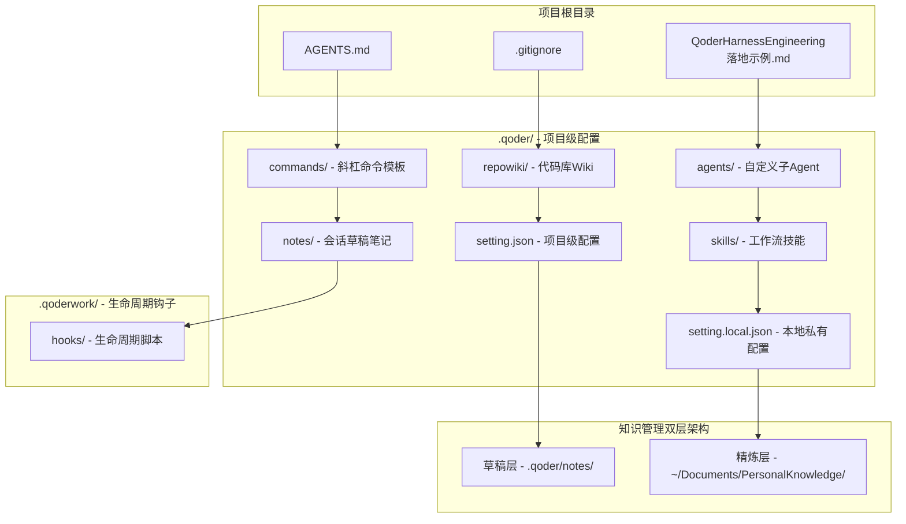
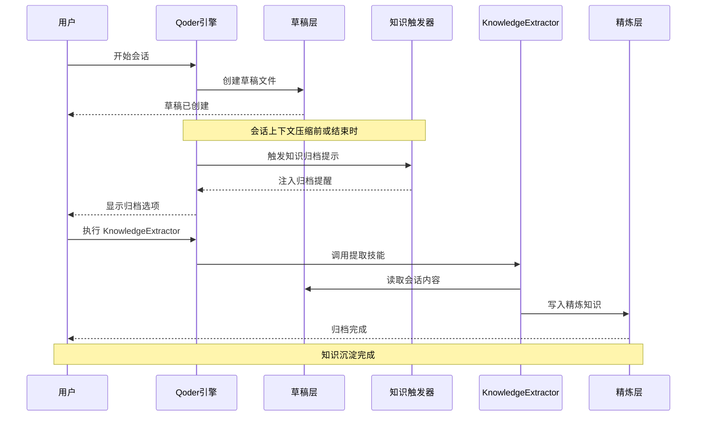
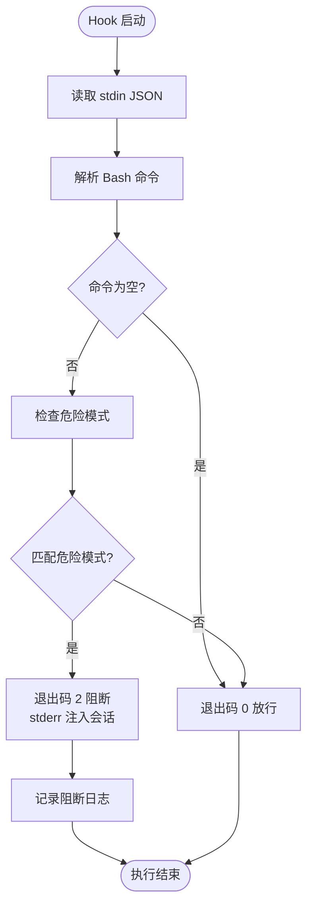
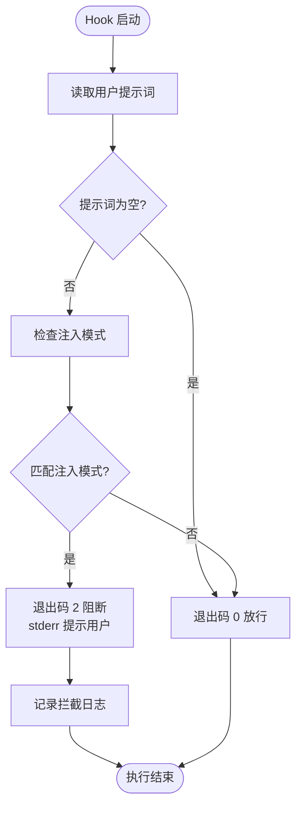
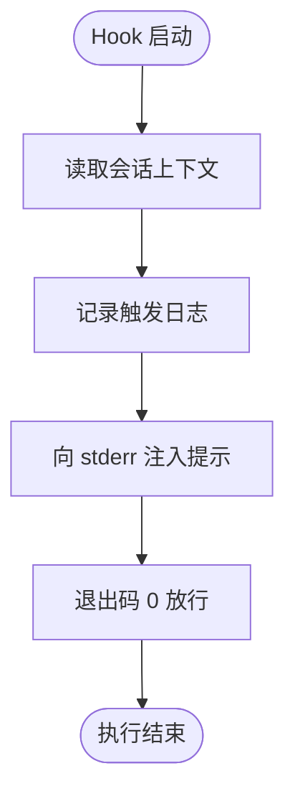
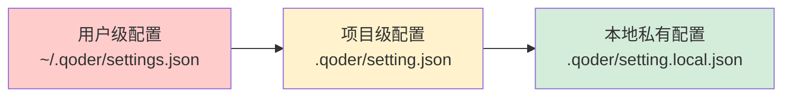
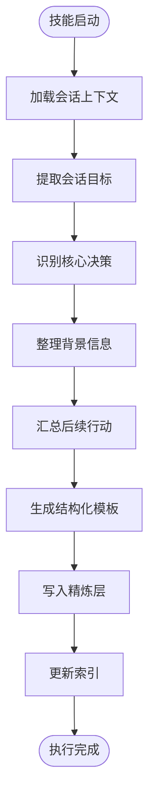
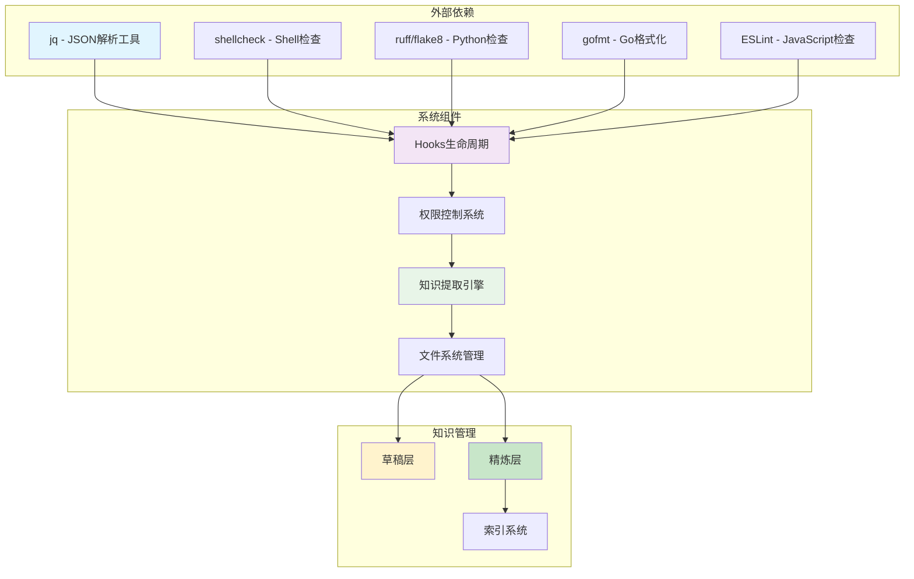

# 知识管理双层架构

<cite>
**本文档引用的文件**
- [QoderHarnessEngineering落地示例.md](file://QoderHarnessEngineering落地示例.md)
- [知识材料管理方案.md](file://docs/知识材料管理方案.md)
- [AGENTS.md](file://AGENTS.md)
- [Hooks配置操作手册.md](file://docs/Hooks配置操作手册.md)
- [security-gate.sh](file://.qoderwork/hooks/security-gate.sh)
- [prompt-guard.sh](file://.qoderwork/hooks/prompt-guard.sh)
- [knowledge-trigger.sh](file://.qoderwork/hooks/knowledge-trigger.sh)
- [.gitkeep](file://.qoder/notes/.gitkeep)
</cite>

## 目录
1. [引言](#引言)
2. [项目结构](#项目结构)
3. [核心组件](#核心组件)
4. [架构概览](#架构概览)
5. [详细组件分析](#详细组件分析)
6. [依赖关系分析](#依赖关系分析)
7. [性能考虑](#性能考虑)
8. [故障排除指南](#故障排除指南)
9. [结论](#结论)
10. [附录](#附录)

## 引言

Qoder Harness Engineering 知识管理双层架构是一个创新的知识管理系统，旨在解决传统知识管理中的痛点：既要保证知识收集的即时性和便利性，又要确保知识沉淀的质量和可检索性。该架构通过"草稿层"和"精炼层"的双重设计，实现了知识管理的高效闭环。

### 设计理念

双层架构的核心理念是"草稿求全，精炼求精"。草稿层专注于即时捕获，降低知识收集的门槛和成本；精炼层专注于质量控制和标准化，确保知识的可复用性和可传承性。

### 系统特色

- **零摩擦捕获**：草稿层采用项目内存储，无需切换目录即可随时记录
- **智能触发机制**：通过 Hooks 自动提示知识归档时机
- **双层安全保障**：多层次权限控制和安全拦截
- **跨项目可检索**：统一的精炼层存储，支持跨项目知识检索
- **团队协作友好**：既支持个人知识沉淀，也支持团队知识共享

## 项目结构

该项目采用模块化的目录结构，每个组件都有明确的职责分工：



**图表来源**
- [QoderHarnessEngineering落地示例.md:42-67](file://QoderHarnessEngineering落地示例.md#L42-L67)
- [知识材料管理方案.md:120-161](file://docs/知识材料管理方案.md#L120-L161)

### 目录结构详解

#### 草稿层（项目内）
- **位置**：`{project}/.qoder/notes/`
- **特点**：不提交 Git，格式自由，随手记录
- **用途**：会话中产生的原始笔记和讨论要点
- **管理**：加入 `.gitignore`，纯个人材料

#### 精炼层（全局）
- **位置**：`~/Documents/PersonalKnowledge/`
- **结构**：按时间、主题、项目分类组织
- **用途**：经过 KnowledgeExtractor Skill 提炼后的高质量知识
- **管理**：统一的版本控制和索引系统

**章节来源**
- [QoderHarnessEngineering落地示例.md:42-67](file://QoderHarnessEngineering落地示例.md#L42-L67)
- [知识材料管理方案.md:120-161](file://docs/知识材料管理方案.md#L120-L161)

## 核心组件

### 草稿层组件

草稿层是知识管理的第一道防线，其设计目标是最大化知识捕获率，最小化记录成本。

#### Notes 目录管理
- **自动创建**：会话中随时创建，无需额外配置
- **命名规范**：`YYYY-MM-DD_主题.md`
- **格式自由**：bullet points、讨论片段、代码片段均可
- **版本控制**：不提交 Git，避免污染项目历史

#### AGENTS.md 行为约束
- **项目上下文**：提供项目级别的技术栈和约束
- **行为规范**：定义 Agent 的安全边界和操作限制
- **自动加载**：每次会话自动应用

### 精炼层组件

精炼层负责知识的质量控制和标准化，确保沉淀的知识具有长期价值。

#### KnowledgeExtractor 技能
- **7步提炼流程**：目标提取、决策识别、背景整理、行动项汇总、结构化输出
- **模板化输出**：标准化的 Markdown 格式
- **元数据管理**：项目标签、主题分类、日期标记

#### 目录结构组织
- **archive/**：按时间分层的原始归档
- **topics/**：按主题聚合的专业知识
- **projects/**：按项目维度的项目知识
- **README.md**：全局索引和导航

**章节来源**
- [知识材料管理方案.md:164-215](file://docs/知识材料管理方案.md#L164-L215)
- [AGENTS.md:1-69](file://AGENTS.md#L1-L69)

## 架构概览

双层架构通过 Hooks 机制实现知识管理的自动化和智能化：



**图表来源**
- [知识材料管理方案.md:175-215](file://docs/知识材料管理方案.md#L175-L215)
- [QoderHarnessEngineering落地示例.md:332-337](file://QoderHarnessEngineering落地示例.md#L332-L337)

### 数据流机制

#### 草稿捕获流程
1. **实时记录**：会话中随时创建草稿
2. **内容丰富**：支持多种格式和内容类型
3. **自动保存**：无需手动保存，系统自动持久化

#### 精炼提取流程
1. **智能触发**：PreCompact/SessionEnd Hook 提示
2. **内容梳理**：提取核心决策和背景信息
3. **结构化输出**：生成标准化的 Markdown 文档
4. **多维归档**：按时间、主题、项目分类存储

**章节来源**
- [知识材料管理方案.md:175-215](file://docs/知识材料管理方案.md#L175-L215)
- [QoderHarnessEngineering落地示例.md:332-337](file://QoderHarnessEngineering落地示例.md#L332-L337)

## 详细组件分析

### Hooks 生命周期工程

Hooks 是双层架构的核心执行机制，通过生命周期事件实现知识管理的自动化。

#### 安全门（security-gate.sh）


**图表来源**
- [security-gate.sh:15-35](file://.qoderwork/hooks/security-gate.sh#L15-L35)

#### 提示词注入防护（prompt-guard.sh）


**图表来源**
- [prompt-guard.sh:14-52](file://.qoderwork/hooks/prompt-guard.sh#L14-L52)

#### 知识归档触发器（knowledge-trigger.sh）


**图表来源**
- [knowledge-trigger.sh:8-39](file://.qoderwork/hooks/knowledge-trigger.sh#L8-L39)

### 权限控制系统

双层架构采用三层权限控制机制，确保知识管理的安全性：

#### 配置层级与优先级


**图表来源**
- [QoderHarnessEngineering落地示例.md:23-38](file://QoderHarnessEngineering落地示例.md#L23-L38)

#### 权限策略语义
- **allow**：自动放行，无提示
- **ask**：弹出确认对话框，用户决定是否执行
- **deny**：直接拒绝，不可执行，不弹窗

**章节来源**
- [QoderHarnessEngineering落地示例.md:224-251](file://QoderHarnessEngineering落地示例.md#L224-L251)

### 知识提取与归档机制

#### KnowledgeExtractor 技能执行流程


**图表来源**
- [知识材料管理方案.md:195-201](file://docs/知识材料管理方案.md#L195-L201)

#### 精炼内容结构化模板
精炼后的知识采用标准化的 Markdown 格式，包含：
- **元数据**：项目标签、主题分类、日期标记
- **概述**：一句话总结，便于快速判断
- **背景信息**：项目背景、技术约束、涉及模块
- **核心决策**：方案对比、选择理由、适用场景
- **结论建议**：推荐做法、注意事项、可复用模式
- **后续行动**：待办事项、责任人、截止日期
- **参考资源**：相关代码、决策链接

**章节来源**
- [知识材料管理方案.md:217-271](file://docs/知识材料管理方案.md#L217-L271)

## 依赖关系分析

双层架构的依赖关系体现了模块化设计的优势：



**图表来源**
- [QoderHarnessEngineering落地示例.md:296-306](file://QoderHarnessEngineering落地示例.md#L296-L306)
- [Hooks配置操作手册.md:22-50](file://docs/Hooks配置操作手册.md#L22-L50)

### 组件耦合度分析

- **低耦合设计**：各组件职责明确，相互独立
- **高内聚特性**：相同功能的组件紧密协作
- **可替换性**：单个组件的变更不影响其他组件
- **可扩展性**：新增组件不影响现有架构

**章节来源**
- [Hooks配置操作手册.md:84-101](file://docs/Hooks配置操作手册.md#L84-L101)

## 性能考虑

### 系统性能优化

#### Hooks 执行效率
- **异步执行**：Hooks 脚本采用异步执行，避免阻塞主流程
- **超时控制**：默认超时 60 秒，可按需调整
- **资源限制**：合理的内存和 CPU 使用限制

#### 存储性能优化
- **增量更新**：精炼层采用增量更新，减少磁盘 I/O
- **索引优化**：建立多维索引，提高查询效率
- **缓存机制**：热点数据缓存，加速频繁访问

### 性能监控指标

- **响应时间**：Hooks 执行平均响应时间
- **吞吐量**：每分钟处理的知识条目数量
- **资源利用率**：CPU、内存、磁盘使用率
- **错误率**：知识提取失败率和系统异常率

## 故障排除指南

### 常见问题诊断

#### Hooks 脚本执行问题
1. **检查脚本权限**：确保所有脚本具有执行权限
2. **验证 jq 工具**：确认系统已安装 jq 工具
3. **检查配置语法**：验证 JSON 配置文件语法正确性
4. **查看日志文件**：检查 `.qoderwork/logs/` 目录下的日志

#### 知识提取失败
1. **检查会话完整性**：确认会话上下文完整
2. **验证模板格式**：检查精炼模板的完整性
3. **清理缓存数据**：删除临时文件和缓存
4. **重启系统服务**：必要时重启相关服务

### 调试技巧

#### 手动测试 Hooks
```bash
# 测试 PreToolUse 事件
echo '{"session_id":"test","tool_name":"Bash","tool_input":{"command":"rm -rf /"}}' \
  | bash .qoderwork/hooks/security-gate.sh

# 测试 PostToolUse 事件
echo '{"session_id":"test","tool_name":"Write","tool_input":{"path":"./src/index.ts"}}' \
  | bash .qoderwork/hooks/auto-lint.sh
```

#### 日志监控
```bash
# 实时监控失败日志
tail -f .qoderwork/logs/failure.log

# 查看知识触发日志
tail -f .qoderwork/logs/knowledge-trigger.log
```

**章节来源**
- [Hooks配置操作手册.md:520-570](file://docs/Hooks配置操作手册.md#L520-L570)

## 结论

Qoder Harness Engineering 知识管理双层架构通过精心设计的草稿层和精炼层，实现了知识管理的高效闭环。该架构不仅解决了知识收集的即时性问题，更重要的是建立了可持续的知识沉淀和传承机制。

### 架构优势

1. **用户体验优秀**：零摩擦的知识捕获，降低学习成本
2. **质量保障完善**：多层权限控制和安全拦截
3. **可扩展性强**：模块化设计支持功能扩展
4. **团队协作友好**：既支持个人沉淀也支持团队共享
5. **长期价值显著**：标准化的精炼流程确保知识的可复用性

### 应用前景

该架构特别适用于：
- **技术团队**：代码审查、架构决策、最佳实践沉淀
- **产品团队**：需求分析、设计决策、用户反馈整理
- **运营团队**：活动策划、数据分析、经验总结
- **教育培训**：课程内容、教学案例、学习笔记

通过持续优化和迭代，双层架构将成为企业知识管理的重要基础设施，为组织的知识传承和创新能力提供强有力的支持。

## 附录

### 快速操作参考

#### 创建草稿
直接在会话中告诉 Qoder：
> "把刚才关于 XX 的讨论要点记录到 `.qoder/notes/` 下"

#### 触发精炼归档
> "执行 KnowledgeExtractor Skill，将本次会话的重要内容归档到个人知识库"

#### 查看知识库
```bash
# 查看最近归档
ls -lt ~/Documents/PersonalKnowledge/archive/2026/

# 全文搜索
grep -r "关键词" ~/Documents/PersonalKnowledge/

# 查看总索引
open ~/Documents/PersonalKnowledge/README.md
```

### 最佳实践指南

#### 草稿管理
- 保持草稿的及时性，不要拖延
- 使用简洁明了的主题命名
- 记录关键决策和背景信息
- 适当使用代码片段和截图

#### 精炼质量控制
- 确保内容的准确性和完整性
- 使用标准的 Markdown 格式
- 添加适当的元数据标签
- 定期回顾和更新旧知识

#### 团队协作
- 建立知识分享机制
- 定期组织知识分享会
- 制定知识贡献激励制度
- 维护知识库的整洁和有序