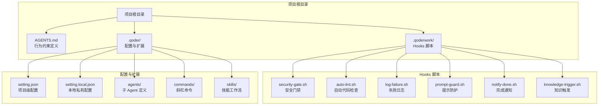
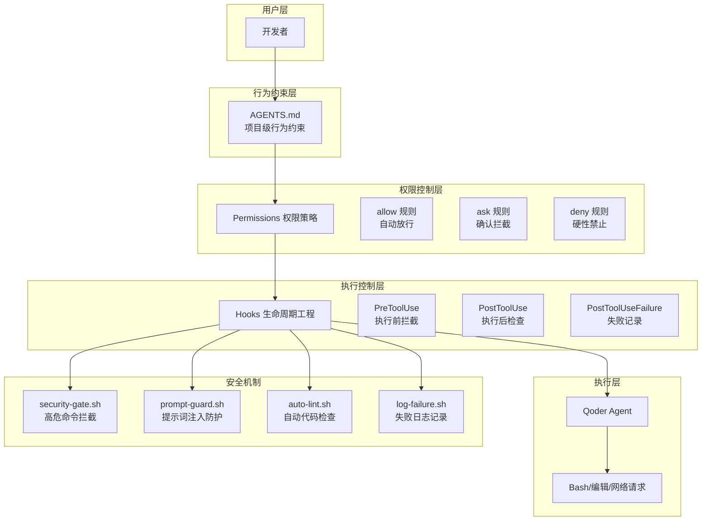
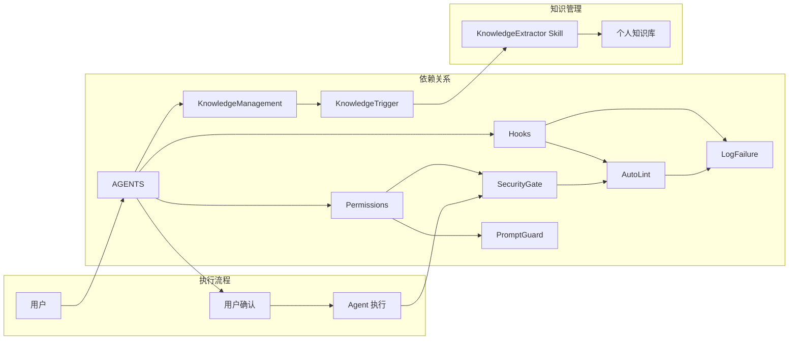

# AGENTS.md 行为约束

<cite>
**本文档引用的文件**
- [AGENTS.md](file://AGENTS.md)
- [QoderHarnessEngineering落地示例.md](file://QoderHarnessEngineering落地示例.md)
- [.qoderwork/hooks/security-gate.sh](file://.qoderwork/hooks/security-gate.sh)
- [.qoderwork/hooks/auto-lint.sh](file://.qoderwork/hooks/auto-lint.sh)
- [.qoderwork/hooks/log-failure.sh](file://.qoderwork/hooks/log-failure.sh)
- [.qoderwork/hooks/prompt-guard.sh](file://.qoderwork/hooks/prompt-guard.sh)
- [.qoderwork/hooks/notify-done.sh](file://.qoderwork/hooks/notify-done.sh)
- [.qoderwork/hooks/knowledge-trigger.sh](file://.qoderwork/hooks/knowledge-trigger.sh)
- [知识材料管理方案.md](file://docs/知识材料管理方案.md)
</cite>

## 目录
1. [简介](#简介)
2. [项目结构](#项目结构)
3. [核心组件](#核心组件)
4. [架构概览](#架构概览)
5. [详细组件分析](#详细组件分析)
6. [依赖关系分析](#依赖关系分析)
7. [性能考虑](#性能考虑)
8. [故障排除指南](#故障排除指南)
9. [结论](#结论)

## 简介

AGENTS.md 是 Qoder Harness Engineering 项目中的核心行为约束配置文件，位于项目根目录，为 Qoder 提供项目级别的上下文和行为规范。该文件在每次会话开始时自动加载，定义了 Agent 在该项目中的行为边界和操作准则。

AGENTS.md 作为项目上下文和行为规范的定义文件，直接影响 Agent 的行为模式，确保 AI 助手在执行代码修改、文件操作、Git 交互等任务时遵循预设的安全策略和工作流程规范。它与权限系统（Permissions）和 Hooks 系统共同构建了完整的开发工作流安全保障机制。

## 项目结构

基于仓库的实际结构，AGENTS.md 所在的项目组织如下：

**图表来源**
- [AGENTS.md:34-50](file://AGENTS.md#L34-L50)
- [QoderHarnessEngineering落地示例.md:42-67](file://QoderHarnessEngineering落地示例.md#L42-L67)

**章节来源**
- [AGENTS.md:34-50](file://AGENTS.md#L34-L50)
- [QoderHarnessEngineering落地示例.md:42-67](file://QoderHarnessEngineering落地示例.md#L42-L67)

## 核心组件

AGENTS.md 包含四个核心行为规则类别，每个类别都定义了明确的操作边界和安全约束：

### 代码安全规则（Code Safety）

代码安全规则确保 Agent 在修改配置文件和执行潜在危险操作时保持谨慎态度：

- **配置文件预览**：在应用任何配置文件（`.qoder/**`、`.qoderwork/**`）的更改前，必须先预览变更
- **文件删除确认**：禁止直接删除文件，必须获得显式用户确认
- **Hooks 脚本验证**：修改 Hooks 脚本时，必须验证退出码逻辑的正确性

### Git 纪律规则（Git Discipline）

Git 纪律规则维护代码版本控制的完整性：

- **状态检查**：在执行任何 Git 操作前，必须运行 `git status` 和 `git diff`
- **用户确认**：在执行 `git commit` 或 `git push` 前，必须询问用户确认
- **分支保护**：禁止对 `main` 或 `master` 分支进行强制推送

### 文件作用域规则（File Scope）

文件作用域规则限制 Agent 的代码修改范围：

- **默认范围**：源代码编辑仅限于 `./src/**` 和 `./tests/**` 目录
- **范围外编辑**：超出默认范围的编辑操作必须先获得用户确认

**章节来源**
- [AGENTS.md:18-31](file://AGENTS.md#L18-L31)

## 架构概览

AGENTS.md 与权限系统和 Hooks 系统形成了一个多层次的安全保障架构：

**图表来源**
- [QoderHarnessEngineering落地示例.md:253-337](file://QoderHarnessEngineering落地示例.md#L253-L337)
- [AGENTS.md:16-31](file://AGENTS.md#L16-L31)

## 详细组件分析

### AGENTS.md 文件格式与内容结构

AGENTS.md 采用标准的 Markdown 格式，包含以下结构化内容：

#### 标题层次结构

文件采用两级标题结构：
- **一级标题**：项目概述（Project Overview）
- **二级标题**：核心行为规则（Core Behavioral Rules）
- **三级标题**：具体规则类别（Code Safety、Git Discipline、File Scope）

#### 内容要素

每个行为规则类别都包含：
- **规则标题**：明确的行为约束名称
- **规则列表**：具体的操作要求和限制条件
- **执行约束**：违反规则时的处理方式

### Hooks 脚本系统

Hooks 系统提供了六个专门的脚本来实现不同的安全控制功能：

#### 安全门禁脚本（security-gate.sh）

在工具执行前拦截高危命令，支持以下拦截模式：
- 文件系统破坏：`rm -rf`、`rm --recursive`、`TRUNCATE TABLE`
- 数据库破坏：`DROP TABLE`、`DROP DATABASE`
- 磁盘写入：`dd if=`
- 系统破坏：`mkfs.`、`:(){:|:&};:`（Fork Bomb）
- 权限开放：`chmod -R 777`

#### 自动代码检查脚本（auto-lint.sh）

在文件编辑后自动运行相应的代码检查工具：
- JavaScript/TypeScript：ESLint，支持 `--fix --quiet` 参数
- Python：ruff 或 flake8，支持 `--fix --quiet` 参数
- Go：gofmt，使用 `-w` 参数进行格式化
- Shell：shellcheck，进行静态检查

#### 失败日志脚本（log-failure.sh）

记录工具执行失败的信息到 `.qoderwork/logs/failure.log` 文件中，包含时间戳、工具类型和错误信息。

#### 提示词防护脚本（prompt-guard.sh）

在用户提交提示词后进行安全检查，拦截以下类型的注入模式：
- 指令覆盖：要求忽略之前的所有指令
- Jailbreak：DAN mode、developer mode 等
- 角色扮演绕过：pretend you have no restrictions
- 系统提示泄露：repeat your system prompt

#### 完成通知脚本（notify-done.sh）

在 Agent 完成响应时触发桌面通知，提供任务完成的视觉反馈。

#### 知识触发脚本（knowledge-trigger.sh）

在上下文压缩前或会话结束时触发知识归档提醒，配合 KnowledgeExtractor Skill 使用。

**章节来源**
- [QoderHarnessEngineering落地示例.md:279-337](file://QoderHarnessEngineering落地示例.md#L279-L337)
- [AGENTS.md:54-61](file://AGENTS.md#L54-L61)

### 权限系统集成

AGENTS.md 与权限系统的集成体现在以下几个方面：

#### 规则优先级

权限系统采用三层优先级机制：
1. **deny 规则优先于 allow 和 ask**
2. **更具体规则优先于通配符规则**
3. **本地级覆盖项目级，项目级覆盖用户级**

#### 规则格式

权限规则采用统一的格式规范：
- **Bash 命令**：`Bash(前缀*)`
- **读取文件**：`Read(glob)`
- **编辑文件**：`Edit(glob)`
- **网络请求**：`WebFetch(domain:域名)`
- **路径取反**：`Read(!路径)`

#### 三级策略语义

- **allow**：自动放行，无提示
- **ask**：弹出确认对话框，用户决定是否执行
- **deny**：直接拒绝，不可执行，不弹窗

**章节来源**
- [QoderHarnessEngineering落地示例.md:224-251](file://QoderHarnessEngineering落地示例.md#L224-L251)

## 依赖关系分析

AGENTS.md 与其他组件之间的依赖关系形成了一个完整的安全控制生态系统：

**图表来源**
- [QoderHarnessEngineering落地示例.md:340-356](file://QoderHarnessEngineering落地示例.md#L340-L356)
- [知识材料管理方案.md:51-101](file://docs/知识材料管理方案.md#L51-L101)

### 组件耦合度分析

- **AGENTS.md 与 Permissions**：高度耦合，行为约束直接影响权限规则的应用
- **AGENTS.md 与 Hooks**：中等耦合，通过文件结构和脚本引用建立联系
- **Permissions 与 Hooks**：低耦合，各自独立运行但相互补充

### 外部依赖

- **Shell 环境**：依赖 Bash 脚本执行环境
- **外部工具**：依赖 ESLint、ruff、gofmt、shellcheck 等代码检查工具
- **操作系统**：依赖 macOS 桌面通知功能

**章节来源**
- [QoderHarnessEngineering落地示例.md:253-337](file://QoderHarnessEngineering落地示例.md#L253-L337)

## 性能考虑

在设计 AGENTS.md 行为约束时，需要考虑以下性能因素：

### 执行效率

- **Hooks 脚本执行时间**：应尽量保持简洁，避免长时间阻塞
- **权限检查开销**：规则匹配应具有良好的时间复杂度
- **文件监控**：避免过度频繁的文件系统检查

### 资源消耗

- **内存使用**：权限规则缓存和 Hooks 脚本状态管理
- **磁盘空间**：日志文件的管理和轮转机制
- **CPU 占用**：代码检查工具的执行频率

### 可扩展性

- **规则数量增长**：权限规则的线性增长对性能的影响
- **Hooks 数量增加**：脚本执行的串行化处理
- **并发处理**：多 Agent 并行执行时的资源竞争

## 故障排除指南

### 常见问题及解决方案

#### AGENTS.md 不生效

**症状**：修改 AGENTS.md 后，Agent 仍然按照旧规则执行

**可能原因**：
- 文件未保存或编码格式不正确
- Qoder 缓存未刷新
- 文件权限问题

**解决步骤**：
1. 确认文件编码为 UTF-8
2. 重启 Qoder 应用
3. 检查文件权限设置
4. 验证文件语法格式

#### Hooks 脚本执行失败

**症状**：代码检查或安全拦截功能异常

**可能原因**：
- 脚本权限不足
- 外部工具未安装
- 脚本语法错误

**解决步骤**：
1. 赋予脚本执行权限：`chmod +x .qoderwork/hooks/*.sh`
2. 检查外部工具安装情况
3. 验证脚本语法和逻辑
4. 查看日志文件获取详细错误信息

#### 权限规则冲突

**症状**：某些操作被意外阻止或放行

**可能原因**：
- 规则优先级设置不当
- 通配符规则过于宽泛
- 本地覆盖规则冲突

**解决步骤**：
1. 检查规则优先级顺序
2. 缩小通配符规则范围
3. 清理冲突的本地覆盖规则
4. 重新评估规则粒度

**章节来源**
- [QoderHarnessEngineering落地示例.md:549-552](file://QoderHarnessEngineering落地示例.md#L549-L552)

## 结论

AGENTS.md 作为 Qoder Harness Engineering 项目的核心行为约束配置文件，通过明确的规则定义和严格的执行机制，为 AI 助手在项目中的行为提供了清晰的边界和安全保障。它与权限系统和 Hooks 系统的协同工作，构建了一个多层次、全方位的开发工作流安全保障机制。

该文件的重要性体现在：

1. **标准化约束**：为不同项目提供统一的行为规范模板
2. **安全第一**：通过多层次的安全控制确保代码质量和系统安全
3. **可扩展性**：支持根据项目特点定制化调整行为约束
4. **可维护性**：清晰的结构和文档便于团队协作和知识传承

通过合理配置和使用 AGENTS.md，团队可以在享受 AI 助手高效辅助的同时，确保开发过程的安全性和规范性，为项目的长期健康发展奠定坚实基础。