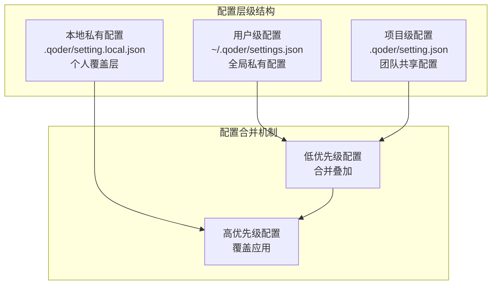
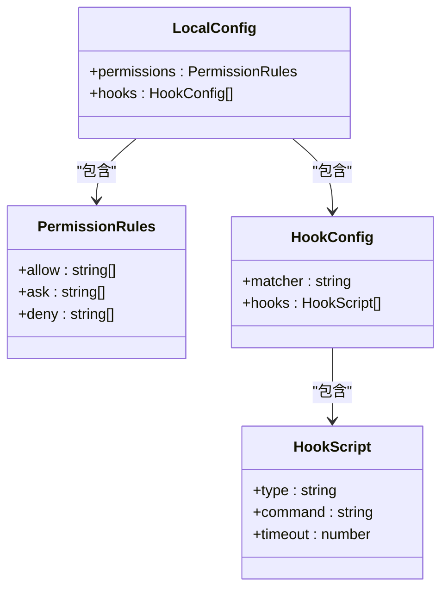
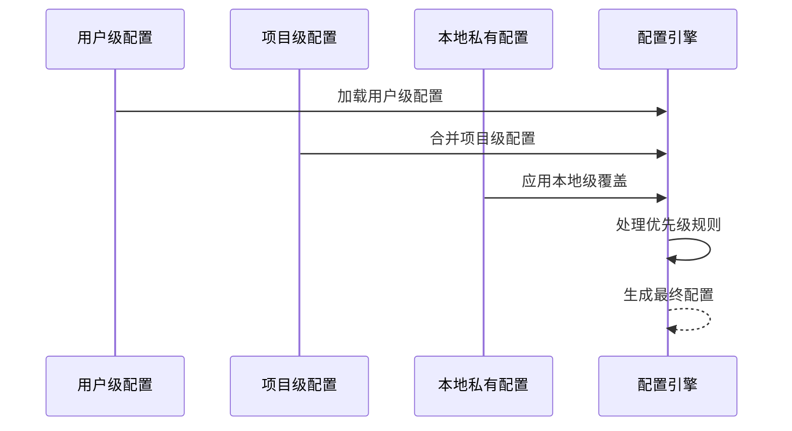
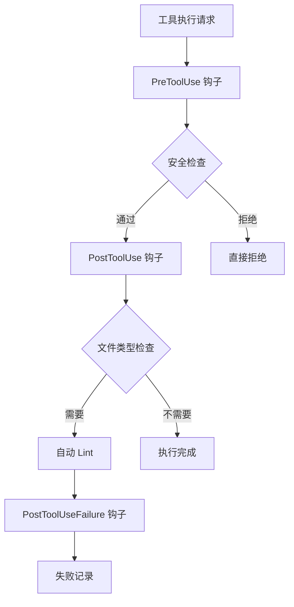
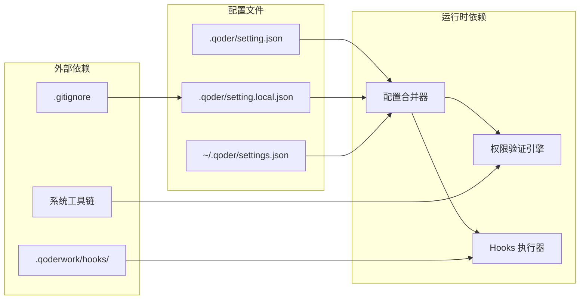

# 本地私有配置 - setting.local.json

<cite>
**本文引用的文件**
- [.gitignore](file://.gitignore)
- [QoderHarnessEngineering落地示例.md](file://QoderHarnessEngineering落地示例.md)
- [AGENTS.md](file://AGENTS.md)
- [.qoderwork/hooks/auto-lint.sh](file://.qoderwork/hooks/auto-lint.sh)
</cite>

## 目录
1. [简介](#简介)
2. [项目结构](#项目结构)
3. [核心组件](#核心组件)
4. [架构概览](#架构概览)
5. [详细组件分析](#详细组件分析)
6. [依赖关系分析](#依赖关系分析)
7. [性能考量](#性能考量)
8. [故障排除指南](#故障排除指南)
9. [结论](#结论)
10. [附录](#附录)

## 简介

`setting.local.json` 是 Qoder 项目工程化配置系统中的关键组件，作为本地私有配置文件，它为开发者提供了在不影响团队协作的前提下进行个性化配置的能力。该文件采用三层配置合并机制的最顶层，专门用于个人覆盖层，确保每个开发者都能根据自己的工作流程和环境需求进行定制化配置。

### 设计目的与重要性

`setting.local.json` 的核心价值在于其"私有性"和"覆盖性"双重特性。它允许开发者在不改变项目级配置的情况下，针对个人工作环境进行微调，这种设计既保证了团队协作的一致性，又充分尊重了个人的工作习惯差异。

### 安全考虑与 .gitignore 集成

该文件必须加入 `.gitignore` 的严格要求体现了其私有性质。任何包含个人敏感信息、API 密钥或环境特定配置的文件都不应该被提交到版本控制系统中，这不仅是安全最佳实践，也是团队协作的基本准则。

## 项目结构

Qoder 项目采用分层配置架构，每层都有明确的职责和作用范围：



**图表来源**
- [QoderHarnessEngineering落地示例.md:23-39](file://QoderHarnessEngineering落地示例.md#L23-L39)

### 配置层级优先级

配置系统遵循严格的优先级规则：
1. **用户级配置**（全局，对所有项目生效）
2. **项目级配置**（提交 Git，团队共享）
3. **本地级配置**（不提交，个人覆盖）

这种设计确保了配置的层次性和可维护性，同时避免了配置冲突。

**章节来源**
- [QoderHarnessEngineering落地示例.md:23-39](file://QoderHarnessEngineering落地示例.md#L23-L39)

## 核心组件

### 配置文件结构

`setting.local.json` 采用标准化的 JSON 格式，包含以下核心字段：



**图表来源**
- [QoderHarnessEngineering落地示例.md:127-183](file://QoderHarnessEngineering落地示例.md#L127-L183)

### 权限策略机制

权限系统采用三层策略模型，每层都有明确的语义和作用：

| 策略类型 | 语义 | 行为特征 | 适用场景 |
|---------|------|----------|----------|
| `allow` | 自动放行 | 无提示直接执行 | 常规只读和受控编辑操作 |
| `ask` | 人工确认 | 弹出确认对话框 | 需要用户审核的操作 |
| `deny` | 直接拒绝 | 不可执行且不弹窗 | 危险命令和敏感路径 |

**章节来源**
- [QoderHarnessEngineering落地示例.md:224-251](file://QoderHarnessEngineering落地示例.md#L224-L251)

## 架构概览

### 配置合并流程

配置系统采用"低优先级合并，高优先级覆盖"的设计理念，确保配置的灵活性和一致性：



**图表来源**
- [QoderHarnessEngineering落地示例.md:25-33](file://QoderHarnessEngineering落地示例.md#L25-L33)

### 优先级处理规则

当同一规则同时出现在多个层级时，系统遵循以下优先级规则：

1. **deny 优先于 allow 和 ask** - 无论在哪个层级定义
2. **更具体规则优先于通配符规则** - 精确匹配优于模糊匹配
3. **本地级覆盖项目级** - 个人配置优先于团队配置
4. **项目级覆盖用户级** - 团队配置优先于全局配置

**章节来源**
- [QoderHarnessEngineering落地示例.md:244-249](file://QoderHarnessEngineering落地示例.md#L244-L249)

## 详细组件分析

### 权限规则详解

#### Bash 命令权限

Bash 命令权限采用前缀匹配机制，支持通配符操作：

| 规则类型 | 格式示例 | 说明 |
|---------|----------|------|
| 基础命令 | `Bash(git status)` | 精确匹配单个命令 |
| 通配符命令 | `Bash(npm run*)` | 匹配命令前缀 |
| 参数匹配 | `Bash(python -m pip*)` | 匹配带参数的命令序列 |

#### 文件系统权限

文件系统权限采用 glob 模式匹配，支持复杂的路径规则：

| 规则类型 | 格式示例 | 说明 |
|---------|----------|------|
| 通配符路径 | `Read(./src/**)` | 匹配任意层级的文件 |
| 路径取反 | `Read(!~/.ssh/**)` | 排除特定路径 |
| 相对路径 | `Edit(./tests/**)` | 限制在测试目录 |
| 绝对路径 | `Read(~/.aws/**)` | 访问用户家目录 |

**章节来源**
- [QoderHarnessEngineering落地示例.md:226-235](file://QoderHarnessEngineering落地示例.md#L226-L235)

### Hooks 生命周期集成

本地配置不仅支持权限控制，还集成了完整的生命周期钩子系统：



**图表来源**
- [QoderHarnessEngineering落地示例.md:253-270](file://QoderHarnessEngineering落地示例.md#L253-L270)

**章节来源**
- [QoderHarnessEngineering落地示例.md:253-270](file://QoderHarnessEngineering落地示例.md#L253-L270)

## 依赖关系分析

### 配置文件依赖图



**图表来源**
- [QoderHarnessEngineering落地示例.md:42-67](file://QoderHarnessEngineering落地示例.md#L42-L67)

### 依赖关系说明

1. **配置合并器**：负责将三层配置进行合并处理
2. **权限验证引擎**：实时验证工具执行请求的合法性
3. **Hooks 执行器**：管理生命周期钩子的执行
4. **外部依赖**：包括版本控制、系统工具和脚本文件

**章节来源**
- [QoderHarnessEngineering落地示例.md:42-67](file://QoderHarnessEngineering落地示例.md#L42-L67)

## 性能考量

### 配置加载性能

配置系统的性能优化主要体现在以下几个方面：

1. **延迟加载**：配置文件仅在需要时加载和解析
2. **缓存机制**：已解析的配置结果会被缓存
3. **增量更新**：本地配置的修改只影响相关部分

### 执行效率优化

- **权限检查**：采用快速匹配算法，避免深度遍历
- **Hooks 执行**：异步执行非阻断性钩子
- **内存管理**：及时释放不再使用的配置数据

## 故障排除指南

### 常见配置问题

#### 配置不生效

**可能原因**：
1. 配置文件语法错误
2. 文件路径不正确
3. 权限规则冲突

**解决方法**：
1. 检查 JSON 语法格式
2. 确认文件位于正确的目录
3. 验证权限规则的优先级

#### 权限冲突

**症状**：某些操作被意外拒绝

**排查步骤**：
1. 检查 deny 规则的优先级
2. 验证 allow 和 ask 规则的匹配程度
3. 确认本地配置是否覆盖了预期规则

**章节来源**
- [QoderHarnessEngineering落地示例.md:244-249](file://QoderHarnessEngineering落地示例.md#L244-L249)

### 调试技巧

1. **启用调试模式**：查看配置加载日志
2. **规则测试**：使用简单规则验证配置
3. **逐步排查**：从最小配置开始逐步增加规则

## 结论

`setting.local.json` 作为 Qoder 配置系统的重要组成部分，为开发者提供了灵活而安全的个性化配置能力。通过三层配置合并机制，它在保证团队协作一致性的同时，充分尊重了个人的工作习惯差异。

### 最佳实践总结

1. **安全第一**：确保本地配置文件加入 `.gitignore`
2. **最小化原则**：只配置必要的覆盖规则
3. **文档化**：为重要的本地配置添加注释说明
4. **版本控制**：定期备份和版本化本地配置

## 附录

### 配置模板参考

#### 基础本地配置模板

```json
{
  "permissions": {
    "allow": [],
    "ask": [],
    "deny": []
  }
}
```

#### 常见覆盖场景示例

1. **开发环境特定工具权限**
```json
{
  "permissions": {
    "allow": [
      "Edit(./**)",
      "Bash(python*)",
      "Bash(pip*)"
    ]
  }
}
```

2. **个人工作流程定制**
```json
{
  "hooks": {
    "Stop": [
      {
        "hooks": [
          { "type": "command", "command": "~/.qoder/hooks/notify-done.sh" }
        ]
      }
    ]
  }
}
```

3. **临时性权限调整**
```json
{
  "permissions": {
    "deny": [
      "Bash(sudo rm -rf*)"
    ]
  }
}
```

**章节来源**
- [QoderHarnessEngineering落地示例.md:194-221](file://QoderHarnessEngineering落地示例.md#L194-L221)

### 团队协作注意事项

1. **避免过度覆盖**：只配置必要的个人需求
2. **保持一致性**：尽量使用团队认可的配置模式
3. **沟通协调**：重大配置变更前与团队沟通
4. **文档记录**：记录重要的本地配置变更