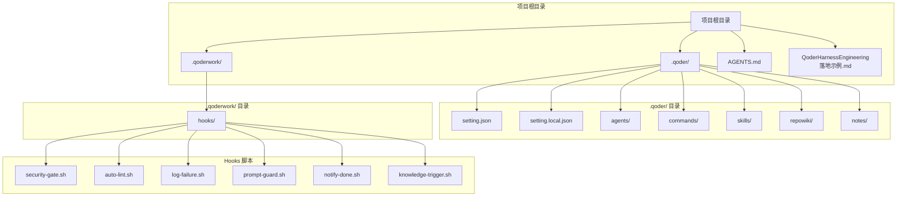
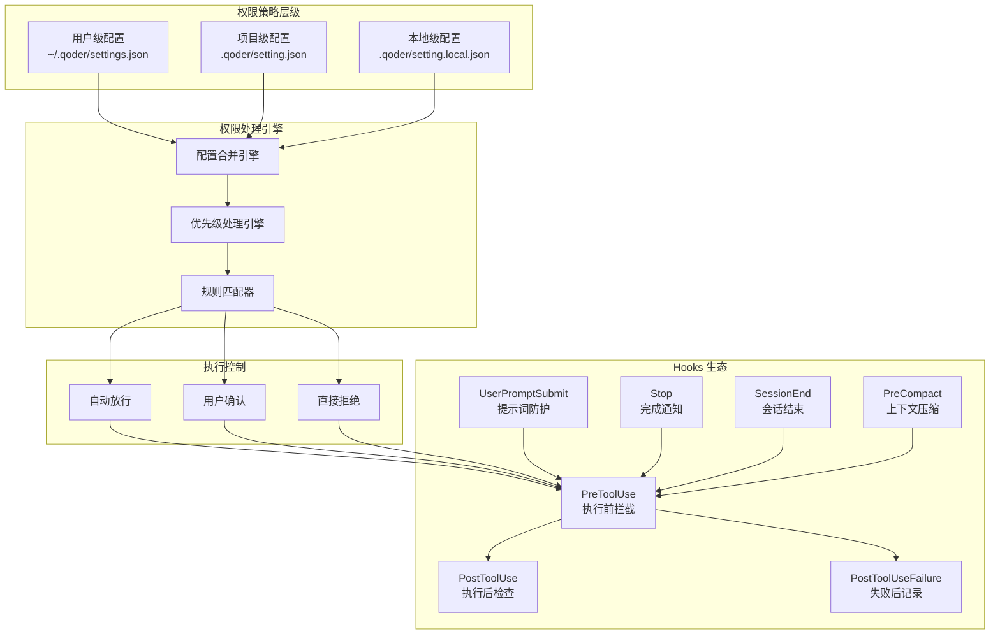
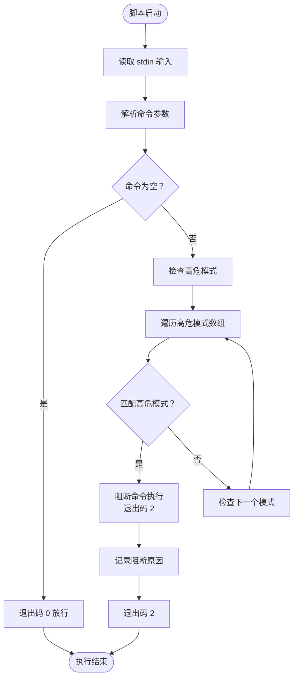
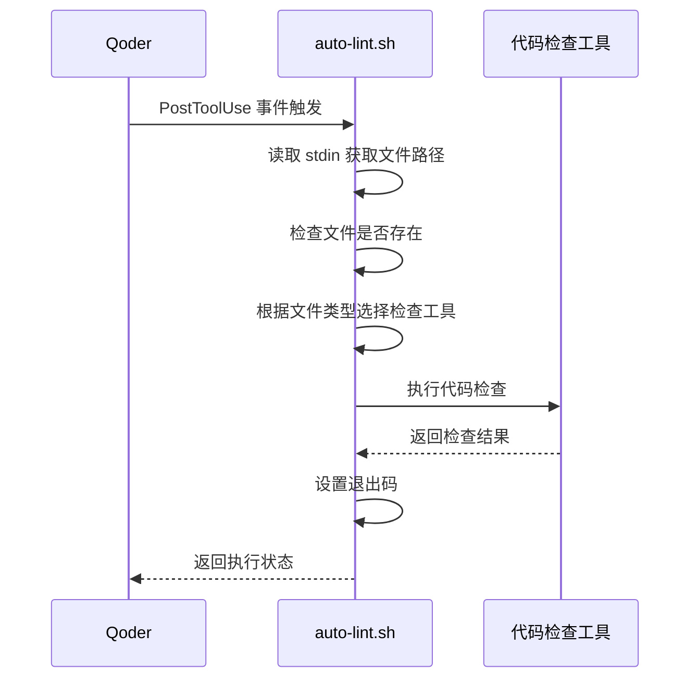
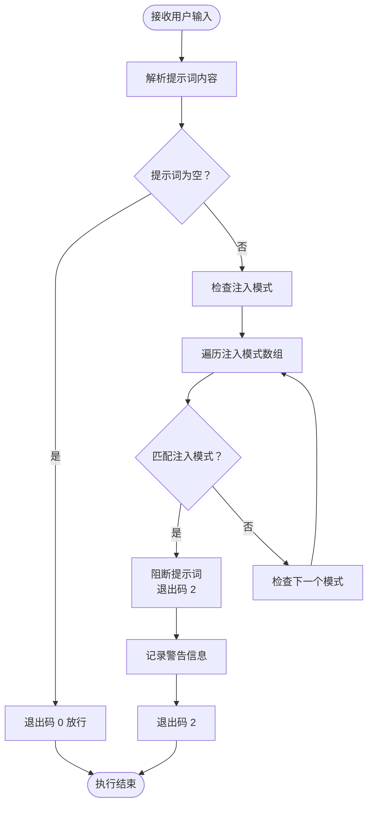
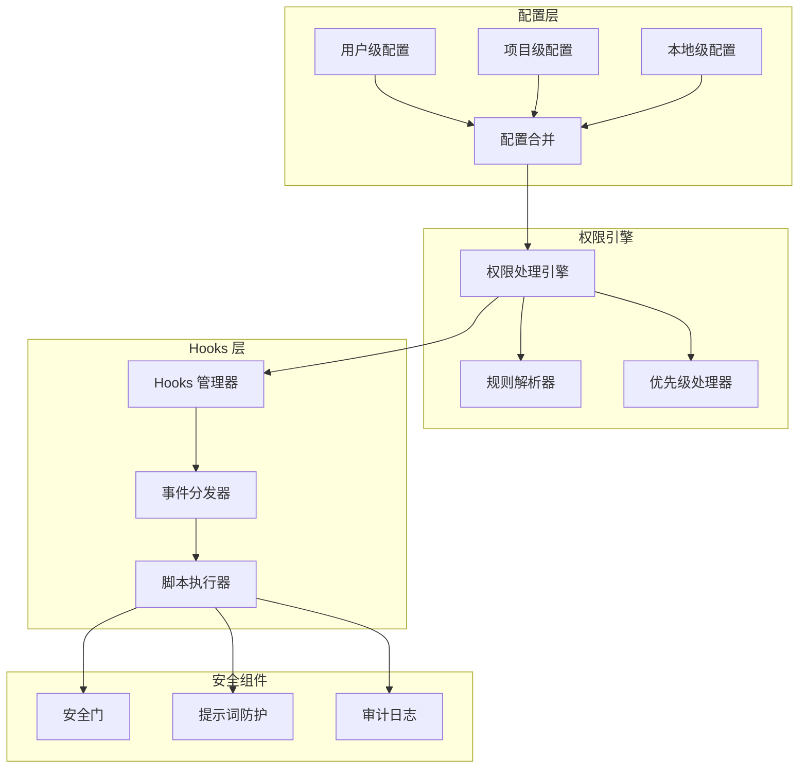

# 权限策略配置

<cite>
**本文档引用的文件**
- [QoderHarnessEngineering落地示例.md](file://QoderHarnessEngineering落地示例.md)
- [AGENTS.md](file://AGENTS.md)
- [Hooks配置操作手册.md](file://docs/Hooks配置操作手册.md)
- [security-gate.sh](file://.qoderwork/hooks/security-gate.sh)
- [auto-lint.sh](file://.qoderwork/hooks/auto-lint.sh)
- [log-failure.sh](file://.qoderwork/hooks/log-failure.sh)
- [prompt-guard.sh](file://.qoderwork/hooks/prompt-guard.sh)
- [notify-done.sh](file://.qoderwork/hooks/notify-done.sh)
- [knowledge-trigger.sh](file://.qoderwork/hooks/knowledge-trigger.sh)
</cite>

## 目录
1. [简介](#简介)
2. [项目结构](#项目结构)
3. [核心组件](#核心组件)
4. [架构概览](#架构概览)
5. [详细组件分析](#详细组件分析)
6. [依赖关系分析](#依赖关系分析)
7. [性能考虑](#性能考虑)
8. [故障排除指南](#故障排除指南)
9. [结论](#结论)
10. [附录](#附录)

## 简介

本文档为 Qoder 权限治理系统提供了全面的技术文档，深入解释了 Qoder 权限治理的三级策略模型。该系统采用分层权限控制机制，通过 allow（自动放行）、ask（需要确认）、deny（直接拒绝）三种策略语义，结合多种规则格式和匹配模式，为不同类型的权限控制需求提供灵活的解决方案。

Qoder 权限系统的核心特点是其三层配置合并机制，支持用户级、项目级和本地级的权限策略叠加，确保在保证安全性的同时提供良好的开发体验。系统还集成了 Hooks 生命周期机制，通过预执行、后执行和失败处理等不同阶段的安全控制，构建了完整的权限治理闭环。

## 项目结构

Qoder 权限策略配置系统围绕以下核心目录和文件组织：



**图表来源**
- [QoderHarnessEngineering落地示例.md:42-67](file://QoderHarnessEngineering落地示例.md#L42-L67)
- [AGENTS.md:34-50](file://AGENTS.md#L34-L50)

**章节来源**
- [QoderHarnessEngineering落地示例.md:42-67](file://QoderHarnessEngineering落地示例.md#L42-L67)
- [AGENTS.md:34-50](file://AGENTS.md#L34-L50)

## 核心组件

### 三级策略模型

Qoder 权限系统采用三层策略模型，每种策略都有明确的语义和使用场景：

#### Allow 策略（自动放行）
- **语义**：自动放行，无提示
- **使用场景**：常规只读操作、受控的开发工具使用、基础的文件访问
- **典型规则**：`Bash(npm run*)`、`Read(./src/**)`、`Read(./tests/**)`

#### Ask 策略（需要确认）
- **语义**：弹出确认对话框，用户决定是否执行
- **使用场景**：可能影响生产环境的操作、涉及数据修改的命令、需要人工审核的变更
- **典型规则**：`Bash(git commit*)`、`Bash(git push*)`、`Edit(./.qoder/**)`

#### Deny 策略（直接拒绝）
- **语义**：直接拒绝，不可执行，不弹窗
- **使用场景**：高危操作、敏感数据访问、违反安全策略的行为
- **典型规则**：`Bash(rm -rf*)`、`Bash(sudo*)`、`Read(~/.ssh/**)`

**章节来源**
- [QoderHarnessEngineering落地示例.md:236-242](file://QoderHarnessEngineering落地示例.md#L236-L242)

### 规则格式系统

Qoder 支持多种规则格式，满足不同类型的权限控制需求：

#### Bash 命令规则
- **格式**：`Bash(前缀*)`
- **匹配模式**：命令前缀匹配，支持通配符
- **示例**：`Bash(npm run*)`、`Bash(git status)`、`Bash(ls*)`

#### 文件访问规则
- **读取规则**：`Read(glob)`
- **编辑规则**：`Edit(glob)`
- **匹配模式**：Glob 模式匹配，支持递归目录
- **示例**：`Read(./src/**)`、`Edit(./tests/**)`

#### 网络请求规则
- **格式**：`WebFetch(domain:域名)`
- **匹配模式**：域名白名单控制
- **示例**：`WebFetch(domain:api.github.com)`、`WebFetch(domain:registry.npmjs.org)`

#### 路径取反规则
- **格式**：`Read(!路径)`
- **匹配模式**：排除特定路径
- **示例**：`Read(!~/.ssh/**)`、`Read(!~/.aws/**)`

**章节来源**
- [QoderHarnessEngineering落地示例.md:226-235](file://QoderHarnessEngineering落地示例.md#L226-L235)

## 架构概览

Qoder 权限策略系统采用分层架构设计，通过配置合并和优先级处理实现灵活的权限控制：



**图表来源**
- [QoderHarnessEngineering落地示例.md:23-39](file://QoderHarnessEngineering落地示例.md#L23-L39)
- [Hooks配置操作手册.md:22-49](file://docs/Hooks配置操作手册.md#L22-L49)

### 优先级处理规则

Qoder 权限系统遵循严格的优先级处理规则，确保安全性和一致性：

1. **deny 优先于 allow 和 ask**：无论在哪个层级定义，deny 规则都具有最高优先级
2. **更具体规则优先于通配符规则**：精确匹配的规则比通配符规则优先
3. **配置层级优先级**：本地级 > 项目级 > 用户级

**章节来源**
- [QoderHarnessEngineering落地示例.md:244-249](file://QoderHarnessEngineering落地示例.md#L244-L249)

## 详细组件分析

### 权限配置文件结构

Qoder 权限系统通过 JSON 配置文件实现策略定义，支持三层配置的合并：

#### 用户级配置（~/.qoder/settings.json）
- **作用域**：全局，对所有项目生效
- **维护者**：开发者个人
- **典型用途**：个人偏好设置、全局 Hooks 配置、个人 API 白名单

#### 项目级配置（.qoder/setting.json）
- **作用域**：项目共享，提交到 Git
- **维护者**：项目团队
- **典型用途**：团队协作规范、项目特定权限策略

#### 本地级配置（.qoder/setting.local.json）
- **作用域**：个人私有，不提交到 Git
- **维护者**：开发者个人
- **典型用途**：个人工作流定制、临时权限调整

**章节来源**
- [QoderHarnessEngineering落地示例.md:71-120](file://QoderHarnessEngineering落地示例.md#L71-L120)

### Hooks 生命周期机制

Qoder 通过 Hooks 机制在关键节点实现自动化控制：

#### 预执行拦截（PreToolUse）
- **触发时机**：工具执行前
- **可阻断性**：支持阻断执行
- **典型用途**：高危命令拦截、安全检查

#### 执行后检查（PostToolUse）
- **触发时机**：工具成功执行后
- **可阻断性**：不支持阻断
- **典型用途**：代码检查、自动修复

#### 失败后记录（PostToolUseFailure）
- **触发时机**：工具执行失败后
- **可阻断性**：不支持阻断
- **典型用途**：失败日志记录、问题追踪

**章节来源**
- [Hooks配置操作手册.md:84-101](file://docs/Hooks配置操作手册.md#L84-L101)

### 安全门脚本（security-gate.sh）

安全门脚本是 PreToolUse 事件的核心实现，负责拦截高危 Bash 命令：



**图表来源**
- [.qoderwork/hooks/security-gate.sh:1-38](file://.qoderwork/hooks/security-gate.sh#L1-L38)

**章节来源**
- [.qoderwork/hooks/security-gate.sh:1-38](file://.qoderwork/hooks/security-gate.sh#L1-L38)

### 自动代码检查（auto-lint.sh）

自动代码检查脚本在文件写入后自动执行相应的代码检查工具：



**图表来源**
- [.qoderwork/hooks/auto-lint.sh:1-43](file://.qoderwork/hooks/auto-lint.sh#L1-L43)

**章节来源**
- [.qoderwork/hooks/auto-lint.sh:1-43](file://.qoderwork/hooks/auto-lint.sh#L1-L43)

### 提示词注入防护（prompt-guard.sh）

提示词注入防护脚本在用户提交提示词时进行安全检查：



**图表来源**
- [.qoderwork/hooks/prompt-guard.sh:1-55](file://.qoderwork/hooks/prompt-guard.sh#L1-L55)

**章节来源**
- [.qoderwork/hooks/prompt-guard.sh:1-55](file://.qoderwork/hooks/prompt-guard.sh#L1-L55)

## 依赖关系分析

Qoder 权限系统各组件之间存在复杂的依赖关系：



**图表来源**
- [QoderHarnessEngineering落地示例.md:23-39](file://QoderHarnessEngineering落地示例.md#L23-L39)
- [Hooks配置操作手册.md:22-49](file://docs/Hooks配置操作手册.md#L22-L49)

### 组件耦合度分析

- **配置层与权限引擎**：低耦合，通过标准化的数据结构进行交互
- **权限引擎与 Hooks 管理器**：中等耦合，通过事件驱动机制协调
- **Hooks 脚本与系统工具**：高耦合，依赖外部命令行工具

**章节来源**
- [QoderHarnessEngineering落地示例.md:23-39](file://QoderHarnessEngineering落地示例.md#L23-L39)

## 性能考虑

### 规则匹配性能

Qoder 权限系统的规则匹配采用线性扫描算法，对于大多数使用场景具有良好的性能表现：

- **规则数量**：建议单个项目不超过 100 条规则
- **通配符使用**：避免过度使用深层递归通配符
- **规则排序**：将最常用的规则放在前面

### Hooks 执行性能

- **脚本执行时间**：单个 Hooks 脚本应在 1-3 秒内完成
- **超时设置**：合理设置 Hooks 超时时间，避免阻塞会话
- **并发控制**：同一事件的多个 Hooks 串行执行，避免资源竞争

### 内存使用优化

- **配置缓存**：权限配置在内存中缓存，减少频繁读取
- **日志轮转**：失败日志采用轮转机制，控制磁盘占用
- **临时文件清理**：及时清理临时文件和中间结果

## 故障排除指南

### 常见问题诊断

#### 问题：权限规则不生效
**可能原因**：
1. 配置文件语法错误
2. 规则格式不正确
3. 配置层级冲突

**解决方法**：
1. 检查 JSON 语法格式
2. 验证规则格式符合规范
3. 使用配置合并验证工具

#### 问题：Hooks 脚本执行失败
**可能原因**：
1. 脚本权限不足
2. 外部工具未安装
3. 脚本逻辑错误

**解决方法**：
1. 赋予脚本执行权限：`chmod +x .qoderwork/hooks/*.sh`
2. 检查外部依赖工具是否可用
3. 使用调试模式测试脚本逻辑

#### 问题：阻断功能无效
**可能原因**：
1. 事件类型不支持阻断
2. 退出码设置错误
3. stderr 输出格式问题

**解决方法**：
1. 确认事件类型支持阻断（PreToolUse、UserPromptSubmit、Stop、SubagentStop）
2. 检查退出码设置为 2
3. 确保错误信息写入 stderr

**章节来源**
- [Hooks配置操作手册.md:572-626](file://docs/Hooks配置操作手册.md#L572-L626)

### 调试技巧

#### 手动测试 Hooks 脚本
```bash
# 测试 PreToolUse（Bash 工具）
echo '{"session_id":"test","tool_name":"Bash","tool_input":{"command":"rm -rf /"}}' \
  | bash .qoderwork/hooks/security-gate.sh
echo "exit: $?"

# 测试 PostToolUse（Write 工具）
echo '{"session_id":"test","tool_name":"Write","tool_input":{"path":"./src/index.ts"}}' \
  | bash .qoderwork/hooks/auto-lint.sh
echo "exit: $?"
```

#### 配置验证
1. 使用 jq 工具验证 JSON 语法
2. 检查规则格式是否符合规范
3. 验证配置合并结果

**章节来源**
- [Hooks配置操作手册.md:520-541](file://docs/Hooks配置操作手册.md#L520-L541)

## 结论

Qoder 权限策略配置系统通过其三层策略模型和分层配置机制，为现代软件开发团队提供了全面的权限治理解决方案。系统的设计充分考虑了安全性、可维护性和用户体验，在保证严格安全控制的同时，为开发者提供了灵活的配置选项。

该系统的核心优势在于：
1. **多层次安全控制**：通过 allow、ask、deny 三级策略实现渐进式安全控制
2. **灵活的规则格式**：支持多种规则格式满足不同场景需求
3. **智能优先级处理**：严格的优先级规则确保安全策略的有效执行
4. **完善的 Hooks 生态**：通过生命周期 Hooks 实现自动化安全控制
5. **可扩展的架构**：模块化的组件设计便于功能扩展和定制

通过合理配置和最佳实践，Qoder 权限系统能够有效保护项目安全，同时提升开发效率，是现代软件工程团队不可或缺的安全基础设施。

## 附录

### 配置示例集合

#### 基础权限配置示例
```json
{
  "permissions": {
    "allow": [
      "Read(./**)",
      "Bash(npm run*)",
      "Bash(git status)"
    ],
    "ask": [
      "Bash(git commit*)",
      "Edit(./.qoder/**)"
    ],
    "deny": [
      "Bash(rm -rf*)",
      "Read(~/.ssh/**)"
    ]
  }
}
```

#### 网络访问控制示例
```json
{
  "permissions": {
    "allow": [
      "WebFetch(domain:api.github.com)",
      "WebFetch(domain:registry.npmjs.org)"
    ],
    "deny": [
      "WebFetch(domain:*)"
    ]
  }
}
```

#### 本地个性化配置示例
```json
{
  "permissions": {
    "allow": [
      "Edit(./**)",
      "Bash(python*)",
      "Bash(pip*)"
    ]
  }
}
```

### 最佳实践建议

#### 权限策略设计原则
1. **最小权限原则**：只授予必要的最小权限
2. **纵深防御**：多层安全控制相互补充
3. **可审计性**：所有权限变更都应可追踪
4. **可维护性**：规则应简洁明了，易于理解和维护

#### 规则编写规范
1. **明确性**：规则描述应清晰明确，避免歧义
2. **完整性**：覆盖所有可能的使用场景
3. **一致性**：同类规则应保持一致的格式和命名
4. **可测试性**：规则应具备可验证性

#### 安全配置建议
1. **定期审查**：定期审查和更新权限配置
2. **监控告警**：建立权限使用监控和告警机制
3. **备份恢复**：建立配置备份和快速恢复机制
4. **培训教育**：对团队成员进行权限安全培训

**章节来源**
- [QoderHarnessEngineering落地示例.md:503-552](file://QoderHarnessEngineering落地示例.md#L503-L552)