# 配置层级与优先级

<cite>
**本文引用的文件**
- [QoderHarnessEngineering落地示例.md](file://QoderHarnessEngineering落地示例.md)
- [AGENTS.md](file://AGENTS.md)
- [security-gate.sh](file://.qoderwork/hooks/security-gate.sh)
- [auto-lint.sh](file://.qoderwork/hooks/auto-lint.sh)
- [log-failure.sh](file://.qoderwork/hooks/log-failure.sh)
- [notify-done.sh](file://.qoderwork/hooks/notify-done.sh)
- [prompt-guard.sh](file://.qoderwork/hooks/prompt-guard.sh)
</cite>

## 目录
1. [引言](#引言)
2. [项目结构](#项目结构)
3. [核心组件](#核心组件)
4. [架构概览](#架构概览)
5. [详细组件分析](#详细组件分析)
6. [依赖关系分析](#依赖关系分析)
7. [性能考虑](#性能考虑)
8. [故障排除指南](#故障排除指南)
9. [结论](#结论)

## 引言

Qoder Harness Engineering 采用三层配置合并机制，通过用户级、项目级和本地级配置的分层管理，实现了灵活而安全的权限控制和工作流自动化。该系统的核心目标是在保证安全性的同时，为不同层级的用户提供适当的配置灵活性。

## 项目结构

基于现有文档，Qoder 项目采用以下目录结构：

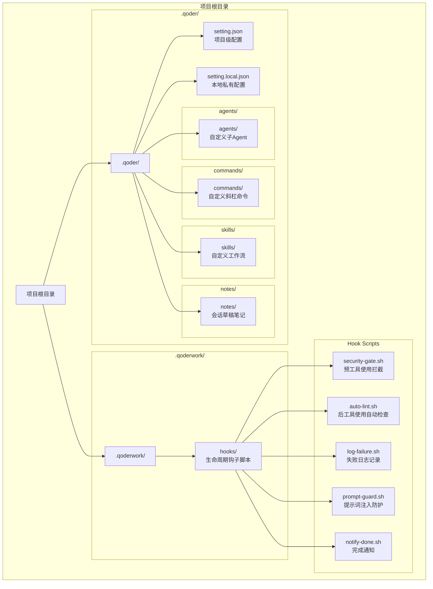

**图表来源**
- [QoderHarnessEngineering落地示例.md:42-67](file://QoderHarnessEngineering落地示例.md#L42-L67)
- [AGENTS.md:34-50](file://AGENTS.md#L34-L50)

**章节来源**
- [QoderHarnessEngineering落地示例.md:42-67](file://QoderHarnessEngineering落地示例.md#L42-L67)
- [AGENTS.md:34-50](file://AGENTS.md#L34-L50)

## 核心组件

### 三层配置层级

Qoder 采用严格的三层配置合并机制，每层都有明确的职责和优先级：

#### 用户级配置 (~/.qoder/settings.json)
- **作用域**：全局，对所有项目生效
- **维护者**：开发者个人
- **用途**：设置个人偏好的默认权限、全局 Hooks、个人 API 访问白名单
- **特点**：不提交到版本控制，属于个人配置

#### 项目级配置 (.qoder/setting.json)
- **作用域**：当前项目，团队共享
- **维护者**：项目团队
- **用途**：定义项目特定的权限策略、工作流自动化
- **特点**：提交到 Git，确保团队一致性

#### 本地私有配置 (.qoder/setting.local.json)
- **作用域**：当前开发者的本地环境
- **维护者**：开发者个人
- **用途**：个人化的配置覆盖，不影响团队配置
- **特点**：必须加入 .gitignore，不提交到版本控制

### 合并优先级原则

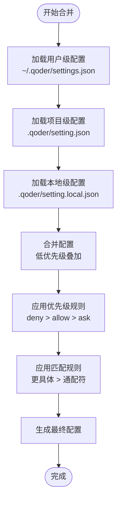

**图表来源**
- [QoderHarnessEngineering落地示例.md:25-33](file://QoderHarnessEngineering落地示例.md#L25-L33)
- [QoderHarnessEngineering落地示例.md:244-249](file://QoderHarnessEngineering落地示例.md#L244-L249)

**章节来源**
- [QoderHarnessEngineering落地示例.md:25-33](file://QoderHarnessEngineering落地示例.md#L25-L33)
- [QoderHarnessEngineering落地示例.md:244-249](file://QoderHarnessEngineering落地示例.md#L244-L249)

## 架构概览

### 配置合并架构

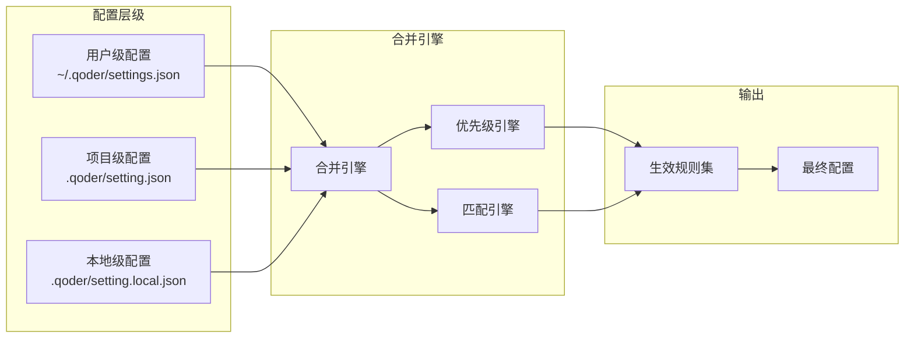

**图表来源**
- [QoderHarnessEngineering落地示例.md:25-33](file://QoderHarnessEngineering落地示例.md#L25-L33)
- [QoderHarnessEngineering落地示例.md:244-249](file://QoderHarnessEngineering落地示例.md#L244-L249)

### 权限策略架构

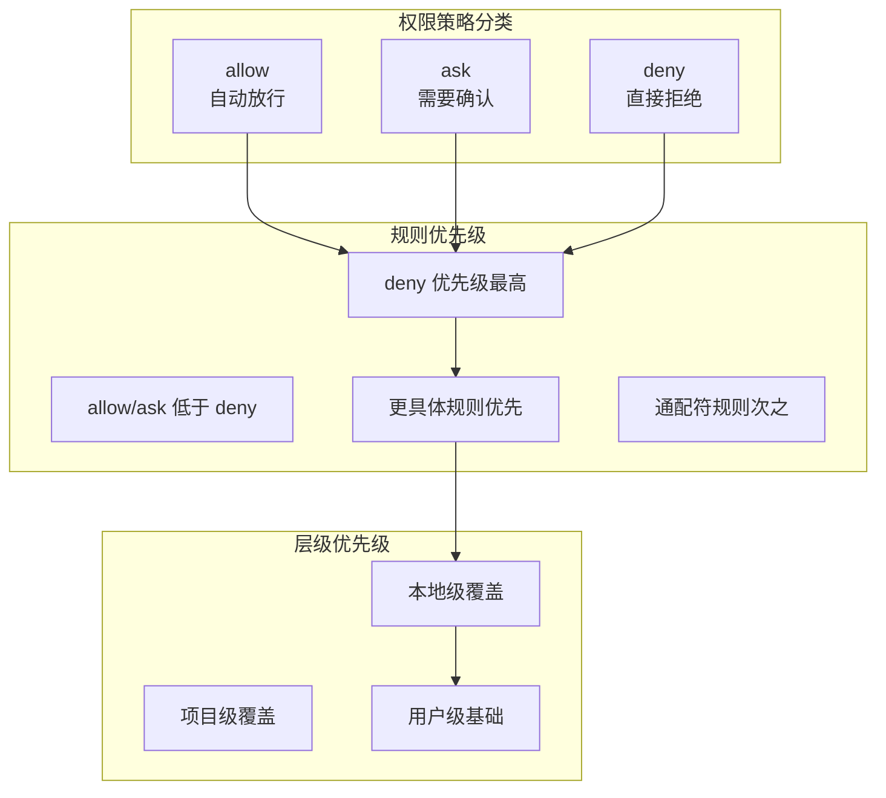

**图表来源**
- [QoderHarnessEngineering落地示例.md:244-249](file://QoderHarnessEngineering落地示例.md#L244-L249)

**章节来源**
- [QoderHarnessEngineering落地示例.md:244-249](file://QoderHarnessEngineering落地示例.md#L244-L249)

## 详细组件分析

### 用户级配置组件

#### 配置文件结构

用户级配置文件位于 `~/.qoder/settings.json`，主要包含以下结构：

- **permissions.allow**：自动放行的规则列表
- **permissions.deny**：直接拒绝的规则列表  
- **hooks**：全局钩子配置

#### 典型用途

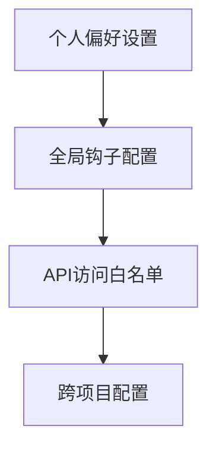

**图表来源**
- [QoderHarnessEngineering落地示例.md:80-84](file://QoderHarnessEngineering落地示例.md#L80-L84)

**章节来源**
- [QoderHarnessEngineering落地示例.md:71-111](file://QoderHarnessEngineering落地示例.md#L71-L111)

### 项目级配置组件

#### 配置文件结构

项目级配置文件位于 `.qoder/setting.json`，包含：

- **permissions.allow**：项目允许的操作规则
- **permissions.ask**：需要用户确认的操作规则
- **permissions.deny**：严格禁止的操作规则
- **hooks**：项目特定的生命周期钩子

#### 设计要点

项目级配置体现了最小权限原则和分层保护策略：

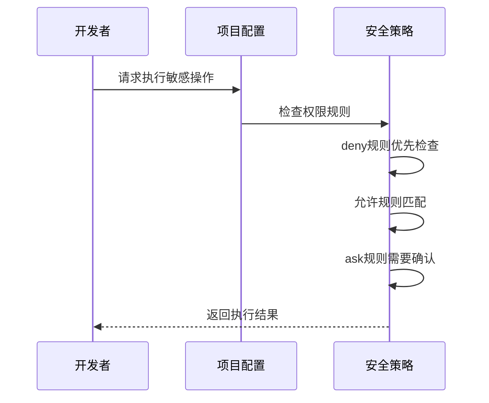

**图表来源**
- [QoderHarnessEngineering落地示例.md:186-190](file://QoderHarnessEngineering落地示例.md#L186-L190)

**章节来源**
- [QoderHarnessEngineering落地示例.md:123-184](file://QoderHarnessEngineering落地示例.md#L123-L184)

### 本地私有配置组件

#### 配置文件结构

本地私有配置文件位于 `.qoder/setting.local.json`，主要用于：

- **局部覆盖**：在不影响团队配置的情况下进行个人定制
- **环境差异**：处理不同开发环境的特殊需求
- **临时调整**：短期的配置变更需求

#### 使用场景

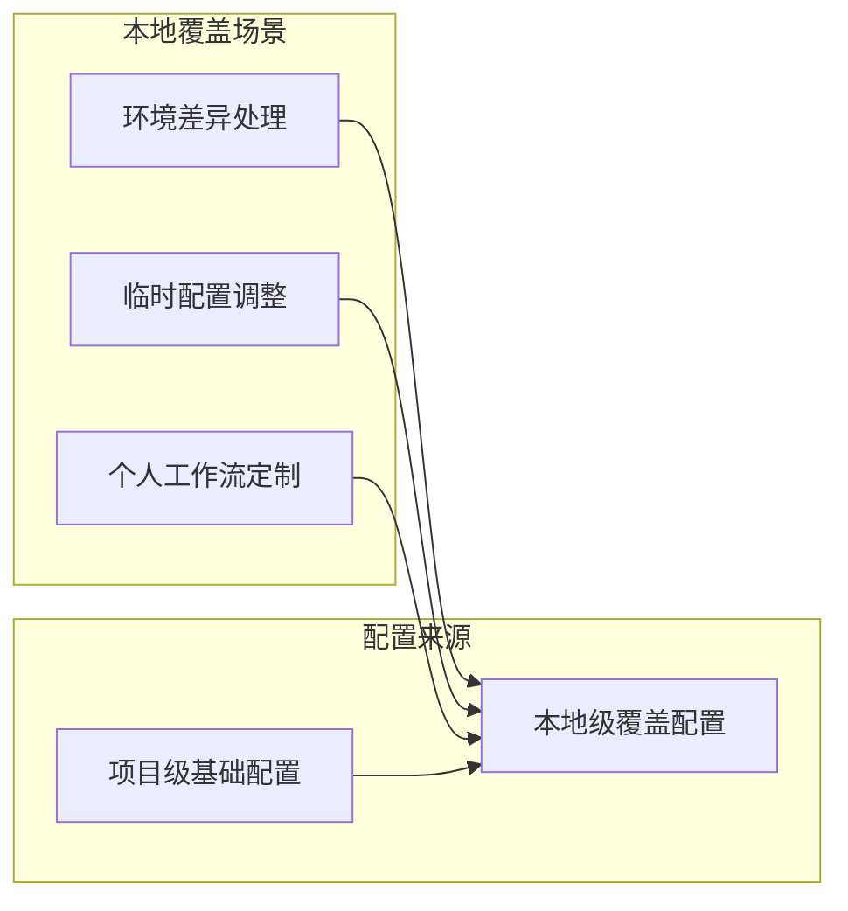

**图表来源**
- [QoderHarnessEngineering落地示例.md:196-221](file://QoderHarnessEngineering落地示例.md#L196-L221)

**章节来源**
- [QoderHarnessEngineering落地示例.md:194-221](file://QoderHarnessEngineering落地示例.md#L194-L221)

### 权限策略组件

#### 规则格式体系

| 类型 | 格式 | 示例 | 说明 |
|------|------|------|------|
| Bash 命令 | `Bash(前缀*)` | `Bash(npm run*)` | 匹配 Bash 命令前缀 |
| 读取文件 | `Read(glob)` | `Read(./src/**)` | 读取指定路径文件 |
| 编辑文件 | `Edit(glob)` | `Edit(./tests/**)` | 编辑指定路径文件 |
| 网络请求 | `WebFetch(domain:域名)` | `WebFetch(domain:api.github.com)` | 访问指定域名 |
| 路径取反 | `Read(!路径)` | `Read(!~/.ssh/**)` | 排除特定路径 |

#### 优先级规则实现

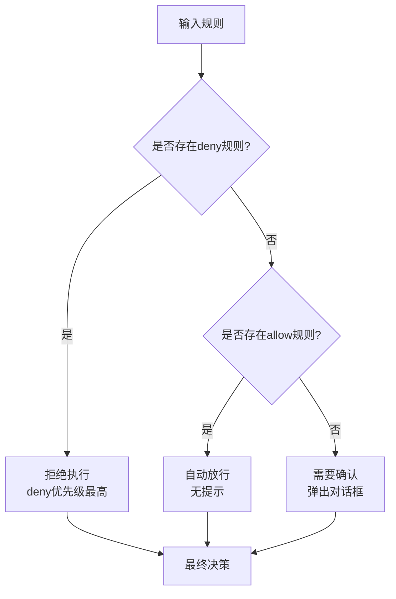

**图表来源**
- [QoderHarnessEngineering落地示例.md:244-249](file://QoderHarnessEngineering落地示例.md#L244-L249)

**章节来源**
- [QoderHarnessEngineering落地示例.md:224-251](file://QoderHarnessEngineering落地示例.md#L224-L251)

### 生命周期钩子组件

#### 钩子事件体系

| 事件名称 | 触发时机 | 可阻断 | 说明 |
|----------|----------|--------|------|
| `PreToolUse` | 工具执行前 | ✅ exit 2 | 预工具使用拦截 |
| `PostToolUse` | 工具成功后 | ❌ | 后工具使用检查 |
| `PostToolUseFailure` | 工具失败后 | ❌ | 失败记录 |
| `UserPromptSubmit` | 用户提交 prompt 后 | ✅ | 提示词注入防护 |
| `Stop` | Agent 完成响应时 | ✅ | 完成通知 |
| `SessionStart` | 会话启动 | ❌ | 会话开始 |
| `SessionEnd` | 会话结束 | ❌ | 会话结束 |
| `SubagentStart` | 子 Agent 启动 | ❌ | 子代理开始 |
| `SubagentStop` | 子 Agent 完成 | ✅ | 子代理停止 |
| `PreCompact` | 上下文压缩前 | ❌ | 上下文压缩 |
| `Notification` | 权限/通知事件 | ❌ | 权限通知 |

#### 钩子脚本实现

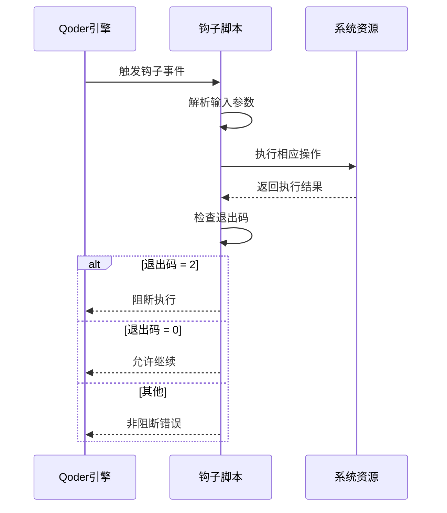

**图表来源**
- [QoderHarnessEngineering落地示例.md:253-278](file://QoderHarnessEngineering落地示例.md#L253-L278)

**章节来源**
- [QoderHarnessEngineering落地示例.md:253-338](file://QoderHarnessEngineering落地示例.md#L253-L338)

## 依赖关系分析

### 配置依赖图

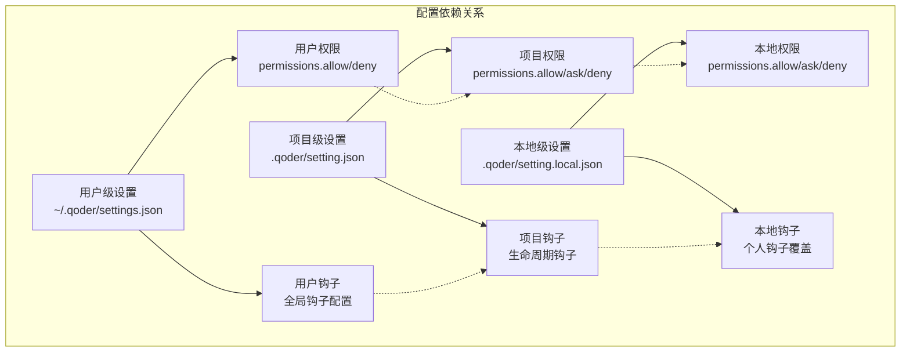

**图表来源**
- [QoderHarnessEngineering落地示例.md:113-121](file://QoderHarnessEngineering落地示例.md#L113-L121)

### 权限继承关系

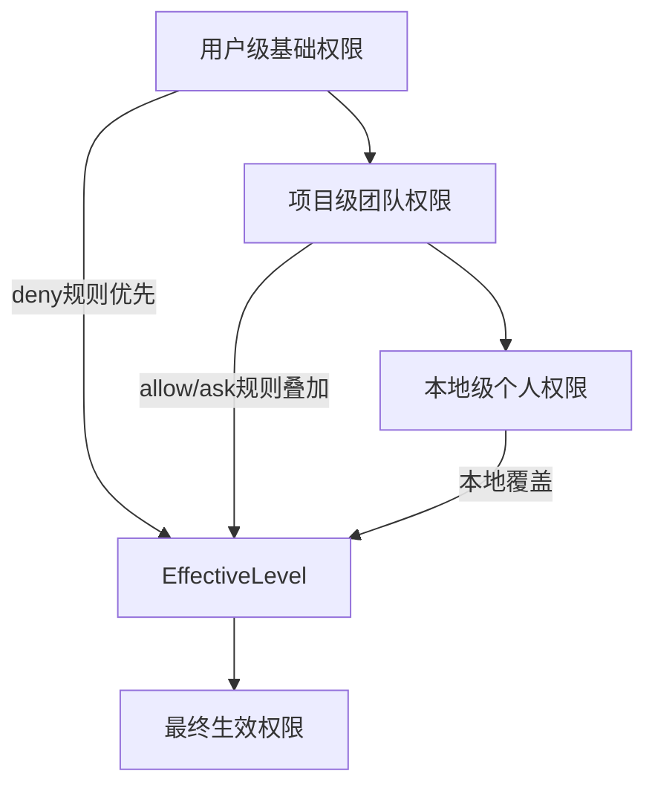

**图表来源**
- [QoderHarnessEngineering落地示例.md:244-249](file://QoderHarnessEngineering落地示例.md#L244-L249)

**章节来源**
- [QoderHarnessEngineering落地示例.md:113-121](file://QoderHarnessEngineering落地示例.md#L113-L121)
- [QoderHarnessEngineering落地示例.md:244-249](file://QoderHarnessEngineering落地示例.md#L244-L249)

## 性能考虑

### 配置加载性能

- **延迟加载**：配置文件按需加载，避免不必要的 I/O 操作
- **缓存机制**：已解析的配置结果进行缓存，减少重复计算
- **增量更新**：本地配置变更时，仅重新计算受影响的部分

### 合并算法复杂度

- **时间复杂度**：O(n*m)，其中 n 为规则数量，m 为层级数量
- **空间复杂度**：O(n)，存储合并后的规则集合
- **优化策略**：使用索引加速规则匹配，避免重复计算

## 故障排除指南

### 常见配置冲突场景

#### 场景一：deny 与 allow 冲突
当同一规则同时出现在 deny 和 allow 列表中时，deny 规则具有绝对优先权。

#### 场景二：通配符与具体规则冲突
更具体的规则（如精确路径匹配）优先于通配符规则（如 `*`）。

#### 场景三：层级覆盖问题
本地级配置可以覆盖项目级配置，但不能影响其他用户的配置。

### 调试方法

1. **检查配置文件语法**：确保 JSON 格式正确
2. **验证规则格式**：确认权限规则符合规范
3. **测试钩子脚本**：验证脚本执行权限和返回码
4. **查看日志输出**：检查失败日志和调试信息

**章节来源**
- [QoderHarnessEngineering落地示例.md:244-249](file://QoderHarnessEngineering落地示例.md#L244-L249)

## 结论

Qoder Harness Engineering 的三层配置系统通过精心设计的优先级机制和合并算法，实现了安全性和灵活性的平衡。该系统的核心优势在于：

1. **分层治理**：清晰的层级划分确保了配置的可控性
2. **优先级明确**：deny 优先、更具体规则优先的原则简化了冲突解决
3. **可扩展性强**：支持用户级、项目级、本地级的灵活配置
4. **安全性保障**：通过钩子机制和权限控制确保操作安全

通过合理利用这一配置系统，团队可以在保证安全性的前提下，为不同层级的用户提供适当的配置灵活性，实现高效的工程化协作。