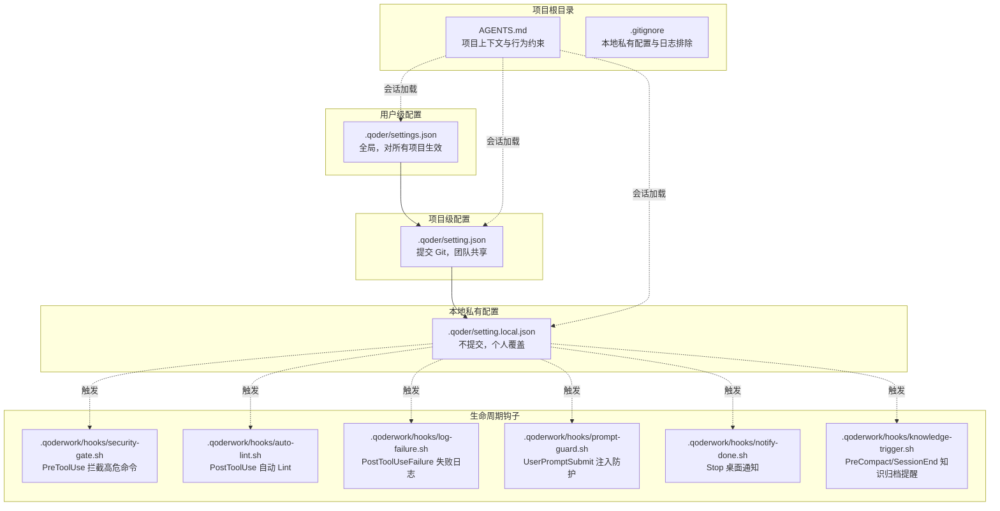
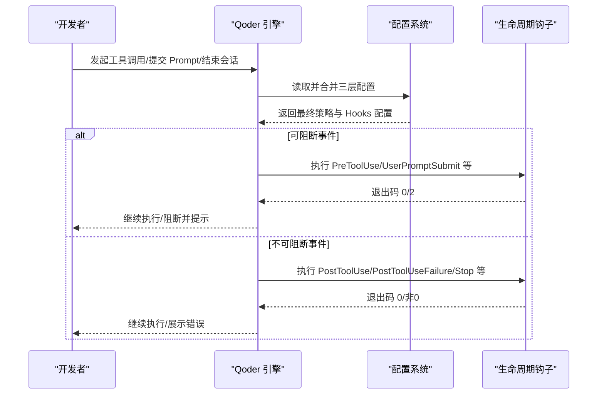
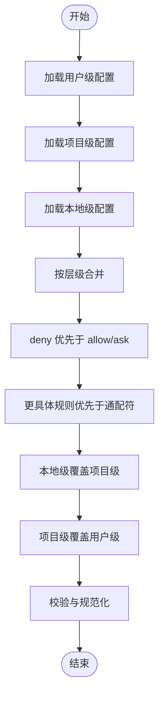
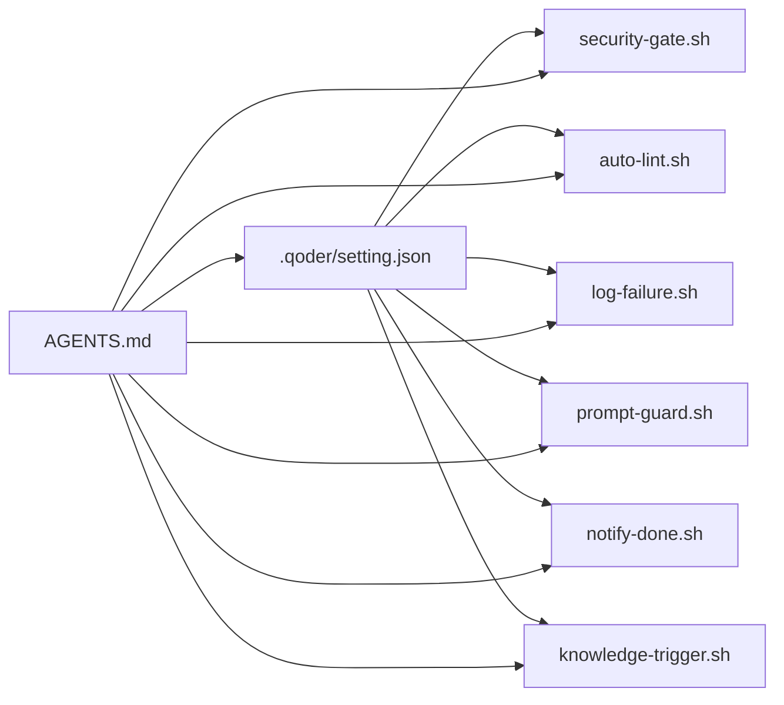

# 配置系统

<cite>
**本文引用的文件**
- [QoderHarnessEngineering落地示例.md](file://QoderHarnessEngineering落地示例.md)
- [AGENTS.md](file://AGENTS.md)
- [.gitignore](file://.gitignore)
- [security-gate.sh](file://.qoderwork/hooks/security-gate.sh)
- [auto-lint.sh](file://.qoderwork/hooks/auto-lint.sh)
- [log-failure.sh](file://.qoderwork/hooks/log-failure.sh)
- [prompt-guard.sh](file://.qoderwork/hooks/prompt-guard.sh)
- [notify-done.sh](file://.qoderwork/hooks/notify-done.sh)
- [knowledge-trigger.sh](file://.qoderwork/hooks/knowledge-trigger.sh)
</cite>

## 目录
1. [引言](#引言)
2. [项目结构](#项目结构)
3. [核心组件](#核心组件)
4. [架构总览](#架构总览)
5. [详细组件分析](#详细组件分析)
6. [依赖关系分析](#依赖关系分析)
7. [性能考虑](#性能考虑)
8. [故障排查指南](#故障排查指南)
9. [结论](#结论)
10. [附录](#附录)

## 引言
本文件面向 Qoder Harness Engineering 的配置系统，系统性阐述三层配置层级与优先级机制、setting.json 与 setting.local.json 的字段语义与验证规则、权限策略与 Hooks 生命周期工程，并结合 AGENTS.md 的项目上下文定义，给出合并算法的技术实现细节、最佳实践与常见配置模式，帮助团队按需定制工程化接入方案。

## 项目结构
本项目在工作区根目录下提供配置与扩展目录，形成“用户级（全局）→项目级（共享）→本地级（私有）”的三层配置链路，配合 Hooks 脚本实现“执行前拦截、执行后检查、失败记录、提示词防护、桌面通知、知识归档触发”等工程化能力。

图表来源
- [QoderHarnessEngineering落地示例.md:42-67](file://QoderHarnessEngineering落地示例.md#L42-L67)
- [AGENTS.md:34-50](file://AGENTS.md#L34-L50)
- [.gitignore:1-12](file://.gitignore#L1-L12)

章节来源
- [QoderHarnessEngineering落地示例.md:42-67](file://QoderHarnessEngineering落地示例.md#L42-L67)
- [AGENTS.md:34-50](file://AGENTS.md#L34-L50)
- [.gitignore:1-12](file://.gitignore#L1-L12)

## 核心组件
- 三层配置合并与优先级
  - 合并顺序：用户级 → 项目级 → 本地级；低优先级不会覆盖高优先级，而是“合并叠加”
  - deny 优先于 allow/ask，无论层级
  - 本地级覆盖项目级，项目级覆盖用户级
- 权限策略（permissions）
  - allow：自动放行，无提示
  - ask：弹出确认对话框，用户决定是否执行
  - deny：直接拒绝，不可执行，不弹窗
  - 规则类型：Bash 命令、读取/编辑文件、WebFetch 域名、路径取反
- Hooks 生命周期（hooks）
  - 事件类型：PreToolUse、PostToolUse、PostToolUseFailure、UserPromptSubmit、Stop、SessionStart、SessionEnd、SubagentStart、SubagentStop、PreCompact、Notification
  - 退出码：0 允许继续；2 阻断（仅对可阻断事件有效）；其他非阻断性错误
- AGENTS.md
  - 项目级上下文与行为约束，每次会话自动加载，影响所有 Agent 与子会话

章节来源
- [QoderHarnessEngineering落地示例.md:23-39](file://QoderHarnessEngineering落地示例.md#L23-L39)
- [QoderHarnessEngineering落地示例.md:224-251](file://QoderHarnessEngineering落地示例.md#L224-L251)
- [QoderHarnessEngineering落地示例.md:253-270](file://QoderHarnessEngineering落地示例.md#L253-L270)
- [AGENTS.md:3-69](file://AGENTS.md#L3-L69)

## 架构总览
三层配置与 Hooks 的交互关系如下：

图表来源
- [QoderHarnessEngineering落地示例.md:23-39](file://QoderHarnessEngineering落地示例.md#L23-L39)
- [QoderHarnessEngineering落地示例.md:253-270](file://QoderHarnessEngineering落地示例.md#L253-L270)

## 详细组件分析

### 配置层级与合并算法
- 合并策略
  - 用户级：全局默认，适合个人偏好与通用 Hooks
  - 项目级：团队共享，定义通用权限与默认 Hooks
  - 本地级：个人覆盖，建议加入 .gitignore，避免污染仓库
- 合并与优先级规则
  - deny > allow/ask（跨层级）
  - 更具体规则优先于通配符规则
  - 本地级覆盖项目级，项目级覆盖用户级
- 验证与校验建议
  - allow/ask/deny 列表去重与冲突检测
  - glob 与 domain: 域名校验
  - hooks 事件名与脚本路径存在性校验
  - 退出码与 timeout 合法性校验

图表来源
- [QoderHarnessEngineering落地示例.md:23-39](file://QoderHarnessEngineering落地示例.md#L23-L39)
- [QoderHarnessEngineering落地示例.md:244-249](file://QoderHarnessEngineering落地示例.md#L244-L249)

章节来源
- [QoderHarnessEngineering落地示例.md:23-39](file://QoderHarnessEngineering落地示例.md#L23-L39)
- [QoderHarnessEngineering落地示例.md:244-249](file://QoderHarnessEngineering落地示例.md#L244-L249)

### setting.json（项目级配置）
- 位置与作用
  - .qoder/setting.json，提交 Git，团队共享
  - 定义项目级权限策略与默认 Hooks
- 关键字段
  - permissions.allow/ask/deny：规则集合
  - hooks.<事件名>：事件到 Hook 列表的映射
- 设计要点
  - allow 放行常规只读与受控编辑
  - ask 拦截 Git 写操作与配置文件修改，强制确认
  - deny 禁止危险命令与敏感路径访问
  - 三类 Hooks 覆盖执行前拦截、执行后检查、失败记录
- 示例参考
  - 完整示例见“项目级配置 — setting.json”章节

章节来源
- [QoderHarnessEngineering落地示例.md:123-191](file://QoderHarnessEngineering落地示例.md#L123-L191)

### setting.local.json（本地私有配置）
- 位置与作用
  - .qoder/setting.local.json，不提交，个人覆盖
  - 用于本地临时覆盖或特殊场景
- 推荐做法
  - 将其加入 .gitignore
  - 保持最小化覆盖，避免与团队策略冲突
- 示例参考
  - 初始模板与常见覆盖场景见“本地私有配置 — setting.local.json”章节

章节来源
- [QoderHarnessEngineering落地示例.md:194-221](file://QoderHarnessEngineering落地示例.md#L194-L221)
- [.gitignore:1-2](file://.gitignore#L1-L2)

### 权限策略（permissions）
- 规则格式速查
  - Bash(前缀*)、Read(glob)、Edit(glob)、WebFetch(domain:域名)、Read(!路径)
- 语义
  - allow：自动放行
  - ask：弹窗确认
  - deny：直接拒绝
- 优先级
  - deny > allow/ask；更具体规则优先；本地级覆盖项目级，项目级覆盖用户级

章节来源
- [QoderHarnessEngineering落地示例.md:224-251](file://QoderHarnessEngineering落地示例.md#L224-L251)

### Hooks 生命周期工程
- 事件与行为
  - PreToolUse：工具执行前，可阻断（exit 2）
  - PostToolUse：工具成功后
  - PostToolUseFailure：工具失败后
  - UserPromptSubmit：用户提交 Prompt 后，可阻断
  - Stop：Agent 完成响应时，可阻断
  - SessionStart/SessionEnd/SubagentStart/SubagentStop/PreCompact/Notification
- 退出码规范
  - 0：允许继续
  - 2：阻断（仅对可阻断事件）
  - 其他：非阻断性错误，stderr 展示给用户
- 脚本职责与示例
  - security-gate.sh：拦截高危命令（PreToolUse/Bash）
  - auto-lint.sh：文件写入/编辑后自动 Lint（PostToolUse/Write|Edit）
  - log-failure.sh：失败记录（PostToolUseFailure/*）
  - prompt-guard.sh：提示词注入防护（UserPromptSubmit）
  - notify-done.sh：任务完成通知（Stop）
  - knowledge-trigger.sh：知识归档提醒（PreCompact/SessionEnd）

章节来源
- [QoderHarnessEngineering落地示例.md:253-337](file://QoderHarnessEngineering落地示例.md#L253-L337)
- [security-gate.sh:1-38](file://.qoderwork/hooks/security-gate.sh#L1-L38)
- [auto-lint.sh:1-43](file://.qoderwork/hooks/auto-lint.sh#L1-L43)
- [log-failure.sh:1-20](file://.qoderwork/hooks/log-failure.sh#L1-L20)
- [prompt-guard.sh:1-55](file://.qoderwork/hooks/prompt-guard.sh#L1-L55)
- [notify-done.sh:1-16](file://.qoderwork/hooks/notify-done.sh#L1-L16)
- [knowledge-trigger.sh:1-40](file://.qoderwork/hooks/knowledge-trigger.sh#L1-L40)

### AGENTS.md（项目上下文与行为约束）
- 作用
  - 为 Qoder 提供项目级上下文与行为规范，每次会话自动加载
- 推荐内容
  - 项目简介、技术栈、代码修改范围、Git 规范、禁止行为、Hooks 速查
- 本项目约束示例
  - 修改配置文件前须确认
  - 禁止直接删除文件
  - Git commit/push 前须确认
  - 代码编辑范围限定在 ./src/** 与 ./tests/**

章节来源
- [AGENTS.md:1-69](file://AGENTS.md#L1-L69)

## 依赖关系分析
- 配置依赖
  - setting.json 与 setting.local.json 依赖 AGENTS.md 的上下文约束
  - Hooks 脚本依赖 setting.json 中 hooks 字段的事件与 matcher 配置
- 脚本依赖
  - security-gate.sh 依赖 Bash 与 jq
  - auto-lint.sh 依赖各类静态检查工具（ESLint/ruff/gofmt/shellcheck）
  - log-failure.sh 依赖 jq 与日志目录
  - prompt-guard.sh 依赖 Bash 与 jq
  - notify-done.sh 依赖 macOS 的 osascript
  - knowledge-trigger.sh 依赖 jq 与日志目录

图表来源
- [QoderHarnessEngineering落地示例.md:123-191](file://QoderHarnessEngineering落地示例.md#L123-L191)
- [AGENTS.md:34-50](file://AGENTS.md#L34-L50)

章节来源
- [QoderHarnessEngineering落地示例.md:123-191](file://QoderHarnessEngineering落地示例.md#L123-L191)
- [AGENTS.md:34-50](file://AGENTS.md#L34-L50)

## 性能考虑
- 合并与校验
  - 对 allow/ask/deny 列表进行去重与冲突检测，减少运行时判断开销
  - glob 与 domain 校验提前完成，避免运行期失败
- Hooks 执行
  - 控制 timeout，避免长时间阻塞
  - 将非关键性检查（如 Lint）设为非阻断性（非 2 退出码）
- 日志与资源
  - 合理设置日志轮转与保留周期，避免磁盘占用过大

## 故障排查指南
- 常见问题与处理
  - 命令被误阻断：检查 deny 与 ask 规则优先级，必要时在本地级放宽
  - Hooks 未生效：确认 setting.json 中 hooks 事件名与脚本路径正确，脚本具备执行权限
  - 提示词注入被阻断：检查 prompt-guard.sh 的匹配规则，必要时调整
  - 失败日志缺失：确认 log-failure.sh 脚本可写日志目录
- 调试建议
  - 在本地级临时开启更宽松规则，逐步收敛
  - 通过 stderr 输出定位具体阻断原因
  - 使用 .gitignore 确保本地级配置不被提交

章节来源
- [QoderHarnessEngineering落地示例.md:253-270](file://QoderHarnessEngineering落地示例.md#L253-L270)
- [log-failure.sh:1-20](file://.qoderwork/hooks/log-failure.sh#L1-L20)
- [prompt-guard.sh:1-55](file://.qoderwork/hooks/prompt-guard.sh#L1-L55)

## 结论
Qoder Harness Engineering 的配置系统通过三层合并机制与严格的 deny 优先策略，实现了“团队共享 + 个人覆盖”的灵活治理；结合 Hooks 生命周期工程与 AGENTS.md 的项目上下文，构建了从安全拦截到质量保障再到知识沉淀的全链路工程化能力。建议团队在遵循 deny 优先与最小覆盖原则的基础上，按需扩展权限与 Hooks，持续优化开发体验与安全性。

## 附录

### 配置项与验证规则摘要
- permissions.allow/ask/deny
  - 类型：字符串数组，支持 Bash 前缀、glob、WebFetch(domain:*)、路径取反
  - 规则：deny > allow/ask；更具体优先于通配符
- hooks.<事件名>
  - 类型：数组，元素含 matcher 与 hooks 列表
  - matcher：事件匹配对象（如 Bash、Write|Edit 等）
  - hooks：命令型 Hook，含 type、command、timeout 等
- 退出码
  - 0：允许继续；2：阻断；其他：非阻断性错误

章节来源
- [QoderHarnessEngineering落地示例.md:224-251](file://QoderHarnessEngineering落地示例.md#L224-L251)
- [QoderHarnessEngineering落地示例.md:253-270](file://QoderHarnessEngineering落地示例.md#L253-L270)

### 常见配置模式与示例路径
- 用户级配置（个人偏好与全局 Hooks）
  - 示例路径：[QoderHarnessEngineering落地示例.md:85-111](file://QoderHarnessEngineering落地示例.md#L85-L111)
- 项目级配置（团队共享）
  - 完整示例路径：[QoderHarnessEngineering落地示例.md:127-184](file://QoderHarnessEngineering落地示例.md#L127-L184)
- 本地私有配置（个人覆盖）
  - 初始模板路径：[QoderHarnessEngineering落地示例.md:199-207](file://QoderHarnessEngineering落地示例.md#L199-L207)
  - 常见覆盖示例路径：[QoderHarnessEngineering落地示例.md:209-220](file://QoderHarnessEngineering落地示例.md#L209-L220)
- 权限规则格式速查
  - 路径：[QoderHarnessEngineering落地示例.md:226-235](file://QoderHarnessEngineering落地示例.md#L226-L235)
- Hooks 事件与脚本
  - 事件列表与退出码：[QoderHarnessEngineering落地示例.md:255-270](file://QoderHarnessEngineering落地示例.md#L255-L270)
  - 脚本实现参考：
    - [security-gate.sh:1-38](file://.qoderwork/hooks/security-gate.sh#L1-L38)
    - [auto-lint.sh:1-43](file://.qoderwork/hooks/auto-lint.sh#L1-L43)
    - [log-failure.sh:1-20](file://.qoderwork/hooks/log-failure.sh#L1-L20)
    - [prompt-guard.sh:1-55](file://.qoderwork/hooks/prompt-guard.sh#L1-L55)
    - [notify-done.sh:1-16](file://.qoderwork/hooks/notify-done.sh#L1-L16)
    - [knowledge-trigger.sh:1-40](file://.qoderwork/hooks/knowledge-trigger.sh#L1-L40)
- AGENTS.md 项目上下文
  - 路径：[AGENTS.md:34-50](file://AGENTS.md#L34-L50)