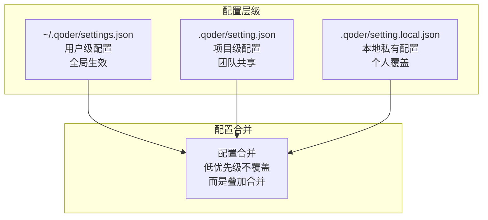
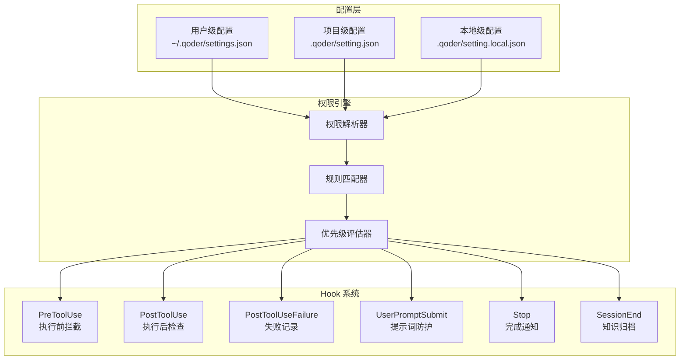
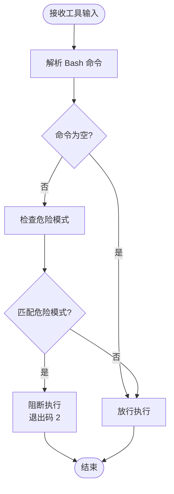
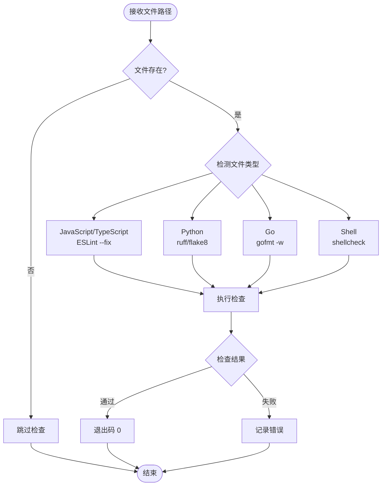
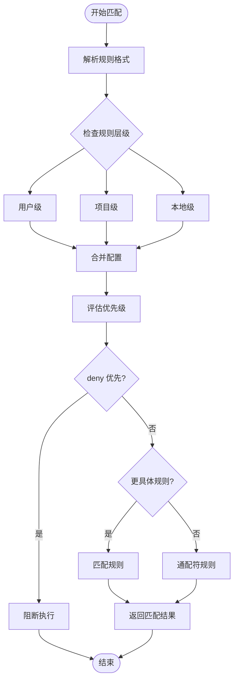
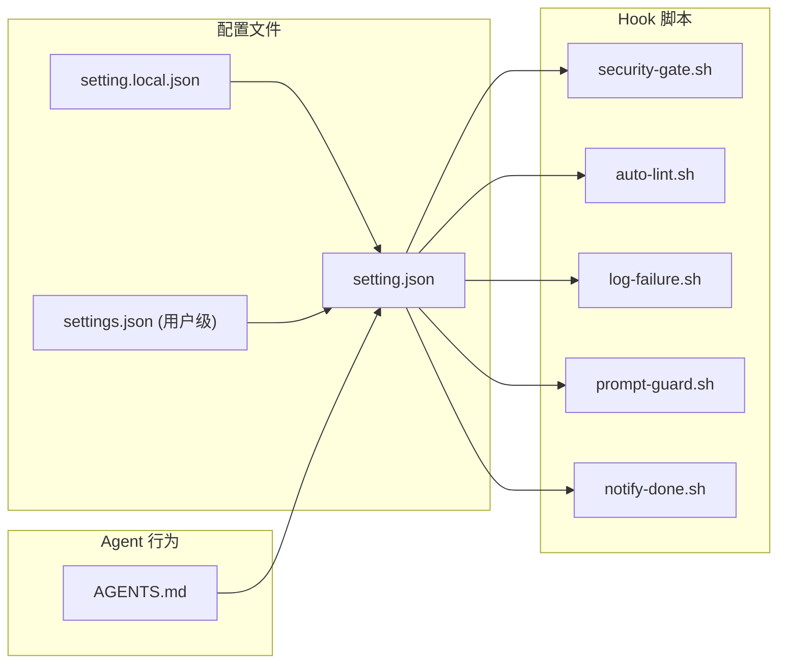

# 项目级配置 - setting.json

<cite>
**本文引用的文件**
- [QoderHarnessEngineering落地示例.md](file://QoderHarnessEngineering落地示例.md)
- [security-gate.sh](file://.qoderwork/hooks/security-gate.sh)
- [auto-lint.sh](file://.qoderwork/hooks/auto-lint.sh)
- [log-failure.sh](file://.qoderwork/hooks/log-failure.sh)
- [prompt-guard.sh](file://.qoderwork/hooks/prompt-guard.sh)
- [notify-done.sh](file://.qoderwork/hooks/notify-done.sh)
- [AGENTS.md](file://AGENTS.md)
</cite>

## 目录
1. [简介](#简介)
2. [项目结构](#项目结构)
3. [核心组件](#核心组件)
4. [架构概览](#架构概览)
5. [详细组件分析](#详细组件分析)
6. [依赖关系分析](#依赖关系分析)
7. [性能考虑](#性能考虑)
8. [故障排除指南](#故障排除指南)
9. [结论](#结论)
10. [附录](#附录)

## 简介

本文档详细解析 Qoder 项目级配置文件 `setting.json` 的完整配置结构和语法格式。该配置文件位于项目根目录的 `.qoder/` 目录下，是团队共享的配置文件，用于定义项目的权限策略、Hook 脚本和行为约束。本文档涵盖了权限系统的三大策略（allow、ask、deny）、各种规则格式的语法规则、Hook 生命周期工程以及最佳实践建议。

## 项目结构

Qoder 项目采用三层配置合并机制，每层配置都有其特定的作用域和优先级：



**图表来源**
- [QoderHarnessEngineering落地示例.md: 23-39:23-39](file://QoderHarnessEngineering落地示例.md#L23-L39)

**章节来源**
- [QoderHarnessEngineering落地示例.md: 23-39:23-39](file://QoderHarnessEngineering落地示例.md#L23-L39)

## 核心组件

### 权限策略系统

Qoder 的权限策略采用三层设计，确保在保证安全性的前提下提供良好的开发体验：

#### 三大策略语义

| 策略类型 | 语义 | 行为 | 优先级 |
|---------|------|------|--------|
| allow | 允许 | 自动放行，无提示 | 最低 |
| ask | 确认 | 弹出确认对话框，用户决定 | 中等 |
| deny | 拒绝 | 直接拒绝，不可执行 | 最高 |

#### 规则格式速查表

| 类型 | 格式 | 示例 | 说明 |
|------|------|------|------|
| Bash 命令 | `Bash(前缀*)` | `Bash(npm run*)` | 匹配以指定前缀开头的 Bash 命令 |
| 读取文件 | `Read(glob)` | `Read(./src/**)` | 允许读取指定路径的文件 |
| 编辑文件 | `Edit(glob)` | `Edit(./tests/**)` | 允许编辑指定路径的文件 |
| 网络请求 | `WebFetch(domain:域名)` | `WebFetch(domain:api.github.com)` | 允许访问指定域名的网络请求 |
| 路径取反 | `Read(!路径)` | `Read(!~/.ssh/**)` | 排除指定路径的读取权限 |

**章节来源**
- [QoderHarnessEngineering落地示例.md: 224-250:224-250](file://QoderHarnessEngineering落地示例.md#L224-L250)

## 架构概览

Qoder 的配置系统采用分层架构设计，结合 Hook 脚本实现完整的生命周期控制：



**图表来源**
- [QoderHarnessEngineering落地示例.md: 123-191:123-191](file://QoderHarnessEngineering落地示例.md#L123-L191)

## 详细组件分析

### 权限配置详解

#### allow 数组配置

allow 数组包含项目中常规使用的权限规则，这些规则会被自动放行且无需用户确认：

**典型规则类型：**
- 读取权限：`Read(./**)` - 允许读取项目内所有文件
- 编辑权限：`Edit(./src/**)` - 限制编辑范围到源代码目录
- 命令权限：`Bash(npm run*)` - 允许运行 npm 相关命令
- 网络权限：`WebFetch(domain:api.github.com)` - 允许访问 GitHub API

#### ask 数组配置

ask 数组包含需要用户确认的重要操作规则，这些操作虽然不是危险的，但需要人工审核：

**典型规则类型：**
- Git 操作：`Bash(git commit*)` - 提交前需要确认
- 配置修改：`Edit(./.qoder/**)` - 修改 Qoder 配置文件需要确认
- 工作区修改：`Edit(./.qoderwork/**)` - 修改 Hook 脚本需要确认

#### deny 数组配置

deny 数组包含严格禁止的操作规则，这些规则会直接阻止执行且不可绕过：

**典型规则类型：**
- 危险命令：`Bash(rm*)` - 禁止删除操作
- 特权命令：`Bash(sudo*)` - 禁止使用 sudo
- 敏感路径：`Read(~/.ssh/**)` - 禁止读取 SSH 密钥
- 权限修改：`Bash(chmod*)` - 禁止修改文件权限

**章节来源**
- [QoderHarnessEngineering落地示例.md: 127-184:127-184](file://QoderHarnessEngineering落地示例.md#L127-L184)

### Hook 生命周期工程

Qoder 提供了完整的生命周期 Hook 系统，支持 10+ 种事件类型：

#### Hook 事件类型

| 事件类型 | 触发时机 | 可阻断 | 匹配对象 | 退出码规范 |
|----------|----------|--------|----------|------------|
| PreToolUse | 工具执行前 | ✅ exit 2 | 工具名（Bash/Write/Edit/...） | 0=允许, 2=阻断, 其他=非阻断错误 |
| PostToolUse | 工具成功后 | ❌ | 工具名 | 0=继续, 非0=非阻断错误 |
| PostToolUseFailure | 工具失败后 | ❌ | 工具名 | 0=继续 |
| UserPromptSubmit | 用户提交 prompt 后 | ✅ | — | 0=继续, 2=阻断 |
| Stop | Agent 完成响应时 | ✅ | — | 0=继续 |
| SessionStart | 会话启动 | ❌ | startup/resume/compact | — |
| SessionEnd | 会话结束 | ❌ | prompt_input_exit/other | — |
| SubagentStart | 子 Agent 启动 | ❌ | Agent 类型名 | — |
| SubagentStop | 子 Agent 完成 | ✅ | Agent 类型名 | 0=继续, 2=阻断 |
| PreCompact | 上下文压缩前 | ❌ | manual/auto | — |
| Notification | 权限/通知事件 | ❌ | permission/result | — |

#### Hook 脚本实现

##### security-gate.sh - 安全门拦截



**图表来源**
- [security-gate.sh: 15-35:15-35](file://.qoderwork/hooks/security-gate.sh#L15-L35)

##### auto-lint.sh - 自动代码检查



**图表来源**
- [auto-lint.sh: 17-42:17-42](file://.qoderwork/hooks/auto-lint.sh#L17-L42)

**章节来源**
- [QoderHarnessEngineering落地示例.md: 253-337:253-337](file://QoderHarnessEngineering落地示例.md#L253-L337)

### 权限规则匹配算法

Qoder 的权限匹配采用精确优先级算法：



**图表来源**
- [QoderHarnessEngineering落地示例.md: 244-249:244-249](file://QoderHarnessEngineering落地示例.md#L244-L249)

**章节来源**
- [QoderHarnessEngineering落地示例.md: 244-249:244-249](file://QoderHarnessEngineering落地示例.md#L244-L249)

## 依赖关系分析

### 配置文件依赖关系



**图表来源**
- [QoderHarnessEngineering落地示例.md: 42-67:42-67](file://QoderHarnessEngineering落地示例.md#L42-L67)

### 权限规则依赖关系

| 规则类型 | 依赖工具 | 依赖环境 | 依赖配置 |
|----------|----------|----------|----------|
| Bash 命令 | bash, jq | 系统 PATH | 无 |
| Read 文件 | jq, 文件系统 | 无 | 无 |
| Edit 文件 | jq, 文件系统 | 无 | 无 |
| WebFetch | curl, jq | 网络连接 | 无 |
| 路径取反 | jq, glob | 无 | 无 |

**章节来源**
- [QoderHarnessEngineering落地示例.md: 42-67:42-67](file://QoderHarnessEngineering落地示例.md#L42-L67)

## 性能考虑

### 配置解析性能

Qoder 的配置解析采用延迟加载策略，只有在需要时才解析相应的 Hook 脚本：

- **配置缓存**：解析后的规则会缓存到内存中
- **规则预编译**：glob 模式会在首次使用时编译为正则表达式
- **最小化 IO**：Hook 脚本只在相应事件触发时才执行

### Hook 执行性能

- **异步执行**：Hook 脚本采用异步执行模式，避免阻塞主流程
- **超时控制**：每个 Hook 脚本都有超时限制（默认 10-30 秒）
- **资源限制**：Hook 脚本执行受限于系统资源和权限

## 故障排除指南

### 常见配置问题

#### 权限规则不生效

**症状**：配置的权限规则没有按照预期工作

**排查步骤**：
1. 检查规则格式是否正确
2. 验证规则优先级（deny 优先于 allow）
3. 确认规则匹配的具体程度
4. 检查是否存在更具体的规则覆盖

#### Hook 脚本执行失败

**症状**：Hook 脚本执行时报错或不按预期工作

**排查步骤**：
1. 检查脚本执行权限（需要 +x 权限）
2. 验证脚本依赖的外部工具是否安装
3. 检查脚本退出码是否正确
4. 查看 Hook 日志文件

#### 配置合并冲突

**症状**：本地配置没有覆盖项目配置

**排查步骤**：
1. 确认 setting.local.json 文件存在
2. 检查文件路径是否正确
3. 验证 JSON 格式是否正确
4. 确认文件未被 Git 提交

**章节来源**
- [QoderHarnessEngineering落地示例.md: 549-552:549-552](file://QoderHarnessEngineering落地示例.md#L549-L552)

### 调试技巧

#### 启用调试模式

```bash
# 在终端中启用详细日志
export QODER_DEBUG=true
```

#### 查看配置解析结果

```bash
# 查看合并后的配置
qoder config show

# 查看当前工作目录的配置
qoder config show --local
```

#### 测试权限规则

```bash
# 测试 Bash 命令权限
qoder test permission "Bash(npm run build)"

# 测试文件读取权限
qoder test permission "Read(./src/**/*.ts)"
```

## 结论

Qoder 的 `setting.json` 配置系统提供了一个强大而灵活的安全框架，通过三层配置合并机制和精细的权限控制，实现了在保证安全性的同时提升开发效率的目标。该系统的核心优势包括：

1. **分层配置**：用户级、项目级、本地级配置的灵活组合
2. **精细控制**：allow、ask、deny 三种策略的精确权限控制
3. **生命周期管理**：完整的 Hook 系统覆盖软件开发生命周期
4. **可扩展性**：支持自定义 Hook 脚本和规则格式

通过合理配置 `setting.json`，团队可以在确保代码安全的前提下，最大化开发效率和协作体验。

## 附录

### 最佳实践建议

#### 权限配置最佳实践

1. **最小权限原则**：只授予必要的权限
2. **分层配置**：将通用规则放在项目级，个人偏好放在本地级
3. **明确分类**：将规则分为 allow、ask、deny 三类，避免混淆
4. **定期审查**：定期审查和更新权限规则

#### Hook 脚本最佳实践

1. **幂等性**：Hook 脚本应该具有幂等性
2. **超时控制**：为 Hook 脚本设置合理的超时时间
3. **错误处理**：完善错误处理和日志记录
4. **测试验证**：在开发环境中充分测试 Hook 脚本

#### 安全配置建议

1. **默认拒绝**：采用默认拒绝策略，只在必要时放行
2. **路径限制**：限制文件操作的路径范围
3. **命令白名单**：建立命令执行的白名单机制
4. **网络访问控制**：严格控制网络请求的域名和端口

### 配置示例模板

#### 基础权限配置模板

```json
{
  "permissions": {
    "allow": [
      "Read(./**)",
      "Bash(npm run*)"
    ],
    "ask": [
      "Bash(git commit*)"
    ],
    "deny": [
      "Bash(rm*)"
    ]
  }
}
```

#### 网络访问控制模板

```json
{
  "permissions": {
    "allow": [
      "WebFetch(domain:api.github.com)",
      "WebFetch(domain:registry.npmjs.org)"
    ],
    "deny": [
      "WebFetch(domain:*)"
    ]
  }
}
```

#### Hook 配置模板

```json
{
  "hooks": {
    "PreToolUse": [
      {
        "matcher": "Bash",
        "hooks": [
          { "type": "command", "command": ".qoderwork/hooks/security-gate.sh" }
        ]
      }
    ]
  }
}
```

**章节来源**
- [QoderHarnessEngineering落地示例.md: 524-548:524-548](file://QoderHarnessEngineering落地示例.md#L524-L548)