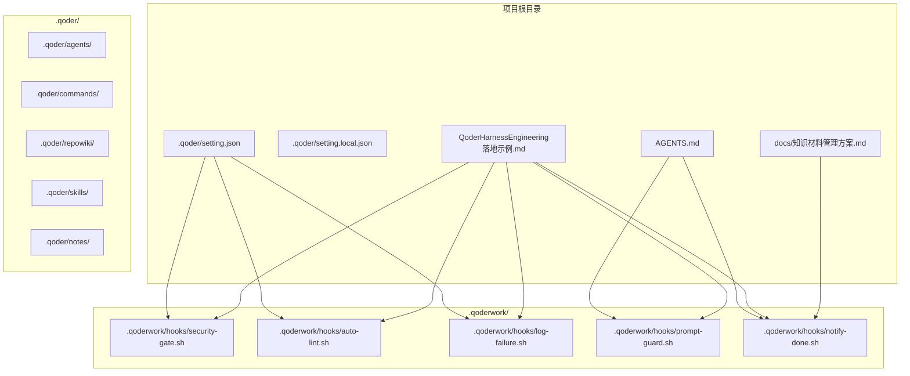
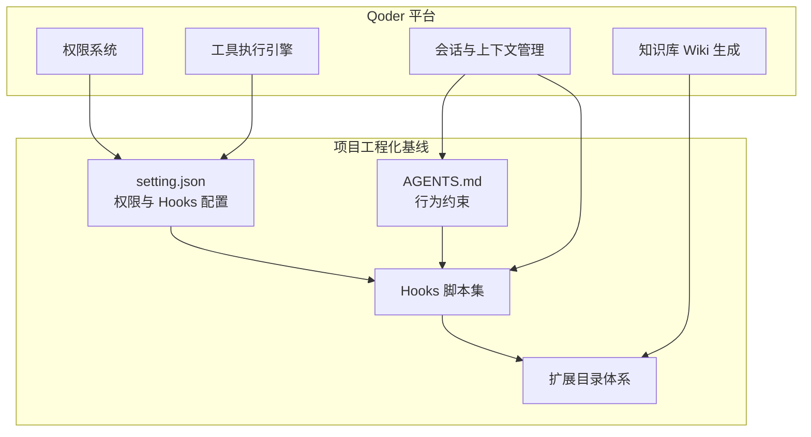
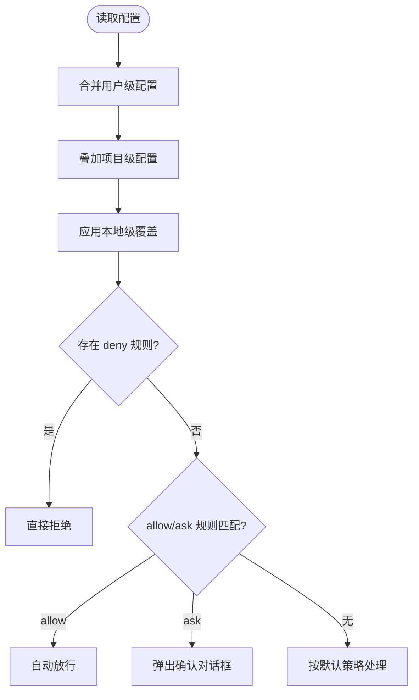
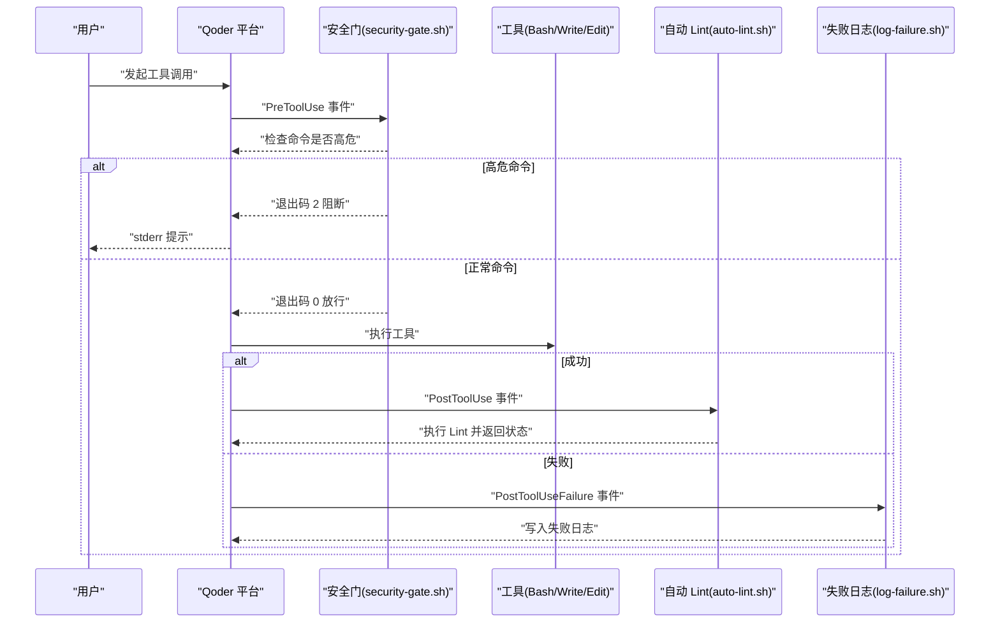
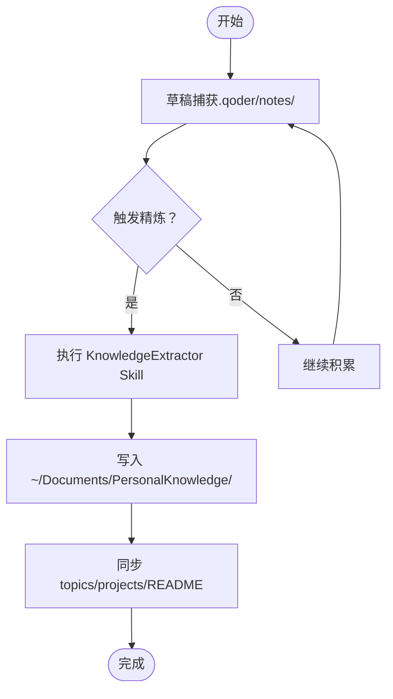
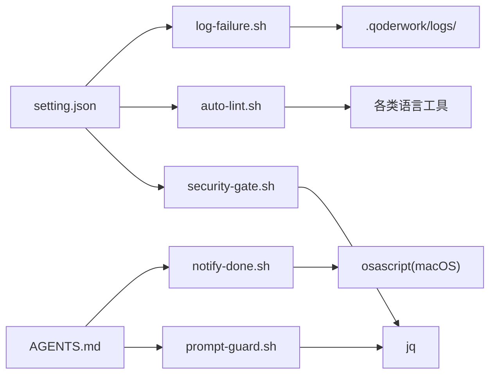

# 项目概览

<cite>
**本文引用的文件**
- [AGENTS.md](file://AGENTS.md)
- [QoderHarnessEngineering落地示例.md](file://QoderHarnessEngineering落地示例.md)
- [知识材料管理方案.md](file://docs/知识材料管理方案.md)
- [.qoderwork/hooks/security-gate.sh](file://.qoderwork/hooks/security-gate.sh)
- [.qoderwork/hooks/auto-lint.sh](file://.qoderwork/hooks/auto-lint.sh)
- [.qoderwork/hooks/log-failure.sh](file://.qoderwork/hooks/log-failure.sh)
- [.qoderwork/hooks/prompt-guard.sh](file://.qoderwork/hooks/prompt-guard.sh)
- [.qoderwork/hooks/notify-done.sh](file://.qoderwork/hooks/notify-done.sh)
</cite>

## 目录
1. [引言](#引言)
2. [项目结构](#项目结构)
3. [核心组件](#核心组件)
4. [架构总览](#架构总览)
5. [详细组件分析](#详细组件分析)
6. [依赖分析](#依赖分析)
7. [性能考虑](#性能考虑)
8. [故障排查指南](#故障排查指南)
9. [结论](#结论)
10. [附录](#附录)

## 引言
本项目是面向团队工程化的“Qoder Harness Engineering”模板，旨在为任意团队项目提供统一的工程化接入范式。其核心价值在于：
- 将 Qoder 的权限策略、生命周期钩子（Hooks）、Agent 行为约束标准化，降低团队在 AI 工程化落地上的试错成本
- 通过三层配置合并机制（用户级/项目级/本地级）实现“可共享、可覆盖、可审计”的配置治理
- 以 Hooks 串联安全门禁、自动 Lint、失败日志、提示词防护、桌面通知与知识归档触发等关键工程能力
- 与 Qoder AI 平台深度集成，既保证工具使用安全可控，又提升日常开发效率与知识沉淀质量

适用场景包括但不限于：
- 新项目快速接入 AI 工程化基线
- 团队统一的权限与安全策略落地
- 代码质量与合规性的自动化保障
- 个人与团队知识资产的系统化沉淀

## 项目结构
项目采用“模板 + 脚手架 + 文档”的组织方式，核心目录与文件如下：
- .qoder/：项目级配置与扩展目录（agents/、commands/、repowiki/、skills/、notes/、setting.json、setting.local.json）
- .qoderwork/hooks/：生命周期钩子脚本集合（安全门、自动 Lint、失败日志、提示词防护、通知、知识触发等）
- AGENTS.md：Agent 行为约束与项目上下文说明
- QoderHarnessEngineering落地示例.md：配置规范、Hooks 工程、权限策略与最佳实践的完整落地参考
- docs/知识材料管理方案.md：个人知识库的双层结构（草稿层/精炼层）与归档流程

图表来源
- [QoderHarnessEngineering落地示例.md:42-67](file://QoderHarnessEngineering落地示例.md#L42-L67)
- [AGENTS.md:34-69](file://AGENTS.md#L34-L69)

章节来源
- [QoderHarnessEngineering落地示例.md:42-67](file://QoderHarnessEngineering落地示例.md#L42-L67)
- [AGENTS.md:34-69](file://AGENTS.md#L34-L69)

## 核心组件
- 权限策略（Permissions）
  - 三层合并：用户级（全局）、项目级（团队共享）、本地级（个人覆盖）
  - 规则类型：allow（自动放行）、ask（确认后执行）、deny（硬性禁止）
  - 优先级：deny > allow/ask；更具体规则优先于通配符；本地级覆盖项目级，项目级覆盖用户级
- 生命周期钩子（Hooks）
  - PreToolUse：工具执行前拦截（如安全门、提示词防护）
  - PostToolUse：工具成功后检查（如自动 Lint）
  - PostToolUseFailure：工具失败后记录（失败日志）
  - UserPromptSubmit：用户提交 Prompt 后注入防护
  - Stop：Agent 完成响应时触发（桌面通知）
  - PreCompact/SessionEnd：上下文压缩/会话结束时触发（知识归档提示）
- Agent 行为约束（AGENTS.md）
  - 明确代码修改范围、Git 操作规范、禁止行为与 Hooks 脚本速查
- 扩展目录体系
  - agents/：独立上下文的子 Agent
  - commands/：可复用的 Prompt 模板
  - repowiki/：由 Qoder 自动生成的代码库 Wiki
  - skills/：多步骤专业工作流（含 KnowledgeExtractor）

章节来源
- [QoderHarnessEngineering落地示例.md:23-39](file://QoderHarnessEngineering落地示例.md#L23-L39)
- [QoderHarnessEngineering落地示例.md:123-191](file://QoderHarnessEngineering落地示例.md#L123-L191)
- [QoderHarnessEngineering落地示例.md:253-337](file://QoderHarnessEngineering落地示例.md#L253-L337)
- [AGENTS.md:16-31](file://AGENTS.md#L16-L31)
- [QoderHarnessEngineering落地示例.md:359-434](file://QoderHarnessEngineering落地示例.md#L359-L434)

## 架构总览
整体设计理念围绕“安全前置、质量内建、知识沉淀、团队协同”展开。技术栈选择遵循“最小必要、稳定可靠”的原则：
- Shell 脚本：轻量、可移植、易审计，覆盖安全门禁、自动 Lint、失败日志、提示词防护、桌面通知等
- JSON 配置：三层合并、声明式权限与 Hooks，便于版本化与团队协作
- Markdown 扩展：agents/commands/skills/repowiki/notes，以文本形式承载 AI 工作流与知识资产
- 与 Qoder 平台集成：通过 setting.json 与 Hooks 脚本，将平台能力固化为工程化基线

图表来源
- [QoderHarnessEngineering落地示例.md:123-191](file://QoderHarnessEngineering落地示例.md#L123-L191)
- [QoderHarnessEngineering落地示例.md:253-337](file://QoderHarnessEngineering落地示例.md#L253-L337)
- [QoderHarnessEngineering落地示例.md:359-434](file://QoderHarnessEngineering落地示例.md#L359-L434)

## 详细组件分析

### 权限策略与三层配置合并
- 合并机制：用户级 < 项目级 < 本地级，低优先级配置“叠加合并”，deny 优先于 allow/ask
- 项目级 setting.json 默认放行只读与受控编辑、拦截 Git 写操作与配置文件修改、禁止危险命令与敏感路径访问
- 本地级 setting.local.json 用于个人覆盖，需加入 .gitignore

图表来源
- [QoderHarnessEngineering落地示例.md:23-39](file://QoderHarnessEngineering落地示例.md#L23-L39)
- [QoderHarnessEngineering落地示例.md:123-191](file://QoderHarnessEngineering落地示例.md#L123-L191)

章节来源
- [QoderHarnessEngineering落地示例.md:23-39](file://QoderHarnessEngineering落地示例.md#L23-L39)
- [QoderHarnessEngineering落地示例.md:123-191](file://QoderHarnessEngineering落地示例.md#L123-L191)

### 生命周期钩子与安全门禁
- 安全门（security-gate.sh）
  - PreToolUse 阶段拦截高危 Bash 模式（如递归删除、数据库破坏性操作、Fork Bomb 等）
  - 退出码 2 阻断执行，并将 stderr 注入会话
- 自动 Lint（auto-lint.sh）
  - PostToolUse 阶段根据文件类型自动选择 Lint 工具（ESLint、ruff/flake8、gofmt、shellcheck）
  - 非阻断性错误（非 0 退出码）展示 stderr，但继续执行
- 失败日志（log-failure.sh）
  - PostToolUseFailure 阶段记录失败信息至 .qoderwork/logs/failure.log
- 提示词防护（prompt-guard.sh）
  - UserPromptSubmit 阶段拦截注入攻击特征（指令覆盖、越狱、系统提示泄露等）
  - 退出码 2 阻断并提示用户
- 桌面通知（notify-done.sh）
  - Stop 阶段在 macOS 上发送任务完成通知

图表来源
- [.qoderwork/hooks/security-gate.sh:1-38](file://.qoderwork/hooks/security-gate.sh#L1-L38)
- [.qoderwork/hooks/auto-lint.sh:1-43](file://.qoderwork/hooks/auto-lint.sh#L1-L43)
- [.qoderwork/hooks/log-failure.sh:1-20](file://.qoderwork/hooks/log-failure.sh#L1-L20)

章节来源
- [.qoderwork/hooks/security-gate.sh:1-38](file://.qoderwork/hooks/security-gate.sh#L1-L38)
- [.qoderwork/hooks/auto-lint.sh:1-43](file://.qoderwork/hooks/auto-lint.sh#L1-L43)
- [.qoderwork/hooks/log-failure.sh:1-20](file://.qoderwork/hooks/log-failure.sh#L1-L20)
- [.qoderwork/hooks/prompt-guard.sh:1-55](file://.qoderwork/hooks/prompt-guard.sh#L1-L55)
- [.qoderwork/hooks/notify-done.sh:1-16](file://.qoderwork/hooks/notify-done.sh#L1-L16)

### AGENTS.md 行为约束
- 明确 Agent 在本项目中的行为边界：预览配置变更、禁止直接删除文件、Git 操作需确认、编辑范围限制在 src/tests
- 作为每次会话自动加载的项目上下文，确保团队协作的一致性与安全性

章节来源
- [AGENTS.md:16-31](file://AGENTS.md#L16-L31)
- [AGENTS.md:340-356](file://AGENTS.md#L340-L356)

### 扩展目录体系与技能工作流
- agents/：独立上下文的子 Agent，适合需要专属工具权限与反复使用的专职角色
- commands/：可复用 Prompt 模板，一键触发高频固定操作
- repowiki/：由 Qoder 自动生成的代码库 Wiki，AI 优先读取以减少上下文消耗
- skills/：多步骤专业工作流，如 KnowledgeExtractor，支持会话内容提炼与归档

章节来源
- [QoderHarnessEngineering落地示例.md:359-434](file://QoderHarnessEngineering落地示例.md#L359-L434)

### 知识材料管理方案（双层结构）
- 草稿层（项目内，不提交 Git）：即时捕获、零摩擦
- 精炼层（全局，长期维护）：统一归档、跨项目检索
- 触发机制：PreCompact/SessionEnd Hook 自动提示，或用户手动触发
- 与 KnowledgeExtractor Skill 配合，实现“草稿 → 精炼 → 归档”的闭环

图表来源
- [知识材料管理方案.md:51-78](file://docs/知识材料管理方案.md#L51-L78)
- [知识材料管理方案.md:164-215](file://docs/知识材料管理方案.md#L164-L215)

章节来源
- [知识材料管理方案.md:51-78](file://docs/知识材料管理方案.md#L51-L78)
- [知识材料管理方案.md:164-215](file://docs/知识材料管理方案.md#L164-L215)

## 依赖分析
- 配置层依赖
  - setting.json 依赖 .qoderwork/hooks/* 脚本路径与超时配置
  - AGENTS.md 依赖 Hooks 脚本的存在与可执行权限
- 脚本层依赖
  - security-gate.sh 依赖 jq 解析输入
  - auto-lint.sh 依赖各类语言工具（npx/eslint、ruff/flake8、gofmt、shellcheck）
  - log-failure.sh 依赖 jq 与日志目录
  - prompt-guard.sh 依赖 jq 与正则匹配
  - notify-done.sh 依赖 macOS 的 osascript
- 平台集成依赖
  - Qoder 平台事件模型（PreToolUse/PostToolUse/PostToolUseFailure/UserPromptSubmit/Stop/PreCompact/SessionEnd/SubagentStop 等）
  - repowiki/ 由平台自动生成，无需手动维护

图表来源
- [QoderHarnessEngineering落地示例.md:123-191](file://QoderHarnessEngineering落地示例.md#L123-L191)
- [.qoderwork/hooks/security-gate.sh:8-13](file://.qoderwork/hooks/security-gate.sh#L8-L13)
- [.qoderwork/hooks/auto-lint.sh:19-38](file://.qoderwork/hooks/auto-lint.sh#L19-L38)
- [.qoderwork/hooks/log-failure.sh:7-17](file://.qoderwork/hooks/log-failure.sh#L7-L17)
- [.qoderwork/hooks/prompt-guard.sh:8-9](file://.qoderwork/hooks/prompt-guard.sh#L8-L9)
- [.qoderwork/hooks/notify-done.sh:10-13](file://.qoderwork/hooks/notify-done.sh#L10-L13)

章节来源
- [QoderHarnessEngineering落地示例.md:123-191](file://QoderHarnessEngineering落地示例.md#L123-L191)
- [.qoderwork/hooks/security-gate.sh:8-13](file://.qoderwork/hooks/security-gate.sh#L8-L13)
- [.qoderwork/hooks/auto-lint.sh:19-38](file://.qoderwork/hooks/auto-lint.sh#L19-L38)
- [.qoderwork/hooks/log-failure.sh:7-17](file://.qoderwork/hooks/log-failure.sh#L7-L17)
- [.qoderwork/hooks/prompt-guard.sh:8-9](file://.qoderwork/hooks/prompt-guard.sh#L8-L9)
- [.qoderwork/hooks/notify-done.sh:10-13](file://.qoderwork/hooks/notify-done.sh#L10-L13)

## 性能考虑
- Hooks 执行超时控制：PreToolUse（如安全门）与 PostToolUse（如自动 Lint）均配置超时，避免阻塞主流程
- 工具链选择：优先使用具备“就地修复 + 静默模式”的工具组合，减少交互与日志噪音
- 日志落盘：失败日志异步写入，避免影响工具执行性能
- 依赖最小化：Shell 脚本为主，仅在必要时调用外部工具，降低环境差异带来的性能波动

## 故障排查指南
- 权限未生效
  - 检查 setting.json 的 allow/ask/deny 规则是否冲突
  - 确认本地级覆盖是否意外屏蔽了项目级规则
- Hooks 未执行
  - 确认 .qoderwork/hooks/*.sh 是否赋予执行权限
  - 检查 setting.json 中 hooks 的 matcher 与命令路径是否正确
- 安全门误报
  - 在 AGENTS.md 中补充必要的命令白名单，或在本地级覆盖中放宽特定场景
- 自动 Lint 未执行
  - 确认目标文件类型对应的工具已安装且可执行
  - 检查 auto-lint.sh 的文件路径解析逻辑
- 提示词注入被阻断
  - 检查 prompt-guard.sh 的正则匹配是否过于严格，必要时在 AGENTS.md 中说明场景
- 失败日志缺失
  - 确认 log-failure.sh 的日志目录可写，且事件类型匹配 PostToolUseFailure

章节来源
- [QoderHarnessEngineering落地示例.md:123-191](file://QoderHarnessEngineering落地示例.md#L123-L191)
- [.qoderwork/hooks/security-gate.sh:15-35](file://.qoderwork/hooks/security-gate.sh#L15-L35)
- [.qoderwork/hooks/auto-lint.sh:17-40](file://.qoderwork/hooks/auto-lint.sh#L17-L40)
- [.qoderwork/hooks/log-failure.sh:7-17](file://.qoderwork/hooks/log-failure.sh#L7-L17)
- [.qoderwork/hooks/prompt-guard.sh:14-52](file://.qoderwork/hooks/prompt-guard.sh#L14-L52)

## 结论
本项目以“模板 + 脚手架 + 文档”的方式，构建了面向团队的 AI 工程化基线。通过三层配置合并与 Hooks 生态，实现了“安全前置、质量内建、知识沉淀、团队协同”的统一范式。与 Qoder 平台的深度集成，使得工程化能力可复制、可推广、可持续演进。对于初学者，可从 AGENTS.md 与落地示例入手；对于资深开发者，可在扩展目录体系与 Hooks 脚本上进一步定制，满足复杂场景的工程化需求。

## 附录
- 快速启动步骤
  - 复制 .qoder/ 与 .qoderwork/ 至新项目
  - 在 .gitignore 中加入 .qoder/setting.local.json 与 .qoderwork/logs/
  - 按项目技术栈调整 setting.json 的 allow 规则
  - 更新 AGENTS.md 中的项目上下文
  - 赋予 .qoderwork/hooks/*.sh 执行权限
  - 验证 ask 规则是否弹出确认框

章节来源
- [QoderHarnessEngineering落地示例.md:503-552](file://QoderHarnessEngineering落地示例.md#L503-L552)