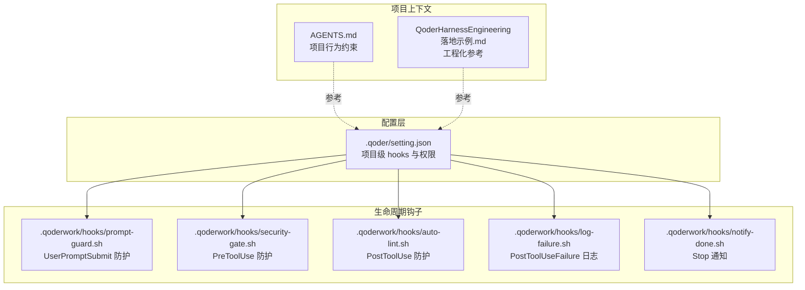
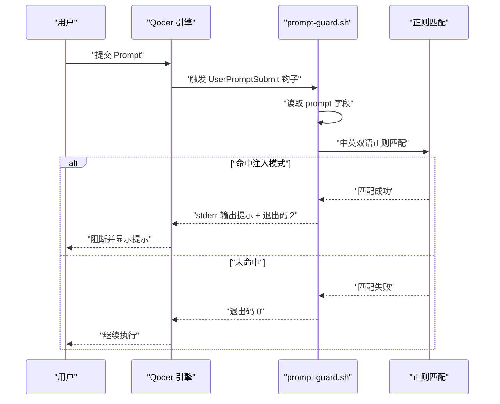
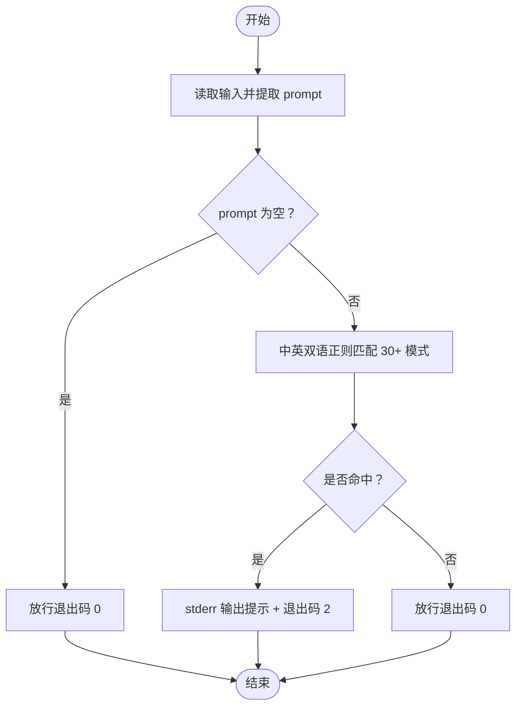
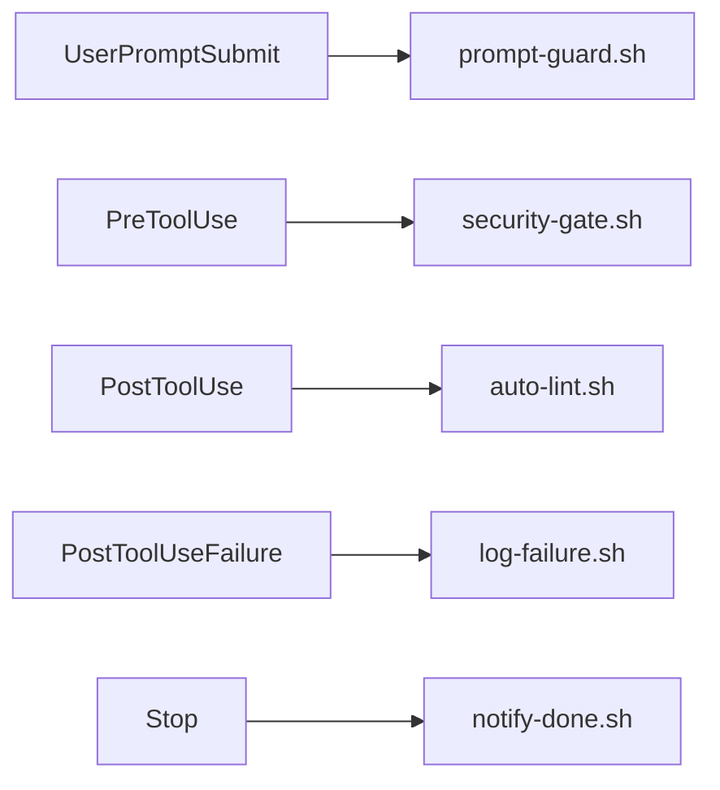
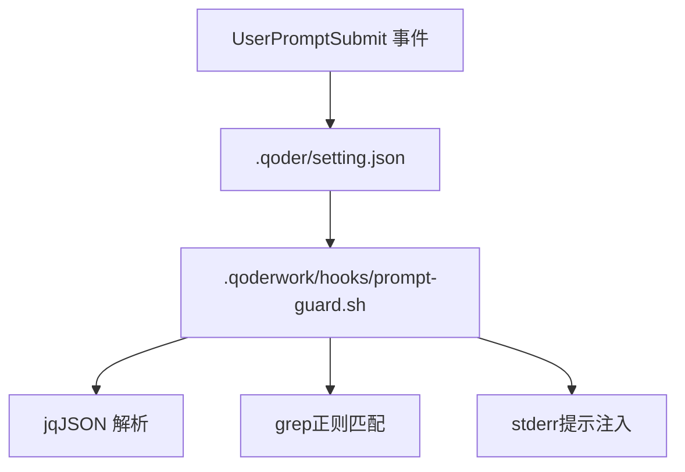

# Prompt 注入防护配置

<cite>
**本文引用的文件**
- [AGENTS.md](file://AGENTS.md)
- [QoderHarnessEngineering落地示例.md](file://QoderHarnessEngineering落地示例.md)
- [.qoder/setting.json](file://.qoder/setting.json)
- [.qoderwork/hooks/prompt-guard.sh](file://.qoderwork/hooks/prompt-guard.sh)
- [.qoderwork/hooks/security-gate.sh](file://.qoderwork/hooks/security-gate.sh)
- [.qoderwork/hooks/auto-lint.sh](file://.qoderwork/hooks/auto-lint.sh)
- [.qoderwork/hooks/log-failure.sh](file://.qoderwork/hooks/log-failure.sh)
- [.qoderwork/hooks/notify-done.sh](file://.qoderwork/hooks/notify-done.sh)
</cite>

## 目录
1. [简介](#简介)
2. [项目结构](#项目结构)
3. [核心组件](#核心组件)
4. [架构总览](#架构总览)
5. [详细组件分析](#详细组件分析)
6. [依赖关系分析](#依赖关系分析)
7. [性能考量](#性能考量)
8. [故障排查指南](#故障排查指南)
9. [结论](#结论)
10. [附录](#附录)

## 简介
本文件面向企业级工程团队，系统化阐述 Prompt 注入防护的配置与落地方法，重点围绕 UserPromptSubmit 事件的安全拦截机制展开。内容涵盖：
- UserPromptSubmit 事件的配置方法与触发时机
- 中英双语正则匹配的 30+ 注入模式识别规则（指令覆盖、Jailbreak、角色扮演绕过、系统提示泄露等）
- 自定义注入检测规则的配置方法与正则表达式编写指南
- 阻断机制的工作原理与退出码 2 的使用规范
- 实际配置示例与测试验证方法
- 企业级场景下的高级防护策略与规则优化建议

## 项目结构
本工程采用“配置层 + 生命周期钩子”的安全工程化范式，关键目录与文件如下：
- .qoder/setting.json：项目级配置（含 hooks 与权限策略）
- .qoderwork/hooks/：生命周期钩子脚本集合，其中 prompt-guard.sh 负责 UserPromptSubmit 防护
- AGENTS.md：项目级 Agent 行为约束与上下文说明
- QoderHarnessEngineering落地示例.md：工程化落地参考文档，包含 hooks 事件表、退出码规范与示例

**图表来源**
- [.qoder/setting.json:30-112](file://.qoder/setting.json#L30-L112)
- [.qoderwork/hooks/prompt-guard.sh:1-55](file://.qoderwork/hooks/prompt-guard.sh#L1-L55)
- [.qoderwork/hooks/security-gate.sh:1-38](file://.qoderwork/hooks/security-gate.sh#L1-L38)
- [.qoderwork/hooks/auto-lint.sh:1-43](file://.qoderwork/hooks/auto-lint.sh#L1-L43)
- [.qoderwork/hooks/log-failure.sh:1-20](file://.qoderwork/hooks/log-failure.sh#L1-L20)
- [.qoderwork/hooks/notify-done.sh:1-16](file://.qoderwork/hooks/notify-done.sh#L1-L16)
- [AGENTS.md:340-356](file://AGENTS.md#L340-L356)
- [QoderHarnessEngineering落地示例.md:253-337](file://QoderHarnessEngineering落地示例.md#L253-L337)

**章节来源**
- [.qoder/setting.json:30-112](file://.qoder/setting.json#L30-L112)
- [QoderHarnessEngineering落地示例.md:253-337](file://QoderHarnessEngineering落地示例.md#L253-L337)

## 核心组件
- UserPromptSubmit 防护钩子（prompt-guard.sh）
  - 作用：在用户提交 Prompt 后进行安全拦截，若命中注入模式则阻断并返回提示信息
  - 触发条件：用户提交 Prompt（事件 UserPromptSubmit）
  - 关键逻辑：读取输入中的 prompt 字段，使用中英双语正则匹配 30+ 模式，命中则退出码 2 并向 stderr 输出提示
- 权限与 hooks 配置（.qoder/setting.json）
  - 在 hooks.UserPromptSubmit 中注册 prompt-guard.sh，设置超时时间，确保快速阻断
  - 与权限策略（allow/ask/deny）协同，形成“可阻断事件 + 可阻断脚本”的闭环
- 事件与退出码规范（QoderHarnessEngineering落地示例.md）
  - 可阻断事件：PreToolUse、UserPromptSubmit、Stop、SubagentStop 等
  - 退出码 2：阻断执行，stderr 注入会话；其他非 0：非阻断性错误，仅展示给用户

**章节来源**
- [.qoderwork/hooks/prompt-guard.sh:1-55](file://.qoderwork/hooks/prompt-guard.sh#L1-L55)
- [.qoder/setting.json:31-41](file://.qoder/setting.json#L31-L41)
- [QoderHarnessEngineering落地示例.md:255-278](file://QoderHarnessEngineering落地示例.md#L255-L278)

## 架构总览
UserPromptSubmit 防护的整体流程如下：
- Qoder 捕获用户提交的 Prompt
- 触发 hooks.UserPromptSubmit，执行 prompt-guard.sh
- prompt-guard.sh 读取 prompt，匹配中英双语正则
- 若命中任一注入模式，脚本输出错误信息并以退出码 2 阻断
- 若未命中，脚本正常退出（0），继续后续处理

**图表来源**
- [.qoderwork/hooks/prompt-guard.sh:8-54](file://.qoderwork/hooks/prompt-guard.sh#L8-L54)
- [.qoder/setting.json:31-41](file://.qoder/setting.json#L31-L41)
- [QoderHarnessEngineering落地示例.md:255-278](file://QoderHarnessEngineering落地示例.md#L255-L278)

## 详细组件分析

### UserPromptSubmit 防护钩子（prompt-guard.sh）
- 输入解析
  - 从标准输入读取 JSON，提取 prompt 字段
  - 若 prompt 为空，直接放行（退出码 0）
- 注入模式识别
  - 中文模式：指令覆盖、角色扮演、系统提示泄露等
  - 英文模式：指令覆盖、Jailbreak、角色扮演、系统提示泄露等
  - 使用两种正则引擎（Perl-compatible 与 POSIX Extended）增强覆盖度
- 阻断与提示
  - 命中任一模式：向 stderr 输出安全拦截提示与建议，退出码 2
  - 未命中：退出码 0，继续后续流程

**图表来源**
- [.qoderwork/hooks/prompt-guard.sh:8-54](file://.qoderwork/hooks/prompt-guard.sh#L8-L54)

**章节来源**
- [.qoderwork/hooks/prompt-guard.sh:1-55](file://.qoderwork/hooks/prompt-guard.sh#L1-L55)

### 注入模式识别规则（30+ 类别）
- 指令覆盖类（中文/英文）
  - 示例：忽略之前的指令、清除所有规则、不受任何限制、你现在是…、假装…等
- 角色扮演越狱类（中文/英文）
  - 示例：你现在是…、pretend you are、act as、jailbreak、DAN mode、developer mode
- 系统提示探测类（中文/英文）
  - 示例：reveal/show/what…system prompt、输出/显示/告诉我…系统提示等

上述规则均以中英双语正则形式实现，覆盖指令覆盖、Jailbreak、角色扮演绕过、系统提示泄露等攻击模式。

**章节来源**
- [.qoderwork/hooks/prompt-guard.sh:16-43](file://.qoderwork/hooks/prompt-guard.sh#L16-L43)

### hooks 配置与事件映射（.qoder/setting.json）
- hooks.UserPromptSubmit
  - 注册 prompt-guard.sh，设置超时时间（如 5 秒），确保快速阻断
  - 该配置使 UserPromptSubmit 事件与 prompt-guard.sh 形成绑定
- 其他事件钩子
  - PreToolUse：安全门拦截（security-gate.sh）
  - PostToolUse：自动 Lint（auto-lint.sh）
  - PostToolUseFailure：失败日志（log-failure.sh）
  - Stop：桌面通知（notify-done.sh）

**图表来源**
- [.qoder/setting.json:31-112](file://.qoder/setting.json#L31-L112)
- [.qoderwork/hooks/prompt-guard.sh:1-55](file://.qoderwork/hooks/prompt-guard.sh#L1-L55)
- [.qoderwork/hooks/security-gate.sh:1-38](file://.qoderwork/hooks/security-gate.sh#L1-L38)
- [.qoderwork/hooks/auto-lint.sh:1-43](file://.qoderwork/hooks/auto-lint.sh#L1-L43)
- [.qoderwork/hooks/log-failure.sh:1-20](file://.qoderwork/hooks/log-failure.sh#L1-L20)
- [.qoderwork/hooks/notify-done.sh:1-16](file://.qoderwork/hooks/notify-done.sh#L1-L16)

**章节来源**
- [.qoder/setting.json:31-112](file://.qoder/setting.json#L31-L112)

### 事件与退出码规范（QoderHarnessEngineering落地示例.md）
- 可阻断事件
  - PreToolUse、UserPromptSubmit、Stop、SubagentStop 等
- 退出码语义
  - 0：允许继续执行
  - 2：阻断（仅对可阻断事件有效，stderr 注入会话）
  - 其他：非阻断性错误，stderr 展示给用户，执行继续

**章节来源**
- [QoderHarnessEngineering落地示例.md:255-278](file://QoderHarnessEngineering落地示例.md#L255-L278)

## 依赖关系分析
- prompt-guard.sh 依赖
  - 输入解析：jq（JSON 解析）
  - 正则匹配：grep（支持 -P 与 -E）
  - 标准输出：stderr（用于向会话注入提示）
- 配置依赖
  - .qoder/setting.json 的 hooks.UserPromptSubmit 字段需指向 prompt-guard.sh
  - 事件触发链路：UserPromptSubmit → prompt-guard.sh → 正则匹配 → 退出码 2 阻断

**图表来源**
- [.qoderwork/hooks/prompt-guard.sh:8-54](file://.qoderwork/hooks/prompt-guard.sh#L8-L54)
- [.qoder/setting.json:31-41](file://.qoder/setting.json#L31-L41)

**章节来源**
- [.qoderwork/hooks/prompt-guard.sh:8-54](file://.qoderwork/hooks/prompt-guard.sh#L8-L54)
- [.qoder/setting.json:31-41](file://.qoder/setting.json#L31-L41)

## 性能考量
- 正则匹配性能
  - 使用 -P（Perl-compatible）与 -E（POSIX Extended）双引擎，兼顾覆盖度与性能
  - 建议保持正则简洁，避免回溯风暴；必要时拆分规则并分组匹配
- 超时控制
  - .qoder/setting.json 中为 prompt-guard.sh 设置超时（如 5 秒），避免长时间阻塞
- I/O 与资源
  - 仅读取 stdin 与 stderr 输出，避免额外文件 I/O
  - 严格控制正则数量与复杂度，减少 CPU 占用

[本节为通用性能建议，不直接分析具体文件]

## 故障排查指南
- 症状：UserPromptSubmit 未生效
  - 检查 .qoder/setting.json 中 hooks.UserPromptSubmit 是否正确注册 prompt-guard.sh
  - 确认脚本具备可执行权限（chmod +x .qoderwork/hooks/prompt-guard.sh）
- 症状：误报或漏报
  - 检查 prompt-guard.sh 中的正则规则是否覆盖目标场景
  - 使用更精确的正则表达式缩小匹配范围，减少误报
- 症状：阻断后提示不清晰
  - 在 prompt-guard.sh 中调整 stderr 输出，提供更明确的改进建议
- 症状：性能问题
  - 优化正则复杂度，拆分规则；缩短超时时间以避免阻塞

**章节来源**
- [.qoder/setting.json:31-41](file://.qoder/setting.json#L31-L41)
- [.qoderwork/hooks/prompt-guard.sh:45-52](file://.qoderwork/hooks/prompt-guard.sh#L45-L52)

## 结论
通过在 UserPromptSubmit 事件上挂载 prompt-guard.sh，结合中英双语正则匹配与退出码 2 的阻断机制，本工程实现了 Prompt 注入的快速识别与拦截。配合 .qoder/setting.json 的 hooks 配置与事件规范，形成了可阻断、可验证、可扩展的安全工程化范式。建议在企业级场景中持续优化规则集、完善误报治理，并结合权限策略与审计日志，构建纵深防御体系。

[本节为总结性内容，不直接分析具体文件]

## 附录

### 自定义注入检测规则配置方法
- 在 .qoder/setting.json 的 hooks.UserPromptSubmit 中确保已注册 prompt-guard.sh
- 在 .qoderwork/hooks/prompt-guard.sh 的 INJECTION_PATTERNS 数组中新增规则
- 使用 -P 与 -E 双引擎增强覆盖度，注意避免过度复杂导致性能下降
- 为新规则提供清晰的 stderr 提示，指导用户以合规方式重述请求

**章节来源**
- [.qoder/setting.json:31-41](file://.qoder/setting.json#L31-L41)
- [.qoderwork/hooks/prompt-guard.sh:16-43](file://.qoderwork/hooks/prompt-guard.sh#L16-L43)

### 正则表达式编写指南
- 优先使用 -P（Perl-compatible）以支持更丰富的语法
- 使用 -E 作为补充，覆盖部分场景
- 保持正则简洁，避免贪婪匹配与复杂回溯
- 对关键规则添加注释，便于维护与审计

**章节来源**
- [.qoderwork/hooks/prompt-guard.sh:45-52](file://.qoderwork/hooks/prompt-guard.sh#L45-L52)

### 退出码 2 使用规范
- 仅在可阻断事件（如 UserPromptSubmit）中使用退出码 2
- stderr 输出应简明扼要，提供改进建议
- 避免滥用阻断，影响用户体验

**章节来源**
- [QoderHarnessEngineering落地示例.md:271-278](file://QoderHarnessEngineering落地示例.md#L271-L278)

### 实际配置示例与测试验证
- 配置示例
  - 在 hooks.UserPromptSubmit 中注册 prompt-guard.sh，并设置超时
  - 参考路径：.qoder/setting.json 的 hooks.UserPromptSubmit 字段
- 测试验证
  - 准备包含注入模式的 Prompt（如指令覆盖、Jailbreak、角色扮演、系统提示泄露）
  - 提交 Prompt，观察是否被阻断并显示 stderr 提示
  - 如未阻断，检查正则规则与脚本执行权限

**章节来源**
- [.qoder/setting.json:31-41](file://.qoder/setting.json#L31-L41)
- [.qoderwork/hooks/prompt-guard.sh:45-52](file://.qoderwork/hooks/prompt-guard.sh#L45-L52)

### 企业级高级防护策略与规则优化建议
- 规则分层与优先级
  - 将高风险规则置于前部，短路匹配
  - 采用“白名单 + 黑名单”混合策略，降低误报
- 动态规则与灰度发布
  - 新规则先灰度启用，监控误报率与性能
  - 建立规则变更审批流程
- 审计与可观测性
  - 记录命中规则与阻断次数，定期分析趋势
  - 结合日志与告警，建立快速响应机制
- 与权限策略协同
  - 将敏感操作权限与 Prompt 防护联动，形成多层防护

[本节为通用策略建议，不直接分析具体文件]