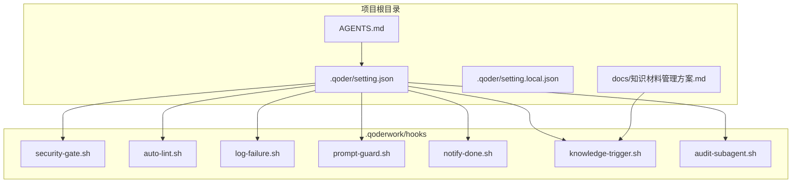
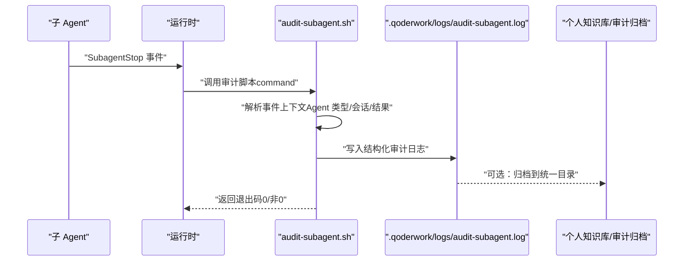
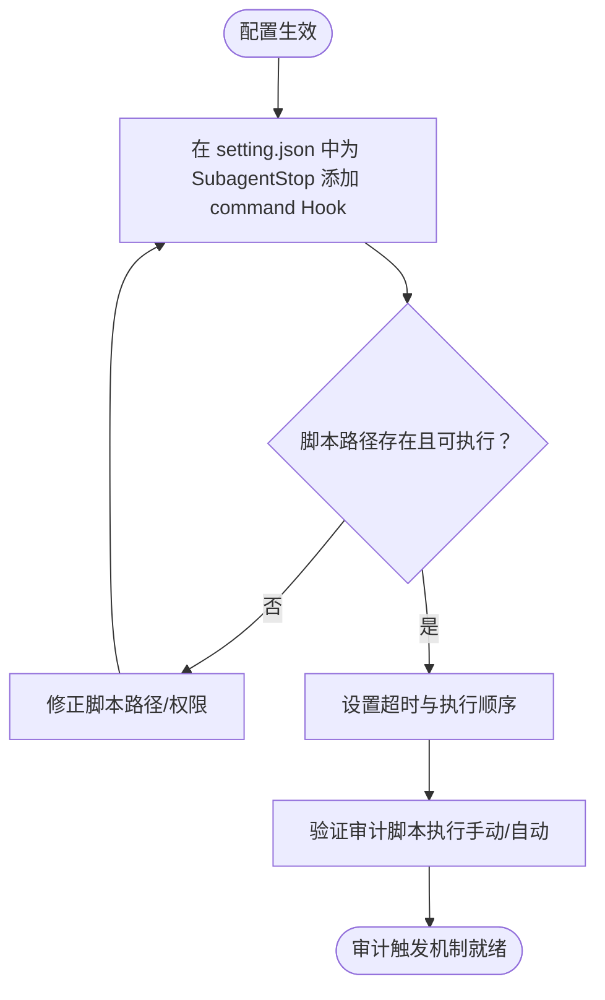
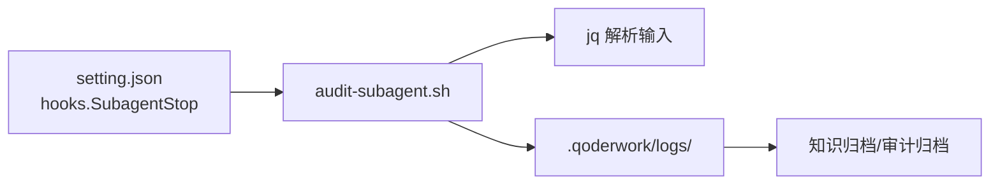

# 子 Agent 审计日志配置

<cite>
**本文引用的文件**
- [QoderHarnessEngineering落地示例.md](file://QoderHarnessEngineering落地示例.md)
- [AGENTS.md](file://AGENTS.md)
- [.qoderwork/hooks/log-failure.sh](file://.qoderwork/hooks/log-failure.sh)
- [.qoderwork/hooks/notify-done.sh](file://.qoderwork/hooks/notify-done.sh)
- [.qoderwork/hooks/security-gate.sh](file://.qoderwork/hooks/security-gate.sh)
- [.qoderwork/hooks/auto-lint.sh](file://.qoderwork/hooks/auto-lint.sh)
- [.qoderwork/hooks/prompt-guard.sh](file://.qoderwork/hooks/prompt-guard.sh)
- [.qoderwork/hooks/knowledge-trigger.sh](file://.qoderwork/hooks/knowledge-trigger.sh)
- [docs/知识材料管理方案.md](file://docs/知识材料管理方案.md)
- [docs/规划ToDo.md](file://docs/规划ToDo.md)
</cite>

## 目录
1. [简介](#简介)
2. [项目结构](#项目结构)
3. [核心组件](#核心组件)
4. [架构总览](#架构总览)
5. [详细组件分析](#详细组件分析)
6. [依赖关系分析](#依赖关系分析)
7. [性能考量](#性能考量)
8. [故障排查指南](#故障排查指南)
9. [结论](#结论)
10. [附录](#附录)

## 简介
本文件围绕“子 Agent 审计日志配置”展开，重点说明 SubagentStop 事件的配置方法与审计触发机制，梳理审计日志的数据结构与记录字段（Agent 类型、执行时间、操作内容、结果状态），并给出存储策略、归档管理、查询分析、安全告警与异常检测、导出与第三方集成、以及性能监控与日志轮转的最佳实践。内容基于仓库中现有的 Hooks 体系与相关文档，确保读者能够快速落地并持续优化。

## 项目结构
本项目采用“Hooks 生命周期工程”与“扩展目录体系”的组织方式，其中与审计日志密切相关的目录与文件包括：
- .qoderwork/hooks：生命周期钩子脚本集合，包含与审计相关的多个脚本
- .qoder/setting.json：项目级配置，定义权限与 Hooks 触发规则
- docs/知识材料管理方案.md：知识归档与审计结果的归档路径参考

图表来源
- [QoderHarnessEngineering落地示例.md: 42-67:42-67](file://QoderHarnessEngineering落地示例.md#L42-L67)
- [QoderHarnessEngineering落地示例.md: 127-184:127-184](file://QoderHarnessEngineering落地示例.md#L127-L184)
- [AGENTS.md: 34-50:34-50](file://AGENTS.md#L34-L50)

章节来源
- [QoderHarnessEngineering落地示例.md: 42-67:42-67](file://QoderHarnessEngineering落地示例.md#L42-L67)
- [QoderHarnessEngineering落地示例.md: 127-184:127-184](file://QoderHarnessEngineering落地示例.md#L127-L184)
- [AGENTS.md: 34-50:34-50](file://AGENTS.md#L34-L50)

## 核心组件
- SubagentStop 事件与审计触发
  - SubagentStop 事件在子 Agent 完成时触发，支持通过 Hooks 配置进行审计拦截与记录。
  - 可通过在 setting.json 的 hooks 字段中为 SubagentStop 添加 command 类型的 Hook，指向审计脚本 audit-subagent.sh。
- 审计日志数据结构与字段
  - 基于现有 Hooks 的输入输出模式，审计日志应包含：Agent 类型、执行时间、操作内容、结果状态等关键字段。
  - 可参考 log-failure.sh 的日志格式与字段风格，结合 SubagentStop 的上下文参数进行扩展。
- 存储策略与归档管理
  - 借鉴知识归档的思路，审计日志可采用“草稿层（临时）+ 精炼层（长期）”的双层结构，或直接归档至统一目录。
  - 可参考知识材料管理方案中的归档路径与命名规范，制定审计日志的统一存放与检索策略。

章节来源
- [QoderHarnessEngineering落地示例.md: 255-269:255-269](file://QoderHarnessEngineering落地示例.md#L255-L269)
- [QoderHarnessEngineering落地示例.md: 472-482:472-482](file://QoderHarnessEngineering落地示例.md#L472-L482)
- [docs/知识材料管理方案.md: 136-160:136-160](file://docs/知识材料管理方案.md#L136-L160)

## 架构总览
下图展示 SubagentStop 事件的审计触发与日志落盘的整体流程，包括事件触发、脚本执行、日志记录与归档路径。

图表来源
- [QoderHarnessEngineering落地示例.md: 255-269:255-269](file://QoderHarnessEngineering落地示例.md#L255-L269)
- [QoderHarnessEngineering落地示例.md: 472-482:472-482](file://QoderHarnessEngineering落地示例.md#L472-L482)
- [.qoderwork/hooks/log-failure.sh: 7-17:7-17](file://.qoderwork/hooks/log-failure.sh#L7-L17)
- [docs/知识材料管理方案.md: 136-160:136-160](file://docs/知识材料管理方案.md#L136-L160)

## 详细组件分析

### SubagentStop 事件配置与审计触发机制
- 事件定义与匹配
  - SubagentStop 事件在子 Agent 完成时触发，matcher 对象为 Agent 类型名，可按 Agent 类型进行细粒度审计。
- 配置入口
  - 在 setting.json 的 hooks.SubagentStop 中添加 command 类型的 Hook，指向 .qoderwork/hooks/audit-subagent.sh。
  - 可设置超时时间与执行顺序，确保审计脚本在子 Agent 结束后及时执行。
- 触发时机与阻断
  - SubagentStop 事件可阻断（exit 2），但通常建议将其作为审计记录而非阻断手段，以避免影响子 Agent 的正常生命周期。

图表来源
- [QoderHarnessEngineering落地示例.md: 472-482:472-482](file://QoderHarnessEngineering落地示例.md#L472-L482)
- [QoderHarnessEngineering落地示例.md: 255-269:255-269](file://QoderHarnessEngineering落地示例.md#L255-L269)

章节来源
- [QoderHarnessEngineering落地示例.md: 255-269:255-269](file://QoderHarnessEngineering落地示例.md#L255-L269)
- [QoderHarnessEngineering落地示例.md: 472-482:472-482](file://QoderHarnessEngineering落地示例.md#L472-L482)

### 审计日志数据结构与记录字段
- 建议字段（基于现有 Hooks 的输入输出风格扩展）
  - 事件标识：SubagentStop
  - Agent 类型：来自事件上下文的 matcher 参数
  - 执行时间：事件发生的时间戳
  - 操作内容：子 Agent 的执行摘要（可从会话上下文中抽取）
  - 结果状态：成功/失败/异常中断
  - 会话 ID：用于关联审计与会话上下文
  - 脚本输出：子 Agent 的关键输出或错误信息
  - 超时/阻断：是否因超时或阻断导致提前结束
- 日志格式参考
  - 可参考 log-failure.sh 的结构化日志风格，统一字段分隔与时间格式，便于后续解析与检索。

章节来源
- [.qoderwork/hooks/log-failure.sh: 12-17:12-17](file://.qoderwork/hooks/log-failure.sh#L12-L17)
- [QoderHarnessEngineering落地示例.md: 472-482:472-482](file://QoderHarnessEngineering落地示例.md#L472-L482)

### 存储策略与归档管理
- 存储位置
  - 临时审计日志：.qoderwork/logs/audit-subagent.log
  - 长期归档：可参考知识材料管理方案的归档路径，将审计日志统一归档至 ~/Documents/PersonalKnowledge/audit/ 或项目内的 .qoder/audit/ 目录
- 归档策略
  - 按时间归档：archive/ 年/月/ 日志文件
  - 按主题/项目聚合：topics/audit/、projects/{ProjectName}/audit/
  - 命名规范：YYYY-MM-DD_AgentType_会话摘要.md 或 .log
- 触发与联动
  - 可与知识归档流程联动，在会话结束或压缩前触发审计日志生成与归档

章节来源
- [docs/知识材料管理方案.md: 136-160:136-160](file://docs/知识材料管理方案.md#L136-L160)
- [docs/知识材料管理方案.md: 164-215:164-215](file://docs/知识材料管理方案.md#L164-L215)
- [QoderHarnessEngineering落地示例.md: 472-482:472-482](file://QoderHarnessEngineering落地示例.md#L472-L482)

### 查询与分析方法
- 日志聚合
  - 使用时间范围筛选、Agent 类型过滤、结果状态统计等维度进行聚合
  - 可将 .qoderwork/logs/audit-subagent.log 与归档目录中的审计文件统一纳入分析
- 统计分析
  - 关键指标：子 Agent 成功率、平均执行时长、失败原因分布、Top N 异常 Agent
  - 可结合知识归档中的主题标签，进行跨会话的审计趋势分析
- 可视化建议
  - 使用日志分析平台（如 ELK/Fluentd/Loki/Grafana）对接审计日志，构建仪表盘

章节来源
- [docs/知识材料管理方案.md: 164-215:164-215](file://docs/知识材料管理方案.md#L164-L215)

### 安全事件告警与异常检测规则
- 告警触发点
  - 子 Agent 执行失败、长时间未响应、异常退出、阻断事件
- 异常检测规则（示例）
  - 失败率阈值：单 Agent 类型连续 N 次失败触发告警
  - 超时检测：执行时间超过预设阈值标记为异常
  - 结果异常：输出为空或包含特定错误关键字
- 告警通道
  - 可通过脚本输出或外部系统集成（如邮件/IM/Webhook）推送告警

章节来源
- [QoderHarnessEngineering落地示例.md: 255-269:255-269](file://QoderHarnessEngineering落地示例.md#L255-L269)
- [docs/规划ToDo.md: 60-65:60-65](file://docs/规划ToDo.md#L60-L65)

### 导出格式与第三方系统集成
- 导出格式
  - JSON：便于机器解析与入库
  - CSV：便于 Excel/BI 工具分析
  - Markdown：便于知识库归档与审阅
- 集成方案
  - 日志采集：rsyslog/Filebeat/Fluent Bit 将审计日志转发至 SIEM/日志平台
  - 数据库入库：将结构化字段导入数据库，支持 SQL 查询与报表
  - 知识库集成：与知识材料管理方案联动，将审计摘要写入个人知识库

章节来源
- [docs/知识材料管理方案.md: 136-160:136-160](file://docs/知识材料管理方案.md#L136-L160)

### 性能监控与日志轮转最佳实践
- 性能监控
  - 关注子 Agent 的平均执行时长、吞吐量、失败率等指标
  - 通过 Grafana/Prometheus 等工具构建仪表盘
- 日志轮转
  - 建议对 .qoderwork/logs/audit-subagent.log 实施按大小/日期的轮转，避免单文件过大
  - 可参考现有 failure.log 的轮转思路，结合审计日志体量进行容量规划

章节来源
- [docs/规划ToDo.md: 60-61:60-61](file://docs/规划ToDo.md#L60-L61)
- [.qoderwork/hooks/log-failure.sh: 7-17:7-17](file://.qoderwork/hooks/log-failure.sh#L7-L17)

## 依赖关系分析
- 配置依赖
  - setting.json 的 hooks.SubagentStop 依赖 audit-subagent.sh 的存在与可执行权限
- 脚本依赖
  - audit-subagent.sh 依赖 jq 解析事件输入，依赖 .qoderwork/logs 目录写入
- 文档与流程依赖
  - 知识材料管理方案为审计日志的归档与检索提供路径与命名规范参考

图表来源
- [QoderHarnessEngineering落地示例.md: 472-482:472-482](file://QoderHarnessEngineering落地示例.md#L472-L482)
- [.qoderwork/hooks/log-failure.sh: 7-17:7-17](file://.qoderwork/hooks/log-failure.sh#L7-L17)
- [docs/知识材料管理方案.md: 136-160:136-160](file://docs/知识材料管理方案.md#L136-L160)

章节来源
- [QoderHarnessEngineering落地示例.md: 472-482:472-482](file://QoderHarnessEngineering落地示例.md#L472-L482)
- [.qoderwork/hooks/log-failure.sh: 7-17:7-17](file://.qoderwork/hooks/log-failure.sh#L7-L17)
- [docs/知识材料管理方案.md: 136-160:136-160](file://docs/知识材料管理方案.md#L136-L160)

## 性能考量
- 审计脚本执行开销
  - 控制审计脚本的执行时间，避免成为子 Agent 的性能瓶颈
- 日志写入与 IO
  - 采用异步写入或缓冲策略，减少频繁 IO 对系统的影响
- 存储与带宽
  - 审计日志归档后建议压缩存储，降低长期存储成本

## 故障排查指南
- 常见问题
  - audit-subagent.sh 未执行：检查 setting.json 的 hooks.SubagentStop 配置与脚本路径
  - 权限不足：确保脚本具备可执行权限，日志目录可写
  - 字段缺失：确认事件上下文是否包含所需字段，必要时在脚本中增加容错
- 参考脚本
  - log-failure.sh 展示了结构化日志写入与字段解析的模式，可作为审计脚本的参考

章节来源
- [.qoderwork/hooks/log-failure.sh: 7-17:7-17](file://.qoderwork/hooks/log-failure.sh#L7-L17)
- [QoderHarnessEngineering落地示例.md: 472-482:472-482](file://QoderHarnessEngineering落地示例.md#L472-L482)

## 结论
通过在 setting.json 中为 SubagentStop 事件配置 audit-subagent.sh，可实现对子 Agent 生命周期的结构化审计。结合知识材料管理方案的归档思路与日志轮转策略，可构建稳定、可查询、可扩展的审计体系。建议在生产环境中逐步完善异常检测与告警机制，并持续优化性能与存储策略。

## 附录
- 相关 Hooks 一览（与审计相关）
  - security-gate.sh：PreToolUse 阻断高危命令
  - auto-lint.sh：PostToolUse 自动 Lint
  - log-failure.sh：PostToolUseFailure 失败记录
  - prompt-guard.sh：UserPromptSubmit 注入防护
  - notify-done.sh：Stop 任务完成通知
  - knowledge-trigger.sh：PreCompact/SessionEnd 知识归档提示
  - audit-subagent.sh：SubagentStop 审计日志（待实现）

章节来源
- [QoderHarnessEngineering落地示例.md: 255-269:255-269](file://QoderHarnessEngineering落地示例.md#L255-L269)
- [QoderHarnessEngineering落地示例.md: 279-337:279-337](file://QoderHarnessEngineering落地示例.md#L279-L337)
- [QoderHarnessEngineering落地示例.md: 472-482:472-482](file://QoderHarnessEngineering落地示例.md#L472-L482)