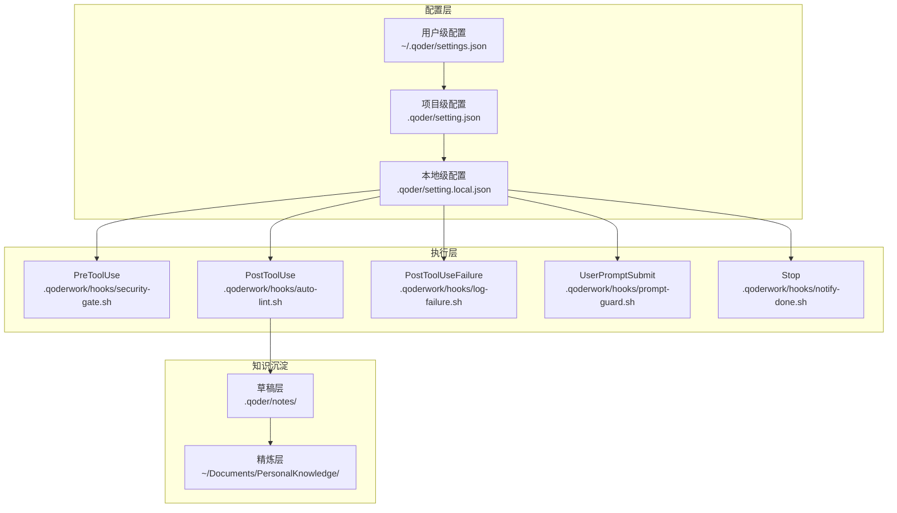
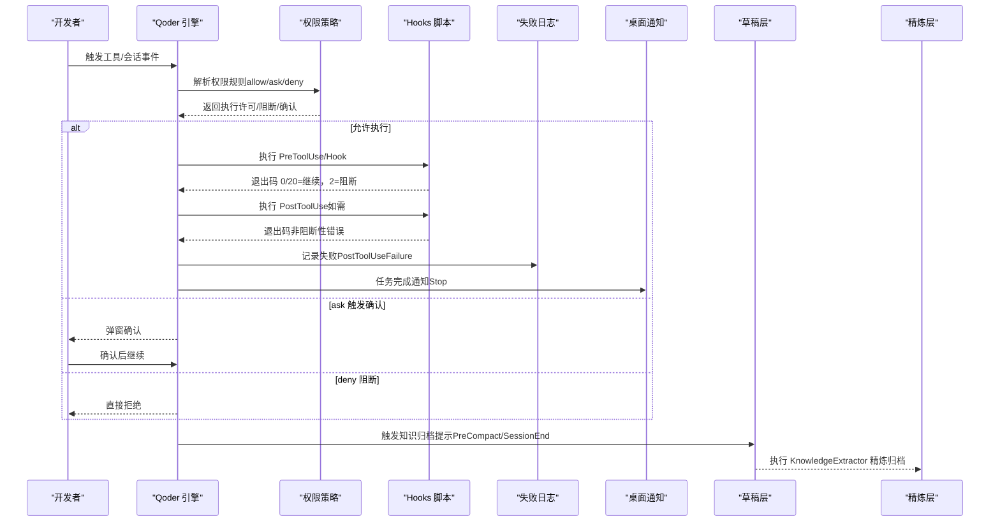
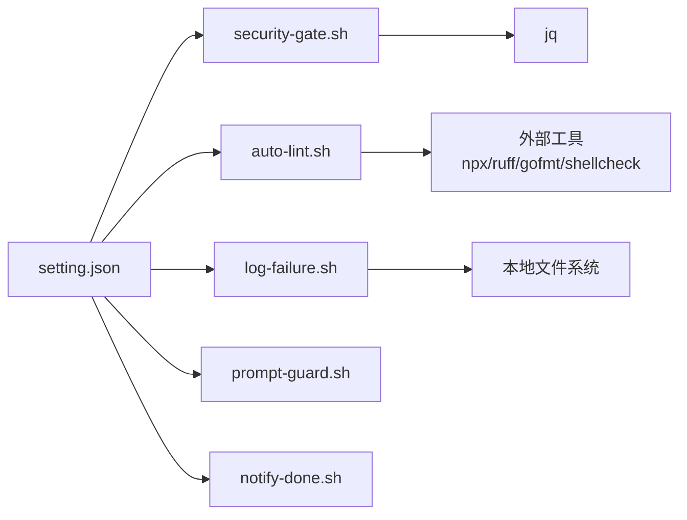

# 性能优化配置策略

<cite>
**本文引用的文件**
- [QoderHarnessEngineering落地示例.md](file://QoderHarnessEngineering落地示例.md)
- [AGENTS.md](file://AGENTS.md)
- [security-gate.sh](file://.qoderwork/hooks/security-gate.sh)
- [auto-lint.sh](file://.qoderwork/hooks/auto-lint.sh)
- [log-failure.sh](file://.qoderwork/hooks/log-failure.sh)
- [prompt-guard.sh](file://.qoderwork/hooks/prompt-guard.sh)
- [notify-done.sh](file://.qoderwork/hooks/notify-done.sh)
- [知识材料管理方案.md](file://docs/知识材料管理方案.md)
</cite>

## 目录
1. [简介](#简介)
2. [项目结构](#项目结构)
3. [核心组件](#核心组件)
4. [架构总览](#架构总览)
5. [详细组件分析](#详细组件分析)
6. [依赖关系分析](#依赖关系分析)
7. [性能考量](#性能考量)
8. [故障排查指南](#故障排查指南)
9. [结论](#结论)
10. [附录](#附录)

## 简介
本文件面向大型工程团队，系统化梳理基于 Qoder Harness 的性能优化配置策略，重点覆盖以下方面：
- Hooks 脚本的超时配置与资源限制
- 权限规则的优化与匹配效率提升
- 大型项目中的配置分层与缓存机制
- 并发执行限制与资源调度策略
- 内存使用优化与 CPU 占用控制
- 网络请求的连接池与超时重试机制
- 日志系统的性能影响与异步写入
- 监控指标与性能基准测试方法

## 项目结构
本项目采用“三层配置合并 + Hooks 生命周期工程”的组织方式，结合权限策略与知识沉淀体系，形成可扩展、可审计、可优化的工程化范式。

图示来源
- [QoderHarnessEngineering落地示例.md:42-67](file://QoderHarnessEngineering落地示例.md#L42-L67)
- [QoderHarnessEngineering落地示例.md:123-184](file://QoderHarnessEngineering落地示例.md#L123-L184)
- [知识材料管理方案.md:120-160](file://docs/知识材料管理方案.md#L120-L160)

章节来源
- [QoderHarnessEngineering落地示例.md:23-40](file://QoderHarnessEngineering落地示例.md#L23-L40)
- [QoderHarnessEngineering落地示例.md:42-67](file://QoderHarnessEngineering落地示例.md#L42-L67)
- [知识材料管理方案.md:120-160](file://docs/知识材料管理方案.md#L120-L160)

## 核心组件
- 配置分层与合并：用户级、项目级、本地级三层合并，deny 优先于 allow，本地级覆盖项目级，项目级覆盖用户级。
- 权限策略：allow（自动放行）、ask（确认后执行）、deny（直接拒绝）。支持 Bash 命令、文件读写、WebFetch 域名白名单等。
- Hooks 生命周期：PreToolUse、PostToolUse、PostToolUseFailure、UserPromptSubmit、Stop、PreCompact、SessionEnd 等。
- 知识沉淀：草稿层（项目内）与精炼层（全局），通过 Hooks 触发知识归档提示。

章节来源
- [QoderHarnessEngineering落地示例.md:244-250](file://QoderHarnessEngineering落地示例.md#L244-L250)
- [QoderHarnessEngineering落地示例.md:255-270](file://QoderHarnessEngineering落地示例.md#L255-L270)
- [QoderHarnessEngineering落地示例.md:127-184](file://QoderHarnessEngineering落地示例.md#L127-L184)
- [知识材料管理方案.md:166-215](file://docs/知识材料管理方案.md#L166-L215)

## 架构总览
下图展示 Hooks 执行链路与配置分层交互关系，以及知识沉淀触发路径。

图示来源
- [QoderHarnessEngineering落地示例.md:255-270](file://QoderHarnessEngineering落地示例.md#L255-L270)
- [QoderHarnessEngineering落地示例.md:157-182](file://QoderHarnessEngineering落地示例.md#L157-L182)
- [知识材料管理方案.md:166-215](file://docs/知识材料管理方案.md#L166-L215)

## 详细组件分析

### Hooks 超时配置与资源限制
- 配置层面
  - 在 setting.json 的 hooks 事件中为每个 Hook 指定 timeout，确保长耗时脚本不会无限占用资源。
  - 建议：PreToolUse（安全门）10s、PostToolUse（自动 Lint）30s、PostToolUseFailure（失败日志）10s。
- 脚本层面
  - 使用 set -euo pipefail 保证健壮性与可中断性。
  - 对外部命令（npx、ruff、gofmt、shellcheck）进行存在性检查，避免无效等待。
  - 失败日志脚本使用本地相对路径与 mkdir -p 确保可写。
- 资源限制建议
  - 为 Bash 脚本设置 ulimit（如文件描述符、CPU 时间）或容器化运行。
  - 对外部工具启用进程组控制，必要时使用 timeout 包裹。
  - 控制并发：同一事件内仅串行执行，避免多脚本竞争资源。

章节来源
- [QoderHarnessEngineering落地示例.md:157-182](file://QoderHarnessEngineering落地示例.md#L157-L182)
- [.qoderwork/hooks/security-gate.sh:6-13](file://.qoderwork/hooks/security-gate.sh#L6-L13)
- [.qoderwork/hooks/auto-lint.sh:6-13](file://.qoderwork/hooks/auto-lint.sh#L6-L13)
- [.qoderwork/hooks/log-failure.sh:7-11](file://.qoderwork/hooks/log-failure.sh#L7-L11)

### 权限规则优化与匹配效率
- 规则优先级
  - deny > allow > ask；更具体的规则优先于通配符规则；本地级覆盖项目级，项目级覆盖用户级。
- 匹配效率提升
  - 将高频放行规则（如 Read(./**)、Bash(ls*)）置于 allow 前部，减少后续匹配开销。
  - 使用 WebFetch 域名白名单（deny domain:* + allow 指定域）实现最小暴露面。
  - 对 Bash 前缀规则采用“最短前缀”策略，避免过多通配。
- 实施建议
  - 定期审计 deny 规则，剔除冗余项。
  - 将 ask 规则集中在高风险操作（git commit/push、配置文件修改）。
  - 为不同环境（开发/预发/线上）提供本地级覆盖，避免频繁修改项目级配置。

章节来源
- [QoderHarnessEngineering落地示例.md:244-250](file://QoderHarnessEngineering落地示例.md#L244-L250)
- [QoderHarnessEngineering落地示例.md:484-499](file://QoderHarnessEngineering落地示例.md#L484-L499)
- [QoderHarnessEngineering落地示例.md:127-156](file://QoderHarnessEngineering落地示例.md#L127-L156)

### 大型项目中的配置分层与缓存机制
- 配置分层
  - 用户级：个人偏好与全局 Hooks。
  - 项目级：团队共享的权限与 Hooks。
  - 本地级：个人覆盖，加入 .gitignore。
- 缓存机制
  - Repowiki：由系统自动生成并缓存代码库结构文档，AI 优先读取，显著降低上下文消耗。
  - 知识沉淀：草稿层（.qoder/notes/）与精炼层（~/Documents/PersonalKnowledge/）双层结构，减少重复生成成本。
- 最佳实践
  - 将大型项目的关键文档纳入 Repowiki，减少手动扫描。
  - 对频繁触发的 Hooks（如 auto-lint）尽量本地化缓存工具（npx/ruff/gofmt）以减少冷启动。

章节来源
- [QoderHarnessEngineering落地示例.md:23-40](file://QoderHarnessEngineering落地示例.md#L23-L40)
- [QoderHarnessEngineering落地示例.md:402-417](file://QoderHarnessEngineering落地示例.md#L402-L417)
- [知识材料管理方案.md:51-78](file://docs/知识材料管理方案.md#L51-L78)

### 并发执行限制与资源调度策略
- 事件模型
  - 可阻断事件（PreToolUse、UserPromptSubmit、Stop、SubagentStop）支持 exit 2 阻断。
  - 其他事件（PostToolUse、PostToolUseFailure、SessionStart/End 等）不可阻断。
- 调度策略
  - 同一事件内串行执行，避免多脚本并发竞争 CPU/IO。
  - 对外部工具调用增加超时与失败回退，避免长时间挂起。
  - 对高开销任务（Lint、网络请求）考虑异步化与队列化。

章节来源
- [QoderHarnessEngineering落地示例.md:255-270](file://QoderHarnessEngineering落地示例.md#L255-L270)
- [QoderHarnessEngineering落地示例.md:157-182](file://QoderHarnessEngineering落地示例.md#L157-L182)

### 内存使用优化与 CPU 占用控制
- 内存优化
  - Hooks 脚本避免大文本一次性处理，使用流式读取（cat | jq）。
  - 对正则匹配与 grep 使用精确模式，减少内存峰值。
- CPU 控制
  - 限制 Bash 脚本并发数，避免多实例同时运行。
  - 对外部工具（ESLint、ruff、gofmt、shellcheck）启用 --quiet 与增量检查。
  - 对网络请求（WebFetch）使用连接复用与超时控制。

章节来源
- [.qoderwork/hooks/security-gate.sh:8-13](file://.qoderwork/hooks/security-gate.sh#L8-L13)
- [.qoderwork/hooks/auto-lint.sh:17-40](file://.qoderwork/hooks/auto-lint.sh#L17-L40)
- [QoderHarnessEngineering落地示例.md:484-499](file://QoderHarnessEngineering落地示例.md#L484-L499)

### 网络请求的连接池与超时重试机制
- WebFetch 白名单策略
  - 使用 deny domain:* + allow 指定域名，实现最小暴露面。
- 连接与超时
  - 对外部 API 请求设置连接超时与读取超时，避免阻塞。
  - 对不稳定网络场景引入指数退避重试。
- 监控与告警
  - 记录失败日志（PostToolUseFailure），便于定位网络异常。

章节来源
- [QoderHarnessEngineering落地示例.md:484-499](file://QoderHarnessEngineering落地示例.md#L484-L499)
- [QoderHarnessEngineering落地示例.md:174-181](file://QoderHarnessEngineering落地示例.md#L174-L181)
- [.qoderwork/hooks/log-failure.sh:12-17](file://.qoderwork/hooks/log-failure.sh#L12-L17)

### 日志系统的性能影响与异步写入
- 性能影响
  - 失败日志写入为同步 I/O，建议控制日志量与频率。
- 异步写入建议
  - 将失败日志写入放入后台队列，避免阻塞主流程。
  - 对高频失败场景进行采样或去重。
- 日志保留与轮转
  - 限制日志文件大小与保留周期，避免磁盘膨胀。

章节来源
- [.qoderwork/hooks/log-failure.sh:7-17](file://.qoderwork/hooks/log-failure.sh#L7-L17)
- [QoderHarnessEngineering落地示例.md:515-522](file://QoderHarnessEngineering落地示例.md#L515-L522)

### 监控指标与性能基准测试
- 指标建议
  - Hooks 执行耗时分布（P50/P95/P99）、失败率、阻断率。
  - 权限规则命中率（allow/ask/deny）、Top 规则命中路径。
  - 网络请求延迟与错误率、外部工具平均耗时。
- 基准测试
  - 对关键 Hooks（security-gate、auto-lint）进行压力测试，评估在高并发下的稳定性。
  - 对 Repowiki 生成与查询进行吞吐与延迟测试，指导缓存策略。

章节来源
- [QoderHarnessEngineering落地示例.md:255-270](file://QoderHarnessEngineering落地示例.md#L255-L270)
- [QoderHarnessEngineering落地示例.md:484-499](file://QoderHarnessEngineering落地示例.md#L484-L499)

## 依赖关系分析
- 配置依赖
  - setting.json 为 Hooks 与权限策略的唯一来源；本地级覆盖项目级，项目级覆盖用户级。
- 脚本依赖
  - security-gate.sh 依赖 jq；auto-lint.sh 依赖 npx/ruff/gofmt/shellcheck；log-failure.sh 依赖 jq 与本地目录。
- 知识沉淀依赖
  - PreCompact/SessionEnd 触发知识归档提示，依赖 KnowledgeExtractor Skill。

图示来源
- [QoderHarnessEngineering落地示例.md:127-184](file://QoderHarnessEngineering落地示例.md#L127-L184)
- [.qoderwork/hooks/security-gate.sh:8-9](file://.qoderwork/hooks/security-gate.sh#L8-L9)
- [.qoderwork/hooks/auto-lint.sh:19-38](file://.qoderwork/hooks/auto-lint.sh#L19-L38)
- [.qoderwork/hooks/log-failure.sh:7-8](file://.qoderwork/hooks/log-failure.sh#L7-L8)

章节来源
- [QoderHarnessEngineering落地示例.md:127-184](file://QoderHarnessEngineering落地示例.md#L127-L184)
- [.qoderwork/hooks/security-gate.sh:8-9](file://.qoderwork/hooks/security-gate.sh#L8-L9)
- [.qoderwork/hooks/auto-lint.sh:19-38](file://.qoderwork/hooks/auto-lint.sh#L19-L38)
- [.qoderwork/hooks/log-failure.sh:7-8](file://.qoderwork/hooks/log-failure.sh#L7-L8)

## 性能考量
- 超时与资源限制
  - 为每个 Hooks 事件配置合理 timeout，避免长尾阻塞。
  - 对外部工具调用增加存在性检查与降级策略。
- 匹配与规则优化
  - deny 优先、更具体规则优先；将高频规则前置。
  - WebFetch 使用白名单策略，减少网络开销。
- 并发与调度
  - 串行执行同一事件内的 Hooks；对外部工具启用连接复用与超时。
- I/O 与日志
  - 失败日志写入异步化；控制日志量与保留周期。
- 知识沉淀
  - Repowiki 缓存代码库结构，减少上下文扫描成本；双层结构降低重复生成。

章节来源
- [QoderHarnessEngineering落地示例.md:244-250](file://QoderHarnessEngineering落地示例.md#L244-L250)
- [QoderHarnessEngineering落地示例.md:484-499](file://QoderHarnessEngineering落地示例.md#L484-L499)
- [QoderHarnessEngineering落地示例.md:157-182](file://QoderHarnessEngineering落地示例.md#L157-L182)
- [.qoderwork/hooks/log-failure.sh:7-17](file://.qoderwork/hooks/log-failure.sh#L7-L17)
- [知识材料管理方案.md:51-78](file://docs/知识材料管理方案.md#L51-L78)

## 故障排查指南
- 权限规则不生效
  - 检查 deny 优先级与本地级覆盖；确认规则格式与匹配对象（Bash/Write/Edit/WebFetch）。
- Hooks 超时或卡死
  - 检查 timeout 配置与外部工具是否存在；为脚本增加 set -euo pipefail 与错误码处理。
- 失败日志未记录
  - 检查 .qoderwork/logs 目录权限与磁盘空间；确认 PostToolUseFailure 事件是否正确触发。
- 提示词注入阻断误报
  - 检查 prompt-guard.sh 的正则模式，必要时放宽或细化规则。
- 通知未弹出
  - 检查 notify-done.sh 的平台命令（osascript）与权限。

章节来源
- [QoderHarnessEngineering落地示例.md:244-250](file://QoderHarnessEngineering落地示例.md#L244-L250)
- [QoderHarnessEngineering落地示例.md:157-182](file://QoderHarnessEngineering落地示例.md#L157-L182)
- [.qoderwork/hooks/log-failure.sh:7-17](file://.qoderwork/hooks/log-failure.sh#L7-L17)
- [.qoderwork/hooks/prompt-guard.sh:45-52](file://.qoderwork/hooks/prompt-guard.sh#L45-L52)
- [.qoderwork/hooks/notify-done.sh:10-13](file://.qoderwork/hooks/notify-done.sh#L10-L13)

## 结论
通过三层配置合并、精细化权限规则与 Hooks 超时控制，结合 Repowiki 缓存与知识沉淀双层结构，可在大型项目中实现稳定、高效且可审计的工程化范式。建议持续监控关键指标，定期压测与优化，确保在高并发与复杂场景下的性能与可靠性。

## 附录
- 快速启动与验证
  - 复制 .qoder 与 .qoderwork 目录，赋予脚本执行权限，验证 ask 规则触发。
- 相关文件路径
  - setting.json、setting.local.json、Hooks 脚本、AGENTS.md、知识沉淀目录。

章节来源
- [QoderHarnessEngineering落地示例.md:503-552](file://QoderHarnessEngineering落地示例.md#L503-L552)
- [AGENTS.md:34-69](file://AGENTS.md#L34-L69)
- [知识材料管理方案.md:120-160](file://docs/知识材料管理方案.md#L120-L160)