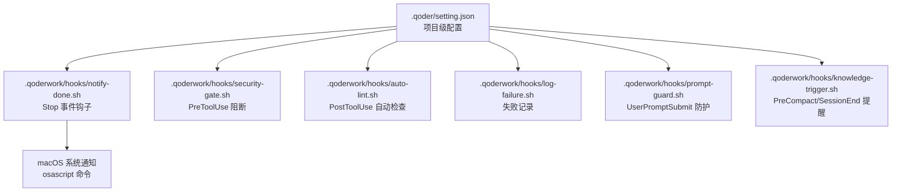
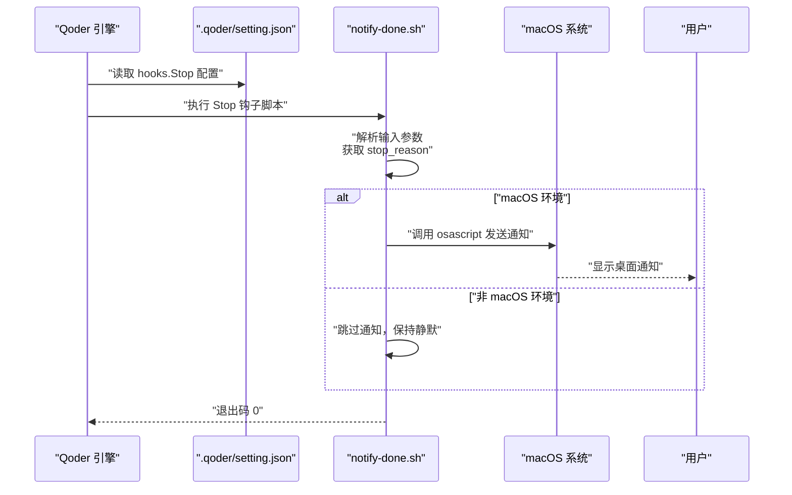
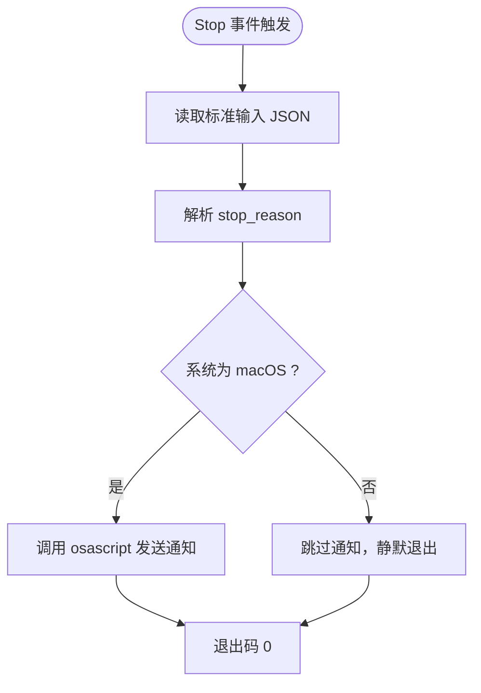
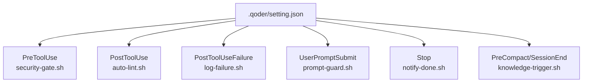
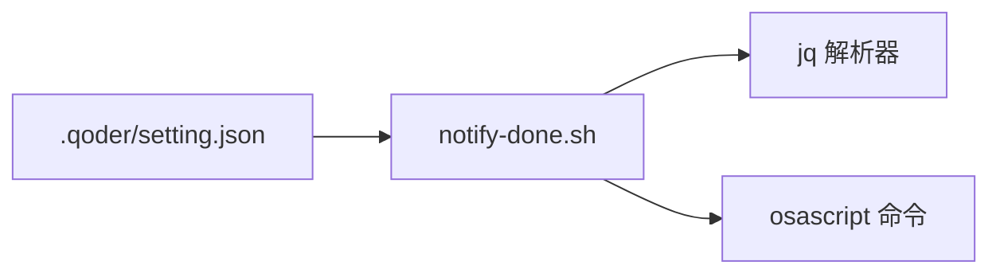

# 桌面通知集成配置

<cite>
**本文引用的文件**
- [.qoderwork/hooks/notify-done.sh](file://.qoderwork/hooks/notify-done.sh)
- [.qoder/setting.json](file://.qoder/setting.json)
- [.qoderwork/hooks/security-gate.sh](file://.qoderwork/hooks/security-gate.sh)
- [.qoderwork/hooks/auto-lint.sh](file://.qoderwork/hooks/auto-lint.sh)
- [.qoderwork/hooks/log-failure.sh](file://.qoderwork/hooks/log-failure.sh)
- [.qoderwork/hooks/prompt-guard.sh](file://.qoderwork/hooks/prompt-guard.sh)
- [.qoderwork/hooks/knowledge-trigger.sh](file://.qoderwork/hooks/knowledge-trigger.sh)
- [AGENTS.md](file://AGENTS.md)
- [QoderHarnessEngineering落地示例.md](file://QoderHarnessEngineering落地示例.md)
</cite>

## 目录
1. [简介](#简介)
2. [项目结构](#项目结构)
3. [核心组件](#核心组件)
4. [架构概览](#架构概览)
5. [详细组件分析](#详细组件分析)
6. [依赖关系分析](#依赖关系分析)
7. [性能考虑](#性能考虑)
8. [故障排除指南](#故障排除指南)
9. [结论](#结论)
10. [附录](#附录)

## 简介
本文件面向桌面通知集成配置，聚焦于 Stop 事件的配置与触发机制，详解 macOS 平台的 osascript 命令集成与通知样式定制，提供通知内容的动态参数化与多语言支持方案，并给出跨平台替代方案与兼容性处理建议。同时，文档涵盖通知频率控制与用户体验优化策略、通知模板自定义与品牌化配置指南，以及故障排除与性能优化的最佳实践。

## 项目结构
本项目采用 Qoder 工程化模板，桌面通知集成位于生命周期钩子中，通过 Stop 事件触发。关键文件与职责如下：
- .qoder/setting.json：项目级配置，定义 Stop 事件的钩子调用与超时时间
- .qoderwork/hooks/notify-done.sh：Stop 事件钩子脚本，负责 macOS 桌面通知
- 其他钩子脚本：security-gate.sh、auto-lint.sh、log-failure.sh、prompt-guard.sh、knowledge-trigger.sh，构成完整的生命周期工程

**图表来源**
- [.qoder/setting.json:78-88](file://.qoder/setting.json#L78-L88)
- [.qoderwork/hooks/notify-done.sh:1-16](file://.qoderwork/hooks/notify-done.sh#L1-L16)

**章节来源**
- [.qoder/setting.json:78-88](file://.qoder/setting.json#L78-L88)
- [QoderHarnessEngineering落地示例.md:42-67](file://QoderHarnessEngineering落地示例.md#L42-L67)

## 核心组件
- Stop 事件钩子配置：在 .qoder/setting.json 的 hooks.Stop 中注册 notify-done.sh，设置超时时间，确保通知在 Agent 完成响应后触发
- notify-done.sh：接收来自 Qoder 的输入，解析 stop_reason，调用 osascript 发送桌面通知，并优雅处理非 macOS 环境
- 事件类型与触发时机：Stop 事件在 Agent 完成响应时触发，适合用于任务完成通知

**章节来源**
- [.qoder/setting.json:78-88](file://.qoder/setting.json#L78-L88)
- [.qoderwork/hooks/notify-done.sh:7-13](file://.qoderwork/hooks/notify-done.sh#L7-L13)
- [QoderHarnessEngineering落地示例.md:257-270](file://QoderHarnessEngineering落地示例.md#L257-L270)

## 架构概览
Stop 事件的触发与通知发送流程如下：

**图表来源**
- [.qoder/setting.json:78-88](file://.qoder/setting.json#L78-L88)
- [.qoderwork/hooks/notify-done.sh:7-13](file://.qoderwork/hooks/notify-done.sh#L7-L13)

## 详细组件分析

### Stop 事件配置与触发机制
- 配置入口：hooks.Stop 指向 notify-done.sh，并设置超时时间，保证通知在 Agent 完成响应后触发
- 输入解析：脚本从标准输入读取 JSON，使用 jq 提取 stop_reason，若缺失则回退为默认值
- 触发时机：Stop 事件在 Agent 完成响应时触发，适合用于任务完成通知

**图表来源**
- [.qoderwork/hooks/notify-done.sh:7-13](file://.qoderwork/hooks/notify-done.sh#L7-L13)

**章节来源**
- [.qoder/setting.json:78-88](file://.qoder/setting.json#L78-L88)
- [.qoderwork/hooks/notify-done.sh:7-13](file://.qoderwork/hooks/notify-done.sh#L7-L13)
- [QoderHarnessEngineering落地示例.md:257-270](file://QoderHarnessEngineering落地示例.md#L257-L270)

### macOS 桌面通知样式定制
- 通知内容：标题与消息文本可通过脚本参数化，便于品牌化与多语言支持
- 声音效果：脚本内置声音名称，可根据需要调整或移除
- 兼容性：脚本检测 osascript 可用性，非 macOS 环境自动降级为静默模式

**章节来源**
- [.qoderwork/hooks/notify-done.sh:10-13](file://.qoderwork/hooks/notify-done.sh#L10-L13)

### 通知内容动态参数化与多语言支持
- 参数化策略：通过环境变量或外部配置文件注入通知标题与消息，实现动态内容
- 多语言支持：在脚本中根据语言偏好选择不同文案，或通过外部 i18n 文件映射
- 品牌化：统一的品牌色彩、图标与声音可在系统层面配置，脚本中保留最小可定制点

**章节来源**
- [.qoderwork/hooks/notify-done.sh:7-13](file://.qoderwork/hooks/notify-done.sh#L7-L13)

### 跨平台替代方案与兼容性处理
- Windows 替代：使用 PowerShell 调用 Windows Toast API 或第三方通知工具
- Linux 替代：使用 notify-send 命令或桌面通知服务
- 通用策略：在脚本中检测系统类型，选择对应通知方式；若不可用则静默退出，保证流程不中断

**章节来源**
- [.qoderwork/hooks/notify-done.sh:10-13](file://.qoderwork/hooks/notify-done.sh#L10-L13)

### 通知频率控制与用户体验优化
- 频率控制：在脚本中引入去重逻辑（如基于会话 ID 或时间戳），避免重复通知
- 用户偏好：通过配置文件允许用户关闭通知或调整触发条件
- 体验优化：仅在关键任务完成时触发通知，避免干扰日常操作

**章节来源**
- [.qoderwork/hooks/notify-done.sh:7-13](file://.qoderwork/hooks/notify-done.sh#L7-L13)

### 通知模板自定义与品牌化配置
- 模板结构：标题、副标题、动作按钮等元素可按需组合
- 品牌化：统一的视觉风格与声音效果，提升产品一致性
- 配置化：通过外部配置文件管理模板与品牌参数，减少脚本改动

**章节来源**
- [.qoderwork/hooks/notify-done.sh:10-13](file://.qoderwork/hooks/notify-done.sh#L10-L13)

### 与其他生命周期钩子的协同
- PreToolUse：security-gate.sh 阻断高危命令，保障执行安全
- PostToolUse：auto-lint.sh 自动格式化与静态检查，提升代码质量
- PostToolUseFailure：log-failure.sh 记录失败日志，便于问题追踪
- UserPromptSubmit：prompt-guard.sh 防护提示词注入，提升安全性
- PreCompact/SessionEnd：knowledge-trigger.sh 提示知识归档，促进知识沉淀

**图表来源**
- [.qoder/setting.json:30-112](file://.qoder/setting.json#L30-L112)

**章节来源**
- [.qoder/setting.json:30-112](file://.qoder/setting.json#L30-L112)
- [.qoderwork/hooks/security-gate.sh:15-35](file://.qoderwork/hooks/security-gate.sh#L15-L35)
- [.qoderwork/hooks/auto-lint.sh:17-40](file://.qoderwork/hooks/auto-lint.sh#L17-L40)
- [.qoderwork/hooks/log-failure.sh:12-17](file://.qoderwork/hooks/log-failure.sh#L12-L17)
- [.qoderwork/hooks/prompt-guard.sh:14-52](file://.qoderwork/hooks/prompt-guard.sh#L14-L52)
- [.qoderwork/hooks/knowledge-trigger.sh:18-37](file://.qoderwork/hooks/knowledge-trigger.sh#L18-L37)

## 依赖关系分析
- 配置依赖：.qoder/setting.json 决定 Stop 事件是否触发 notify-done.sh
- 脚本依赖：notify-done.sh 依赖 jq 解析输入，依赖 osascript 发送通知
- 系统依赖：macOS 环境下 osascript 可用，非 macOS 环境自动降级

**图表来源**
- [.qoder/setting.json:78-88](file://.qoder/setting.json#L78-L88)
- [.qoderwork/hooks/notify-done.sh:7-13](file://.qoderwork/hooks/notify-done.sh#L7-L13)

**章节来源**
- [.qoder/setting.json:78-88](file://.qoder/setting.json#L78-L88)
- [.qoderwork/hooks/notify-done.sh:7-13](file://.qoderwork/hooks/notify-done.sh#L7-L13)

## 性能考虑
- 脚本执行时间：通知脚本应尽量短小，避免影响整体响应时间
- I/O 操作：减少不必要的文件读写，必要时使用缓存
- 错误处理：对系统命令失败进行降级处理，避免阻塞主流程

## 故障排除指南
- 通知未显示
  - 检查系统通知权限与系统偏好设置
  - 确认 osascript 命令可用性
  - 验证脚本执行权限与路径
- 通知内容异常
  - 检查输入 JSON 的 stop_reason 字段
  - 确认脚本中参数化逻辑与环境变量
- 跨平台兼容性问题
  - 在非 macOS 环境下，脚本会静默退出，属预期行为
  - 如需通知，请替换为对应平台的通知命令

**章节来源**
- [.qoderwork/hooks/notify-done.sh:10-13](file://.qoderwork/hooks/notify-done.sh#L10-L13)
- [.qoderwork/hooks/notify-done.sh:7-13](file://.qoderwork/hooks/notify-done.sh#L7-L13)

## 结论
通过在 .qoder/setting.json 中配置 Stop 事件钩子并结合 notify-done.sh，可实现可靠的桌面通知集成。脚本针对 macOS 的 osascript 进行了适配，并在非 macOS 环境下提供静默降级。配合参数化与多语言支持，可满足品牌化与国际化需求。建议在生产环境中增加频率控制与用户偏好配置，以优化用户体验。

## 附录
- 快速启用步骤
  - 确保 .qoderwork/hooks/notify-done.sh 可执行
  - 在 .qoder/setting.json 中启用 hooks.Stop
  - 在 macOS 系统上验证通知显示
- 相关文件
  - .qoder/setting.json：项目级配置
  - .qoderwork/hooks/notify-done.sh：Stop 事件钩子脚本
  - AGENTS.md：项目行为约束与上下文

**章节来源**
- [QoderHarnessEngineering落地示例.md:503-552](file://QoderHarnessEngineering落地示例.md#L503-L552)
- [AGENTS.md:340-356](file://AGENTS.md#L340-L356)