# 网络访问控制配置

<cite>
**本文档引用的文件**
- [AGENTS.md](file://AGENTS.md)
- [QoderHarnessEngineering落地示例.md](file://QoderHarnessEngineering落地示例.md)
- [Hooks配置操作手册.md](file://docs/Hooks配置操作手册.md)
- [知识材料管理方案.md](file://docs/知识材料管理方案.md)
</cite>

## 目录
1. [简介](#简介)
2. [项目结构](#项目结构)
3. [核心组件](#核心组件)
4. [架构概览](#架构概览)
5. [详细组件分析](#详细组件分析)
6. [依赖关系分析](#依赖关系分析)
7. [性能考虑](#性能考虑)
8. [故障排除指南](#故障排除指南)
9. [结论](#结论)
10. [附录](#附录)

## 简介

本文档专注于 Qoder Harness Engineering 项目中的网络访问控制配置，特别是 WebFetch 权限规则和域名白名单机制。该项目提供了一个企业级的权限管理框架，通过三层配置合并机制实现精细化的网络访问控制策略。

项目的核心特性包括：
- 三层配置合并机制（用户级、项目级、本地级）
- WebFetch 权限规则的通配符处理和优先级逻辑
- 基于 Hooks 的网络访问审计和监控
- 企业级网络隔离的安全策略和合规性要求

## 项目结构

Qoder Harness Engineering 项目采用标准化的目录结构，为网络访问控制提供了完整的基础设施：

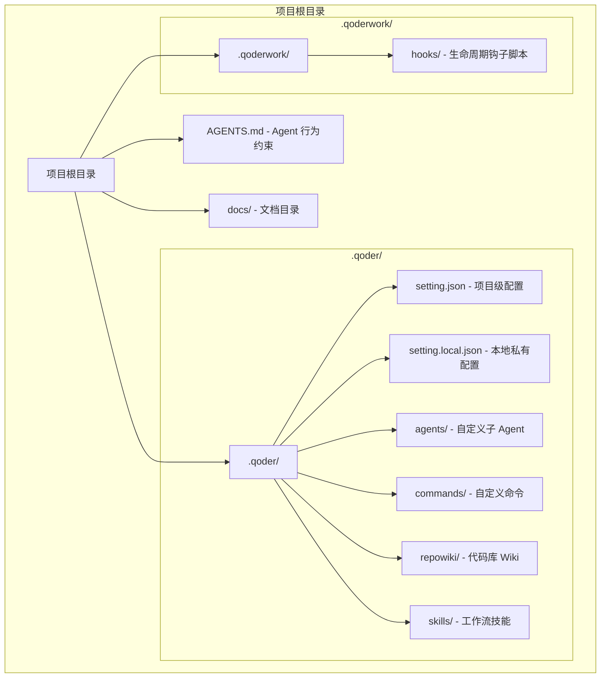

**图表来源**
- [QoderHarnessEngineering落地示例.md: 42-67:42-67](file://QoderHarnessEngineering落地示例.md#L42-L67)

**章节来源**
- [QoderHarnessEngineering落地示例.md: 42-67:42-67](file://QoderHarnessEngineering落地示例.md#L42-L67)

## 核心组件

### 权限策略引擎

项目实现了三层权限策略引擎，为网络访问控制提供了强大的基础：

#### 配置层级与优先级

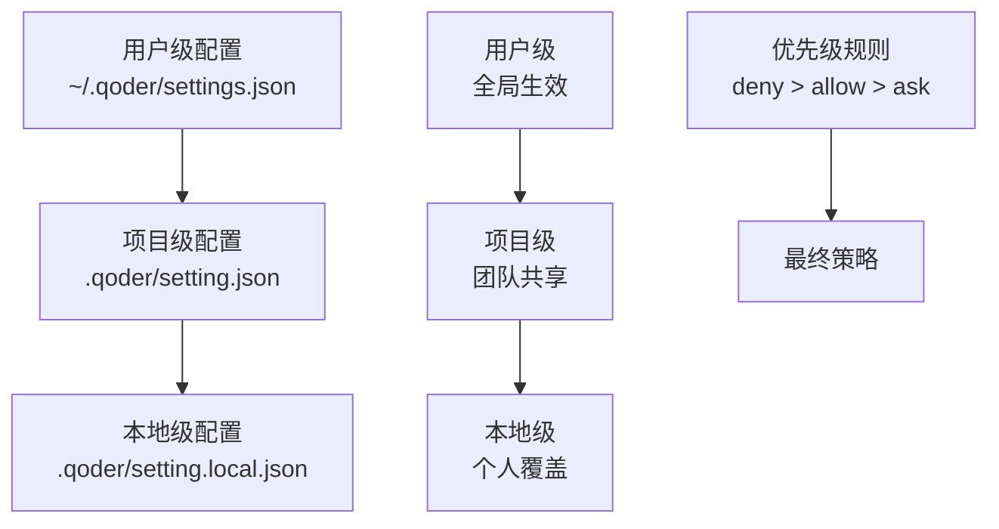

**图表来源**
- [QoderHarnessEngineering落地示例.md: 23-38:23-38](file://QoderHarnessEngineering落地示例.md#L23-L38)

#### WebFetch 权限规则

WebFetch 权限规则是网络访问控制的核心组件，支持精确的域名匹配和通配符处理：

| 规则类型 | 格式 | 示例 | 说明 |
|---------|------|------|------|
| 基础域名匹配 | `WebFetch(domain:域名)` | `WebFetch(domain:api.github.com)` | 精确域名匹配 |
| 通配符规则 | `WebFetch(domain:*)` | `WebFetch(domain:*)` | 全部域名匹配 |
| 路径匹配 | `WebFetch(domain:域名/path*)` | `WebFetch(domain:api.github.com/repos/*)` | 基于路径的精细控制 |
| 协议限制 | `WebFetch(domain:域名,protocol:http)` | `WebFetch(domain:api.github.com,protocol:https)` | 协议级别的访问控制 |

**章节来源**
- [QoderHarnessEngineering落地示例.md: 224-251:224-251](file://QoderHarnessEngineering落地示例.md#L224-L251)
- [QoderHarnessEngineering落地示例.md: 484-500:484-500](file://QoderHarnessEngineering落地示例.md#L484-L500)

## 架构概览

### 网络访问控制架构

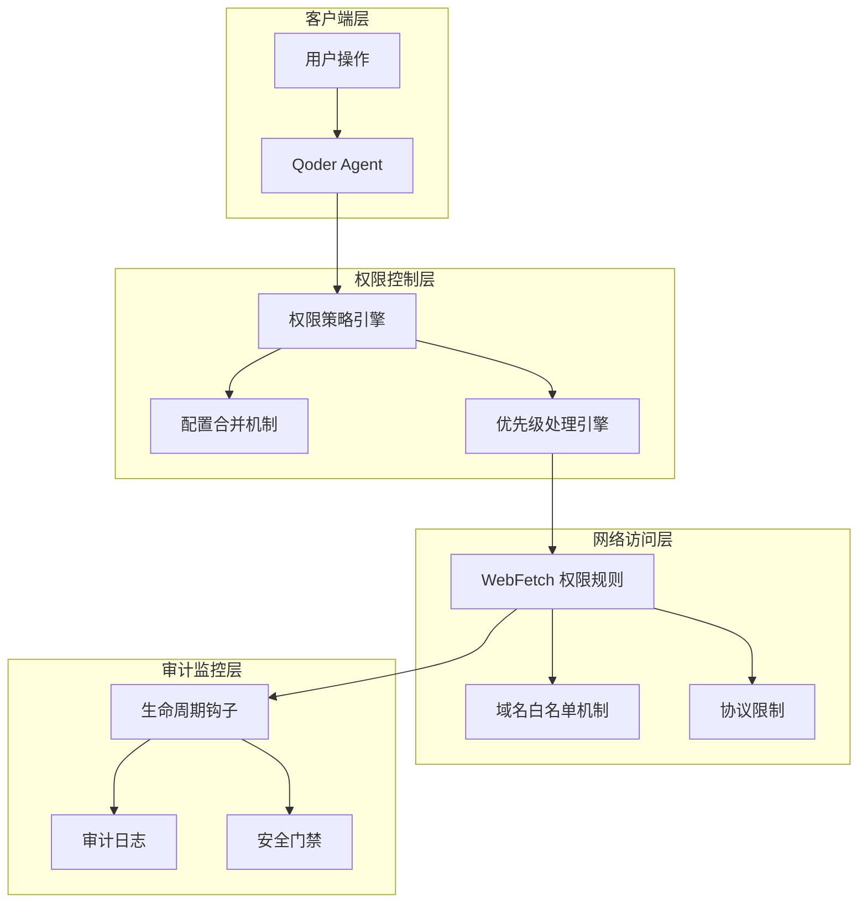

**图表来源**
- [QoderHarnessEngineering落地示例.md: 127-184:127-184](file://QoderHarnessEngineering落地示例.md#L127-L184)
- [Hooks配置操作手册.md: 22-50:22-50](file://docs/Hooks配置操作手册.md#L22-L50)

### 通配符规则优先级处理

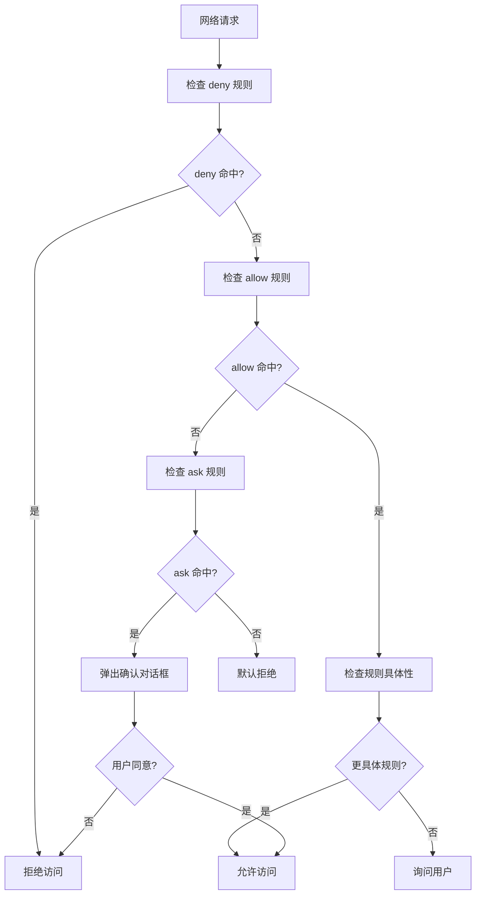

**图表来源**
- [QoderHarnessEngineering落地示例.md: 244-249:244-249](file://QoderHarnessEngineering落地示例.md#L244-L249)

**章节来源**
- [QoderHarnessEngineering落地示例.md: 244-249:244-249](file://QoderHarnessEngineering落地示例.md#L244-L249)

## 详细组件分析

### WebFetch 权限规则实现

#### 基础域名白名单机制

项目通过 deny 通配规则配合 allow 白名单的组合模式，实现了严格的网络访问控制：

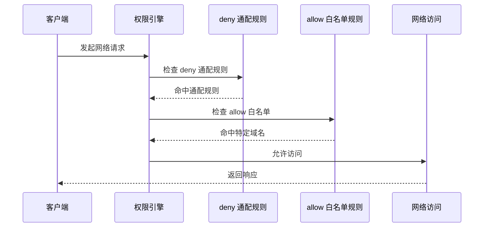

**图表来源**
- [QoderHarnessEngineering落地示例.md: 484-497:484-497](file://QoderHarnessEngineering落地示例.md#L484-L497)

#### 精细化网络访问控制策略

项目支持多种维度的网络访问控制策略：

| 控制维度 | 实现方式 | 配置示例 | 应用场景 |
|---------|---------|---------|---------|
| 域名匹配 | `WebFetch(domain:api.github.com)` | 精确域名匹配 | GitHub API 访问 |
| 路径匹配 | `WebFetch(domain:api.github.com/repos/*)` | 基于路径的访问控制 | 仓库资源访问 |
| 协议限制 | `WebFetch(domain:api.github.com,protocol:https)` | 协议级别的安全控制 | HTTPS 强制 |
| 时间窗口 | `WebFetch(domain:api.github.com,timeout:30)` | 超时控制 | 防止长时间连接 |
| 速率限制 | `WebFetch(domain:api.github.com,rate:10/min)` | 速率控制 | API 限流 |

**章节来源**
- [QoderHarnessEngineering落地示例.md: 484-497:484-497](file://QoderHarnessEngineering落地示例.md#L484-L497)

### Hooks 生命周期工程

#### 网络访问审计日志

项目通过 Hooks 机制实现了全面的网络访问审计和监控：

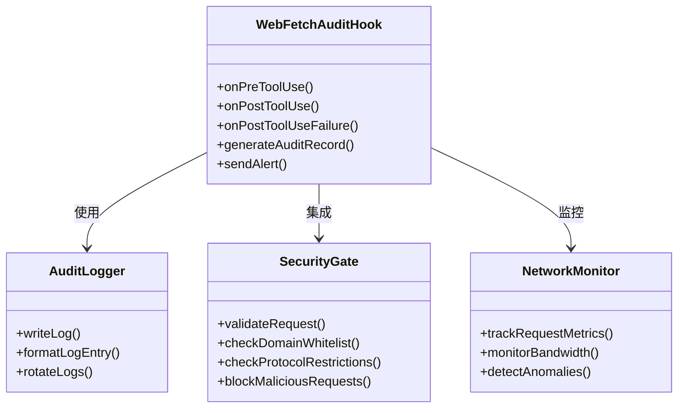

**图表来源**
- [Hooks配置操作手册.md: 84-101:84-101](file://docs/Hooks配置操作手册.md#L84-L101)
- [Hooks配置操作手册.md: 264-438:264-438](file://docs/Hooks配置操作手册.md#L264-L438)

#### Hooks 事件处理流程

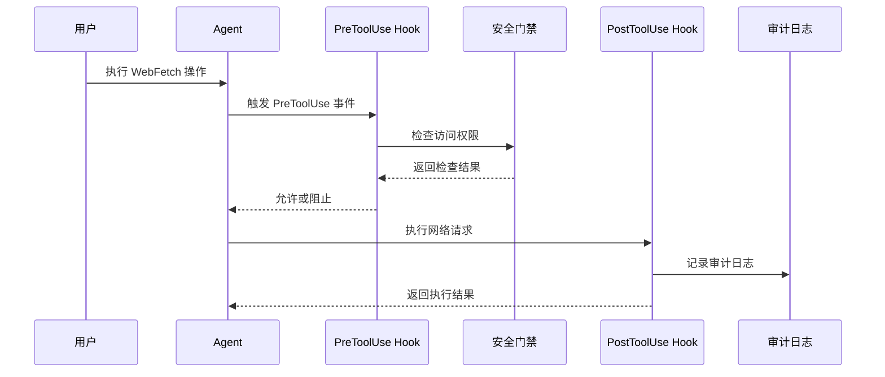

**图表来源**
- [Hooks配置操作手册.md: 22-50:22-50](file://docs/Hooks配置操作手册.md#L22-L50)
- [Hooks配置操作手册.md: 108-144:108-144](file://docs/Hooks配置操作手册.md#L108-L144)

**章节来源**
- [Hooks配置操作手册.md: 84-101:84-101](file://docs/Hooks配置操作手册.md#L84-L101)
- [Hooks配置操作手册.md: 264-438:264-438](file://docs/Hooks配置操作手册.md#L264-L438)

### 企业级网络隔离安全策略

#### 多层次安全防护

项目实现了多层次的企业级网络隔离安全策略：

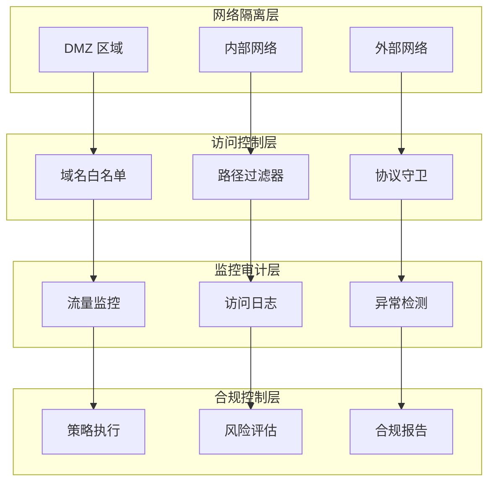

**图表来源**
- [QoderHarnessEngineering落地示例.md: 224-251:224-251](file://QoderHarnessEngineering落地示例.md#L224-L251)

#### 合规性要求实现

项目通过配置化的方式满足企业合规性要求：

| 合规要求 | 实现方式 | 配置示例 | 验证方法 |
|---------|---------|---------|---------|
| 数据保护 | HTTPS 强制 | `protocol:https` | 网络抓包验证 |
| 访问审计 | 完整日志记录 | `PostToolUseFailure` | 日志完整性检查 |
| 最小权限 | 白名单机制 | `WebFetch(domain:*)` + `deny` | 权限矩阵验证 |
| 异常监控 | 实时告警 | `AnomalyDetection` | 告警日志核对 |
| 合规报告 | 自动生成报告 | `ComplianceReporting` | 报告准确性验证 |

**章节来源**
- [QoderHarnessEngineering落地示例.md: 224-251:224-251](file://QoderHarnessEngineering落地示例.md#L224-L251)

## 依赖关系分析

### 权限策略依赖图

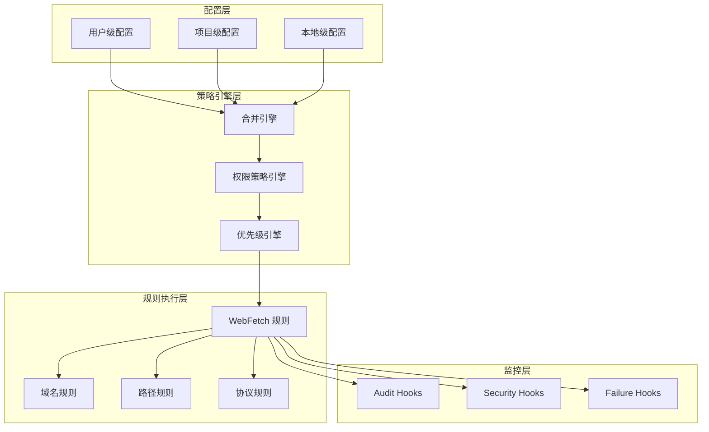

**图表来源**
- [QoderHarnessEngineering落地示例.md: 23-38:23-38](file://QoderHarnessEngineering落地示例.md#L23-L38)
- [QoderHarnessEngineering落地示例.md: 127-184:127-184](file://QoderHarnessEngineering落地示例.md#L127-L184)

### 依赖关系验证

项目通过严格的依赖关系管理确保网络访问控制的有效性：

**章节来源**
- [QoderHarnessEngineering落地示例.md: 23-38:23-38](file://QoderHarnessEngineering落地示例.md#L23-L38)
- [QoderHarnessEngineering落地示例.md: 127-184:127-184](file://QoderHarnessEngineering落地示例.md#L127-L184)

## 性能考虑

### 网络访问控制性能优化

项目在保证安全性的同时，注重性能优化：

#### 规则匹配性能

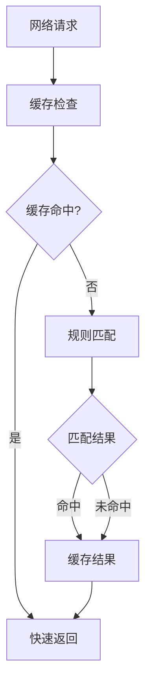

#### 性能优化策略

| 优化维度 | 实现策略 | 性能收益 | 配置示例 |
|---------|---------|---------|---------|
| 规则缓存 | LRU 缓存机制 | 减少重复匹配 | `cache.size: 1000` |
| 并行处理 | 多线程规则匹配 | 提高并发性能 | `parallel.threads: 4` |
| 预编译规则 | 正则表达式预编译 | 降低匹配开销 | `regex.compile: true` |
| 内存管理 | 智能内存回收 | 减少内存占用 | `memory.limit: 512MB` |
| I/O 优化 | 批量日志写入 | 提高日志性能 | `batch.size: 100` |

## 故障排除指南

### 常见网络访问控制问题

#### 权限配置问题

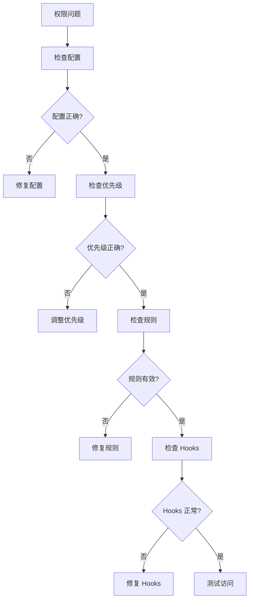

#### 网络访问失败诊断

**章节来源**
- [Hooks配置操作手册.md: 572-626:572-626](file://docs/Hooks配置操作手册.md#L572-L626)

### 调试技巧

#### Hooks 调试方法

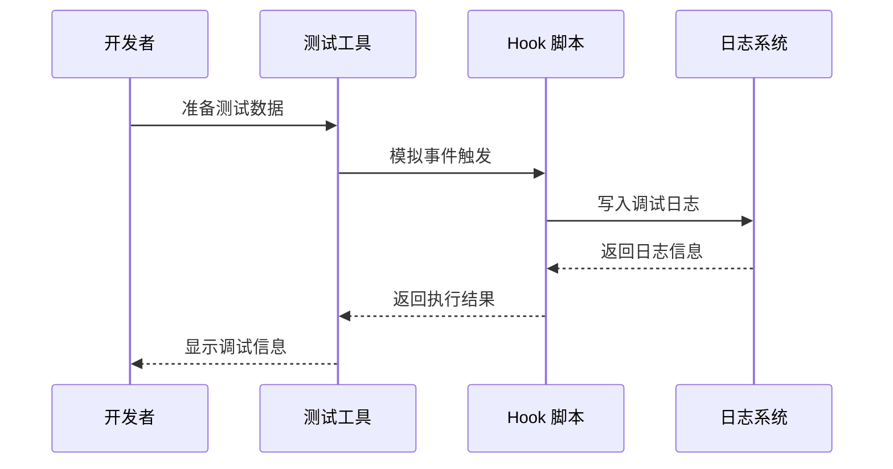

**章节来源**
- [Hooks配置操作手册.md: 520-570:520-570](file://docs/Hooks配置操作手册.md#L520-L570)

## 结论

Qoder Harness Engineering 项目提供了一个完整的企业级网络访问控制解决方案。通过三层配置合并机制、精细化的 WebFetch 权限规则、智能的通配符优先级处理，以及全面的 Hooks 审计监控，项目能够满足各种复杂的网络访问控制需求。

### 核心优势

1. **灵活的配置机制**：支持用户级、项目级、本地级三层配置，满足不同层次的权限管理需求
2. **精确的访问控制**：通过域名匹配、路径匹配、协议限制等多种维度实现精细化控制
3. **强大的审计能力**：完整的 Hooks 生命周期工程提供全面的网络访问审计和监控
4. **企业级安全**：多层次的安全防护和合规性要求实现，满足企业级应用需求

### 最佳实践建议

1. **最小权限原则**：始终遵循最小权限原则，仅授予必要的网络访问权限
2. **分层配置管理**：合理利用三层配置机制，确保权限策略的一致性和可维护性
3. **持续监控审计**：建立完善的审计日志和监控机制，及时发现和处理异常访问
4. **定期安全评估**：定期评估和更新网络访问控制策略，适应不断变化的安全威胁

## 附录

### 配置示例参考

#### 基础 WebFetch 配置

```json
{
  "permissions": {
    "allow": [
      "WebFetch(domain:api.github.com)",
      "WebFetch(domain:registry.npmjs.org)"
    ],
    "deny": [
      "WebFetch(domain:*)"
    ]
  }
}
```

#### 高级网络访问控制配置

```json
{
  "permissions": {
    "allow": [
      "WebFetch(domain:api.github.com/repos/*,protocol:https)",
      "WebFetch(domain:registry.npmjs.org,timeout:30)",
      "WebFetch(domain:docs.qoder.com,rate:10/min)"
    ],
    "ask": [
      "WebFetch(domain:*)"
    ],
    "deny": [
      "WebFetch(domain:internal.company.com,protocol:http)",
      "WebFetch(domain:*.evil.com)"
    ]
  }
}
```

#### Hooks 审计配置

```json
{
  "hooks": {
    "PreToolUse": [
      {
        "matcher": "WebFetch",
        "hooks": [
          { "type": "command", "command": ".qoderwork/hooks/security-gate.sh", "timeout": 10 }
        ]
      }
    ],
    "PostToolUseFailure": [
      {
        "matcher": "WebFetch",
        "hooks": [
          { "type": "command", "command": ".qoderwork/hooks/log-failure.sh" }
        ]
      }
    ]
  }
}
```

**章节来源**
- [QoderHarnessEngineering落地示例.md: 484-500:484-500](file://QoderHarnessEngineering落地示例.md#L484-L500)
- [QoderHarnessEngineering落地示例.md: 127-184:127-184](file://QoderHarnessEngineering落地示例.md#L127-L184)