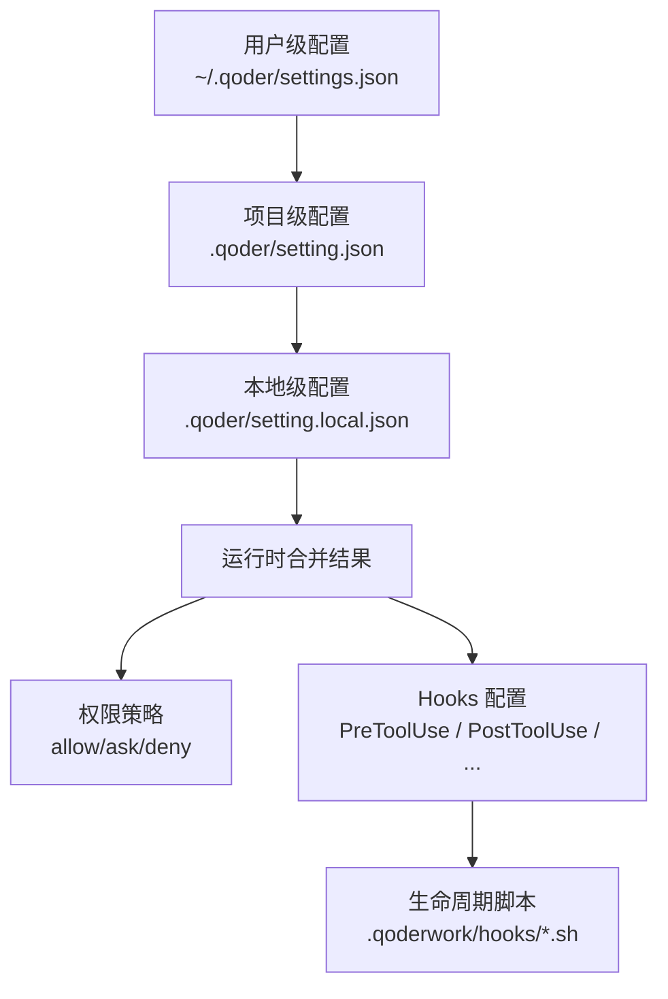
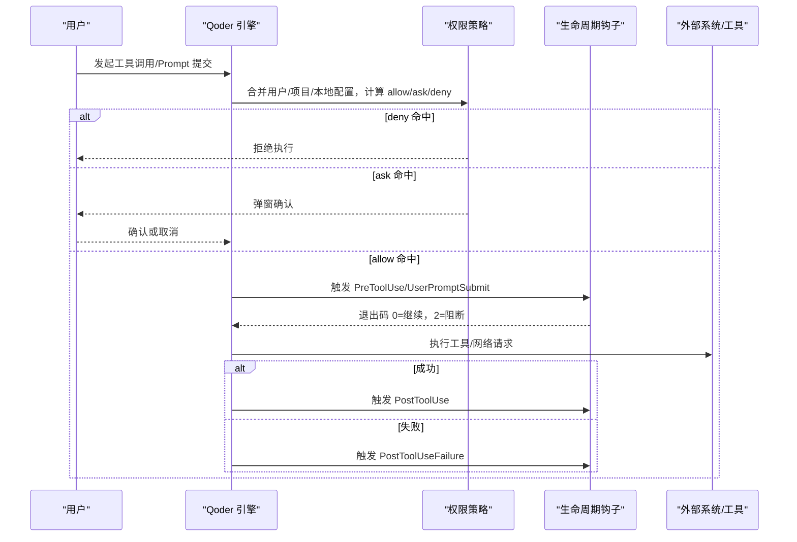
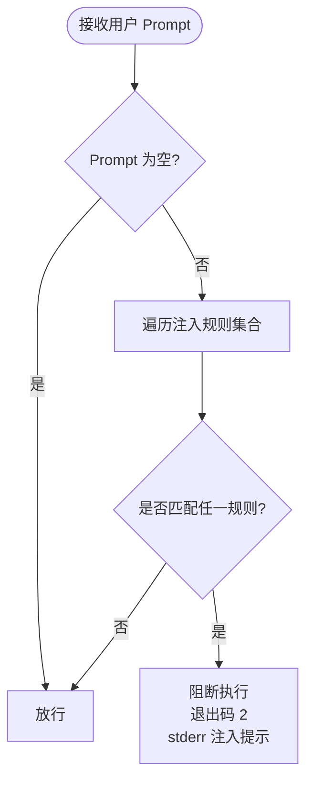
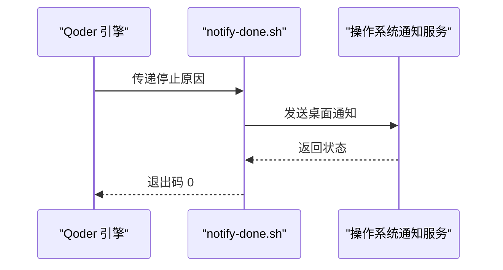
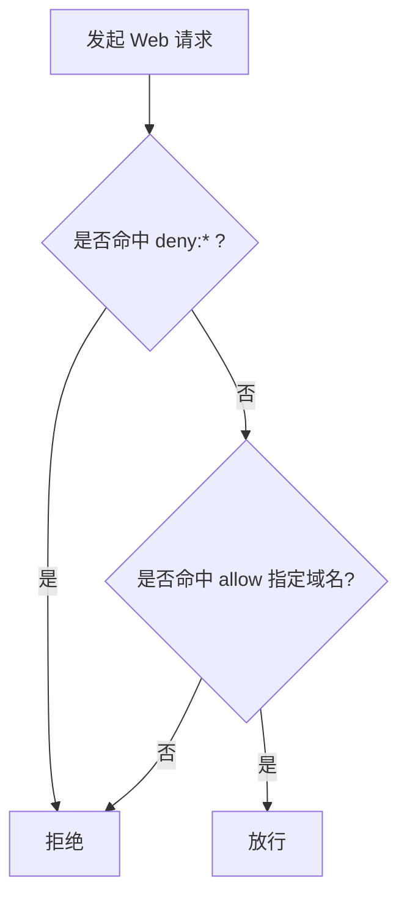
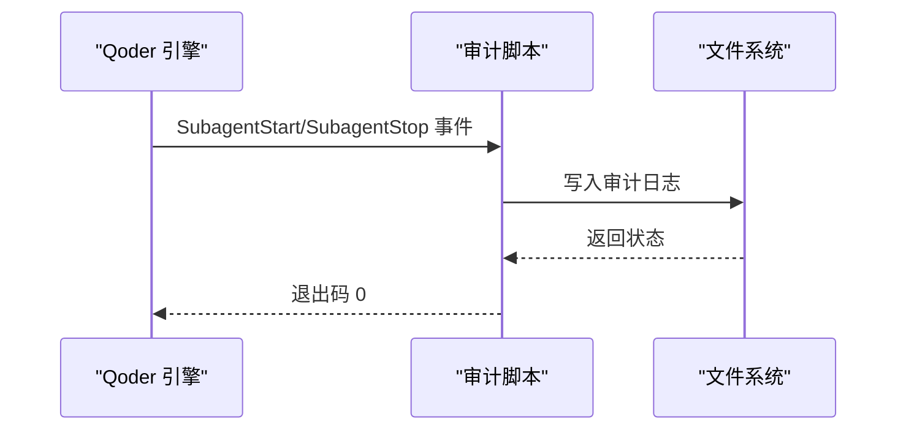
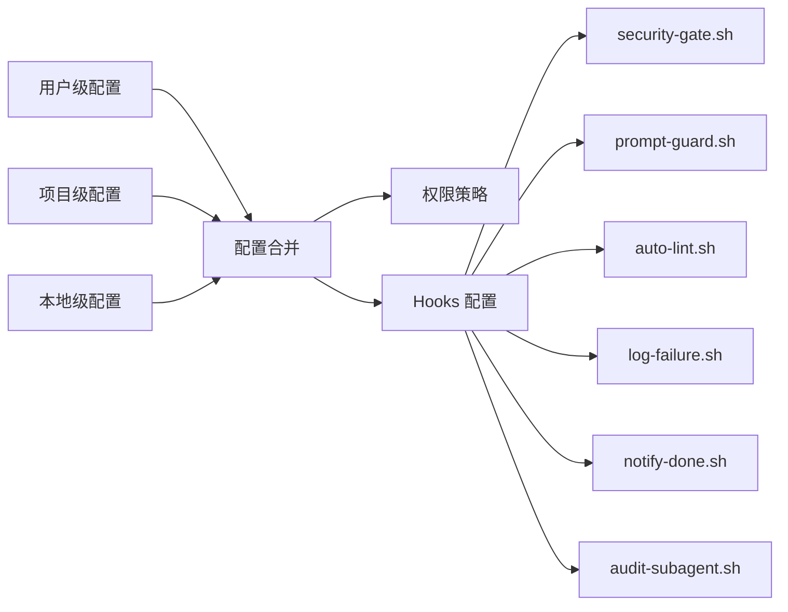

# 高级配置方案

<cite>
**本文引用的文件**
- [AGENTS.md](file://AGENTS.md)
- [QoderHarnessEngineering落地示例.md](file://QoderHarnessEngineering落地示例.md)
- [.qoderwork/hooks/security-gate.sh](file://.qoderwork/hooks/security-gate.sh)
- [.qoderwork/hooks/prompt-guard.sh](file://.qoderwork/hooks/prompt-guard.sh)
- [.qoderwork/hooks/notify-done.sh](file://.qoderwork/hooks/notify-done.sh)
- [.qoderwork/hooks/auto-lint.sh](file://.qoderwork/hooks/auto-lint.sh)
- [.qoderwork/hooks/log-failure.sh](file://.qoderwork/hooks/log-failure.sh)
- [知识材料管理方案.md](file://docs/知识材料管理方案.md)
</cite>

## 目录
1. [简介](#简介)
2. [项目结构](#项目结构)
3. [核心组件](#核心组件)
4. [架构总览](#架构总览)
5. [详细组件分析](#详细组件分析)
6. [依赖关系分析](#依赖关系分析)
7. [性能考量](#性能考量)
8. [故障排除指南](#故障排除指南)
9. [结论](#结论)
10. [附录](#附录)

## 简介
本文件面向企业与工程团队，提供 Qoder Harness Engineering 的高级配置方案与最佳实践，聚焦以下主题：
- Prompt 注入防护的高级配置与自定义规则
- 桌面通知集成与通知策略
- 网络访问控制的细粒度白名单策略
- 子 Agent 审计与监控
- 复杂场景下的配置组合策略与性能优化
- 企业级部署的安全加固与运维建议
- 故障排除与性能调优

## 项目结构
本项目采用“三层配置合并 + 生命周期钩子”的工程化范式，确保团队协作、个人覆盖与安全控制的平衡。

图示来源
- [QoderHarnessEngineering落地示例.md:23-39](file://QoderHarnessEngineering落地示例.md#L23-L39)
- [QoderHarnessEngineering落地示例.md:123-184](file://QoderHarnessEngineering落地示例.md#L123-L184)

章节来源
- [QoderHarnessEngineering落地示例.md:23-39](file://QoderHarnessEngineering落地示例.md#L23-L39)
- [QoderHarnessEngineering落地示例.md:42-67](file://QoderHarnessEngineering落地示例.md#L42-L67)

## 核心组件
- 权限策略（Permissions）
  - allow：自动放行
  - ask：弹窗确认
  - deny：直接拒绝
  - 优先级：deny > allow/ask；更具体规则优先于通配符；本地级覆盖项目级，项目级覆盖用户级
- 生命周期钩子（Hooks）
  - PreToolUse：工具执行前拦截（如高危命令、注入风险）
  - PostToolUse：工具成功后执行（如自动 Lint）
  - PostToolUseFailure：失败后记录日志
  - UserPromptSubmit：用户提交 Prompt 后拦截注入
  - Stop：Agent 完成响应时触发桌面通知
  - SubagentStart/Stop：子 Agent 生命周期审计
  - PreCompact/SessionEnd：知识归档提示

章节来源
- [QoderHarnessEngineering落地示例.md:224-251](file://QoderHarnessEngineering落地示例.md#L224-L251)
- [QoderHarnessEngineering落地示例.md:253-270](file://QoderHarnessEngineering落地示例.md#L253-L270)
- [QoderHarnessEngineering落地示例.md:123-184](file://QoderHarnessEngineering落地示例.md#L123-L184)

## 架构总览
下图展示配置合并、权限判定与 Hooks 执行的总体流程。

图示来源
- [QoderHarnessEngineering落地示例.md:23-39](file://QoderHarnessEngineering落地示例.md#L23-L39)
- [QoderHarnessEngineering落地示例.md:253-270](file://QoderHarnessEngineering落地示例.md#L253-L270)

## 详细组件分析

### Prompt 注入防护（高级配置与自定义规则）
- 目标：在用户提交 Prompt 后，拦截常见的提示词注入模式（指令覆盖、越狱、系统提示探测等）
- 实现：通过 UserPromptSubmit 钩子执行注入检测脚本，命中则以退出码 2 阻断，并将提示信息注入会话
- 高级配置要点
  - 正则覆盖：中英文双语模式，支持 PCRE/ERE 混合匹配
  - 可扩展性：新增规则时，遵循现有模式组织，保持大小写不敏感与多语言兼容
  - 性能：正则数量与复杂度直接影响 Hook 执行时间，建议分批收敛规则
  - 误报控制：结合业务场景逐步收严规则，必要时引入“宽限期”策略（如首次告警但不阻断）

图示来源
- [.qoderwork/hooks/prompt-guard.sh:1-55](file://.qoderwork/hooks/prompt-guard.sh#L1-L55)
- [QoderHarnessEngineering落地示例.md:439-451](file://QoderHarnessEngineering落地示例.md#L439-L451)

章节来源
- [.qoderwork/hooks/prompt-guard.sh:1-55](file://.qoderwork/hooks/prompt-guard.sh#L1-L55)
- [QoderHarnessEngineering落地示例.md:439-451](file://QoderHarnessEngineering落地示例.md#L439-L451)

### 桌面通知集成（策略与配置）
- 目标：在 Agent 完成响应时，向用户发出桌面通知，提升交互反馈
- 实现：Stop 钩子触发脚本，macOS 使用系统脚本引擎发送通知
- 策略建议
  - 平台差异：仅 macOS 生效；Windows/Linux 可替换为平台通知命令
  - 声音与标题：可按需定制，避免过度打扰
  - 一致性：统一通知文案风格，便于用户识别

图示来源
- [.qoderwork/hooks/notify-done.sh:1-16](file://.qoderwork/hooks/notify-done.sh#L1-L16)
- [QoderHarnessEngineering落地示例.md:453-463](file://QoderHarnessEngineering落地示例.md#L453-L463)

章节来源
- [.qoderwork/hooks/notify-done.sh:1-16](file://.qoderwork/hooks/notify-done.sh#L1-L16)
- [QoderHarnessEngineering落地示例.md:453-463](file://QoderHarnessEngineering落地示例.md#L453-L463)

### 网络访问控制（WebFetch 白名单）
- 目标：限制对外部网络请求的域名范围，降低供应链与数据外泄风险
- 实现：deny 所有域名 + allow 指定域名的组合，达到“仅白名单放行”的效果
- 配置要点
  - deny 通配优先：确保未显式允许的域名一律拒绝
  - allow 精准：按域名维度精确列出允许域
  - 域名格式：使用 domain: 前缀声明
  - 与权限策略合并：deny 优先级高于 allow，避免误放行

图示来源
- [QoderHarnessEngineering落地示例.md:484-497](file://QoderHarnessEngineering落地示例.md#L484-L497)

章节来源
- [QoderHarnessEngineering落地示例.md:484-497](file://QoderHarnessEngineering落地示例.md#L484-L497)

### 子 Agent 审计（配置与监控）
- 目标：记录子 Agent 的启动与停止事件，便于审计与排障
- 实现：通过 SubagentStart/Stop 钩子执行审计脚本，记录关键元数据
- 建议
  - 日志格式：包含 Agent 名称、启动/停止时间、触发原因、耗时等
  - 存储位置：独立日志文件，便于检索与归档
  - 与权限策略联动：对审计脚本本身也应纳入权限与 Hooks 控制

图示来源
- [QoderHarnessEngineering落地示例.md:472-482](file://QoderHarnessEngineering落地示例.md#L472-L482)

章节来源
- [QoderHarnessEngineering落地示例.md:472-482](file://QoderHarnessEngineering落地示例.md#L472-L482)

### 高级配置组合策略
- 场景一：开发环境（宽松 + 审计）
  - allow：常用开发工具与本地服务
  - ask：涉及生产或敏感路径的操作
  - deny：高危命令与敏感路径
  - 启用 SubagentStop 审计，记录子 Agent 行为
- 场景二：CI/CD 环境（严格 + 通知）
  - deny：除构建/发布所需域名外的所有 Web 请求
  - allow：限定域名白名单
  - 启用 Stop 通知，便于流水线可视化
- 场景三：企业合规（强审计 + 注入防护）
  - 启用 UserPromptSubmit 注入防护
  - deny：所有 Bash 与 WebFetch
  - allow：仅授权工具与域名
  - 启用 SubagentStop 审计与日志失败记录

章节来源
- [QoderHarnessEngineering落地示例.md:123-184](file://QoderHarnessEngineering落地示例.md#L123-L184)
- [QoderHarnessEngineering落地示例.md:439-497](file://QoderHarnessEngineering落地示例.md#L439-L497)

## 依赖关系分析
- 配置层依赖
  - 用户级配置为全局基线，项目级为团队共享，本地级为个人覆盖
  - 合并时遵循 deny 优先、更具体规则优先、本地级覆盖项目级的原则
- Hooks 依赖
  - PreToolUse 依赖安全脚本（命令拦截、注入防护）
  - PostToolUse 依赖 Lint 脚本（ESLint、ruff/flake8、gofmt、shellcheck）
  - PostToolUseFailure 依赖失败日志脚本
  - Stop 依赖桌面通知脚本
  - SubagentStop 依赖审计脚本
- 工具链依赖
  - jq：解析 JSON 输入
  - 平台通知命令：macOS 的 osascript
  - 各语言静态检查工具：npx、ruff、flake8、gofmt、shellcheck

图示来源
- [QoderHarnessEngineering落地示例.md:23-39](file://QoderHarnessEngineering落地示例.md#L23-L39)
- [QoderHarnessEngineering落地示例.md:123-184](file://QoderHarnessEngineering落地示例.md#L123-L184)
- [.qoderwork/hooks/security-gate.sh:1-38](file://.qoderwork/hooks/security-gate.sh#L1-L38)
- [.qoderwork/hooks/prompt-guard.sh:1-55](file://.qoderwork/hooks/prompt-guard.sh#L1-L55)
- [.qoderwork/hooks/auto-lint.sh:1-43](file://.qoderwork/hooks/auto-lint.sh#L1-L43)
- [.qoderwork/hooks/log-failure.sh:1-20](file://.qoderwork/hooks/log-failure.sh#L1-L20)
- [.qoderwork/hooks/notify-done.sh:1-16](file://.qoderwork/hooks/notify-done.sh#L1-L16)

章节来源
- [QoderHarnessEngineering落地示例.md:23-39](file://QoderHarnessEngineering落地示例.md#L23-L39)
- [QoderHarnessEngineering落地示例.md:123-184](file://QoderHarnessEngineering落地示例.md#L123-L184)
- [.qoderwork/hooks/security-gate.sh:1-38](file://.qoderwork/hooks/security-gate.sh#L1-L38)
- [.qoderwork/hooks/prompt-guard.sh:1-55](file://.qoderwork/hooks/prompt-guard.sh#L1-L55)
- [.qoderwork/hooks/auto-lint.sh:1-43](file://.qoderwork/hooks/auto-lint.sh#L1-L43)
- [.qoderwork/hooks/log-failure.sh:1-20](file://.qoderwork/hooks/log-failure.sh#L1-L20)
- [.qoderwork/hooks/notify-done.sh:1-16](file://.qoderwork/hooks/notify-done.sh#L1-L16)

## 性能考量
- 正则匹配复杂度
  - 注入防护脚本的正则数量与复杂度直接影响 UserPromptSubmit 的延迟，建议定期评估与收敛
- Lint 执行开销
  - auto-lint.sh 对不同语言采用不同工具，工具链可用性与版本会影响执行时间；建议在 CI 中缓存工具与依赖
- Hooks 超时与并发
  - Hooks 配置支持 timeout，建议为高风险脚本设置合理超时，避免阻塞主流程
- 日志写入
  - 失败日志与审计日志写入磁盘，建议落盘到本地 SSD 或使用异步写入策略，减少对主流程的影响

章节来源
- [.qoderwork/hooks/prompt-guard.sh:1-55](file://.qoderwork/hooks/prompt-guard.sh#L1-L55)
- [.qoderwork/hooks/auto-lint.sh:1-43](file://.qoderwork/hooks/auto-lint.sh#L1-L43)
- [QoderHarnessEngineering落地示例.md:157-182](file://QoderHarnessEngineering落地示例.md#L157-L182)

## 故障排除指南
- 注入防护误报
  - 症状：合法 Prompt 被阻断
  - 处理：检查注入规则集合，必要时放宽或分批收敛；在确认安全后临时移除相关规则
- 通知不生效
  - 症状：Stop 钩子执行但无桌面通知
  - 处理：确认脚本具备可执行权限；macOS 平台检查系统通知权限；查看脚本返回值与 stderr 输出
- Lint 未执行
  - 症状：编辑后未自动 Lint
  - 处理：确认 PostToolUse 钩子已启用；检查对应语言工具是否安装与可用；查看脚本返回码
- 失败日志缺失
  - 症状：工具失败后未记录日志
  - 处理：确认 PostToolUseFailure 钩子已启用；检查日志目录权限与磁盘空间；查看脚本 stderr 输出
- 网络请求被拒
  - 症状：外部请求失败
  - 处理：核对 deny/allow 规则；确认域名格式为 domain:；在开发环境临时放宽白名单验证

章节来源
- [.qoderwork/hooks/prompt-guard.sh:1-55](file://.qoderwork/hooks/prompt-guard.sh#L1-L55)
- [.qoderwork/hooks/notify-done.sh:1-16](file://.qoderwork/hooks/notify-done.sh#L1-L16)
- [.qoderwork/hooks/auto-lint.sh:1-43](file://.qoderwork/hooks/auto-lint.sh#L1-L43)
- [.qoderwork/hooks/log-failure.sh:1-20](file://.qoderwork/hooks/log-failure.sh#L1-L20)
- [QoderHarnessEngineering落地示例.md:484-497](file://QoderHarnessEngineering落地示例.md#L484-L497)

## 结论
通过三层配置合并与 Hooks 生命周期工程，Qoder Harness Engineering 提供了可组合、可审计、可扩展的企业级工程化范式。针对提示词注入、网络访问、桌面通知与子 Agent 审计等关键领域，建议：
- 将 deny 优先与白名单策略作为默认安全基线
- 以 Hooks 为入口统一接入安全与可观测性能力
- 在复杂场景下分层收敛规则，持续优化性能与体验
- 建立完善的日志与审计体系，支撑合规与排障

## 附录
- 项目级配置参考
  - 权限策略与 Hooks 配置示例见项目文档
- 本地私有配置
  - 本地覆盖模板与常见场景示例见项目文档
- AGENTS.md
  - 项目上下文与行为约束说明

章节来源
- [QoderHarnessEngineering落地示例.md:123-184](file://QoderHarnessEngineering落地示例.md#L123-L184)
- [QoderHarnessEngineering落地示例.md:194-221](file://QoderHarnessEngineering落地示例.md#L194-L221)
- [AGENTS.md:1-69](file://AGENTS.md#L1-L69)